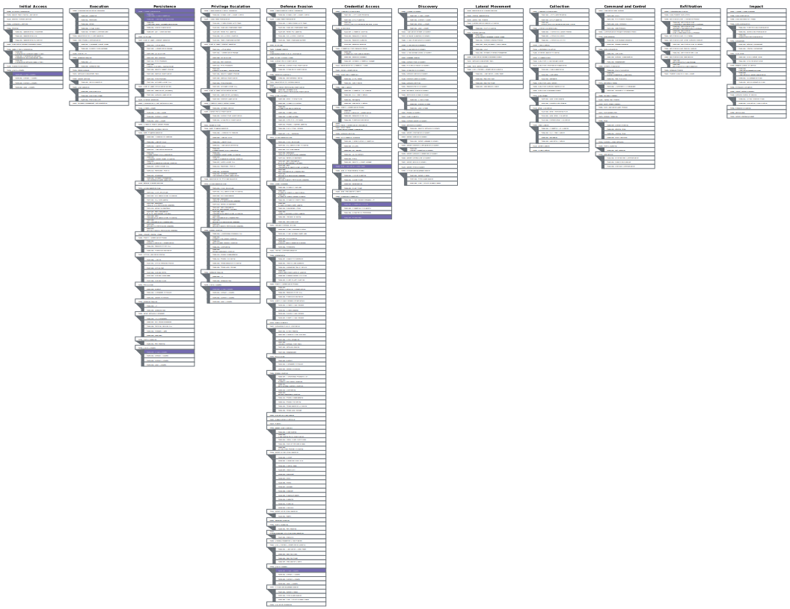
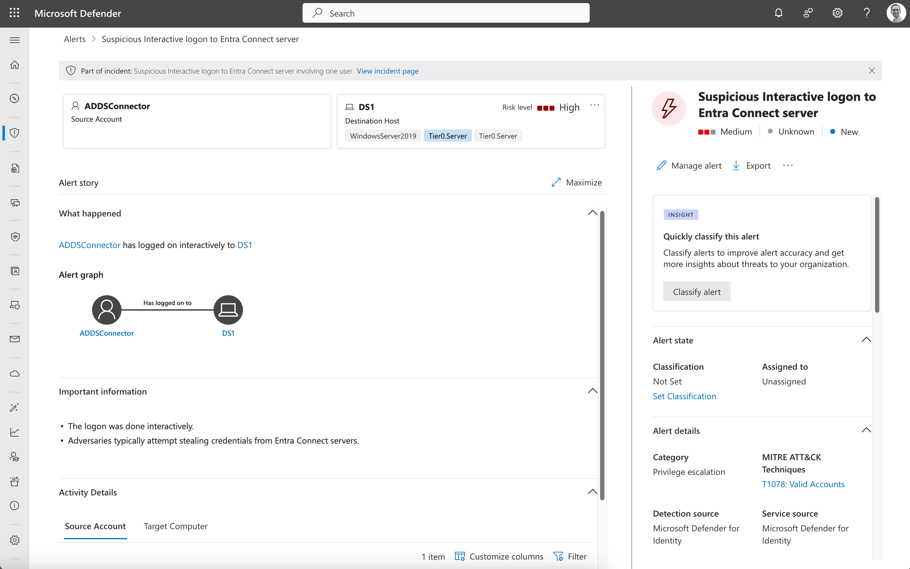
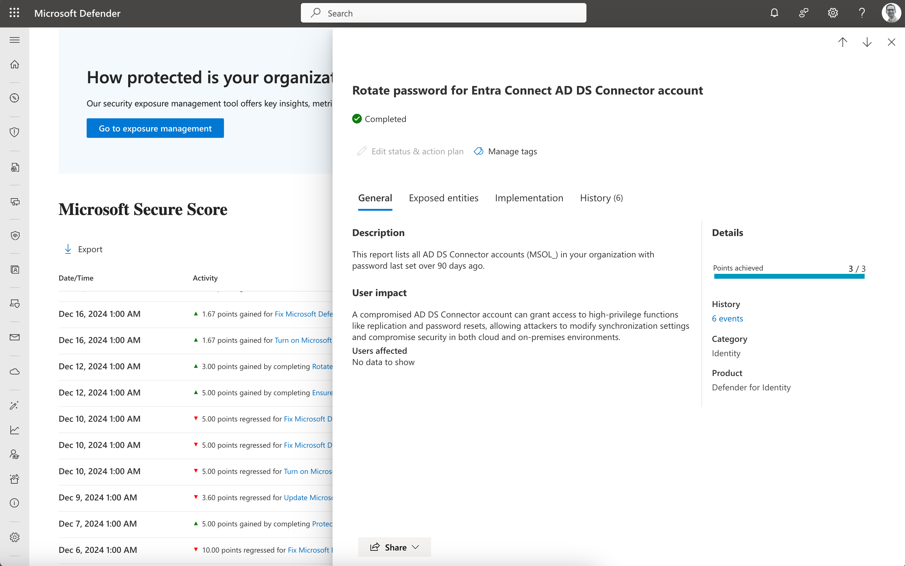
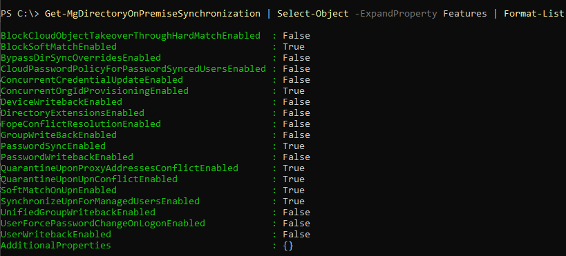
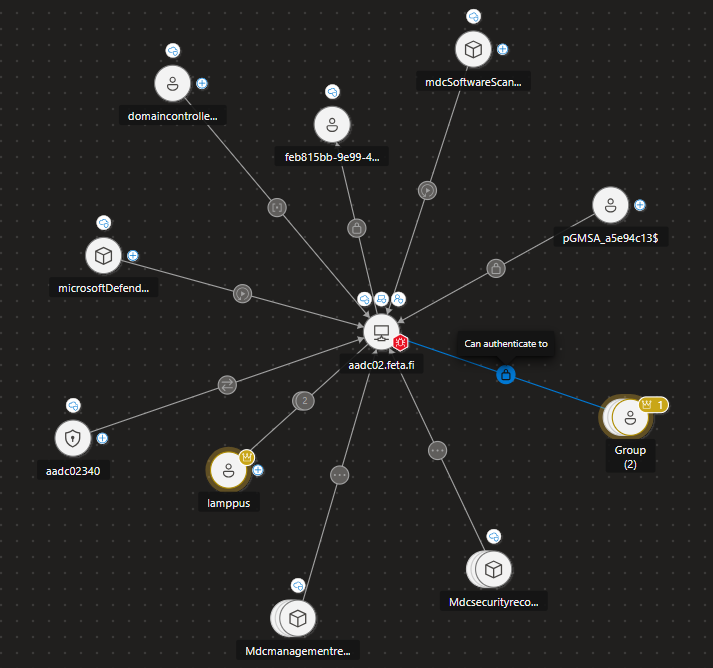
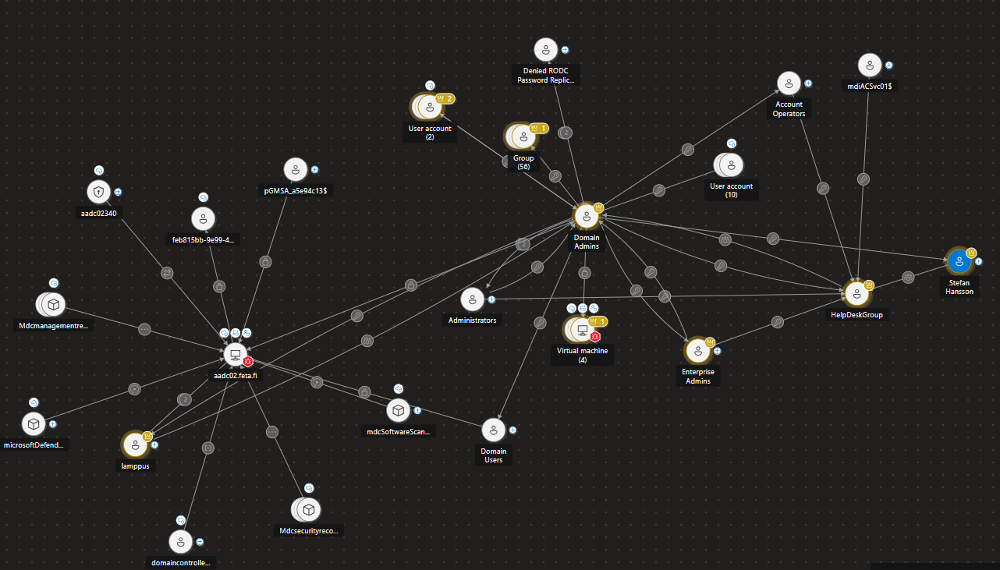
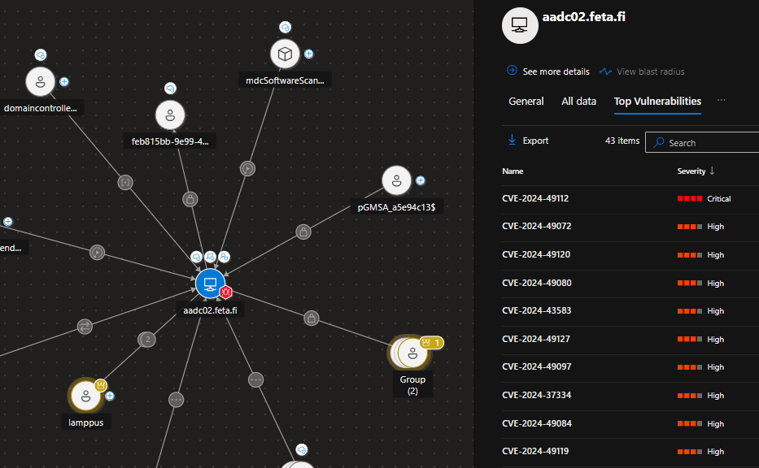

# Abuse of Microsoft Entra Connect Sync Service Account

_Author: Sami Lamppu and Thomas Naunheim_
_Created: March 2022_
_Updated: December 2024 [Updated privileges on directory sync](#removed-privileges-and-security-hardening-by-microsoft-in-2024), [XSPM capabilities](#identified-attack-paths-to-connect-server-by-exposure-management), [MDI sensor for Connect and product name updates](#defender-for-identity-detection-on-unusual-behavior-and-events)_

- [Abuse of Microsoft Entra Connect Sync Service Account](#abuse-of-microsoft-entra-connect-sync-service-account)
- [Introduction](#introduction)
  - [Architecture and Service Accounts](#architecture-and-service-accounts)
    - [Removed privileges and security hardening by Microsoft in 2024](#removed-privileges-and-security-hardening-by-microsoft-in-2024)
- [Attack scenarios](#attack-scenarios)
  - [MITRE ATT\&CK Framework](#mitre-attck-framework)
    - [Tactics, Techniques \& Procedures (TTPs) of the named attack scenarios](#tactics-techniques--procedures-ttps-of-the-named-attack-scenarios)
    - [TTP on abusing Entra Connect Sync Service Account](#ttp-on-abusing-entra-connect-sync-service-account)
- [Detections](#detections)
  - [Defender for Endpoint signals by using offensive tools on Entra Connect servers](#defender-for-endpoint-signals-by-using-offensive-tools-on-entra-connect-servers)
    - [Dumping credentials with AADInternals](#dumping-credentials-with-aadinternals)
    - [Updating credentials with AADInternals](#updating-credentials-with-aadinternals)
  - [Defender for Identity detection on unusual behavior and events](#defender-for-identity-detection-on-unusual-behavior-and-events)
    - [Identity Security Posture Management (part of Microsoft Secure Score)](#identity-security-posture-management-part-of-microsoft-secure-score)
    - [Threat detections](#threat-detections)
  - [Changes of Entra Connect sync features](#changes-of-entra-connect-sync-features)
  - [Suspicious activities from Entra Connector account](#suspicious-activities-from-entra-connector-account)
  - [Takeover Entra Connector by generating Temporary access pass (TAP) as backdoor](#takeover-entra-connector-by-generating-temporary-access-pass-tap-as-backdoor)
  - [Password Spray attacks to Entra Connector account](#password-spray-attacks-to-entra-connector-account)
- [Mitigations](#mitigations)
    - [Increase visibility by implementing detections](#increase-visibility-by-implementing-detections)
    - [Secure your Entra Connect Server and Service Accounts as Tier0](#secure-your-entra-connect-server-and-service-accounts-as-tier0)
    - [Reduce attack surface for Entra Connect resources](#reduce-attack-surface-for-entra-connect-resources)
  - [Protect your cloud-only and privileged accounts from account take over](#protect-your-cloud-only-and-privileged-accounts-from-account-take-over)
    - [Identified Attack paths to Connect server by Exposure Management](#identified-attack-paths-to-connect-server-by-exposure-management)
- [Security Insights from Entra Connect Server](#security-insights-from-entra-connect-server)
  - [Local application and system events from Entra Connect (Server)](#local-application-and-system-events-from-entra-connect-server)
  - [Removing AAD Sync Server(s) from Entra Connect Health](#removing-aad-sync-servers-from-entra-connect-health)
  - [Other references and resources](#other-references-and-resources)


# Introduction

In this paper we are mainly focusing on the following scenario:

1. Attacking administrative account with directory role assignment to "[Hybrid Identity Administrator](https://docs.microsoft.com/en-us/azure/active-directory/roles/permissions-reference#hybrid-identity-administrator)" for managing Microsoft Entra connect configurations
2. Abusing of Microsoft Entra ID (EID) user "On-Premises Directory Synchronization Service Account" which will be used to synchronize objects from Microsoft Entra Connect Server (AD on-premises) to Entra ID.

*Out of scope are privilege escalation and attack paths from Entra Connect server in direction to Active Directory (incl. abuse Entra Connector account)*

## Architecture and Service Accounts


**AD DS Connector Account** has been configured during Entra Connect server implementation and will be used to read/write information to Windows Server Active Directory. This account has no permissions in Entra ID but privileges to write-back attributes and passwords to on-premises AD. Service account cannot be used as "Group Managed Service Account (gMSA)" and needs to be protected particularly.

**Entra Connector Account** will be used to write information and synchronize objects from/to Entra ID.
Account will be created for each Entra Connect Server and is visible with display name "On-Premises Directory Synchronization Service Account" in Entra ID tenant. The account is assigned to the Entra ID directory role "[Directory Synchronization Accounts](https://docs.microsoft.com/en-us/azure/active-directory/roles/permissions-reference#directory-synchronization-accounts)".

**ADSync Service Account** takes place for running the synchronization service but has also access to the database for storing Entra Connect information. No (direct) privileged access exists to Entra ID or Active Directory objects. Nevertheless, it’s a sensitive account because it plays a central part in running Entra Connect services and data access (incl. SQL database).

More details about Entra Connect [accounts and permissions](https://docs.microsoft.com/en-us/azure/active-directory/hybrid/reference-connect-accounts-permissions) are described in Microsoft Docs articles.

### Removed privileges and security hardening by Microsoft in 2024
[Update on December 2024]: Microsoft announced update on Microsoft Entra Connect Sync and Microsoft Entra Cloud Sync directory synchronization accounts (DSA) in August 2024. 

*As part of ongoing security hardening, Microsoft removes unused permissions from the privileged Directory Synchronization Accounts role. This role is exclusively used by Microsoft Entra Connect Sync, and Microsoft Entra Cloud Sync, to synchronize Active Directory objects with Microsoft Entra ID. There's no action required by customers to benefit from this hardening.*

Before the update, the DSA account had a high privileged permissions to:
- Applications
  - Wide permissions to manage applications
- Authorization and hybrid authentication policies
  - Read standard properties of authorization policy Manage hybrid authentication policy in Microsoft Entra ID
- Organization's Dirsync settings
  - Update the organization directory sync property
- Password Hash sync settings
  - Manage all aspects of Password Hash Synchronization (PHS) in Microsoft Entra ID
- Policies
  - Ability to manage policies
- Service Principals
  - Ability to manage service principals

Current permissions are listed in the [Entra built-in roles documentation](https://learn.microsoft.com/en-us/entra/identity/role-based-access-control/permissions-reference#directory-synchronization-accounts)
In addition, a new directory role named "[On Premises Directory Sync Account](https://www.azadvertizer.net/azentraidroles/a92aed5d-d78a-4d16-b381-09adb37eb3b0.html)" has been introduced which is not currently in use.
More details about the announcement on [Entra what's new August 2024](https://learn.microsoft.com/en-us/entra/fundamentals/whats-new#august-2024).


# Attack scenarios

This chapter describes attack scenarios referring to the document scope. 

- Access to unprotected Entra Connect servers (not hardened or restricted access as Tier0 system) or exfiltration from uncontrolled/unencrypted backups allows access to the service database.
    - Decryption and extraction of stored Entra ID and Active Directory credentials can be achieved by using [fox-it/adconnectdump](https://github.com/fox-it/adconnectdump).
    - Dumping of encryption keys of DPAPI and getting Entra Connect service-related credentials has been automated as part of the "Get-AADIntSyncCredentials" cmdlet in the [AADInternals PowerShell module.](https://o365blog.com/post/adsync/)
      - Side note: You need to use version 0.9.4. The versions above doesn't contain the needed command.
    
    
    
- Passwords of Entra Connector account can be exfiltrated in clear text if privilege escalation to local admin permissions on the Entra Connect server was successfully.
    
  - More details of credentials dump are very well described in "[Shooting Up: On-Prem to Cloud](https://imphash.medium.com/shooting-up-on-prem-to-cloud-detecting-aadconnect-creds-dump-422b21128729)" by imp hash.
  - A great overview about "[Entra Connect for Red Teamer](https://blog.xpnsec.com/azuread-connect-for-redteam/)s" is available on XPN InfoSec Blog.
- Refresh/access token from account with assigned directory role "[Hybrid Identity Administrator](https://docs.microsoft.com/en-us/azure/active-directory/roles/permissions-reference#hybrid-identity-administrator)" can be replayed when it will be used to apply Entra Connect service configuration changes. Members of this role could be excluded from device compliance to allow usage on Entra Connect Server for management tasks.
    
    
    
    - Token could be exfiltrated by "man in the middle" attacks, such as compromised proxy solutions (which will be used to prevent direct internet connection) and manipulated certificates.
- User accounts with assigned "[Hybrid Identity administrators](https://docs.microsoft.com/en-us/azure/active-directory/roles/permissions-reference#hybrid-identity-administrator)" roles has enhanced permissions for ’[sync service features’](https://docs.microsoft.com/en-us/azure/active-directory/hybrid/how-to-connect-syncservice-features) but also, extensive management permissions for service principals and app registrations in Entra ID which includes:
    
    - Change configuration of "soft and hard matching" feature settings.
        - By default, cloud-only accounts are only protected if they are assigned to directory roles.
        - Hard matching can be blocked for cloud-only particularly. This feature was [introduced in October 2021](https://twitter.com/rjong999/status/1451316231286374439/photo).
        - Only users with direct (role assignable group) membership to directory roles (such as Global Admin) are particularly protected. 
          - This can be seen in this test by using Privileged Access Groups (PAG), Role Assignable Groups (PRG) in a combination of eligible/permanent membership and ownership of group:
            
            
            
    - Blocking of soft and hard matching (recommended) could have been already configured.
        - Nevertheless, "Hybrid identity admins" are able to modify this setting and could be used to "synchronize" accounts and take control of accounts with sensitive permissions outside of Entra ID directory roles. 
          - A great explanation about "[user hard and soft matching](https://dirteam.com/sander/2020/03/27/explained-user-hard-matching-and-soft-matching-in-azure-ad-connect/)" has been written by Sander Berkouwer.
    - Directory role permissions allows to change ownership of "GraphAggregatorService" service principal and add app roles to self-grant arbitrary Microsoft Graph API permission.
        - More details about this service principal and abusing app roles are described in "[Azure Privilege Escalation via Azure API Permissions Abuse](https://posts.specterops.io/azure-privilege-escalation-via-azure-api-permissions-abuse-74aee1006f48)" by Andy Robbins.
- Temporary Access Pass can be used by compromised high-privileged accounts or service accounts to create a backdoor on "On-Premises Directory Synchronization Service Account":
    - This allows to issue credentials for existing synchronization account(s), instead of creating noise (in security detections) by creating new accounts or reset password of existing ones. Most SecOps/SOC teams are not monitoring the synchronization accounts actively or particularly.


## MITRE ATT&CK Framework
MITRE ATT&CK framework is commonly used for mapping Tactics, Techniques and Procedures (TTPs) for adversary actions and emulating defenses on organizations around the world.

### Tactics, Techniques & Procedures (TTPs) of the named attack scenarios
<a href="https://raw.githubusercontent.com/Cloud-Architekt/AzureAD-Attack-Defense/main/media/mitre/AttackScenarios/AADC.svg" target="_blank"></a>
<a style="font-style:italic" href="https://mitre-attack.github.io/attack-navigator/#layerURL=https%3A%2F%2Fraw.githubusercontent.com%2FCloud-Architekt%2FAzureAD-Attack-Defense%2Fmain%2Fmedia%2Fmitre%2FAttackScenarios%2FAADC.json&tabs=false&selecting_techniques=false" >Open in MITRE ATT&CK Navigator</a>

### TTP on abusing Entra Connect Sync Service Account

|  Attack Scenario |    TTPs         |  Description  |
|--------------|-----------|-----------|
|  Access to unprotected Entra Connect servers (not hardened or restricted access as Tier0 system) or exfiltration from uncontrolled/unencrypted backups allows access to the Entra Connect database<br><br>Passwords of Entra Connector accounts can be exfiltrated in clear text if privilege escalation to local admin permissions on the Entra Connect server was successful | Unsecured Credentials: Credentials In Files [T1552.001](https://attack.mitre.org/techniques/T1552/001/) | Adversaries may search local file systems and remote file shares for files containing insecurely stored credentials. These can be files created by users to store their own credentials, shared credential stores for a group of individuals, configuration files containing passwords for a system or service, or source code/binary files containing embedded passwords.
| Access to unprotected Entra Connect servers (not hardened or restricted access as Tier0 system) or exfiltration from uncontrolled/unencrypted backups allows access to the Entra Connect database<br> | Unsecured Credentials: Private Keys [T1552.004](https://attack.mitre.org/techniques/T1552/004/) | Adversaries may search for private key certificate files on compromised systems for insecurely stored credentials. Private cryptographic keys and certificates are used for authentication, encryption/decryption, and digital signatures.[1] Common key and certificate file extensions include: .key, .pgp, .gpg, .ppk., .p12, .pem, .pfx, .cer, .p7b, .asc.
| Using credentials of Entra Connector accounts from unprotected Entra Connect for privileged access to Connector API,<br> Adding temporary access pass to Entra Connector Account | Valid Accounts: Cloud Accounts - [T1078.004](https://attack.mitre.org/techniques/T1528/)| Adversaries may obtain and abuse credentials of a cloud account as a means of gaining Initial Access, Persistence, Privilege Escalation, or Defense Evasion. Cloud accounts are those created and configured by an organization for use by users, remote support, services, or for administration of resources within a cloud service provider or SaaS application. In some cases, cloud accounts may be federated with traditional identity management system, such as Window Active Directory. Compromised credentials for cloud accounts can be used to harvest sensitive data from online storage accounts and databases. Access to cloud accounts can also be abused to gain Initial Access to a network by abusing a Trusted Relationship. Similar to Domain Accounts, compromise of federated cloud accounts may allow adversaries to more easily move laterally within an environment. Once a cloud account is compromised, an adversary may perform Account Manipulation - for example, by adding Additional Cloud Roles - to maintain persistence and potentially escalate their privileges. |
|  User accounts with assigned "Hybrid Identity administrators" roles have enhanced permissions for ’sync service features’ but also, extensive management permissions for service principals and app registrations in Entra ID which includes | Account Manipulation - [T1098](https://attack.mitre.org/techniques/T1098/)| Adversaries may manipulate accounts to maintain access to victim systems. Account manipulation may consist of any action that preserves adversary access to a compromised account, such as modifying credentials or permission groups. These actions could also include account activity designed to subvert security policies, such as performing iterative password updates to bypass password duration policies and preserve the life of compromised credentials. In order to create or manipulate accounts, the adversary must already have sufficient permissions on systems or the domain. However, account manipulation may also lead to privilege escalation where modifications grant access to additional roles, permissions, or higher-privileged Valid Accounts. |
|  Temporary Access Pass can be used by compromised high-privileged accounts or service accounts to create a backdoor on "On-Premises Directory Synchronization Service Account | Account Manipulation: Additional Cloud Credentials - [T1098.001](https://attack.mitre.org/techniques/T1098/001/)| Adversaries may add adversary-controlled credentials to a cloud account to maintain persistent access to victim accounts and instances within the environment. Adversaries may add credentials for Service Principals and Applications in addition to existing legitimate credentials in Entra ID. These credentials include both x509 keys and passwords.With sufficient permissions, there are a variety of ways to add credentials including the Azure Portal, Azure command line interface, and Azure or Az PowerShell modules. |
|  Directory role permissions allow to change of ownership of the "GraphAggregatorService" service principal and add app roles to self-grant arbitrary Microsoft Graph API permission. | Account Manipulation: Additional Cloud Roles - [T1098.003](https://attack.mitre.org/techniques/T1098/003/)| An adversary may add additional roles or permissions to an adversary-controlled cloud account to maintain persistent access to a tenant. For example, they may update IAM policies in cloud-based environments or add a new global administrator in Office 365 environments. With sufficient permissions, a compromised account can gain almost unlimited access to data and settings (including the ability to reset the passwords of other admins). This account modification may immediately follow Create Account or other malicious account activity. Adversaries may also modify an existing Valid Accounts that they have compromised. This could lead to privilege escalation, particularly if the roles added allow for lateral movement to additional accounts. For example, in Entra ID environments, an adversary with the Application Administrator role can add Additional Cloud Credentials to their application's service principal. In doing so the adversary would be able to gain the service principal’s roles and permissions, which may be different from those of the Application Administrator. |
| Refresh/access token from an account with assigned directory role "Hybrid Identity Administrator" can be replayed when it will be used to apply Entra Connect configuration changes. Members of this role could be excluded from device compliance to allow usage of Entra Connect Server for management tasks| Steal Application Access Token - [T1528](https://attack.mitre.org/techniques/T1528/)| Adversaries can steal application access tokens as a means of acquiring credentials to access remote systems and resources. Application access tokens are used to make authorized API requests on behalf of a user or service and are commonly used as a way to access resources in cloud and container-based applications and software-as-a-service (SaaS). OAuth is one commonly implemented framework that issues tokens to users for access to systems. Adversaries who steal account API tokens in cloud and containerized environments may be able to access data and perform actions with the permissions of these accounts, which can lead to privilege escalation and further compromise of the environment. |
|||

# Detections

On the detections side, we are focusing on available Microsoft cloud-based security solutions:
Starting from the source of the attack, Entra Connect server, which is located on-premises, and moving to cloud-based security solutions.

You can expect to find the tools used in the following scenarios in this chapter:

- Microsoft Defender for Endpoint (MDE) on Entra Connect for detecting suspicious activities or tools on the operating system level and on-premises environment.
- Microsoft Defender for Cloud Apps (MDA) and Microsoft Sentinel for detecting suspicious sign-in and audit activities of the Entra Connector Account but also Hybrid Identity Admin.
- Microsoft Sentinel takes essential part for advanced detection by using WatchList and anomaly techniques.
- Entra ID Protection (formely known as Identity Protection) detection is valuable if interactive (and suspicious/unfamiliar) sign-in has been attempted by Entra connector account.

In our templates of Microsoft Sentinel analytics rule, we’re using **[WatchLists](https://docs.microsoft.com/en-us/azure/sentinel/watchlists)** to enrich and store information for correlation centrally.
WatchList template for "[High-Value Assets](https://docs.microsoft.com/en-us/azure/sentinel/watchlist-schemas#high-value-assets)" should be used to define "Entra Connect Servers" and the assigned public IP address.

  

Valid and authorized Entra Connector accounts should be included in the  "[Service Accounts](https://docs.microsoft.com/en-us/azure/sentinel/watchlist-schemas#service-accounts)" WatchList template.
This helps us to identify user accounts with assigned "Directory Synchronization" or similar account names which aren't whitelisted as part of the WatchList.

  

Both lists are using the same tag (Entra ID Connect) to identify related resources to the Entra Connect operations and activities.
These Watchlists are an important part and pre-requisite for the custom analytics rules which we have written for this playbook.

UEBA tables is another feature which will be included in one of the queries.
We're using **[IdentityInfo](https://techcommunity.microsoft.com/t5/microsoft-sentinel-blog/what-s-new-identityinfo-table-is-now-in-public-preview/ba-p/2571037)** table to identify user accounts with directory role assignment to "Hybrid Identity Administrator". Related Entra Connector accounts can be also identified by directory role assignment ("Directory Synchronization Accounts") which is also stored in "IdentityInfo".

## Defender for Endpoint signals by using offensive tools on Entra Connect servers

If Microsoft Defender for Endpoint (MDE) is installed to Entra Connect server, EDR can detect suspicious activities from the instance. For example, when [AADInternals](https://o365blog.com/aadinternals/) is used to dump Entra Connect credentials the activity is detected by MDE.

### Dumping credentials with AADInternals


### Updating credentials with AADInternals
MDE will be able to detect access or updates to credentials of ADSync or Microsft Entra Connector account (by using AADInternals):


*Side note: If you are not protecting Entra Connect server(s) by MDE, activities of tools (such as AADInternals) can be detected based on a event in Windows Event logs which can be used for custom detections.*. *More information about detection options of credentials dump are described in the blog post "[Shooting Up: On-Prem to Cloud" by imp hash.](https://imphash.medium.com/shooting-up-on-prem-to-cloud-detecting-aadconnect-creds-dump-422b21128729)*

## Defender for Identity detection on unusual behavior and events
Update on December 2024: Microsoft has been [introduced in August 2024](https://techcommunity.microsoft.com/blog/microsoftthreatprotectionblog/protect-and-detect-microsoft-defender-for-identity-expands-to-entra-connect-serv/4226165) various identity posture recommendations and threat detections for Microsoft Entra Connect.
Signals and posture data will be collected by a sensor for Connector servers which has to be [installed](https://learn.microsoft.com/en-us/defender-for-identity/deploy/active-directory-federation-services) with [configured auditing of the required events](https://learn.microsoft.com/en-us/defender-for-identity/deploy/configure-windows-event-collection#configure-auditing-on-microsoft-entra-connect).

A list of the supported detections and signals are documented on the "[What's new in MDI]"(https://learn.microsoft.com/en-us/defender-for-identity/whats-new#august-2024) docs page. This includes:

### Identity Security Posture Management (part of Microsoft Secure Score)

- Rotate password for Microsoft Entra Connect connector account
- Remove unnecessary replication permissions for Microsoft Entra Connect Account
- Change password for Microsoft Entra seamless SSO account configuration


_Regular security operations and hardening tasks for Entra Connect servers will be shown directly in Microsoft Secure Score and should help identity admins to keep the sensitive sync service secure._

### Threat detections
- Suspicious Interactive Logon to the Microsoft Entra Connect Server
- User Password Reset by Microsoft Entra Connect Account
- Suspicious writeback by Microsoft Entra Connect on a sensitive user


_Unusual interactive logons to Entra Connect servers will be detected by MDI and shown in the Unified XDR portal. This can be noisy in some cases if dedicated hybrid identity admins (authorized accounts to manage local Entra Connect instances and configurations) will be used. Implementation of a playbook to automate verification of authorized actors or allowlisting by [exclusion in MDI detection settings](https://learn.microsoft.com/en-us/defender-for-identity/exclusions#how-to-add-detection-exclusions) will be an option to reduce false positives._

## Changes of Entra Connect sync features

Global and Hybrid Identity Administrators are able to change sync features of Entra ID Connect.
This includes the attack scenario to enable "hard" and "soft" matching to takeover of cloud-only accounts. Current configuration can be displayed by using "Get-MgDirectoryOnPremiseSynchronization":



The attacker needs to use "[Update-MgDirectoryOnPremiseSynchronization](https://learn.microsoft.com/en-us/powershell/module/microsoft.graph.identity.directorymanagement/update-mgdirectoryonpremisesynchronization?view=graph-powershell-1.0)" cmdlet from the MgGraph PowerShell module. This activity creates an audit log in Entra ID:


Microsoft Sentinel Analytics rule "[Disabled soft- or hard match of Entra Connect sync](./queries/AADConnect-ChangedDirSyncSettings.kql)" allows to create incidents if a identity synchronization features has been modified. The old and new value (in the audit log entry) is summed integer of all [DirSync feature settings](https://docs.microsoft.com/en-us/azure/active-directory/hybrid/how-to-connect-syncservice-features) which includes "BlockSoftMatch" or "BlockCloudObjectTakeoverThroughHardMatch" but also other important settings such as enable/disable "Password Hash Sync"


## Suspicious activities from Entra Connector account
Suspicious Entra ID sign-ins and audit events from AD DS connector service account can be detected by Microsoft Sentinel.
As already described, we're using WatchLists to identify valid Entra Connect servers (based on name/IP address) and also Entra Connector accounts (based on Entra ID ObjectId).

Assignments and activities of "Directory Synchronization" role members can be sourced from the IdentityInfo table.
In addition, we're using the standard naming pattern (sync_*@*.onmicrosoft.com) of Entra Connector accounts to find similar named objects. Both sources will be used in the analytics rule "[Entra Connector accounts outside of WatchLists](./queries/AADConnectorAccount-OutsideOfWatchList.kql)" to detect any accounts which aren't whitelisted and seems to be suspicous accounts or an indicator for outdated watchlist content.

Our next analytics rule "[Sign-in from Entra Connector account outside of Entra Connect Server](./queries/AADConnect-SignInsOutsideServerIP.kql)" is written to detect sign-ins outside of a named public IP addresses.
We're using "AccountObject ID" from the "Service Accounts" watchlist to detect any sign-ins outside of the named IP address which is defined in the "High Value Asses" watchlist. Furthermore, we're covering all sign-ins to the "Entra Connect Endpoints" (Entra ID Sync and Entra Connect V2) to detect sign-ins that doesn't match with the WatchList.

The hunting query "[Activities from Entra Connector account with enrichment of IdentityInfo](./queries/AADConnectorAccount-AADActivitiesWithEnrichedInformation.kql)" can be used for further investigation of changes which was made by the whitelisted Entra Connector account. It allows to find "take over" or synchronization to user objects with sensitive group membership or assigned AAD roles. This query is also useful to find anomaly of object changes.

In addition to the custom analytics rules, the following signals or queries could be used to identify suspicious events:
- Insights from ["BehaviourAnalytics"](https://docs.microsoft.com/en-us/azure/sentinel/identify-threats-with-entity-behavior-analytics) from Microsoft Sentinel's UEBA. This also includes events if firstpeer IP addresses or rare operations has been detected.
- Any kind of risk events of Entra Connector account (by Identity Protection) should be reviewed. Trigger incidents for those kind of events by using the [AADRiskyUsers](https://docs.microsoft.com/en-us/azure/azure-monitor/reference/tables/aadriskyusers) and [AADUserRiskEvents](https://docs.microsoft.com/de-de/azure/azure-monitor/reference/tables/aaduserriskevents) tables.
- Any password change and user modification to the "AAD Sync Service Account" should be also reviewed

## Takeover Entra Connector by generating Temporary access pass (TAP) as backdoor

High-privileged role administrators (such as Global Admin) could be a TAP to use Entra Connector account with any noise or service interruption (compare to password change).

Analytics rule "[Added temporary access pass or changed password of Entra Connector account](./queries/AADConnectorAccount-AddedTAPorChangedPassword.kql)" is looking for security information (of TAP) and password change event. Entra Connector accounts will be identified by IdentityInfo table (assignment to "Directory Synchronization Accounts" role) and name pattern.

## Password Spray attacks to Entra Connector account

Attackers could try to gain credentials of the account by using a "Password Spray Attack".
This attack allows also to enforce (Smart) lockout which will end in stopping Entra Connect synchronization if the source of attack and Entra Connect server are sharing the same public IP address (e.g. common outbound public IP of on-premises environment).


If Entra Connect service account is hammered by password spray attack, "**Microsoft Defender for Cloud Apps (MDA)**" is able to detect such activity:


More information about detecting password spray attacks can be found [from this playbook chapter](./PasswordSpray.md).

# Mitigations

### Increase visibility by implementing detections

- Implement security solution and detections from the detection part, evaluate our custom Microsoft Sentinel queries and add them to your analytics or hunting queries:
  - "[Entra Connector accounts outside of WatchLists](./queries/AADConnectorAccount-OutsideOfWatchList.kql)"
    List of objects with directory role assignment to "Directory Synchronization" or naming similar to Entra Connector account which aren't stored in the WatchList. Indicator of creating Entra Connector account as backdoor.
  - "[Activities from Entra Connector account with enrichment of IdentityInfo](./queries/AADConnectorAccount-AADActivitiesWithEnrichedInformation.kql)"
    Entra ID Audit Events of Entra Connector account (defined in WatchList) will be correlated with IdentityInfo.
  - "[Sign-in from Entra Connector account outside of the Entra Connec Server](./queries/AADConnect-SignInsOutsideServerIP.kql)"
    Successful sign-ins from valid Entra Connector account outside of whitelisted IP address from WatchList.
  - "[Added temporary access pass or changed password of Entra Connector account](./queries/AADConnectorAccount-AddedTAPorChangedPassword.kql)"
    Activities on adding Temporary Access Pass (TAP) as authentication method for valid Entra Connector account.
  - "[Disabled soft- or hard match of Entra Connect sync](./queries/AADConnect-ChangedDirSyncSettings.kql)"
    Change of Entra Connect sync configuration to overwrite and take-over (Entra ID) cloud-only accounts from Entra Connect server (on-premises)
  
### Secure your Entra Connect Server and Service Accounts as Tier0

- Protect your Entra Connect servers as Tier0 system which is part of your "control plane" on-premises <u>and</u> in the cloud
    - Verify every asset with direct or indirect management access (incl. GPO, delegated permissions on OU, installed agents or open admin interfaces)
    - Verify your options for backup (use a full encrypted and secure way to isolate the backup, otherwise export configuration on a regular basis to restore without backup)
- Follow Microsoft’s [best practices to "harden" Entra Connect server implementation](https://docs.microsoft.com/en-us/azure/active-directory/hybrid/how-to-connect-install-prerequisites#harden-your-azure-ad-connect-server)
- [Lock down and disable permission inheritance](https://docs.microsoft.com/en-us/azure/active-directory/hybrid/reference-connect-version-history-archive#lock) for all Entra Connect service accounts
  
  "Suppose there is a malicious on-premises AD administrator with limited access to Customer’s on-premises AD but has Reset-Password permission to the AD DS account. The malicious administrator can reset the password of the AD DS account to a known password value. This in turn allows the malicious administrator to gain unauthorized, privileged access to the Customer ’s on-premises AD"
        
  <a href="https://raw.githubusercontent.com/Cloud-Architekt/AzureAD-Attack-Defense/media/aadc-syncservice-acc/aadc-improveperm.png" target="_blank"></a>
        
- Rotate credentials of all non-managed service accounts regularly
- Limit your scope on synchronizing AD objects to Entra ID (exclude Tier0 assets incl. Entra Connect related resources)
    - Delegate permissions to AD DS connector account to scoped OUs only

### Reduce attack surface for Entra Connect resources

- Avoid unpatched version of Entra Connect server (track patch/versions by vulnerability management solution) and minimize installed agents which allows local exploit
- Use local SQL if you aren’t able to use a protected/dedicated Tier0 SQL server
- Remove unnecessary and unused "On-Premises Directory Synchronization Service Account" or "DirSync" account (assigned Global Admin roles) which can be abused by reset password and trigger sync operations
- Disable Seamless SSO if you haven’t a particular use case or requirement for that
- Evaluate "Entra Connect Cloud Synchronization" as alternate solution if the [included features fit to your requirement](https://docs.microsoft.com/en-us/azure/active-directory/cloud-sync/what-is-cloud-sync#comparison-between-azure-ad-connect-and-cloud-sync). This allows to reduce risk dependencies and attack surface of Entra Connect sync components in your on-premises environment.
  - Cloud Sync offers a lightweight agent deployment but also the capability for multiple active agent which increase resilience for your hybrid identity infrastructure.
  - A detailed list of limitations of cloud sync in [comparison to Entra Connect sync is documented in Microsoft Learn](https://learn.microsoft.com/en-us/entra/identity/hybrid/cloud-sync/what-is-cloud-sync#comparison-between-microsoft-entra-connect-and-cloud-sync).

## Protect your cloud-only and privileged accounts from account take over

Disable "Soft match" and "Hard match" (for CloudOnly Accounts) by using "[Update-MgDirectoryOnPremiseSynchronization](https://docs.microsoft.com/en-us/powershell/module/msonline/set-msoldirsyncfeature?view=azureadps-1.0](https://learn.microsoft.com/en-us/powershell/module/microsoft.graph.identity.directorymanagement/update-mgdirectoryonpremisesynchronization?view=graph-powershell-1.0))" cmdlets:

To connect to MgGraph endpoint with the correct scope:

```
Connect-MgGraph -Scopes "OnPremDirectorySynchronization.Read.All"
```

Update the settings
```
Connect-MgGraph -Scopes "OnPremDirectorySynchronization.ReadWrite.All"

$DirectorySync = Get-MgDirectoryOnPremiseSynchronization
$DirectorySync.id

$SoftBlock = @{ BlockSoftMatchEnabled = "false" }
$BlockCloudTakeOver = @{ BlockCloudObjectTakeoverThroughHardMatchEnabled = "true" }

Update-MgDirectoryOnPremiseSynchronization -Features $SoftBlock -OnPremisesDirectorySynchronizationId $DirectorySync.Id
Update-MgDirectoryOnPremiseSynchronization -Features $BlockCloudTakeOver -OnPremisesDirectorySynchronizationId $DirectorySync.Id
```
<a href="https://raw.githubusercontent.com/Cloud-Architekt/AzureAD-Attack-Defense/media/aadc-syncservice-acc/Entra-Sync-blocks.png" target="_blank"></a>

Monitor any changes to these feature configurations, as we have shown in the detection section.
Overall monitoring of changing "DirSync" feature configuration should be considered to see changes in other areas as well (such as disable password hash sync).

Include Entra Connect assets in Conditional Access Design to restrict and avoid attack surface:

- As already shown, "Password Spray Attacks" on "On-Premises Directory Synchronization Service Account" allows to block synchronization from on-premises to Entra ID. This could avoid sychronization of security-related lifecycle updates (e.g. disable account of leaved employees)
- Running Entra Connect with dedicated public IP address allows to restrict access of "Entra Connector account" based on IP addresses in Conditional Access. This avoid to have running password spray attack from a shared IP address range with other (on-premises) resources.
- Use a dedicated CA policy that allows the sync account login from this certain IP address only:
  - Access to Entra Connect (API) endpoint ("Microsoft Azure Active Directory Connect") cannot be targeted as Cloud App. Therefore, CA policy must be target on "All Cloud Apps" for directory role members of "Directory Synchronization Accounts" and "Hybrid Identity Administrators" (if needed):
    
    
    
If authentication is allowed only from certain IP-addresses access, Conditional Access will block the authentication requests. We often see that the "Entra Connect service account" is just excluded from the policies but we would rather recommend creating a separate policy for the service accounts as mentioned above.


### Identified Attack paths to Connect server by Exposure Management
Update on December 2024: Microsoft Security Exposure Management (XSPM) is a pretty new innovation in the posture management domain. It can be imagined as a combination of the next-generation vulnerability management & posture management solution that modernizes posture management in the same way XDR modernizes threat management. Where XDR (detect, investigate, and respond) provides unified threat management for workloads, the XSPM (identify and protect) provides unified exposure management for the same workloads.

According to Microsoft: 'XSPM is a security solution that provides a unified view of security posture across company assets and workloads. Security Exposure Management enriches asset information with a security context that helps you to manage attack surfaces, protect critical assets, and explore and mitigate exposure risk'.

Entra Connect servers are identified as critical assets in Defender XDR (confirm that in XDR configuration). Identifying critical assets helps protect your organization’s most important assets against the risk of data breaches and operational disruptions. This is also seen in the XSPM. In the following figures, we elaborate data collected by the XSPM, and how this can be beneficial in the investigation.

In the first figure, Entra Connect server (AADC02.feta.fi) is shown on the attack map, and all the connections to other resources in the environment. As seen on the right side of the figure, there is interesting connection to the server from a group which is tagged as critical (can authenticate to).

<a href="https://raw.githubusercontent.com/Cloud-Architekt/AzureAD-Attack-Defense/media/aadc-syncservice-acc/XSPM-3-1.png" target="_blank"></a>


This lead us to the potential configuration error, or overprivileged permissions in the environment as seen on the figure below. Here we can see groups (HelpDeskGroup & Domain Users) expanded which shows that one user (Stefan Hansson) is member of the HelpDeskGroup and this group is member of the Domain Admin that leads to the Entra Connect server.

<a href="https://raw.githubusercontent.com/Cloud-Architekt/AzureAD-Attack-Defense/media/aadc-syncservice-acc/XSPM-4.png" target="_blank"></a>

By using XSPM, you can see the connections between resource and more easier to find possible an attack paths in the environment. In addition, XSPM leverages Threat and Vulnerability Management data (TVM) and shows TVM data on the right hand blade as seen on the figure below.

<a href="https://raw.githubusercontent.com/Cloud-Architekt/AzureAD-Attack-Defense/media/aadc-syncservice-acc/XSPM-6.png" target="_blank"></a>

The XSPM's data is available on the XDR's advanced hunting on the two tables: ExposureGraphEdges & ExposureGraphNodes. Here is an example of query that query identifies devices affected by exposures in a system and correlates their details, providing a prioritized view based on the number of exposures linked to each device.

```
let ExposureItems = (ExposureGraphEdges
| where EdgeLabel == "affecting"
| mv-expand TargetNodeCategories
| where TargetNodeCategories == "device"
| join kind=inner ExposureGraphNodes on $left.TargetNodeId == $right.NodeId
| mv-expand EntityIds
| extend EntityType = tostring(EntityIds.type)
| where EntityType == "DeviceInventoryId"
| extend EntityID = tostring(EntityIds.id)
| summarize Item = make_set(SourceNodeName) by EntityID
| extend Case = array_length(Item));
DeviceInfo
| where ExposureLevel in ("Medium", "High")
| summarize arg_max(Timestamp, *) by DeviceId, DeviceName 
| join kind=inner ExposureItems on $left.DeviceId ==  $right.EntityID
| project Timestamp, DeviceId, DeviceName, OSPlatform, ExposureLevel, Case, Item
| order by Case desc 
```

# Security Insights from Entra Connect Server
This chapter contains information about the "Entra ID Connect" server related security monitoring activities that can be established and also insights about Entra Connect Health. The latter one provides Entra Connect monitoring and performance data to Entra ID.

## Local application and system events from Entra Connect (Server)

Information from activities inside the Entra Connect server is logged to Windows Event logs. Most of the Entra Connect related activities are found from the "Application log".

These events can be sent to Microsoft Sentinel and underlying Azure Log Analytics workspace (or 3rd party SIEM) when needed. If Microsoft Sentinel is used in the environment there are two options to send the Windows Events:

- Microsoft Monitoring Agent (MMA) also known as Azure Log Analytics agent
- Azure Monitoring Agent (AMA) through Azure Arc

Both agents obviously have pros and cons but we are not focusing on the agent capabilities in this playbook. Taking that into account, if you would like to have more information about the agent capabilities, we suggest starting with the Microsoft documentation:

- [Collect Windows event log data sources with Log Analytics agent in Azure Monitor - Azure Monitor | Microsoft Docs](https://docs.microsoft.com/en-us/azure/azure-monitor/agents/data-sources-windows-events)
- [Configure data collection for the Azure Monitor agent - Azure Monitor | Microsoft Docs](https://docs.microsoft.com/en-us/azure/azure-monitor/agents/data-collection-rule-azure-monitor-agent#limit-data-collection-with-custom-xpath-queries)
- [Collect custom logs with Log Analytics agent in Azure Monitor - Azure Monitor | Microsoft Docs](https://docs.microsoft.com/en-us/azure/azure-monitor/agents/data-sources-custom-logs#step-3-add-log-collection-paths)

*Side note: Consider sending Entra Connect events (at minimum from the application log) to your application log management solution (this could also include Microsoft Sentinel). Entra Connect produces great operational level logs and also [exports configuration change every time change is made by ‘Entra Connect’](https://docs.microsoft.com/en-us/azure/active-directory/hybrid/how-to-connect-import-export-config) from version 1.5.30.0 onwards. This configuration export can be used to restore the whole service when needed.*

*- Only changes made by Entra Connect are automatically exported.
    - Any changes made by using PowerShell, the Synchronization Service Manager, or the Synchronization Rules Editor must be exported on demand as needed to maintain an up-to-date copy. Export on demand can also be used to place a copy of the settings in a secure location for disaster recovery purposes.*

*- If you are using Windows Sysinternals tool ‘Sysmon’ to collect events from your Entra Connect Server these events can be sent to Log Analytics as a custom log. More information from - [How to deploy Sysmon and MMA Agent to receive logs in Azure Sentinel? | Microsoft 365 Security (m365internals.com)](https://m365internals.com/2021/05/17/how-to-deploy-sysmon-and-mma-agent-to-receive-logs-in-azure-sentinel/)*

## Removing AAD Sync Server(s) from Entra Connect Health

Entra Connect Health provides agent provides health information from the service and sends that information to Entra ID. The information is available in the dedicated Entra Connect Health blade in the Entra ID portal.

<a href="https://raw.githubusercontent.com/Cloud-Architekt/AzureAD-Attack-Defense/media/aadc-syncservice-acc/aadc-connecthealth.png" target="_blank"></a>

If the attacker wants to hide health events from the Entra Connect server the person might want to delete the servers from the portal. When deleted, there isn’t any event from the actual deletion process found from the Entra ID audit logs.

The event from the deletion can be found from Microsoft Defender for Cloud Apps (MDCA) as in many similar use cases.


## Other references and resources

* [AAD Internals (o365blog.com)](https://o365blog.com/aadinternals/#set-aadintpasswordhashsyncenabled-a)

* [HOWTO: Hunt for abuse of Entra Connect’s AD Connector account - The things that are better left unspoken (dirteam.com)](https://dirteam.com/sander/2021/03/04/howto-hunt-for-abuse-of-azure-ad-connects-ad-connector-account/)

* [Detecting Microsoft 365 and Azure Active Directory Backdoors | Mandiant](https://www.mandiant.com/resources/detecting-microsoft-365-azure-active-directory-backdoors)
