# Abuse of Azure AD Connect Sync Service Account

_Author: Sami Lamppu and Thomas Naunheim_
_Created: March 2022_

- [Abuse of Azure AD Connect Sync Service Account](#abuse-of-azure-ad-connect-sync-service-account)
- [Introduction](#introduction)
  - [Architecture and Service Accounts](#architecture-and-service-accounts)
- [Attack scenarios](#attack-scenarios)
  - [MITRE ATT&CK Framework](#mitre-attck-framework)
    - [Tactics, Techniques & Procedures (TTPs) of the named attack scenarios](#tactics-techniques--procedures-ttps-of-the-named-attack-scenarios)
    - [TTP on abusing service connections in Azure DevOps](#ttp-on-abusing-service-connections-in-azure-devops)
- [Detections](#detections)
  - [Threat signals by using offensive tools on AADC servers](#threat-signals-by-using-offensive-tools-on-aadc-servers)
    - [Dumping credentials with AADInternals](#dumping-credentials-with-aadinternals)
    - [Updating credentials with AADInternals](#updating-credentials-with-aadinternals)
  - [Changes of AAD Connect sync features](#changes-of-aad-connect-sync-features)
  - [Suspicious activities from Azure AD connector account](#suspicious-activities-from-azure-ad-connector-account)
  - [Takeover Azure AD connector by generating Temporary access pass (TAP) as backdoor](#takeover-azure-ad-connector-by-generating-temporary-access-pass-tap-as-backdoor)
  - [Password Spray attacks to Azure AD connector account](#password-spray-attacks-to-azure-ad-connector-account)
- [Mitigations](#mitigations)
    - [Increase visibility by implementing detections](#increase-visibility-by-implementing-detections)
    - [Secure your AAD Connect Server and Service Accounts as Tier0](#secure-your-aad-connect-server-and-service-accounts-as-tier0)
    - [Reduce attack surface for AAD Connect resources](#reduce-attack-surface-for-aad-connect-resources)
  - [Protect your cloud-only and privileged accounts from account take over](#protect-your-cloud-only-and-privileged-accounts-from-account-take-over)
- [Security Insights from Azure AD Connect Server](#security-insights-from-azure-ad-connect-server)
  - [Local application and system events from Azure AD Connect (Server)](#local-application-and-system-events-from-azure-ad-connect-server)
  - [Removing AAD Sync Server(s) from AAD Connect Health](#removing-aad-sync-servers-from-aad-connect-health)
  - [Other references and resources](#other-references-and-resources)

# Introduction

In this paper we are mainly focusing on the following scenario:

1. Attacking administrative account with directory role assignment to "[Hybrid Identity Administrator](https://docs.microsoft.com/en-us/azure/active-directory/roles/permissions-reference#hybrid-identity-administrator)" for managing Azure AD connect configurations
2. Abusing of Azure AD user "On-Premises Directory Synchronization Service Account" which will be used to synchronize objects from Azure AD Connect (AADC) Server (AD on-premises) to Azure AD.

*Out of scope are privilege escalation and attack paths from AADC server in direction to Active Directory (incl. abuse Azure AD DS connector account)*

## Architecture and Service Accounts

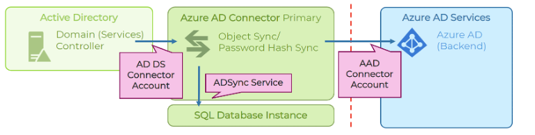

**AD DS Connector Account** has been configured during AADC server implementation and will be used to read/write information to Windows Server Active Directory. This account has no permissions in Azure AD but privileges to write-back attributes and passwords to on-premises AD. Service account cannot be used as "Group Managed Service Account (gMSA)" and needs to be protected particularly.

**AAD Connector Account** will be used to write information and synchronize objects from/to Azure AD.
Account will be created for each AAD Connect Server and is visible with display name "On-Premises Directory Synchronization Service Account" in Azure AD tenant. The account is assigned to the Azure AD directory role "[Directory Synchronization Accounts](https://docs.microsoft.com/en-us/azure/active-directory/roles/permissions-reference#directory-synchronization-accounts)".

**ADSync Service Account** takes place for running the synchronization service but has also access to the database for storing AADC information. No (direct) privileged access exists to Azure AD or Active Directory objects. Nevertheless, it’s a sensitive account because it plays a central part in running AADC services and data access (incl. SQL database).

More details about Azure AD Connect [accounts and permissions](https://docs.microsoft.com/en-us/azure/active-directory/hybrid/reference-connect-accounts-permissions) are described in Microsoft Docs articles.

# Attack scenarios

This chapter describes attack scenarios referring to the document scope. 

- Access to unprotected Azure AD Connect servers (not hardened or restricted access as Tier0 system) or exfiltration from uncontrolled/unencrypted backups allows access to AADC database.
    - Decryption and extraction of stored Azure AD and Active Directory credentials can be achieved by using [fox-it/adconnectdump](https://github.com/fox-it/adconnectdump).
    - Dumping of encryption keys of DPAPI and getting AADC related credentials has been automated as part of the "Get-AADIntSyncCredentials" cmdlet in the [AADInternals PowerShell module.](https://o365blog.com/post/adsync/)
    
    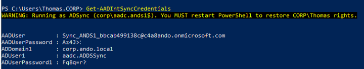
    
- Passwords of Azure AD connector account can be exfiltrated in clear text if privilege escalation to local admin permissions on AADC server was successfully.
    
  - More details of credentials dump are very well described in "[Shooting Up: On-Prem to Cloud](https://imphash.medium.com/shooting-up-on-prem-to-cloud-detecting-aadconnect-creds-dump-422b21128729)" by imp hash.
  - A great overview about "[Azure AD Connect for Red Teamer](https://blog.xpnsec.com/azuread-connect-for-redteam/)s" is available on XPN InfoSec Blog.
- Refresh/access token from account with assigned directory role "[Hybrid Identity Administrator](https://docs.microsoft.com/en-us/azure/active-directory/roles/permissions-reference#hybrid-identity-administrator)" can be replayed when it will be used to apply AADC configuration changes. Members of this role could be excluded from device compliance to allow usage on AAD Connect Server for management tasks.
    
    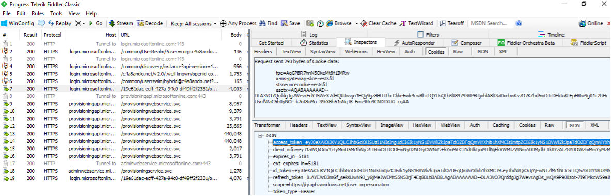
    
    - Token could be exfiltrated by "man in the middle" attacks, such as compromised proxy solutions (which will be used to prevent direct internet connection) and manipulated certificates.
- User accounts with assigned "[Hybrid Identity administrators](https://docs.microsoft.com/en-us/azure/active-directory/roles/permissions-reference#hybrid-identity-administrator)" roles has enhanced permissions for ’[sync service features’](https://docs.microsoft.com/en-us/azure/active-directory/hybrid/how-to-connect-syncservice-features) but also, extensive management permissions for service principals and app registrations in Azure AD which includes:
    
    - Change configuration of "soft and hard matching" feature settings.
        - By default, cloud-only accounts are only protected if they are assigned to directory roles.
        - Hard matching can be blocked for cloud-only particularly. This feature was [introduced in October 2021](https://twitter.com/rjong999/status/1451316231286374439/photo).
        - Only users with direct (role assignable group) membership to directory roles (such as Global Admin) are particularly protected. 
          - This can be seen in this test by using Privileged Access Groups (PAG), Role Assignable Groups (PRG) in a combination of eligible/permanent membership and ownership of group:
            
            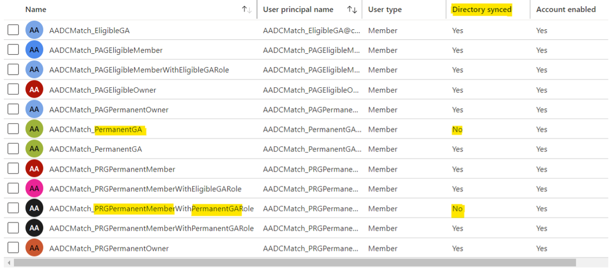
            
    - Blocking of soft and hard matching (recommended) could have been already configured.
        - Nevertheless, "Hybrid identity admins" are able to modify this setting and could be used to "synchronize" accounts and take control of accounts with sensitive permissions outside of Azure AD directory roles. 
          - A great explanation about "[user hard and soft matching](https://dirteam.com/sander/2020/03/27/explained-user-hard-matching-and-soft-matching-in-azure-ad-connect/)" has been written by Sander Berkouwer.
    - Directory role permissions allows to change ownership of "GraphAggregatorService" service principal and add app roles to self-grant arbitrary Microsoft Graph API permission.
        - More details about this service principal and abusing app roles are described in "[Azure Privilege Escalation via Azure API Permissions Abuse](https://posts.specterops.io/azure-privilege-escalation-via-azure-api-permissions-abuse-74aee1006f48)" by Andy Robbins.
- Temporary Access Pass can be used by compromised high-privileged accounts or service accounts to create a backdoor on "On-Premises Directory Synchronization Service Account":
    - This allows to issue credentials for existing synchronization account(s), instead of creating noise (in security detections) by creating new accounts or reset password of existing ones. Most SecOps/SOC teams are not monitoring the synchronization accounts actively or particularly.

## MITRE ATT&CK Framework
MITRE ATT&CK framework is commonly used for mapping Tactics, Techniques and Procedures (TTPs) for adversary actions and emulating defenses on organizations around the world.

### Tactics, Techniques & Procedures (TTPs) of the named attack scenarios

### TTP on abusing service connections in Azure DevOps

|  Attack Scenario |    TTPs         |  Description  |
|--------------|-----------|-----------|
|  Using credentials of Azure AD Connector accounts from unprotected Azure AD Connect for privileged access to Connector API | OS Credential Dumping [T1003.006](https://attack.mitre.org/techniques/T1003/) | Adversaries may attempt to dump credentials to obtain account login and credential material, normally in the form of a hash or a clear text password, from the operating system and software. Credentials can then be used to perform Lateral Movement and access restricted information Several of the tools mentioned in associated sub-techniques may be used by both adversaries and professional security testers. Additional custom tools likely exist as well. |   |  Using credentials of Azure AD Connector accounts from unprotected Azure AD Connect for privileged access to Connector API,  Adding temporary access pass to Azure AD Connector Account | Valid Accounts: Cloud Accounts - [T1078.004](https://attack.mitre.org/techniques/T1528/)| Adversaries may obtain and abuse credentials of a cloud account as a means of gaining Initial Access, Persistence, Privilege Escalation, or Defense Evasion. Cloud accounts are those created and configured by an organization for use by users, remote support, services, or for administration of resources within a cloud service provider or SaaS application. In some cases, cloud accounts may be federated with traditional identity management system, such as Window Active Directory. Compromised credentials for cloud accounts can be used to harvest sensitive data from online storage accounts and databases. Access to cloud accounts can also be abused to gain Initial Access to a network by abusing a Trusted Relationship. Similar to Domain Accounts, compromise of federated cloud accounts may allow adversaries to more easily move laterally within an environment. Once a cloud account is compromised, an adversary may perform Account Manipulation - for example, by adding Additional Cloud Roles - to maintain persistence and potentially escalate their privileges. |
|  Using credentials of Azure AD Connector accounts from unprotected Azure AD Connect for privileged access to Connector API,  Adding temporary access pass to Azure AD Connector Account | Account Manipulation: Additional Cloud Credentials - [T1098.001](https://attack.mitre.org/techniques/T1098/001/)| Adversaries may add adversary-controlled credentials to a cloud account to maintain persistent access to victim accounts and instances within the environment. Adversaries may add credentials for Service Principals and Applications in addition to existing legitimate credentials in Azure AD. These credentials include both x509 keys and passwords.With sufficient permissions, there are a variety of ways to add credentials including the Azure Portal, Azure command line interface, and Azure or Az PowerShell modules. |
| Exfiltrate refresh/access token from Hybrid Identity admin for AADC or application configuration changes | Steal Application Access Token - [T1528](https://attack.mitre.org/techniques/T1528/)| Adversaries can steal application access tokens as a means of acquiring credentials to access remote systems and resources. Application access tokens are used to make authorized API requests on behalf of a user or service and are commonly used as a way to access resources in cloud and container-based applications and software-as-a-service (SaaS). OAuth is one commonly implemented framework that issues tokens to users for access to systems. Adversaries who steal account API tokens in cloud and containerized environments may be able to access data and perform actions with the permissions of these accounts, which can lead to privilege escalation and further compromise of the environment. |
|||

# Detections

On the detections side, we are focusing on available Microsoft cloud-based security solutions:
Starting from the source of the attack, Azure AD Connect server, which is located on-premises, and moving to cloud-based security solutions.

You can expect to find the tools used in the following scenarios in this chapter:

- Microsoft Defender for Endpoint (MDE) on AAD Connect for detecting suspicious activities or tools on the operating system level and on-premises environment.
- Microsoft Defender for Cloud Apps (MDCA) and Microsoft Sentinel for detecting suspicious sign-in and audit activities of the AAD Connector Account but also Hybrid Identity Admin.
- Microsoft Sentinel takes essential part for advanced detection by using WatchList and anomaly techniques.
- Azure AD Identity Protection (IPC) detection is valuable if interactive (and suspicious/unfamiliar) sign-in has been attempted by Azure AD connector account.

In our templates of Microsoft Sentinel analytics rule, we’re using **[WatchLists](https://docs.microsoft.com/en-us/azure/sentinel/watchlists)** to enrich and store information for correlation centrally.
WatchList template for "[High-Value Assets](https://docs.microsoft.com/en-us/azure/sentinel/watchlist-schemas#high-value-assets)" should be used to define "AAD Connect Servers" and the assigned public IP address.

  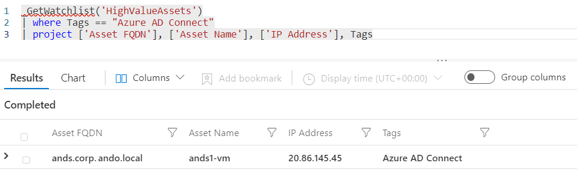

Valid and authorized Azure AD connector accounts should be included in the  "[Service Accounts](https://docs.microsoft.com/en-us/azure/sentinel/watchlist-schemas#service-accounts)" WatchList template.
This helps us to identify user accounts with assigned "Directory Synchronization" or similar account names which aren't whitelisted as part of the WatchList.

  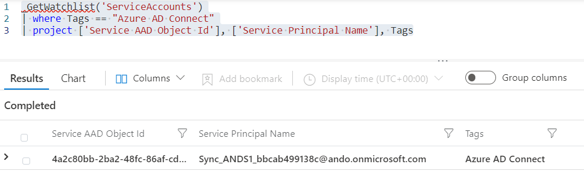

Both lists are using the same tag (Azure AD Connect) to identify related resources to the AADC operations and activities.
These Watchlists are an important part and pre-requisite for the custom analytics rules which we have written for this playbook.

UEBA tables is another feature which will be included in one of the queries.
We're using **[IdentityInfo](https://techcommunity.microsoft.com/t5/microsoft-sentinel-blog/what-s-new-identityinfo-table-is-now-in-public-preview/ba-p/2571037)** table to identify user accounts with directory role assignment to "Hybrid Identity Administrator". Related Azure AD connector accounts can be also identified by directory role assignment ("Directory Synchronization Accounts") which is also stored in "IdentityInfo".

## Threat signals by using offensive tools on AADC servers

If Microsoft Defender for Endpoint (MDE) is installed to AAD Connect server, EDR can detect suspicious activities from the instance. For example, when [AADInternals](https://o365blog.com/aadinternals/) is used to dump Azure AD Connect credentials the activity is detected by MDE.

### Dumping credentials with AADInternals

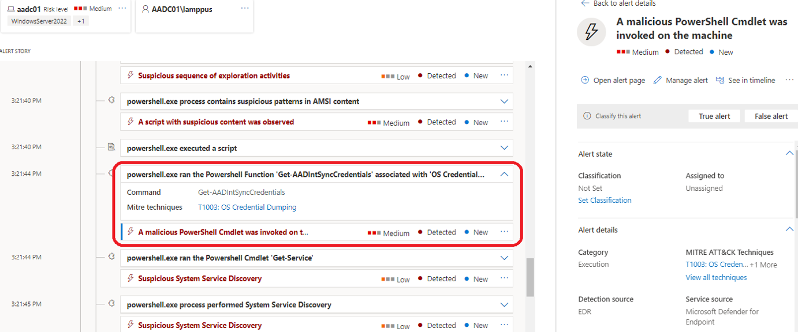

### Updating credentials with AADInternals
MDE will be able to detect access or updates to credentials of ADSync or Azure AD connector (by using AADInternals):

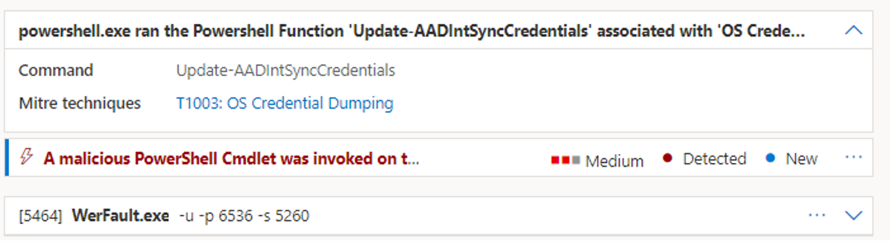

*Side note: If you are not protecting AADC server(s) by MDE, activities of tools (such as AADInternals) can be detected based on a event in Windows Event logs which can be used for custom detections.*. *More information about detection options of credentials dump are described in the blog post "[Shooting Up: On-Prem to Cloud" by imp hash.](https://imphash.medium.com/shooting-up-on-prem-to-cloud-detecting-aadconnect-creds-dump-422b21128729)*

## Changes of AAD Connect sync features

Global and Hybrid Identity Administrators are able to change sync features of Azure AD Connect.
This includes the attack scenario to enable "hard" and "soft" matching to takeover of cloud-only accounts. Current configuration can be displayed by using "Get-MsolDirSyncFeature":

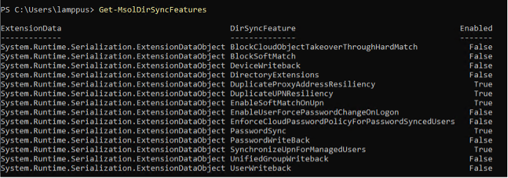

The attacker needs to use "[Set-MsolDirSyncFeature](https://docs.microsoft.com/en-us/powershell/module/msonline/set-msoldirsyncfeature?view=azureadps-1.0)" cmdlet from the MSOL PowerShell module. This activity creates an audit log in Azure AD:

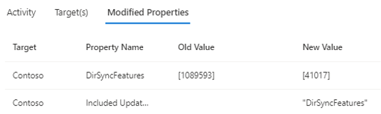

Microsoft Sentinel Analytics rule "[Disabled soft- or hard match of Azure AD Connect sync](./queries/AADConnect-ChangedDirSyncSettings.kql)" allows to create incidents if a identity synchronization features has been modified. The old and new value (in the audit log entry) is summed integer of all [DirSync feature settings](https://docs.microsoft.com/en-us/azure/active-directory/hybrid/how-to-connect-syncservice-features) which includes "BlockSoftMatch" or "BlockCloudObjectTakeoverThroughHardMatch" but also other important settings such as enable/disable "Password Hash Sync"

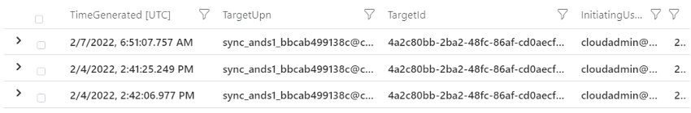

## Suspicious activities from Azure AD connector account
Suspicious AD sign-ins and audit events from AD DS connector service account can be detected by Microsoft Sentinel.
As already described, we're using WatchLists to identify valid AADC servers (based on name/IP address) and also Azure AD connector accounts (based on Azure AD ObjectId).

Assignments and activities of "Directory Synchronization" role members can be sourced from the IdentityInfo table.
In addition, we're using the standard naming pattern (sync_*@*.onmicrosoft.com) of Azure AD connector accounts to find similar named objects. Both sources will be used in the analytics rule "[Azure AD connector accounts outside of WatchLists](./queries/AADConnectorAccount-OutsideOfWatchList.kql)" to detect any accounts which aren't whitelisted and seems to be suspicous accounts or an indicator for outdated watchlist content.

Our next analytics rule "[Sign-in from Azure AD connector account outside of AADC Server](./queries/AADConnect-SignInsOutsideServerIP.kql)" is written to detect sign-ins outside of a named public IP addresses.
We're using "AccountObject ID" from the "Service Accounts" watchlist to detect any sign-ins outside of the named IP address which is defined in the "High Value Asses" watchlist. Furthermore, we're covering all sign-ins to the "AAD Connect Endpoints" (Azure AD Sync and AAD Connect V2) to detect sign-ins that doesn't match with the WatchList.

The hunting query "[Activities from AAD connector account with enrichment of IdentityInfo](./queries/AADConnectorAccount-AADActivitiesWithEnrichedInformation.kql)" can be used for further investigation of changes which was made by the whitelisted AAD connector account. It allows to find "take over" or synchronization to user objects with sensitive group membership or assigned AAD roles. This query is also useful to find anomaly of object changes.

In addition to the custom analytics rules, the following signals or queries could be used to identify suspicious events:
- Insights from ["BehaviourAnalytics"](https://docs.microsoft.com/en-us/azure/sentinel/identify-threats-with-entity-behavior-analytics) from Microsoft Sentinel's UEBA. This also includes events if firstpeer IP addresses or rare operations has been detected.
- Any kind of risk events of Azure AD connector account (by Identity Protection) should be reviewed. Trigger incidents for those kind of events by using the [AADRiskyUsers](https://docs.microsoft.com/en-us/azure/azure-monitor/reference/tables/aadriskyusers) and [AADUserRiskEvents](https://docs.microsoft.com/de-de/azure/azure-monitor/reference/tables/aaduserriskevents) tables.
- Any password change and user modification to the "AAD Sync Service Account" should be also reviewed

## Takeover Azure AD connector by generating Temporary access pass (TAP) as backdoor

High-privileged role administrators (such as Global Admin) could be a TAP to use Azure AD connector account with any noise or service interruption (compare to password change).

Analytics rule "[Added temporary access pass or changed password of Azure AD connector account](./queries/AADConnectorAccount-AddedTAPorChangedPassword.kql)" is looking for security information (of TAP) and password change event. AAD connector accounts will be identified by IdentityInfo table (assignment to "Directory Synchronization Accounts" role) and name pattern.

## Password Spray attacks to Azure AD connector account

Attackers could try to gain credentials of the account by using a "Password Spray Attack".
This attack allows also to enforce (Smart) lockout which will end in stopping AADC synchronization if the source of attack and AADC seerver are sharing the same public IP address (e.g. common outbound public IP of on-premises environment).

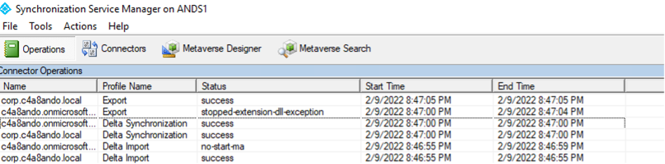

If AAD Connect service account is hammered by password spray attack, "**Microsoft Defender for Cloud Apps (MDCA)**" is able to detect such activity:

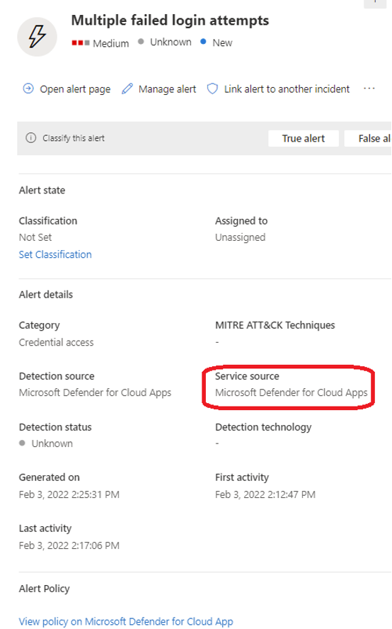

More information about detecting password spray attacks can be found [from this playbook chapter](./PasswordSpray.md).

# Mitigations

### Increase visibility by implementing detections

- Implement security solution and detections from the detection part, evaluate our custom Microsoft Sentinel queries and add them to your analytics or hunting queries:
  - "[Azure AD connector accounts outside of WatchLists](./queries/AADConnectorAccount-OutsideOfWatchList.kql)"
    List of objects with directory role assignment to "Directory Synchronization" or naming similar to AAD connector account which aren't stored in the WatchList. Indicator of creating AAD connector account as backdoor.
  - "[Activities from AAD connector account with enrichment of IdentityInfo](./queries/AADConnectorAccount-AADActivitiesWithEnrichedInformation.kql)"
    Azure AD Audit Events of AAD connector account (defined in WatchList) will be correlated with IdentityInfo.
  - "[Sign-in from Azure AD connector account outside of AADC Server](./queries/AADConnect-SignInsOutsideServerIP.kql)"
    Successful sign-ins from valid AAD connector account outside of whitelisted IP address from WatchList.
  - "[Added temporary access pass or changed password of Azure AD connector account](./queries/AADConnectorAccount-AddedTAPorChangedPassword.kql)"
    Activities on adding Temporary Access Pass (TAP) as authentication method for valid AAD connector account.
  - "[Disabled soft- or hard match of Azure AD Connect sync](./queries/AADConnect-ChangedDirSyncSettings.kql)"
    Change of AAD sync configuration to overwrite and take-over (Azure AD) cloud-only accounts from AADC server (on-premises)
  
### Secure your AAD Connect Server and Service Accounts as Tier0

- Protect your AADC as Tier0 system which is part of your "control plane" on-premises <u>and</u> in the cloud
    - Verify every asset with direct or indirect management access (incl. GPO, delegated permissions on OU, installed agents or open admin interfaces)
    - Verify your options for backup (use a full encrypted and secure way to isolate the backup, otherwise export configuration on a regular basis to restore without backup)
- Follow Microsoft’s [best practices to "harden" AADC server implementation](https://docs.microsoft.com/en-us/azure/active-directory/hybrid/how-to-connect-install-prerequisites#harden-your-azure-ad-connect-server)
- [Lock down and disable permission inheritance](https://docs.microsoft.com/en-us/azure/active-directory/hybrid/reference-connect-version-history-archive#lock) for all AADC service accounts
  
  "Suppose there is a malicious on-premises AD administrator with limited access to Customer’s on-premises AD but has Reset-Password permission to the AD DS account. The malicious administrator can reset the password of the AD DS account to a known password value. This in turn allows the malicious administrator to gain unauthorized, privileged access to the Customer ’s on-premises AD"
        
  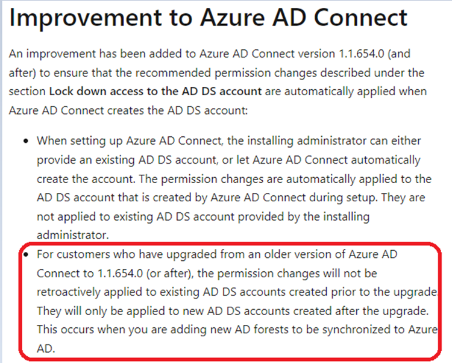
        
- Rotate credentials of all non-managed service accounts regularly
- Limit your scope on synchronizing AD objects to Azure AD (exclude Tier0 assets incl. AADC related resources)
    - Delegate permissions to AD DS connector account to scoped OUs only

### Reduce attack surface for AAD Connect resources

- Avoid unpatched version of AAD connect server (track patch/versions by vulnerability management solution) and minimize installed agents which allows local exploit
- Use local SQL if you aren’t able to use a protected/dedicated Tier0 SQL server
- Remove unnecessary and unused "On-Premises Directory Synchronization Service Account" or "DirSync" account (assigned Global Admin roles) which can be abused by reset password and trigger sync operations
- Disable Seamless SSO if you haven’t a particular use case or requirement for that
- Evaluate "AAD Connect Cloud Synchronization" as alternate solution if the [included features fit to your requirement](https://docs.microsoft.com/en-us/azure/active-directory/cloud-sync/what-is-cloud-sync#comparison-between-azure-ad-connect-and-cloud-sync). This allows to reduce risk dependencies and attack surface of AAD connect sync components in your on-premises environment.

## Protect your cloud-only and privileged accounts from account take over

Disable "Soft match" and "Hard match" (for CloudOnly Accounts) by using "[Set-MsolDirSyncFeature](https://docs.microsoft.com/en-us/powershell/module/msonline/set-msoldirsyncfeature?view=azureadps-1.0)" cmdlets:

- Set-MsolDirSyncFeature -Feature BlockCloudObjectTakeoverThroughHardMatch -Enable $true
- Set-MsolDirSyncFeature -Feature BlockSoftMatch -Enable $true

Monitor any changes to these feature configurations, as we have shown in the detection section.
Overall monitoring of changing "DirSync" feature configuration should be considered to see changes in other areas as well (such as disable password hash sync).

Include AAD Connect assets in Conditional Access Design to restrict and avoid attack surface:

- As already shown, "Password Spray Attacks" on "On-Premises Directory Synchronization Service Account" allows to block synchronization from on-premises to Azure AD. This could avoid sychronization of security-related lifecycle updates (e.g. disable account of leaved employees)
- Running AAD connect with dedicated public IP address allows to restrict access of "Azure AD connector account" based on IP addresses in Conditional Access. This avoid to have running password spray attack from a shared IP address range with other (on-premises) resources.
- Use a dedicated CA policy that allows the sync account login from this certain IP address only:
  - Access to AAD Connect (API) endpoint ("Microsoft Azure Active Directory Connect") cannot be targeted as Cloud App. Therefore, CA policy must be target on "All Cloud Apps" for directory role members of "Directory Synchronization Accounts" and "Hybrid Identity Administrators" (if needed):
    
    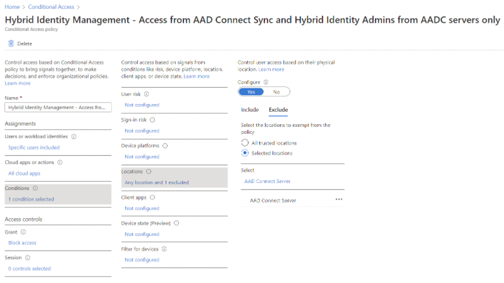
    
If authentication is allowed only from certain IP-addresses access, Conditional Access will block the authentication requests. We often see that the "AADC service account" is just excluded from the policies but we would rather recommend creating a separate policy for the service accounts as mentioned above.

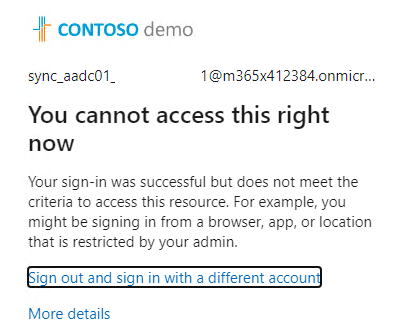

# Security Insights from Azure AD Connect Server
This chapter contains information about the "Azure AD Connect" server related security monitoring activities that can be established and also insights about Azure AD Connect Health. The latter one provides Azure AD Connect monitoring and performance data to Azure AD.

## Local application and system events from Azure AD Connect (Server)

Information from activities inside the Azure AD Connect server is logged to Windows Event logs. Most of the AADC-related activities are found from the "Application log".

These events can be sent to Microsoft Sentinel and underlying Azure Log Analytics workspace (or 3rd party SIEM) when needed. If Microsoft Sentinel is used in the environment there are two options to send the Windows Events:

- Microsoft Monitoring Agent (MMA) also known as Azure Log Analytics agent
- Azure Monitoring Agent (AMA) through Azure Arc

Both agents obviously have pros and cons but we are not focusing on the agent capabilities in this playbook. Taking that into account, if you would like to have more information about the agent capabilities, we suggest starting with the Microsoft documentation:

- [Collect Windows event log data sources with Log Analytics agent in Azure Monitor - Azure Monitor | Microsoft Docs](https://docs.microsoft.com/en-us/azure/azure-monitor/agents/data-sources-windows-events)
- [Configure data collection for the Azure Monitor agent - Azure Monitor | Microsoft Docs](https://docs.microsoft.com/en-us/azure/azure-monitor/agents/data-collection-rule-azure-monitor-agent#limit-data-collection-with-custom-xpath-queries)
- [Collect custom logs with Log Analytics agent in Azure Monitor - Azure Monitor | Microsoft Docs](https://docs.microsoft.com/en-us/azure/azure-monitor/agents/data-sources-custom-logs#step-3-add-log-collection-paths)

*Side note: Consider sending AADC events (at minimum from the application log) to your application log management solution (this could also include Microsoft Sentinel). AAD Connect produces great operational level logs and also [exports configuration change every time change is made by ‘AAD Connect’](https://docs.microsoft.com/en-us/azure/active-directory/hybrid/how-to-connect-import-export-config) from version 1.5.30.0 onwards. This configuration export can be used to restore the whole service when needed.*

*- Only changes made by Azure AD Connect are automatically exported.
    - Any changes made by using PowerShell, the Synchronization Service Manager, or the Synchronization Rules Editor must be exported on demand as needed to maintain an up-to-date copy. Export on demand can also be used to place a copy of the settings in a secure location for disaster recovery purposes.*

*- If you are using Windows Sysinternals tool ‘Sysmon’ to collect events from your AADC Server these events can be sent to Log Analytics as a custom log. More information from - [How to deploy Sysmon and MMA Agent to receive logs in Azure Sentinel? | Microsoft 365 Security (m365internals.com)](https://m365internals.com/2021/05/17/how-to-deploy-sysmon-and-mma-agent-to-receive-logs-in-azure-sentinel/)*

## Removing AAD Sync Server(s) from AAD Connect Health

AAD Connect Health provides agent provides health information from AADC service and sends that information to Azure AD. The information is available in the dedicated AAD Connect Health blade in the Azure AD portal.

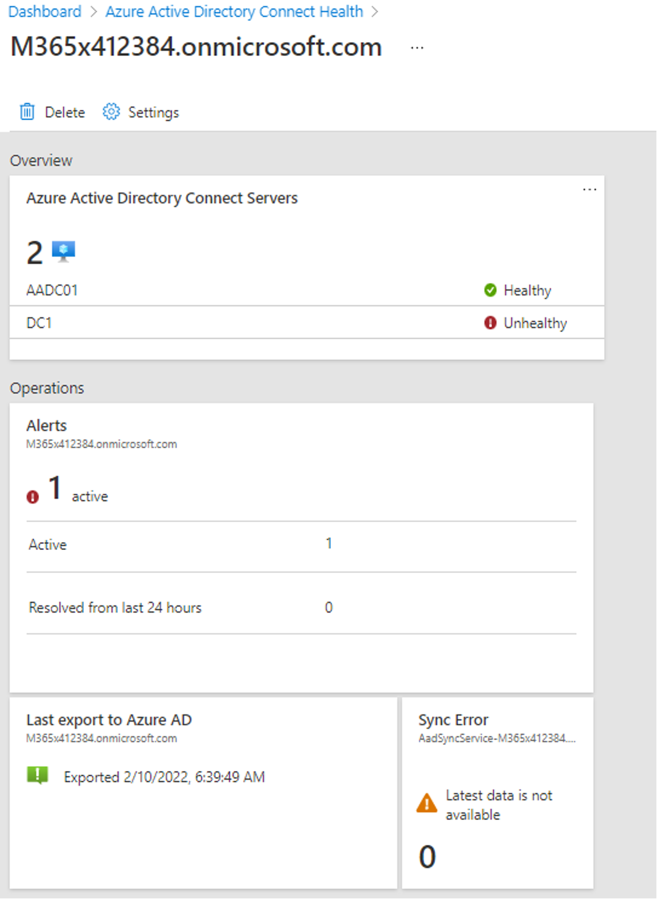

If the attacker wants to hide health events from the AADC server he/she might want to delete AADC servers from the portal. When deleted, there isn’t any event from the actual deletion process found from the Azure AD audit logs.

The event from the deletion can be found from Microsoft Defender for Cloud Apps (MDCA) as in many similar use cases.

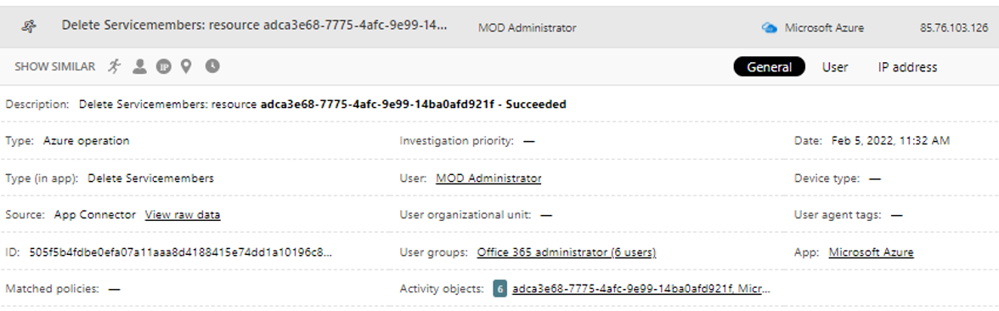

## Other references and resources

* [AAD Internals (o365blog.com)](https://o365blog.com/aadinternals/#set-aadintpasswordhashsyncenabled-a)

* [HOWTO: Hunt for abuse of Azure AD Connect’s AD Connector account - The things that are better left unspoken (dirteam.com)](https://dirteam.com/sander/2021/03/04/howto-hunt-for-abuse-of-azure-ad-connects-ad-connector-account/)

* [Detecting Microsoft 365 and Azure Active Directory Backdoors | Mandiant](https://www.mandiant.com/resources/detecting-microsoft-365-azure-active-directory-backdoors)
