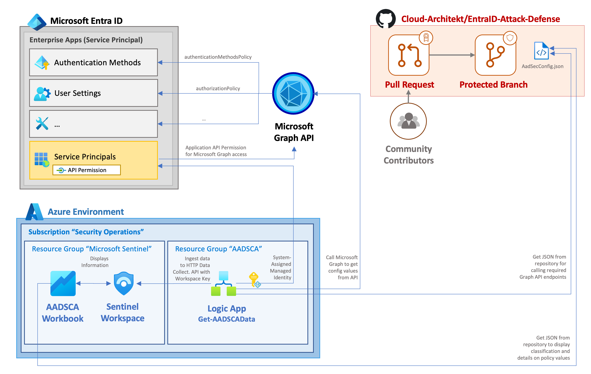

# Entra ID Security Config Analyzer (EIDSCA)
We decided to take alternative approach for chapter 6 and we are not covering possible Microsoft Entra ID attack path. This time, the focus is on on proactive side, how organizations can monitor and strengthen Entra ID's security posture. For this purpose we created 'Entra ID Security Config Analyzer' aka 'EIDSCA' solution.

_Authors: Thomas Naunheim, Sami Lamppu & Markus Pitkäranta_
_Created: March 2023_
_Update_: December 2023_

- [Entra ID Security Config Analyzer (EIDSCA)](#entra-id-security-config-analyzer-eidsca)
- [Description](#description)
- [Architecture](#architecture)
  - [Microsoft Graph API Endpoints used by the solution](#microsoft-graph-api-endpoints-used-by-the-solution)
- [MITRE ATT\&CK Framework](#mitre-attck-framework)
    - [TTP Description \& Built-in Rules](#ttp-description--built-in-rules)
- [Azure Workbook](#azure-workbook)
- [Pre-requisites for the Solution Deployment](#pre-requisites-for-the-solution-deployment)
- [Optional: Create Microsoft Sentinel Incidents by EIDSCA detected configuration changes](#optional-create-microsoft-sentinel-incidents-by-eidsca-detected-configuration-changes)
  - [Deployment](#deployment)
    - [ARM Template for Logic App and Sentinel Playbook](#arm-template-for-logic-app-and-sentinel-playbook)
    - [Assigning Graph API permissions to Managed Identity](#assigning-graph-api-permissions-to-managed-identity)
    - [Azure Workbook](#azure-workbook-1)
    - [Microsoft Sentinel Integration for Incident Creation](#microsoft-sentinel-integration-for-incident-creation)
- [FAQ](#faq)
- [References](#references)

# Description
The purpose of the Entra ID Security Config Analyzer is to provide a solution that pulls out Entra ID security configuration from the selected Microsoft Graph API endpoints and ingest the data to Log Analytics. Azure Workbook is used for data visualization and Microsoft Sentinel can be used to create alerts/incidents when critical configuration change is detected.

_DISCLAIMER: This is a community-driven project and not a official solution or product. This code-sample is provided "AS IT IS" without warranty of any kind, either expressed or implied, including but not limited to the implied warranties of merchantability and/or fitness for a particular purpose. This sample is not supported under any support program or service.. 
We further disclaims all implied warranties including, without limitation, any implied warranties of merchantability or of fitness for a particular purpose. The entire risk arising out of the use or performance of the sample and documentation remains with you. In no event shall we, its authors, or anyone else involved in the creation, production, or delivery of the script be liable for any damages whatsoever (including, without limitation, damages for loss of business profits, business interruption, loss of business information, or other pecuniary loss) arising out of  the use of or inability to use the sample or documentation, even if Microsoft has been advised of the possibility of such damages._

# Architecture
The following picture describes EIDSCA solution architecture, used solution and data flows:

_Reference architecture to integrate EIDSCA as part of Microsoft Sentinel environment. Data will be ingested to same workspace as Sentinel.
It depends on your implementation and design if you want to have an integration to dedicated, operational or existing Sentinel workspace._

## Microsoft Graph API Endpoints used by the solution
The solutions uses several Microsoft Graph API endpoint to get security configuration settings from Entra ID. Worthwhile to mention, the 'EIDSCA' solution does not cover all Entra ID-related endpoints. Full Entra ID related GraphUri's for the currently used endpoints by the solution are listed on the table below:

| Endpoint     |  Permissions     | 
|  ---  |  ---  |
| https://graph.microsoft.com/beta/policies/authorizationPolicy | Policy.All |
| https://graph.microsoft.com/beta/settings     |  Policy.Read.All     |
| https://graph.microsoft.com/beta/policies/activityBasedTimeoutPolicies      | Policy.Read.All      |
| https://graph.microsoft.com/beta/policies/externalIdentitiesPolicy      |  Policy.Read.All     |
| https://graph.microsoft.com/beta/policies/featureRolloutPolicies     |  Directory.Read.All     |
| https://graph.microsoft.com/beta/policies/authenticationMethodsPolicy      | Policy.Read.All      |
| https://graph.microsoft.com/beta/policies/authenticationStrengthPolicies      | Policy.Read.All      |
| https://graph.microsoft.com/beta/policies/defaultAppManagementPolicy     | Policy.Read.All      |
| https://graph.microsoft.com/beta/policies/appManagementPolicies      |  Policy.Read.All     | 
| https://graph.microsoft.com/beta/policies/adminConsentRequestPolicy      | ConsentRequest.Read.All, Directory.Read.All      |
| https://graph.microsoft.com/beta/policies/permissionGrantPolicies		  | Policy.Read.All |
| https://graph.microsoft.com/beta/policies/crossTenantAccessPolicy      | Policy.Read.All      |
| https://graph.microsoft.com/beta/policies/tokenIssuancePolicies      |  Policy.Read.All     |
| https://graph.microsoft.com/beta/policies/tokenLifetimePolicies      |  Policy.Read.All     |

# MITRE ATT&CK Framework
MITRE ATT&CK framework is commonly used for mapping Tactics, Techniques & Procedures (TTPs) for adversary actions and emulating defenses on organizations around the world. Even though, security posture configuration is not directly mapped to MITRE ATT&CK framework we wanted to map settings to the framework because indirectly settings has relation to possible attacks and adversary actions. 

From the following MITRE Navigator pictures you can find mapping related to relevant Entra ID endpoint security configurations.

<a style="font-style:italic" href="https://mitre-attack.github.io/attack-navigator/#layerURL=https%3A%2F%2Fraw.githubusercontent.com%2FCloud-Architekt%2FAzureAD-Attack-Defense%2FAADSCAv3%2Fmedia%2Fmitre%2FChapter6%2FAADPB-CP6-TTPs.json&tabs=false&selecting_techniques=false" >Open in MITRE ATT&CK Navigator</a>

### TTP Description & Built-in Rules
The following TTPs are mapped for the 'Entra ID Security Advisor' solution and AAD security settings. From the table below, you can find TTPs description and link to the MITRE ATT&CK official documentation.

| TTPs         | Description  |
|--------------|-----------| 
| Initial Access - [T1566](https://attack.mitre.org/techniques/T1566/) | AAdversaries may send phishing messages to gain access to victim systems. All forms of phishing are electronically delivered social engineering. Phishing can be targeted, known as spearphishing. In spearphishing, a specific individual, company, or industry will be targeted by the adversary. More generally, adversaries can conduct non-targeted phishing, such as in mass malware spam campaigns.
| Initial Access - [T1566.002](https://attack.mitre.org/techniques/T1566/002/) | Adversaries may send spearphishing emails with a malicious link in an attempt to gain access to victim systems. Spearphishing with a link is a specific variant of spearphishing. It is different from other forms of spearphishing in that it employs the use of links to download malware contained in email, instead of attaching malicious files to the email itself, to avoid defenses that may inspect email attachments. Spearphishing may also involve social engineering techniques, such as posing as a trusted source.
| Initial Access - [T1078](https://attack.mitre.org/techniques/T1078/) | Adversaries may obtain and abuse credentials of existing accounts as a means of gaining Initial Access, Persistence, Privilege Escalation, or Defense Evasion. Compromised credentials may be used to bypass access controls placed on various resources on systems within the network and may even be used for persistent access to remote systems and externally available services, such as VPNs, Outlook Web Access, network devices, and remote desktop. Compromised credentials may also grant an adversary increased privilege to specific systems or access to restricted areas of the network. Adversaries may choose not to use malware or tools in conjunction with the legitimate access those credentials provide to make it harder to detect their presence.
| Defense Evasion - [T1550](https://attack.mitre.org/techniques/T1550/) | Adversaries may use alternate authentication material, such as password hashes, Kerberos tickets, and application access tokens, in order to move laterally within an environment and bypass normal system access controls.
|Credential Access - [T1528](https://attack.mitre.org/techniques/T1528/) | Adversaries can steal application access tokens as a means of acquiring credentials to access remote systems and resources. Application access tokens are used to make authorized API requests on behalf of a user or service and are commonly used as a way to access resources in cloud and container-based applications and software-as-a-service (SaaS). OAuth is one commonly implemented framework that issues tokens to users for access to systems. Adversaries who steal account API tokens in cloud and containerized environments may be able to access data and perform actions with the permissions of these accounts, which can lead to privilege escalation and further compromise of the environment. 
|Lateral Movement - [T1110](https://attack.mitre.org/techniques/T1110/) | Adversaries may use brute force techniques to gain access to accounts when passwords are unknown or when password hashes are obtained. Without knowledge of the password for an account or set of accounts, an adversary may systematically guess the password using a repetitive or iterative mechanism. Brute forcing passwords can take place via interaction with a service that will check the validity of those credentials or offline against previously acquired credential data, such as password hashes. |

# Azure Workbook
This workbook provides insights into Azure Active Directory tenant security configurations. The workbook compares current tenant configurations against best practices, and displays the status (current, recommended and default values) of each configuration. The best practices are based on community work see [Entra ID Attack and Defense GitHub intro chapter](https://github.com/Cloud-Architekt/AzureAD-Attack-Defense/blob/main/README.md) for details. You can also apply your own recommended values by taking a copy of the metadata JSON file, and updating the queries in this workbook to utilize the customized version.

In addition to providing best practices, each configuration is mapped to MITRE ATT&CK framework, allowing you to to identify potentially vulnerable configurations in terms of tactics and techniques.

Each of the values are combined to "Status" field and can have the following values:

|   Value    |  Description     |
|  ---  |  ---  |
|  Passed     |  The configuration is compliant with the recommended value     |
|  Failed     |  The configuration is not compliant with the recommended value. The severity of the finding is High (this is shown in the tooltip)     |
|  Review     |  The configuration is not compliant with the recommended value. The severity of the finding is Medium (this is shown in the tooltip)     |
|  Verify     |  The configuration needs to be manually verified. The severity of the finding is Medium or High (this is shown in the tooltip)    |
|  Informational     | There are no security implications with this configuration, and therefore is only considered informational in this context.      |

# Pre-requisites for the Solution Deployment
To successfully deploy the 'EIDSCA' solution you need to have Azure Log Analytics workspace for storing the data as well as permission to create Azure resources & grant needed API permissions to the Managed Identity used by the Logic App. 

What's needed in a nutshell:
  - Logic App
  - Azure Workbook
  - Azure Log Analytics
    - Preferred to use the same Log Analytics workspace than Microsoft Sentinel is using
    - This will provide more possibilities to leverage the collected data in Sentinel side such as create analytics rules
- Ability to add & configure permissions for Entra ID Managed Identity
  - Configure permissions for Managed Identity in Entra ID side (grant consent permissions)

# Optional: Create Microsoft Sentinel Incidents by EIDSCA detected configuration changes

We have updated EIDSCA to offer a integration to Microsoft Sentinel by trigger the Logic App in case of policy changes and create an incident. Currently only changes to `AuthorizationPolicy` will be covered by this solution. The incident includes all details from the Workbook including:

* Severity and MITRE Mapping based on classification by AadSecConf.json
* Previous, New and Recommended Value of Setting
* Details on the related setting incl. remediation steps

_Side Note: There's an expected delay (10-15 minutes) between configuration change and until the incident is showing in Microsoft Sentinel because of the integrated analytics rules and scheduled time (5 minutes)._

## Deployment
Base deployment is initialized with ARM template that deploys Azure Logic App (Import-AADConfigToLAWS) and necessary API connection into it with Managed Identity. 
- Azure Log Analytics custom table name: 'AADSCA_CL'

Besides ARM template permissions needs to be set for Managed Identity as well as deploy the Azure Workbook.
- Both of these (permissions & workbook deployment) are manual processes and not included in the ARM template deployment. 

### ARM Template for Logic App and Sentinel Playbook
There are two versions of a Logic App to ingest the data to Log Analytics or Microsoft Sentinel Workspace.
Both ARM templates are available from the [Deploy folder](https://github.com/Cloud-Architekt/AzureAD-Attack-Defense/tree/main/config/deploy/) or can be deployed below with 'Deploy to Azure' button.

**Logic App with recurrence interval (default 24 hours)**:

**Microsoft Sentinel Playbook with Incident Trigger**:

The following parameters are required for the successful deployment:
- Subscription
- Resource group
- Region
- Logic App Name
- Log Analytics Workspace Name
- Log Analytics Workspace id
- Log Analytics Workspace Key
- LAWS Resource group
- LAWS Subscription Id
- LAWS Connection Name
- Sentinel Trigger Connection Name (only for Playbook version)

The following resources are found from the environment:
- Logic Apps named as ‘Import-AADSCAtoLAWS’ in Azure subscription
- System-assigned Managed Identity in Entra ID Enterprise Applications blade named as ‘Import-AADSCAtoLAWS’
- API connection with managed identity connection that's needed for the Logic App

### Assigning Graph API permissions to Managed Identity
In our example, needed permissions for the EIDSCA solution (used by Managed Identity of Logic App) are set by PowerShell script. Feel free to use whatever method you find comfortable. The script assigns the following permissions:

- ConsentRequest.Read.All
- Directory.Read.All
- DirectoryRecommendations.Read.All
- Policy.Read.All
- Policy.Read.PermissionGrant
- ServicePrincipalEndpoint.Read.All

The permissions can be assigned from Azure Cloud Shell which provides a pre-installed Azure AD PowerShell Module.
A sample script is available here:

🔗[AADSCA-AddedPermToLogicAppMSI.ps1](config/deploy/AADSCA-AddedPermToLogicAppMSI.ps1)

### Azure Workbook
Azure Workbook for the data visualization is manually deployed. Preferred way is to deploy it as Sentinel workbook to avoid mapping issues to Log Analytics.

The Workbook is available from this GitHub repo:

🔗[AADSCA.workbook](config/deploy/AADSCA.workbook)

To deploy the workbook into Microsoft Sentinel:
- From the Workbook blade in Sentinel - select 'Add workbook'
- Select 'edit' mode & 'advanced editor' from the configuration blade
- Paste the workbook as a code and save it

### Microsoft Sentinel Integration for Incident Creation

Pre-requisite: Deploy the Playbook-Version of EIDSCA.

1. Import both analytics rules from Rule Templates folder:

    

    **Azure AD policy change has been detected** 
    🔗([Policy-change-detected.json](config/ruletemplates/Policy-change-detected.json))
    _Looking for policy operations (covers Authorization Policy changes) from Entra ID Audit Logs and create an informational incident which is used as trigger to initialize EIDSCA._

    **Entra ID Security Posture Issue has been detected by EIDSCA** 
    🔗([Posture-issue-detected.json](config/ruletemplates/Policy-change-detected.json)) 
    _Compares changes of CurrentValue between latest and previous dataset in EIDSCA after the playbook has been executed. It creates an incident foreach configuration change which does not match with recommended value._

2. Create an automation rule which triggers EIDSCA Playbook after analytics rule "Azure AD policy change has been detected" has created an incident. In addition, it's recommended to create an auto-close of the informational incident about the policy change.

    

# FAQ
Why we are not pulling the data from all of the endpoints? 
- All AAD endpoints doesn't contain security related configuration settings.
  
Why all Entra ID endpoints that contain security related configuration are not included?
- To the first release we didn't include all relevant endpoints. Those will be added in the future updates & releases.

Why MITRE ATT&CK mapping is made even though the AAD settings are not part of the common attack scenarios?
- We see the benefit for adding the mapping even though the setting are not directly associated to the MITRE framework

I'm seeing and permission error after initial deployment, what to do?
- Azure Logic App caches permissions and it will take a while after permissions are valid. In testing phase it took max of 5-10min until Logic Apps was able to authenticate through Managed Identity to Entra ID. If you decide to change permissions afterwards it can take up to 24 hours until permissions are effective due Azure Logic Apps caching mechanism.

# References

- [Apps & service principals in Entra ID - Microsoft identity platform | Microsoft Docs](https://docs.microsoft.com/en-us/azure/active-directory/develop/app-objects-and-service-principals)

- [Microsoft identity platform scopes, permissions, and consent | Microsoft Docs](https://docs.microsoft.com/en-us/azure/active-directory/develop/v2-permissions-and-consent)