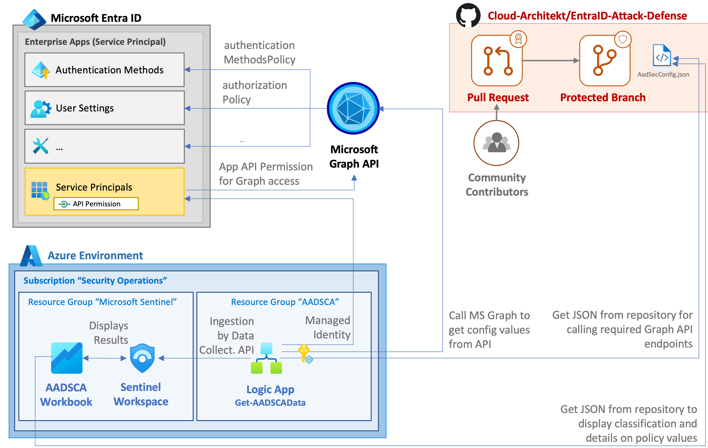

# Azure AD Security Config Analyzer (AADSCA)
In the chapter 6 of Azure AD Attack & Defense Playbook we decided to take alternative approach and we are not covering possible Azure AD attack path. This time, the focus is on on proactive side, how organizations can monitor and strengthen Azure AD's security posture. For this purpose we created 'Azure AD Security Config Analytics' aka 'AADSCA' solution. 

_Authors: Thomas Naunheim, Sami Lamppu & Markus Pitkäranta_
_Created: March 2023_

- [Azure AD Security Config Analyzer (AADSCA)](#azure-ad-security-config-analyzer-aadsca)
- [Description](#description)
- [Architecture](#architecture)
  - [Azure AD Endpoints Used by the Solution](#azure-ad-endpoints-used-by-the-solution)
- [Azure Workbook](#azure-workbook)
- [MITRE ATT\&CK Framework](#mitre-attck-framework)
    - [TTP Description \& Built-in Rules](#ttp-description--built-in-rules)
- [Pre-requisites for the Solution Deployment](#pre-requisites-for-the-solution-deployment)
  - [Deployment](#deployment)
    - [ARM Template](#arm-template)
    - [PowerShell Script](#powershell-script)
    - [Azure Workbook](#azure-workbook-1)
- [FAQ](#faq)
- [References](#references)

# Description
The purpose of the Azure AD Security Config Analyzer solution is to provide a solution that pulls out Azure AD security configuration from the selected AAD endpoints and ingest the data to Azure Log Analytics. Azure Workbook is used for data visualization and Microsoft Sentinel can be used to create alerts/incidents when critical configuration change is detected. 

# Architecture
The following picture describes AADSCA solution architecture, used solution and data flows:

## Azure AD Endpoints Used by the Solution
The solutions uses several Azure AD endpoint to get security configuration settings from Azure AD. Worthwhile to mention, the 'AADSCA' solution does not cover all Azure AD endpoints. Full Azure AD GraphUri's for the currently used endpoints by the solution are listed on the table below:

| Endpoint     |  Permissions     |  Notes     |
|  ---  |  ---  |  ---  |
| https://graph.microsoft.com/beta/policies/authorizationPolicy | Policy.All | |
| https://graph.microsoft.com/beta/settings     |  Policy.Read.All     |       |
| https://graph.microsoft.com/beta/policies/activityBasedTimeoutPolicies      | Policy.Read.All      |       |
| https://graph.microsoft.com/beta/policies/externalIdentitiesPolicy      |  Policy.Read.All     |       |
| https://graph.microsoft.com/beta/policies/featureRolloutPolicies     |  Directory.Read.All     |       |
| https://graph.microsoft.com/beta/policies/authenticationMethodsPolicy      | Policy.Read.All      |       |
| https://graph.microsoft.com/beta/policies/authenticationStrengthPolicies      | Policy.Read.All      |       |
| https://graph.microsoft.com/beta/policies/defaultAppManagementPolicy     | Policy.Read.All      |       |
| https://graph.microsoft.com/beta/policies/appManagementPolicies      |  Policy.Read.All     |       |
| https://graph.microsoft.com/beta/policies/adminConsentRequestPolicy      | ConsentRequest.Read.All, Directory.Read.All, ConsentRequest.Read.All      |       |
| https://graph.microsoft.com/beta/policies/permissionGrantPolicies		  | Policy.Read.All | |
| https://graph.microsoft.com/beta/policies/crossTenantAccessPolicy      | Policy.Read.All      |       |
| https://graph.microsoft.com/beta/policies/tokenIssuancePolicies      |  Policy.Read.All     |       |
| https://graph.microsoft.com/beta/policies/tokenLifetimePolicies      |  Policy.Read.All     |       |

# Azure Workbook
This workbook provides insights into Azure Active Directory tenant security configurations. The workbook compares current tenant configurations against best practices, and displays the status (current, recommended and default values) of each configuration. The best practices are based on community work (see Azure AD Attack and Defense GitHub intro chapter for details). You can also apply your own recommended values by taking a copy of the metadata JSON file, and updating the queries in this workbook to utilize the customized version.

In addition to providing best practices, each configuration is mapped to MITRE ATT&CK framework, allowing you to to identify potentially vulnerable configurations in terms of tactics and techniques.

Each of the values are combined to "Status" field and can have the following values:

|   Value    |  Description     |
|  ---  |  ---  |
|  Passed     |  The configuration is compliant with the recommended value     |
|  Failed     |  The configuration is not compliant with the recommended value. The severity of the finding is High (this is shown in the tooltip)     |
|  Review     |  The configuration is not compliant with the recommended value. The severity of the finding is Medium (this is shown in the tooltip)     |
|  Verify     |  The configuration needs to be manually verified. The severity of the finding is Medium or High (this is shown in the tooltip)    |
|  Informational     | There are no security implications with this configuration, and therefore is only considered informational in this context.      |

# MITRE ATT&CK Framework
MITRE ATT&CK framework is commonly used for mapping Tactics, Techniques & Procedures (TTPs) for adversary actions and emulating defenses on organizations around the world. Even though, security posture configuration is not directly mapped to MITRE ATT&CK framework we wanted to map settings to the framework because indirectly settings has relation to possible attacks and adversary actions. 

From the following MITRE Navigator pictures you can find mapping related to relevant Azure AD endpoint security configurations.

<a style="font-style:italic" href="https://mitre-attack.github.io/attack-navigator/#layerURL=https%3A%2F%2Fraw.githubusercontent.com%2FCloud-Architekt%2FAzureAD-Attack-Defense%2FChapter6-AadSecConfig%2Fmedia%2Fmitre%2FChapter6%2FAADPB-CP6-TTPs.json&tabs=false&selecting_techniques=false" >Open in MITRE ATT&CK Navigator</a>

### TTP Description & Built-in Rules
The following TTPs are mapped for the 'Azure AD Security Advisor' solution and AAD security settings. From the table below, you can find TTPs description and link to the MITRE ATT&CK official documentation.

| TTPs         | Description  |
|--------------|-----------| 
| Initial Access - [T1566](https://attack.mitre.org/techniques/T1566/) | AAdversaries may send phishing messages to gain access to victim systems. All forms of phishing are electronically delivered social engineering. Phishing can be targeted, known as spearphishing. In spearphishing, a specific individual, company, or industry will be targeted by the adversary. More generally, adversaries can conduct non-targeted phishing, such as in mass malware spam campaigns.
| Initial Access - [T1566.002](https://attack.mitre.org/techniques/T1566/002/) | Adversaries may send spearphishing emails with a malicious link in an attempt to gain access to victim systems. Spearphishing with a link is a specific variant of spearphishing. It is different from other forms of spearphishing in that it employs the use of links to download malware contained in email, instead of attaching malicious files to the email itself, to avoid defenses that may inspect email attachments. Spearphishing may also involve social engineering techniques, such as posing as a trusted source.
| Initial Access - [T1078](https://attack.mitre.org/techniques/T1078/) | Adversaries may obtain and abuse credentials of existing accounts as a means of gaining Initial Access, Persistence, Privilege Escalation, or Defense Evasion. Compromised credentials may be used to bypass access controls placed on various resources on systems within the network and may even be used for persistent access to remote systems and externally available services, such as VPNs, Outlook Web Access, network devices, and remote desktop. Compromised credentials may also grant an adversary increased privilege to specific systems or access to restricted areas of the network. Adversaries may choose not to use malware or tools in conjunction with the legitimate access those credentials provide to make it harder to detect their presence.
| Defense Evasion - [T1550](https://attack.mitre.org/techniques/T1550/) | Adversaries may use alternate authentication material, such as password hashes, Kerberos tickets, and application access tokens, in order to move laterally within an environment and bypass normal system access controls.
|Credential Access - [T1528](https://attack.mitre.org/techniques/T1528/) | Adversaries can steal application access tokens as a means of acquiring credentials to access remote systems and resources. Application access tokens are used to make authorized API requests on behalf of a user or service and are commonly used as a way to access resources in cloud and container-based applications and software-as-a-service (SaaS). OAuth is one commonly implemented framework that issues tokens to users for access to systems. Adversaries who steal account API tokens in cloud and containerized environments may be able to access data and perform actions with the permissions of these accounts, which can lead to privilege escalation and further compromise of the environment. 
|Lateral Movement - [T1110](https://attack.mitre.org/techniques/T1110/) | Adversaries may use brute force techniques to gain access to accounts when passwords are unknown or when password hashes are obtained. Without knowledge of the password for an account or set of accounts, an adversary may systematically guess the password using a repetitive or iterative mechanism. Brute forcing passwords can take place via interaction with a service that will check the validity of those credentials or offline against previously acquired credential data, such as password hashes. |

# Pre-requisites for the Solution Deployment
To successfully deploy the solutions you need to have Azure Log Analytics workspace to use for storing the data as well as permission to create Azure resources & grant needed API permissions to the Managed Identity used by the Logic App. 

What's needed:
  - Logic App
  - Azure Workbook
  - Azure Log Analytics
    - Preferred the same than Microsoft Sentinel is using
- Ability to add & configure permissions for Azure AD Managed Identity
  - Configure permissions for Managed Identity in Azure AD side (grant consent permissions)

## Deployment
Base deployment is initiliazed with ARM template that deploys Azure Logic App (Import-AADConfigToLAWS) and necessary API connection into it with Managed Identity. Besides ARM template permissions needs to be set for Managed Identity as well as deploy the Azure Workbook. Both are manual processes and not included in the ARM template deployment.

### ARM Template
Azure ARM template is found from [Deploy folder](https://github.com/Cloud-Architekt/AzureAD-Attack-Defense/tree/Chapter6-AadSecConfig/config/deploy/) or can be deployed here with 'Deploy to Azure':

The following parameters are required for the successful deployment:
- Subscription
- Resource group
- Region
- Logic App Name
- Log Analytics Workspace Name
- Log Analytics Workspace id
- Log Analytics Workspace Key
- LAWS Resource group
- LAWS Subscription Id
- LAWS Connection Name

After successful deployment the following resources are deployed:
- Import-AADConfigToLAWS Logic App
- API connection with managed identity connection that's needed for the Logic App

### PowerShell Script
In our example, needed permissions for the AADSCA solution are set by PowerShell script. Feel free to use whatever method you find comfortable. The script assigns the following permissions:

- $permissionsToAdd = @("Policy.Read.All", "ConsentRequest.Read.All", "Directory.Read.All")
- $permissionsToAdd = @("ServicePrincipalEndpoint.Read.All")
- $permissionsToAdd = @("Directory.AccessAsUser.All")
- $permissionsToAdd = @("Policy.Read.PermissionGrant")

### Azure Workbook

# FAQ
Why we are not pulling the data from all of the endpoints? 
- Not all endpoints contain security related configuration settings
  
  Why MITRE ATT&CK mapping is made even though the solution is not part of attack scenario?
- We see the benefit for adding the mapping even though the setting are not directly associated to the MITRE framework

# References

- [Apps & service principals in Azure AD - Microsoft identity platform | Microsoft Docs](https://docs.microsoft.com/en-us/azure/active-directory/develop/app-objects-and-service-principals)

- [Microsoft identity platform scopes, permissions, and consent | Microsoft Docs](https://docs.microsoft.com/en-us/azure/active-directory/develop/v2-permissions-and-consent)