# Adversary-in-the-Middle (AiTM) Attacks

_Authors: Sami Lamppu, Thomas Naunheim_
_Created: September 2024_
_Reviewers: Fabian Bader, Joosua Santasalo_

_"An adversary-in-the-middle(AiTM) attack leverages sophisticated phishing techniques that can bypass multifactor authentication (MFA) by hijacking session cookies. These attacks often involve the use of reverse-proxy functionality to intercept credentials and session cookies, allowing attackers to gain unauthorized access to user accounts without needing the second authentication factor.”_

_MITRE ATT&CK: [Adversary-in-the-Middle (T1557)](https://attack.mitre.org/techniques/T1557/), [Exploitation for Credential Access T1212)](https://attack.mitre.org/techniques/T1212/),  [Multi-Factor Authentication Interception (T1111)](https://attack.mitre.org/techniques/T1111/), [Phishing: Spearphishing Attachment (T1566.001)](https://attack.mitre.org/techniques/T1566/001/), [Phishing: Spearphishing Link (T1566.002)](https://attack.mitre.org/techniques/T1566/002/), [Valid Accounts: Cloud Accounts (T1078.004)](https://attack.mitre.org/techniques/T1078/004/), [Acquire Infrastructure: Virtual Private Server (T1583.003)](https://attack.mitre.org/techniques/T1583/003/)_

- [Adversary-in-the-Middle (AiTM) Attacks](#adversary-in-the-middle-aitm-attacks)
  - [Introduction](#introduction)
    - [Token Replay Attacks](#token-replay-attacks)
    - [Background of Adversary-in-the-Middle (AiTM) Attacks](#background-of-adversary-in-the-middle-aitm-attacks)
    - [Phishing-as-a-service (PhaaS) by Microsoft Threat Intelligence](#phishing-as-a-service-phaas-by-microsoft-threat-intelligence)
    - [Technique Overview](#technique-overview)
      - [AiTM phishing through reverse proxy](#aitm-phishing-through-reverse-proxy)
      - [AiTM phishing through synchronous relay](#aitm-phishing-through-synchronous-relay)
    - [Tools to simulate AiTM attack](#tools-to-simulate-aitm-attack)
  - [MITRE ATT\&CK Framework](#mitre-attck-framework)
    - [Tactics, Techniques \& Procedures (TTPs) in AiTM Attack](#tactics-techniques--procedures-ttps-in-aitm-attack)
  - [Detections](#detections)
    - [Defender XDR](#defender-xdr)
      - [Attack Disruption](#attack-disruption)
        - [Scenarios covered today​ in Attack Disruption](#scenarios-covered-today-in-attack-disruption)
      - [Typical XDR Incidents in AiTM Scenario](#typical-xdr-incidents-in-aitm-scenario)
    - [Anti-phishing Solution to monitor and scan incoming emails](#anti-phishing-solution-tomonitorand-scan-incoming-emails)
      - [Microsoft Defender for Office 365 (MDO)](#microsoft-defender-for-office-365-mdo)
    - [Continuously monitor suspicious or anomalous activities](#continuouslymonitorsuspicious-or-anomalous-activities)
      - [Entra ID Protection (EIDP)](#entra-id-protection-eidp)
      - [Microsoft Defender for Cloud Apps (MDA)](#microsoft-defender-for-cloud-apps-mda)
        - [Behaviors Data Layer](#behaviors-data-layer)
    - [Microsoft Sentinel](#microsoft-sentinel)
    - [Microsoft Defender for Endpoint (MDE)](#microsoft-defender-for-endpoint-mde)
    - [Copilot for Security (CfS)](#copilot-for-security-cfs)
    - [Custom Detections and Hunting](#custom-detections-and-hunting)
      - [Hunting of OfficeHome application sign-ins (by DART team query)](#hunting-of-officehome-application-sign-ins-by-dart-team-query)
      - [Enrichment of SessionId with IP address and session duration details (by Joosua Santasalo)](#enrichment-of-sessionid-with-ip-address-and-session-duration-details-by-joosua-santasalo)
      - [KQL functions for Correlation of XDR Alerts to SessionIds, CorrelationIds, UniqueTokenIdentifiers and RequestIds](#kql-functions-for-correlation-of-xdr-alerts-to-sessionids-correlationids-uniquetokenidentifiers-and-requestids)
      - [Correlation of risky session to sensitive Exchange Online activity (CloudAppEvents)](#correlation-of-risky-session-to-sensitive-exchange-online-activity-cloudappevents)
      - [Hunting for Session and Tokens with sensitive Azure management operations (AzureActivity)](#hunting-for-session-and-tokens-with-sensitive-azure-management-operations-azureactivity)
      - [Correlation of Session and Tokens which has been used outside of GSA for sensitive operations](#correlation-of-session-and-tokens-which-has-been-used-outside-of-gsa-for-sensitive-operations)
  - [Mitigations (and Reduced Attack Surface)](#mitigations-and-reduced-attack-surface)
    - [Focus on proactive detection side and weak posture management issues in identities \& devices](#focus-on-proactive-detection-side-and-weak-posture-management-issues-in-identities--devices)
    - [Identity and Device Security](#identity-and-device-security)
      - [Configure Conditional Access to be align with best practices](#configure-conditional-access-to-be-align-with-best-practices)
      - [Require device states or compliant device (recommended)](#require-device-states-or-compliant-device-recommended)
      - [Phishing-resistant MFA](#phishing-resistant-mfa)
      - [Entra ID Protection (EIDP)](#entra-id-protection-eidp-1)
    - [Invest in advanced anti-phishing solutions that monitor and scan incoming emails](#invest-in-advanced-anti-phishing-solutionsthatmonitorand-scan-incoming-emails)
    - [Microsoft’s Security Exposure Management (XSPM)](#microsofts-security-exposure-management-xspm)
    - [Deploy and configure Automatic Attack Disruption in Defender XDR](#deploy-and-configure-automatic-attack-disruption-in-defender-xdr)
      - [How to configure automatic attack disruption](#how-to-configure-automatic-attack-disruption)
      - [Automatic attack disruption key stages](#automatic-attack-disruption-key-stages)
    - [Global Secure Access](#global-secure-access)
    - [Microsoft Defender for Cloud Apps (MDA) Session Proxy](#microsoft-defender-for-cloud-apps-mda-session-proxy)
  - [Summary](#summary)
  - [Technical Background and References](#technical-background-and-references)

## Introduction

As we approach the fourth anniversary of the Entra ID Attack and Defense Playbook this October, it's a perfect time to reflect on its evolution and the collective effort that has made it a valuable resource (based on the feedback) for security professionals.

The playbook began as a vision to consolidate common attack scenarios on Microsoft Entra ID (formerly Azure Active Directory) and the corresponding mitigation and detection strategies. This vision quickly turned into a collaborative project that resonated with the community, leading to its first chapter on 'Password Spray' attacks. Over the years, the playbook has expanded to include many scenarios, insights based on real-world experiences and attack simulations.

The playbook is structured to provide a comprehensive guide on various attack vectors. It leverages the Microsoft security stack for detection and mitigation strategies for attack scenarios. It aligns with the MITRE ATT&CK Framework, ensuring each scenario is positioned within a broader security landscape.

As we celebrate this milestone, we extend our gratitude to all the followers and contributors who have enriched the playbook with their expertise and feedback. The playbook is more than just a document; it's a dynamic entity that continues to grow and adapt to the ever-changing cyber threat environment.

Here's to many more years of safeguarding Entra ID environments together. As we look forward, we are confident that the playbook will continue to grow and evolve — Happy 4th anniversary to the Entra ID Attack and Defense Playbook.

### Token Replay Attacks

Different tokens play a crucial role in cloud authentication. Therefore, it's Important to understand their mechanics and how adversaries can exploit them if they get into the wrong hands. Understanding this can help in building protection against identity attacks.

Token theft occurs when an adversary gets access and compromises tokens.  Once stolen, the adversary can replay stolen tokens and access the compromised account. In AiTM scenario, the adversary can bypass MFA requirement, because the MFA claims are already included in the token and authentication requirements are met. Therefore, the adversary gets access to the environment. We will elaborate the scenario, detection and mitigation later on this paper.

To find more information about Entra ID security tokens take a look on the following Microsoft Learn resources:

- [Entra ID Security Tokens](https://learn.microsoft.com/en-us/entra/identity-platform/security-tokens)
- [Concept of Primary Refresh Token](https://learn.microsoft.com/en-us/entra/identity/devices/concept-primary-refresh-token)

Entra ID Attack & Defense Playbook chapter 'Replay of Primary Refresh (PRT) and other issued tokens from an Azure AD joined device' sheds a light on replaying PRT, access token & refresh token:

- [Replay of Primary Refresh (PRT) and other issued tokens from an Azure AD joined device](https://github.com/Cloud-Architekt/AzureAD-Attack-Defense/blob/main/ReplayOfPrimaryRefreshToken.md)

In this chapter, we are focusing on Adversary-in-the-Middle (AiTM) type of attack where adversary intercepts victim's session cookie and later replays it to access the sign-in service.

### Background of Adversary-in-the-Middle (AiTM) Attacks

Typically, the adversaries target in AiTM attacks is to steal user credentials or deliver malware aiming to impersonate the user and access the users data for as long as the stolen token lives.

Threat actors have already been using AiTM attacks for many years. According to [Microsoft Digital Defense Report 2023](https://www.microsoft.com/en-us/security/security-insider/microsoft-digital-defense-report-2023), open source, free phishing kits with AiTM capabilities have been available since 2017. Still, AiTM capabilities were not commonly paired with large-scale phishing campaigns until 2021. In 2022 the technique became common, replacing more traditional forms of credential phishing.

Even though different token theft attacks represent a relatively small percentage of identity breaches, they have increased in recent years. It differs from many other attacks because the AiTM attack can bypass traditional MFA controls in certain scenarios. That being said, many organizations have been struggling with these types of attacks and have been incapable of detecting and mitigating AiTM attacks in their environments.

The Microsoft Digital Defense Report (MDDR) 2023, based on fiscal year 2023, reveals a significant increase on identity related attacks; 4,000 identity authentication threats being blocked per second. The report also highlights the scale of AiTM phishing campaigns. When Microsoft detected high-volume AiTM phishing campaigns, some of them involved millions of phishing emails sent within a 24-hour period. The report also provides growth statistics about domains (which lead to AiTM phishing pages) that Microsoft security researchers were able to track throughout the last 12 months.

<a href="https://raw.githubusercontent.com/Cloud-Architekt/AzureAD-Attack-Defense/Chapter7-AiTM/media/aitm-attack/MDO-AiTM-Domains.png" target="_blank">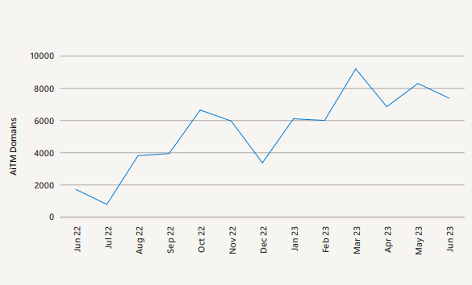</a>

_Source: Defender for Office 365_

You can find the reports in:

- Microsoft Threat Intelligence report about [Adversary-in-the-middle (AiTM) credential phishing attacks](https://security.microsoft.com/threatanalytics3/overview).
- [Microsoft Digital Defense Report 2023](https://www.microsoft.com/en-us/security/security-insider/microsoft-digital-defense-report-2023).

### Phishing-as-a-service (PhaaS) by Microsoft Threat Intelligence

Cybercriminals currently use AiTM phishing techniques to bypass multifactor authentication (MFA) protections at scale. These advanced techniques are democratized and increased through the phishing-as-a-service (PhaaS) cybercrime economic model, which has spawned several service offerings since 2021.

Nowadays the number of AiTM-capable PhaaS platforms has continued to grow throughout 2023-2024, with previously existing services adding AiTM capabilities to their platforms and newly created services incorporating AiTM phishing techniques natively. While traditional forms of credential phishing still exist, the number of AiTM phishing attacks exceeds those without this capability.

The ultimate goal of AiTM phishing is to steal user credentials and session cookies. Browsers store session cookies to allow users access to services without having them repeatedly authenticated. AiTM phishing targets session cookies and credentials to bypass traditional MFA protections.

More information about PhaaS:

- [Hacker News article](https://thehackernews.com/2023/08/phishing-as-service-gets-smarter.html)
- [Infosecurity magazine article](https://www.infosecurity-magazine.com/news/microsoft-aitm-uptick-phishing/)
- [Microsoft Defender Experts blog](https://techcommunity.microsoft.com/t5/microsoft-security-experts-blog/defender-experts-chronicles-a-deep-dive-into-storm-0867/ba-p/3911769)

### Technique Overview

In this chapter we go through two methods related to AiTM attack scenario, AiTM phishing through reverse proxy and AiTM phishing through synchronous relay. The figures and attack descriptions are partly from Microsoft Threat Intelligence reports.

#### AiTM phishing through reverse proxy

Every modern web service implements a session with a user after successful authentication so that the user does not have to authenticate to every new page they visit.
This session functionality is enabled by a session cookie issued by an authentication service following initial authentication. The session cookie serves as proof to the web server that the user has been authenticated and maintains an active session on the website.

In an AiTM phishing attack, an attacker intercepts the target user's session cookie and later replays it to access the sign-in service. Because the cookie demonstrates that the MFA check has already been passed (claim included in the token), it satisfies the MFA requirement, allowing the attacker to bypass MFA protections and gain access to the compromised user account.

In AiTM phishing through a reverse proxy, the proxy is deployed between a user and the legitimate website or application that the user wants to visit (such as Microsoft sign-in portals or LinkedIn). The reverse proxy forwards the requests from the user to the actual service and intercepts the responses. This kind of setup makes it possible to the adversary to steal and intercept the target’s password and the session cookie that proves their ongoing and authenticated session with the website.

Phishing kits, that have been popular among adversaries are: EvilGinx, Modlishka, Muraena and "Office 365" (EvilProxy). These phishing kits allow adversaries to carry out AiTM phishing attacks using reverse proxy servers​.

_Side note: In many campaigns targeted application has been OfficeHome in the Entra ID logs._

<a href="https://raw.githubusercontent.com/Cloud-Architekt/AzureAD-Attack-Defense/Chapter7-AiTM/media/aitm-attack/AiTM.png" target="_blank"></a>

_AiTM phishing through reverse proxy attack diagram (initial figure from Microsoft Defender XDR Threat Intelligence reports)._

#### AiTM phishing through synchronous relay

Another AiTM method is called 'AiTM phishing through synchronous relay'. In this type of attack a copy or mimic of a sign-in page is presented to the target, as seen in traditional phishing attacks. ​If a user provides their credentials to this page, the credentials are stored on an attacker-controlled server where the phishing kit instance, including its administrative panel, are installed. ​Basically, it means that user's input is being stolen including sign-in credentials, two-factor authentication (MFA) codes, and session cookies.

The relay servers are typically provided and controlled by the actor group behind the development, and responsible stakeholders of PhaaS platform. One example of this kind of group is Storm-1295 which is behind the Greatness PhaaS platform according to Microsoft Threat Intelligence reports.

<a href="https://raw.githubusercontent.com/Cloud-Architekt/AzureAD-Attack-Defense/Chapter7-AiTM/media/aitm-attack/AiTM-2.png" target="_blank"></a>

_AiTM phishing through synchronous relay diagram (initial figure from Microsoft Defender XDR Threat Intelligence reports)._

### Tools to simulate AiTM attack

There are a number of tools that can be used to simulate the attack and test how good your detection mechanisms are for this type of attack. Here are a few open-source tools mentioned. Even though they are not brand-new ones they still do the task needed:

- [O365 Attack Toolkit](https://github.com/mdsecactivebreach/o365-attack-toolkit)
- [O365 Stealer](https://github.com/AlteredSecurity/365-Stealer)

Other popular and common tools which are popular among adversaries are:

- [Evilginx2](https://github.com/kgretzky/evilginx2)
- [Modishka](https://github.com/drk1wi/Modlishka)
- [Muraena](https://github.com/muraenateam/muraena)

To find more information about the AiTM attack and how Evilginx can be used to phish credentials take a look on the following resources:

- [John Hammond video about stealing M365 account](https://www.youtube.com/watch?reload=9&app=desktop&v=sZ22YulJwao&feature=youtu.be)
- [How to set up Evilginx to phish O365 credentials by Jan Bakker](https://janbakker.tech/how-to-set-up-evilginx-to-phish-office-365-credentials/)
- [Running Evilginx 3.0 on Windows by Jan Bakker](https://janbakker.tech/running-evilginx-3-0-on-windows/)

## MITRE ATT&CK Framework

MITRE ATT&CK framework is commonly used for mapping Tactics, Techniques and Procedures (TTPs) for adversary actions and emulating defenses on organizations around the world.

### Tactics, Techniques & Procedures (TTPs) in AiTM Attack

The nature of the AiTM attacks includes several methods and it falls into several TTPs in MITRE ATT&CK framework. The following TTPs are mapped for the 'Adversary-in-the-Middle' attack scenario. From the table below, you can find TTPs description and link to the MITRE ATT&CK official documentation.

| TTPs         |  Description  |
|--------------|-----------|
| [T1557 - Adversary-in-the-Middle](https://attack.mitre.org/techniques/T1557/)| Adversaries may attempt to position themselves between two or more networked devices using an adversary-in-the-middle (AiTM) technique to support follow-on behaviors such as Network Sniffing, Transmitted Data Manipulation, or replay attacks (Exploitation for Credential Access).  |
| [T1212 - Exploitation for Credential Access](https://attack.mitre.org/techniques/T1212/)| Adversaries may exploit software vulnerabilities in an attempt to collect credentials. Exploitation of a software vulnerability occurs when an adversary takes advantage of a programming error in a program, service, or within the operating system software or kernel itself to execute adversary-controlled code. Credentialing and authentication mechanisms may be targeted for exploitation by adversaries as a means to gain access to useful credentials or circumvent the process to gain authenticated access to systems. <br><br> One example of this is MS14-068, which targets Kerberos and can be used to forge Kerberos tickets using domain user permissions. Another example of this is replay attacks, in which the adversary intercepts data packets sent between parties and then later replays these packets. If services don't properly validate authentication requests, these replayed packets may allow an adversary to impersonate one of the parties and gain unauthorized access or privileges. |
| [T1111 - Multi-factor Authentication Interception](https://attack.mitre.org/techniques/T1111/) |Adversaries may target multi-factor authentication (MFA) mechanisms, (i.e., smart cards, token generators, etc.) to gain access to credentials that can be used to access systems, services, and network resources. Use of MFA is recommended and provides a higher level of security than usernames and passwords alone, but organizations should be aware of techniques that could be used to intercept and bypass these security mechanisms.|
[T1566.001 - Spearphishing Attachment](https://attack.mitre.org/techniques/T1566/001) |Adversaries may send spearphishing emails with a malicious attachment in an attempt to gain access to victim systems. Spearphishing attachment is a specific variant of spearphishing. Spearphishing attachment is different from other forms of spearphishing in that it employs the use of malware attached to an email. All forms of spearphishing are electronically delivered social engineering targeted at a specific individual, company, or industry. In this scenario, adversaries attach a file to the spearphishing email and usually rely upon User Execution to gain execution. Spearphishing may also involve social engineering techniques, such as posing as a trusted source. <br>  <br> In AiTM scenario - phishing campaign sent with URL payload or QR code in the message body pointing to AiTM phishing site. |
| [T1566.002 - Spearphishing Link](https://attack.mitre.org/techniques/T1566/002)| Adversaries may send spearphishing emails with a malicious link in an attempt to gain access to victim systems. Spearphishing with a link is a specific variant of spearphishing. It is different from other forms of spearphishing in that it employs the use of links to download malware contained in email, instead of attaching malicious files to the email itself, to avoid defenses that may inspect email attachments. Spearphishing may also involve social engineering techniques, such as posing as a trusted source.<br>  <br> In AiTM scenario - phishing campaign sent with URL payload or QR code in the message body pointing to AiTM phishing site.
| [T1078.004 - Valid Accounts](https://attack.mitre.org/techniques/T1078/004/) | Valid accounts in cloud environments may allow adversaries to perform actions to achieve Initial Access, Persistence, Privilege Escalation, or Defense Evasion. Cloud accounts are those created and configured by an organization for use by users, remote support, services, or for administration of resources within a cloud service provider or SaaS application. Cloud Accounts can exist solely in the cloud; alternatively, they may be hybrid-joined between on-premises systems and the cloud through syncing or federation with other identity sources such as Windows Active Directory. |
| [T1583.003 - Acquire Infrastructure](https://attack.mitre.org/techniques/T1583/003/) | Adversaries may rent Virtual Private Servers (VPSs) that can be used during targeting. There exist a variety of cloud service providers that will sell virtual machines/containers as a service. By utilizing a VPS, adversaries can make it difficult to physically tie back operations to them. The use of cloud infrastructure can also make it easier for adversaries to rapidly provision, modify, and shut down their infrastructure. In a nustshell - Deployment of AiTM phishing kit on leased infrastructure in this scenario. |

Figure below shows TTPs used in this scenario in MITRE ATT&CK framework.

<a href="https://raw.githubusercontent.com/Cloud-Architekt/AzureAD-Attack-Defense/main/media/aitm-attack/MITRE-AiTM.svg" target="_blank"></a>

<a style="font-style:italic" href="https://mitre-attack.github.io/attack-navigator/#layerURL=https%3A%2F%2Fraw.githubusercontent.com%2FCloud-Architekt%2FAzureAD-Attack-Defense%2Fmain%2Fmedia%2Faitm-attack%2FMITRE-AiTM.json&tabs=false&selecting_techniques=false" >Open in MITRE ATT&CK Navigator</a>

## Detections

In the next chapter, we will go through how the AiTM attack can be detected with Microsoft security solutions. Threat hunting plays a pivotal role for detecting possible AiTM attacks and you can find several hunting queries later on this paper as well as links to GitHub repo that hosts the content.

_The next section assumes that the organization uses Defender XDR security solutions._

### Defender XDR

Microsoft Unified XDR solution provides several ways to detect AiTM attacks out of the box but you need to take into account that there isn't a silver bullet solution (or even one solution) that detects all attacks and mitigates them. That being said, it's important to know your data and do proactive threat hunting as well. But let us come back to that later.

To get the best possible coverage from a detection point of view, full Defender XDR deployment is recommended even though all products are not included in the detection side. This attack is targeting end-users, so the main detections are based on Defender for Cloud Apps, Entra ID Protection, Defender for Office 365, and XDR data collection and correction capabilities. As said earlier, it's also important to know you data and do proactive threat hunting.

What we also want to highlight is Defender XDR configurations. The solution has automated investigation and response (AIR) and attack disruption capabilities, but we quite often see situations where XDR solution is not able to mitigate possible high confidence incidents because of lack of proper configurations.

Another topic that needs attention is Entra ID Protection '[Anomalous Token](https://learn.microsoft.com/en-us/entra/id-protection/concept-identity-protection-risks#anomalous-token)' & '[Attacker in the middle](https://learn.microsoft.com/en-us/entra/id-protection/concept-identity-protection-risks#attacker-in-the-middle)' detections. The Anomalous Token detection indicates abnormal characteristics in the token, such as an unusual lifetime or a token played from an unfamiliar location and covers Session Tokens and Refresh Tokens. If the location, application, IP address, User Agent, or other characteristics are unexpected for the user, you might expect to see the alert created by EIDP and it should be considered this risk as an indicator of potential token replay.

The Adversary in the Middle high precision detection is triggered when an authentication session is linked to a malicious reverse proxy. In this kind of attack, the adversary can intercept the user's credentials, including tokens issued to the user. The detection is in GA, but we haven't seen this triggered in any environment we have been working on.

To leverage these detections, you need to configure Entra ID Conditional Access EIDP policies to auto-remediate the risks and to include re-auth as session management (sign-in frequency setting) and set it as 'every time'. By doing so, token replay attack can be mitigated if EIDP & CA policies are configured properly. CA policies play a key role for mitigating AiTM attacks including requiring device state or compliant device (recommended), phishing-resistant MFA, sign-in frequency, and more. More details about these are in the 'Mitigations' chapter.

**Key takeaway:** Evaluate and monitor your Defender XDR solution baseline configurations on a regular basis. Also, evaluate your Entra ID Conditional Access & ID Protection policies to be aligned with security recommendations.

<a href="https://raw.githubusercontent.com/Cloud-Architekt/AzureAD-Attack-Defense/Chapter7-AiTM/media/aitm-attack/Microsoft Defender XDR Architecture-V2.png" target="_blank"></a>

#### Attack Disruption

Microsoft Defender XDR, as well as other Microsoft security solutions, shares and correlates a huge number of signals daily. Microsoft announced [Automatic attack disruption](https://learn.microsoft.com/en-us/defender-xdr/automatic-attack-disruption) initially in 2022, and the idea behind is to identify ongoing complex and sophisticated attacks with high confidence and execute mitigation actions automatically (containing compromised assets, such as identity and endpoints). Microsoft Defender XDR's automatic attack disruption mechanism leverages Microsoft AI models and threat research insights to detect possible attacks. One of the main advantages of using automatic attack disruption (compared to other XDR and SIEM solutions) is that the feature is built into the Microsoft Defender XDR platform. It’s automatically enabled when Defender XDR security solutions are deployed, but to make it work as intended (i.e., disrupt attacks), you need to ensure that prerequisites are met, and solutions appropriately configured.

##### Scenarios covered today​ in Attack Disruption

Here is a list of the supported attack scenarios at the time of writing:

- Human Operator Ransomware (HumOR)​
- Business email compromise (BEC)​
- Adversary in the middle (AiTM)​
- SAP (in XDR)​
- AI-powered disruption of SaaS attacks (malicious OAuth apps)

#### Typical XDR Incidents in AiTM Scenario

The following figures show a few example incidents that may be detected in Defender XDR when a possible AiTM attack is identified in the environment. If a high confidence AiTM attack is detected, the detection could look like the one below. The key characteristics in the detection are:

- Disrupted incidents might include a tag for 'Attack Disruption', 'AiTM attack' and the specific threat type identified (i.e., Credential Phish). If you subscribe to incident email notifications, these tags appear in the emails.
- You can see a highlighted notification below the incident title that indicates that XDR disrupted the the attack.
- Suspended users and contained devices appear with a label indicating their status.

<a href="https://raw.githubusercontent.com/Cloud-Architekt/AzureAD-Attack-Defense/Chapter7-AiTM/media/aitm-attack/AttackDisruption-5.png" target="_blank">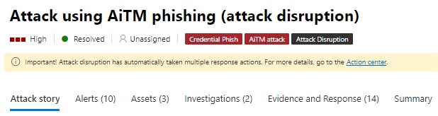</a>

The following figure shows an incident that contains some of the typical AiTM attack characteristics.

<a href="https://raw.githubusercontent.com/Cloud-Architekt/AzureAD-Attack-Defense/Chapter7-AiTM/media/aitm-attack/AttackDisruption-4.png" target="_blank">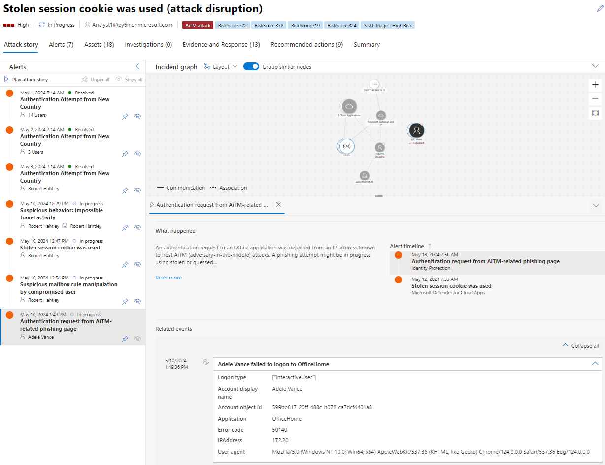</a>

In the second incident, you can see a successful AiTM attack in which a known phishing kit was used to trick the end-user. Defender XDR leverages threat intelligence data and has been able to detect verified threat actor IP-addresses. The detection sources in the incident are Entra ID Protection, Defender for Cloud Apps, and Defender XDR, as seen in the figure below.

<a href="https://raw.githubusercontent.com/Cloud-Architekt/AzureAD-Attack-Defense/Chapter7-AiTM/media/aitm-attack/AttackDisruption-6.png" target="_blank">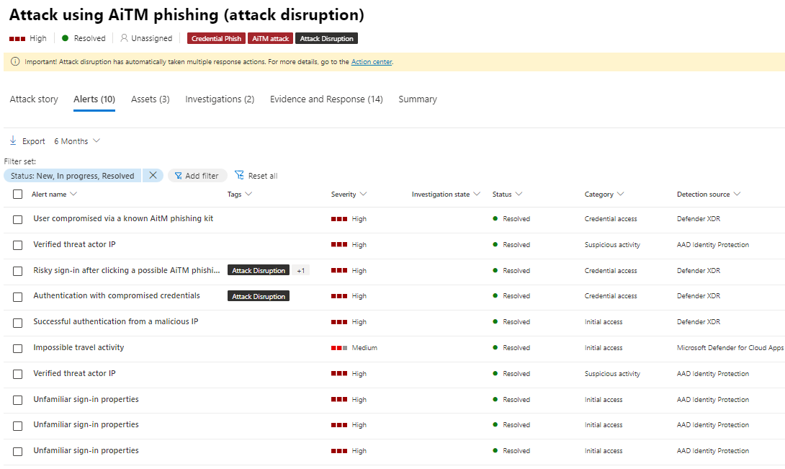</a>

Not all AiTM attacks are identified as high-confidence attacks, but the attack pattern is similar to that of an attack where attack disruption does its magic. In the figure below, you can see an incident where XDR has detected multiple AiTM attack-related suspicious activities, but the attack is not tagged or identified as a high-confidence attack.
<a href="https://raw.githubusercontent.com/Cloud-Architekt/AzureAD-Attack-Defense/Chapter7-AiTM/media/aitm-attack/XDR-detections" target="_blank">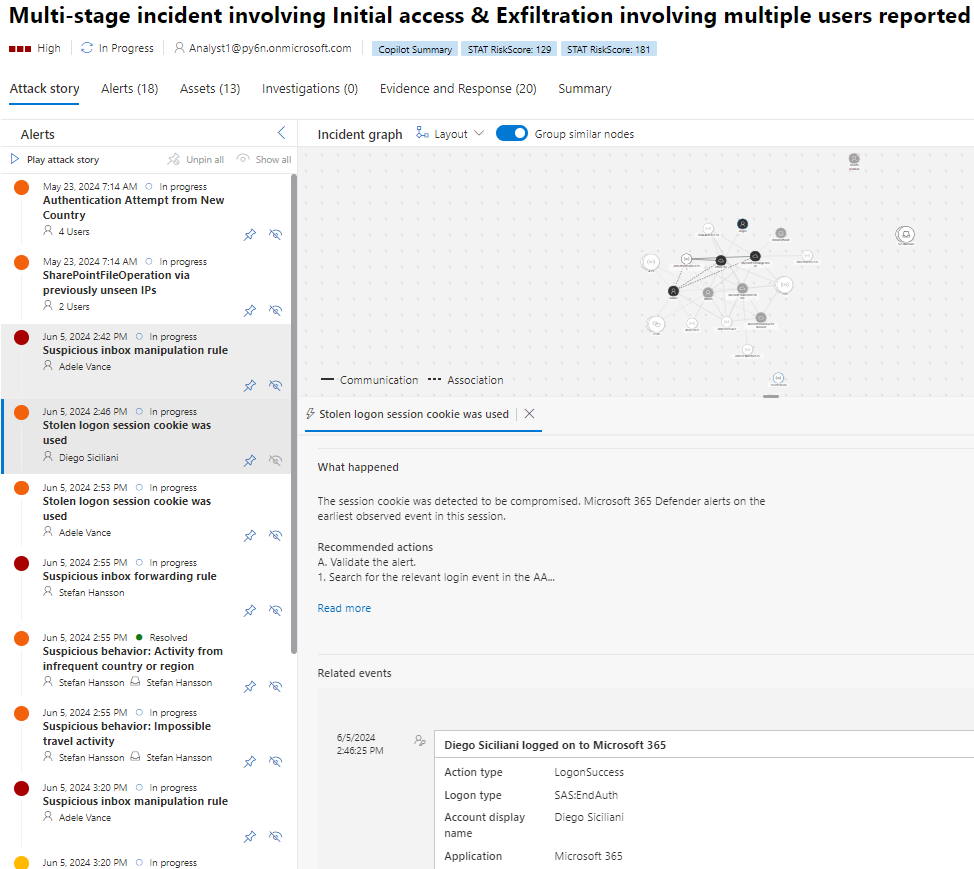</a>

Lastly, when the Defender XDR detects high-confidence attack and attack disruption jumps in the game it executes necessary mitigation actions. In the figure below, you can see that user account was disabled.

<a href="https://raw.githubusercontent.com/Cloud-Architekt/AzureAD-Attack-Defense/Chapter7-AiTM/media/aitm-attack/AttackDisruption-7.png" target="_blank">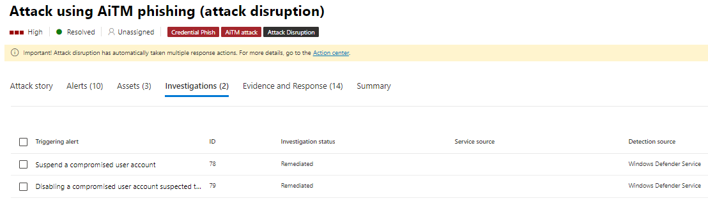</a>

### Anti-phishing Solution to monitor and scan incoming emails

Investing in advanced anti-phishing solutions that monitor and scan incoming emails and visited websites is essential. If you are leveraging the Microsoft security stack, you have Microsoft Defender for Office 365 (MDO), which plays an important role in detecting AiTM campaigns, even though MDO-related detections are not seen in our example incidents. The case would be different if the attack had been part of a globally known attack campaign or a known threat actor.

#### Microsoft Defender for Office 365 (MDO)

In MDO, you could see the following alerts in a case of possible AiTM attack:

- A potentially malicious URL click was detected  
- A user clicked through to a potentially malicious URL​  
- Suspicious email sending patterns detected

These alerts are typically correlated to multi-stage incidents if XDR is the detection source.

### Continuously monitor suspicious or anomalous activities

To be able to detect AiTM attacks you need to have proper detection rules in place that provides detection for suspicious or anomalous activities such as sign-in attempts with suspicious characteristics, for example, location, ISP, user agent, and use of anonymizer services. In Microsoft security stack this can be established with the combination of Entra ID Protection (EIDP), Defender for Cloud Apps (MDA), MDA's Behaviors data layer & icing on the cake, Microsoft Sentinel & Defender XDR.

#### Entra ID Protection (EIDP)

Entra ID Protection provides multiple detections that can be seen as alerts in AiTM attack. The AiTM attack is typically categorized as multi-stage attack in Defender XDR. These alerts in EIDP alone don't indicate AiTM attack but are considered still as suspicious activity that needs to be investigated.

EIDP alerts that you could see part of AiTM attack:

- Anomalous token
- Atypical travel
- Impossible travel activity
- Unfamiliar sign-in properties
- Malicious IP address
- Verified threat actor IP
- Attacker in the Middle

<a href="https://raw.githubusercontent.com/Cloud-Architekt/AzureAD-Attack-Defense/Chapter7-AiTM/media/aitm-attack/IPC-1" target="_blank">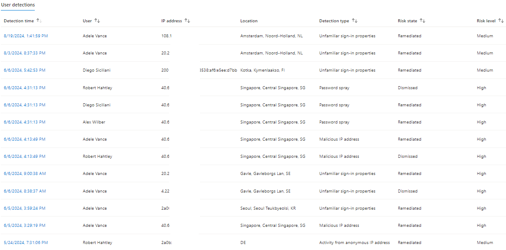</a>

More information about Entra ID Protection detections:

- [Entra Identity Protection - What are risks?](https://learn.microsoft.com/en-us/entra/id-protection/concept-identity-protection-risks#attacker-in-the-middle/)

#### Microsoft Defender for Cloud Apps (MDA)

MDA forwards AiTM-related alerts to Entra ID Protection. The alerts you can see related to AiTM attack, where the detection source is MDA, are:

- Suspicious inbox forwarding
- Suspicious inbox manipulation rules
- Impossible travel

When the alerts are forwarded from MDA to EIDP, the EIDP detection engine calculates user risk. All of these detections are calculated offline. To find more information about EIDP, its detections and integrations underneath the hood take a look at [Identity Protection Integrations with Microsoft Security Solutions]( https://samilamppu.com/2022/11/22/azure-ad-identity-protection-integration-with-microsoft-security-solutions/)

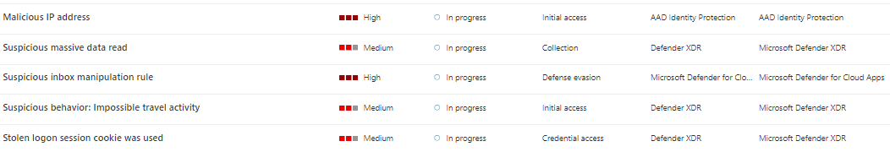
The last piece of the puzzle is to use MDA Behaviors data layer in hunting. In the past, MDA raised quite a lot false/positive (FP) alerts based on the built-in detection rules. These rules were disabled completely from MDA in late 2023 by Microsoft to decrease FP alerts in MDA. At the same time, Behaviors data layer was introduced in Defender XDR. It's an abstract data layer above the raw data layer that provides deeper understanding of MDA events. They have similarities with alerts such as mappings to MITRE ATT&CK TTPs.

##### Behaviors Data Layer

The last piece of the puzzle is to use MDA Behaviors data layer in hunting. In the past, MDA raised quite a lot false/positive (FP) alerts based on the built-in detection rules. These rules were disabled completely from MDA in late 2023 by Microsoft to decrease FP alerts in MDA. At the same time, Behaviors data layer was presented in Defender XDR. It's abstract data layer above raw data layer that provides deeper understanding of MDA events. They have similarities with alerts such as mapping to MITRE ATT&CK TTPs.

Behaviors data layer provides the following use cases:

- Focus on scenario-based alerts, such as “Suspicious inbox manipulation rule” that detects specific patterns of inbox rules created by adversaries.
- Use anomaly detection data that doesn’t have security ramifications as part of your investigation and custom detections.
- Enrich the context of related incidents, anomalies will be correlated to existing incidents when they are relevant, for example when an impossible travel behavior is detected before a “Risky user created global admin” XDR detection.

At the time of writing, the following former MDA alerts are transitioned as Behaviors:

|Alert name | Policy name|
|-----|-----|
|Activity from infrequent country | Activity from infrequent country/region |
| Impossible travel activity| Impossible travel |
| Mass delete | Unusual file deletion activity (by user) |
|  Mass download | Unusual file download (by user) |
|  Mass share |  Unusual file share activity (by user)|
|  Multiple delete VM activities |  Multiple delete VM activities |
|  Multiple failed login attempts |  Multiple failed sign-in attempts |
|  Multiple Power BI report sharing activities |  Multiple Power BI report sharing activities |
|  Multiple VM creation activities |  Multiple VM creation activities |
|  Suspicious administrative activity |  Unusual administrative activity (by user) |
|  Suspicious impersonated activity |  Unusual impersonated activity (by user) |
|  Suspicious OAuth app file download activities |  Suspicious OAuth app file download activities |
|  Suspicious Power BI report sharing |  Suspicious Power BI report sharing |
|  Unusual addition of credentials to an OAuth app |  Unusual addition of credentials to an OAuth app |
|||

More information about the Behavior Analytics and supported detections found in:

- [MDA - Behavior Analytics - Supported Detections](https://learn.microsoft.com/en-us/defender-cloud-apps/behaviors#supported-detections/)

You might be wondering how MDA and Behaviors data layer is related to AiTM attack? Behaviors datalayer in Defender XDR is divided into two different data tables, BehaviorInfo & BehaviorEntities. These tables store important pieces of information that can be leveraged when investigating possible AiTM attacks.

- **BehaviorEntities:** Contains information about entities (file, process, device, user, and others) that are involved in a behavior.
- **BehaviorInfo:** Contains information about behaviors, which in the context of Microsoft Defender XDR refers to a conclusion or insight based on one or more raw events, which can provide analysts with more context in investigations.

By correlating data from both tables, we can identify pieces of information that might be related to malicious activity, impossible travel activity, that might be related with AiTM attack. You can use the following query to find out such events. If you want to investigate a specific event you can include 'BehaviorId' & 'userPrincipalName' into the query.

```
//Investigate behaviors for a specific user
BehaviorInfo
| where Timestamp >ago(7d)
| where ServiceSource == "Microsoft Cloud App Security"
//| where BehaviorId == "<insert behavior id>"
//| where AccountUpn == "<insert entity UPN>"
| join BehaviorEntities on BehaviorId
| project Timestamp, BehaviorId, ActionType, Description, Categories, AttackTechniques, ServiceSource, AccountUpn, AccountObjectId, EntityType, EntityRole, RemoteIP, AccountName, AccountDomain, Application
```

### Microsoft Sentinel

Microsoft Sentinel has a new feature called SOC optimization that has AiTM as one of the threat scenarios in it. Main driver for using SOC optimization is to provide information to the organizations that they can close coverage gaps against specific threats and tighten ingestion rates against data that doesn't provide security value. In a nutshell: better detection coverage and decreased costs.

<a href="https://raw.githubusercontent.com/Cloud-Architekt/AzureAD-Attack-Defense/Chapter7-AiTM/media/aitm-attack/SOC-optimization-1.png" target="_blank">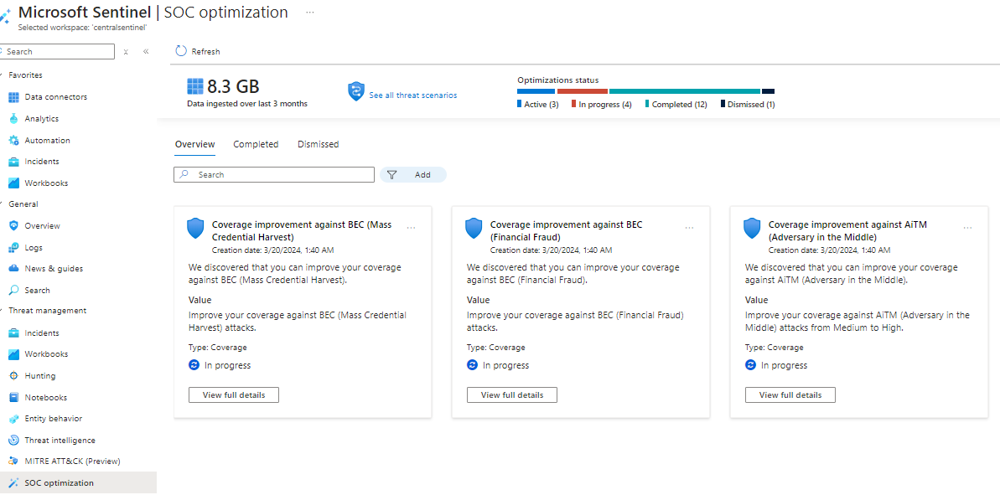</a>

AiTM threat scenario provides a total of 32 configurable items which includes 18 analytic rules and 14 data connectors.

<a href="https://raw.githubusercontent.com/Cloud-Architekt/AzureAD-Attack-Defense/Chapter7-AiTM/media/aitm-attack/SOC-optimization-2.png" target="_blank"></a>

### Microsoft Defender for Endpoint (MDE)

Even though AiTM attack is focusing on stealing identity credentials, MDE can provide protection as well. If AiTM attack is detected, the following alerts by MDE might be seen in the incident queue:

- User compromised in AiTM phishing attack
- Possible AiTM phishing attempt
- Possible Storm-1167 adversary-in-the-middle (AiTM) phishing site

Based on the Microsoft Threat Intelligence report there are also APT related alerts that might indicate AiTM attack but are not necessarily related. These could be related to:

- Luna Tempest actor group activity
- Storm-0867
- Connection to adversary-in-the-middle (AiTM) phishing site by one of the following actor groups: Storm-0485, Storm-1295, Storm-1285, Storm-1363 or Storm-1362
- Storm-0928 threat activity group
- Storm-1069 threat activity group detected
- Storm-1112 threat actor detected

[More information how Microsoft names threat actors](https://learn.microsoft.com/en-us/defender-xdr/microsoft-threat-actor-naming)

### Copilot for Security (CfS)

Microsoft Copilot for Security is currently a buzzword in the security industry. However, the crucial question is: How can it contribute to investigating incidents, especially AiTM attacks? We're leaving this decision in your capable hands. Here's a sneak peek of what you can expect from this solution.

- We can use incident summary skill for creating summary and guided response about the incident
- After we have run automation and enrich the incident, we can run incident report skill that summarizes all the activities done to the incident including comments, automation enrichment etc, or we can do post-mortem report after investigation has been done and incident has been closed.

<a href="https://raw.githubusercontent.com/Cloud-Architekt/AzureAD-Attack-Defense/Chapter7-AiTM/media/aitm-attack/CfS-1.png" target="_blank">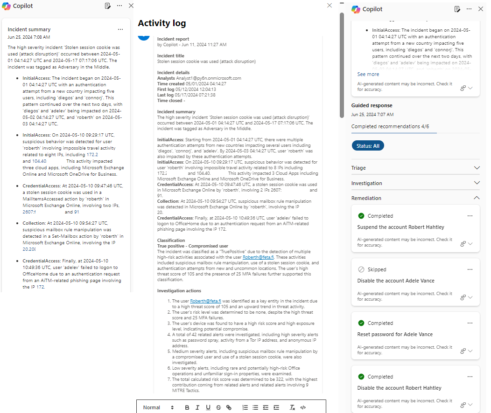</a>

### Custom Detections and Hunting

In the following section, you can find KQL queries and functions for hunting possible malicious activities in your environment. The queries are created by us, the community, or the Microsoft Threat Intelligence & DART teams. The GitHub repo contains even more hunting queries [in the query folder](./queries/AiTM); take a look at that one as well. Every query has pre-requisites, which are listed in the table on the query section.

There are different approach to how to get a job done and we have selected two approaches for this paper. In the first one, the assumption is that you are trying to find a possible suspicious AiTM related activities from the environment, or you have already identified one but are looking for more insights from the possible malicious activities during sessions.

In the second path, the assumption is that you already have alerts or incidents, and malicious activity is detected. The hunting queries will provide deep insights and correlation between alerts, sign-in activities and later on collaboration workloads or Azure activities.

#### Hunting of OfficeHome application sign-ins (by DART team query)

Even though Microsoft security solutions are terrific, there isn't such a thing as bulletproof security solution. That being said, alongside detection mechnishms it's crucial to know your data and do proactive threat hunting. What we can do is to track `SessionId` attribute in AADSignInEventsBeta table in Defender XDR. When an attacker uses a stolen session cookie, the SessionId attribute in the AADSignInEventsBeta table will be identical to the `SessionId` value used in the authentication process against the phishing site.

How to approach:

- We can trace logins from different geo-locations against the OfficeHome application and identify uncommon and untrusted locations. OfficeHome application has been widely used in globally known attack campaigns.
- To dig deeper into the activities during a suspicious session, we suggest using the KQL function ‘Correlation of risky session to sensitive Exchange Online activity (CloudAppEvents) found later in this section.

**Pre-requisites for Hunting OfficeHome App sign-ins**

Pre-requisites for hunting OfficeHome application sign-ins and related sessionId's and summarizing countries are listed on the table below. Besides the info on the table, you need to have proper permissions to be able to read the data (Global Reader in XDR and Reader in Azure at minimum).

| Name | Requirement                  |
|-------------|------------------------------|
| Data Connectors          |  The Defender XDR deployed <br> <br> No additional data connectors needed, the query is run in the Defender XDR Advanced Hunting - Unified Security Operations Platform
| Unified XDR logs           | XDR capabilities, you need to have AADSignInEventsBeta table in XDR but also M365 & Azure app connectors defined in Defender for Cloud Apps (MDA) <br> <br> AADSignInEventsBeta contains information about Microsoft Entra ID sign-in events either by a user (interactive) or a client on the user's behalf (non-interactive) with data retention of 30 days       |
| Dependencies           | Microsoft Entra ID P2 license to collect and view activities for this table |
|||

```
//Search for cookies that were first seen after OfficeHome application authentication (as seen when the user authenticated to the AiTM phishing site) and then seen being used in other applications in other countries
let OfficeHomeSessionIds =
AADSignInEventsBeta
| where Timestamp > ago(7d)
| where ErrorCode == 0
| where ApplicationId == "4765445b-32c6-49b0-83e6-1d93765276ca" //OfficeHome application
| where ClientAppUsed == "Browser"
| where LogonType has "interactiveUser"
| summarize arg_min(Timestamp, Country) by SessionId;
AADSignInEventsBeta
| where Timestamp > ago(7d)
| where ApplicationId != "4765445b-32c6-49b0-83e6-1d93765276ca"
| where ClientAppUsed == "Browser"
| project OtherTimestamp = Timestamp, Application, ApplicationId, AccountObjectId, AccountDisplayName, OtherCountry = Country, SessionId
| join OfficeHomeSessionIds on SessionId
| where OtherTimestamp > Timestamp and OtherCountry != Country
```

The query summarizes countries for each user authenticated to the OfficeHome application.

```
//Summarize for each user the countries that authenticated to the OfficeHome application and find uncommon or untrusted ones
AADSignInEventsBeta
| where Timestamp >ago(7d)
| where ApplicationId == "4765445b-32c6-49b0-83e6-1d93765276ca" //OfficeHome application
| where ClientAppUsed == "Browser"
| where LogonType has "interactiveUser"
| summarize Countries = make_set(Country) by AccountObjectId, AccountDisplayName
```

The original queries and blog post by DART is available from the [Microsoft Security Blog](https://www.microsoft.com/en-us/security/blog/2022/07/12/from-cookie-theft-to-bec-attackers-use-aitm-phishing-sites-as-entry-point-to-further-financial-fraud/?msockid=28c8c6feb17d6e740accd40eb04a6f51/).

#### Enrichment of SessionId with IP address and session duration details (by Joosua Santasalo)

**Pre-requisites**

Pre-requisites for retrieving all Session IDs from AADSignInEventsBeta where the SessionId is not empty are listed on the table below. Besides the info on the table, you need to have proper permissions to be able to read the data.

| Name | Requirement                  |
|-------------|------------------------------|
| Data Connectors          |  The Defender XDR deployed <br> <br> No additional data connectors needed, the query is run in the Defender XDR Advanced Hunting - Unified Security Operations Platform   |
| Unified XDR logs           | XDR capabilities, you need to have AADSignInEventsBeta table in XDR. <br> <br> AADSignInEventsBeta contains information about Microsoft Entra ID sign-in events either by a user (interactive) or a client on the user's behalf (non-interactive) with data retention of 30 days       |
| Dependencies           | Microsoft Entra ID P2 license to collect and view activities for this table |
|||

Joosua Santasalo has created a query that retrieves all `SessionId` from the `AADSignInEventsBeta` table and enriches this information with IP address and session duration time. The query is extremely useful and can be used as a starting point for hunting activities related to possible AiTM attack. The query can be found on his GitHub repository:

[GitHub "jsa2" - kql/aitmInvestigation.kql](https://github.com/jsa2/kql/blob/main/aitmInvestigation.kql)

#### KQL functions for Correlation of XDR Alerts to SessionIds, CorrelationIds, UniqueTokenIdentifiers and RequestIds

Another approach is to build a correlation between an XDR alert and the user's sign-ins. In this scenario, you already have indication of malicious activity in the environment (alert) and the following queries help you to build correlation between the key parameters. Microsoft uses different entities in XDR alerts, which need to be used to establish a correlation with the related sign-in events.

<a href="https://raw.githubusercontent.com/Cloud-Architekt/AzureAD-Attack-Defense/Chapter7-AiTM/media/aitm-attack/HuntingQueryCorrelation.png" target="_blank">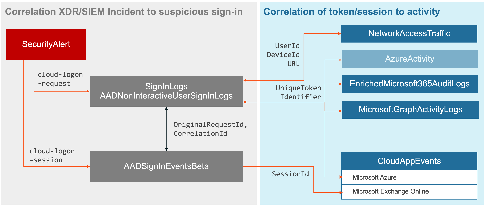</a>

_Most alerts which are in relation to initial access detections in Defender XDR include a `cloud-logon-request` (OriginalRequestId) that offers a direct correlation to sign-in events in Microsoft Entra ID logs. Some other alerts include a `cloud-logon-session` (SessionId) which is available in the XDR's AADSignInEventsBeta table only._

_Side Note: Keep in mind, that alerts with relation to a sign-in or session ID is required to start hunting between initial access (by successful AiTM attack) and activity is needed. Any multi-stage attack without XDR alert which includes relation to a specific session or sign-in request can only be detected by IP Address or suspicious Application._

In the following query, we would like to get details of all sign-in events (`SessionId`, `CorrelationId`, and `OriginalRequestId`) related to the XDR alerts. This would allow us to correlate the sign-in events with different activity logs (e.g., `AzureActivity` or `CloudAppEvent`s), which also require different IDs to establish the relation to the sign-in event.

Define a entity (`UserObjectId`) if you want to filter for a specific user account. By default, the query covers all resolved XDR alerts (e.g., by incident response or risk-based policy).
Adjust the query (`Status != "Resolved"`) if you want to set a scope on all XDR alerts.

**Token_EntityToAlertSession: Mapping XDR alert to SessionIds, CorrelationIds and RequestIds**

**Pre-requisites**

Pre-requisites for hunting sign-in events (`SessionId`, `CorrelationId`, and `OriginalRequestId`) related to the XDR alerts are defined on the table below. Besides the info on the table, you need to have proper permissions to be able to read the data.

| Name | Requirement                  |
|-------------|------------------------------|
| Data Connectors          |The Defender XDR deployed <br> <br> No additional data connectors needed, the query is run in the Defender XDR Advanced Hunting - Unified Security Operations Platform |
| Unified XDR logs           | XDR capabilities, you need to have AADSignInEventsBeta table in XDR <br> <br> AADSignInEventsBeta contains information about Microsoft Entra ID sign-in events either by a user (interactive) or a client on the user's behalf (non-interactive) with data retention of 30 days       |
| Dependencies           | Sentinel integration to Defender XDR platform <br> <br> Microsoft Entra ID P2 license to collect and view activities for this table & Sentinel integrated into Defender XDR (Unified Security Operations Platform) <br> <br> If Sentinel is not integrated into the Defender XDR, you are not having 'SecurityAlerts' data table in the XDR |
|||

_Side Note: The function cannot be executed in Microsoft Sentinel because of the missing option to ingest `AADSignInEventsBeta`._

```
let Token_EntityToAlertSessions = (Entity:string) {
let SessionRelatedAlerts = (SecurityAlert
    | where Entities has (Entity)
    | mv-expand parse_json(Entities)
    | where Entities.Type == "cloud-logon-session" or Entities.Type == "cloud-logon-request"
    | summarize arg_max(TimeGenerated, *) by SystemAlertId
    // Optional: Filtered for resolved events only
    //| where Status != "Resolved"
    | project OriginalRequestId = tostring(parse_json(ExtendedProperties).["Request Id"]), SessionId = tostring(Entities.SessionId), AlertName, Status, SystemAlertId, tostring(Tactics), tostring(Techniques), tostring(Entities), RequestId = tostring(Entities.RequestId)
    );
let AssociatedSessionIds = SessionRelatedAlerts
| join kind=inner ( AADSignInEventsBeta
        | where isnotempty (SessionId)
        | extend SignInTime = TimeGenerated, Timestamp, AppId = ApplicationId, ResourceId, OriginalRequestId = tostring(RequestId), CorrelationId = ReportId, SessionId, IPAddress, Application, ResourceDisplayName
    ) on SessionId;
let AssociatedRequestIds = SessionRelatedAlerts
| join kind=inner ( AADSignInEventsBeta
        | where isnotempty (RequestId)
        | extend SignInTime = TimeGenerated, Timestamp, AppId = ApplicationId, ResourceId, RequestId, CorrelationId = ReportId, SessionId, IPAddress, Application, ResourceDisplayName
    ) on RequestId;
union AssociatedRequestIds, AssociatedSessionIds
| extend SessionId = iff(isempty(SessionId), SessionId1, SessionId)
| extend OriginalRequestId = iff(isempty(RequestId), RequestId1, RequestId)
| extend SignIns = bag_pack_columns(SignInTime, Application, AppId, ResourceId, ResourceDisplayName, IPAddress, ReportId, CorrelationId, OriginalRequestId)
| extend SessionAlert = bag_pack_columns(TimeGenerated, SystemAlertId, AlertName, Status, Tactics, Techniques, Entities)
| summarize SignInActivityStart=min(SignInTime), SignInActivityEnd=max(SignInTime), SignIns = make_set(SignIns), SessionAlerts = make_set(SessionAlert), OriginalRequestIds = make_set(OriginalRequestId) by AccountObjectId, AccountDisplayName, SessionId
};
Token_EntityToAlertSessions(Entity)
```

Below you'll find a result example of the function "Token_EntityToAlertSession":

<a href="https://raw.githubusercontent.com/Cloud-Architekt/AzureAD-Attack-Defense/Chapter7-AiTM/media/aitm-attack/Token_EntityToAlertSession_QueryResult.png" target="_blank">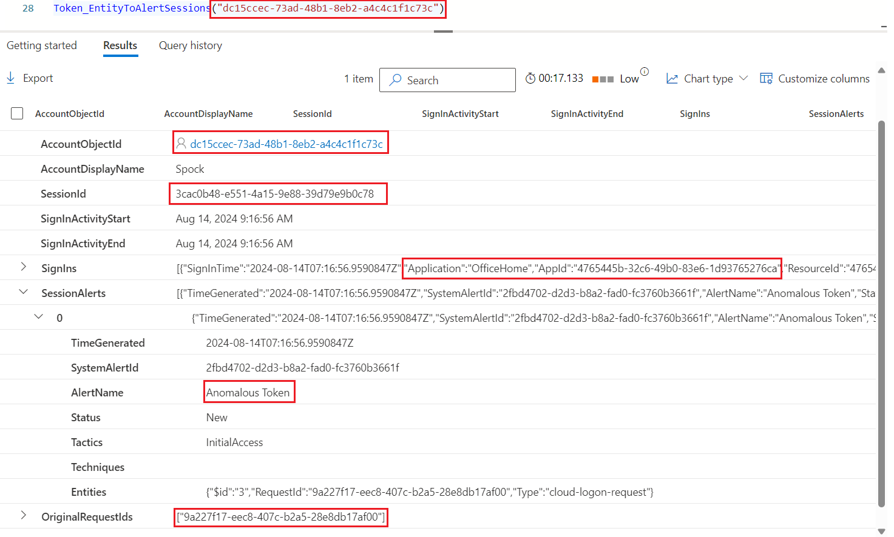</a>

Save the function as "[Token_EntityToAlertSession](./queries/AiTM/Functions/Token_EntityToAlertSession.func)" to use it later for further hunting use cases:

<a href="https://raw.githubusercontent.com/Cloud-Architekt/AzureAD-Attack-Defense/Chapter7-AiTM/media/aitm-attack/Token_EntityToAlertSession_CreateFunction.png" target="_blank">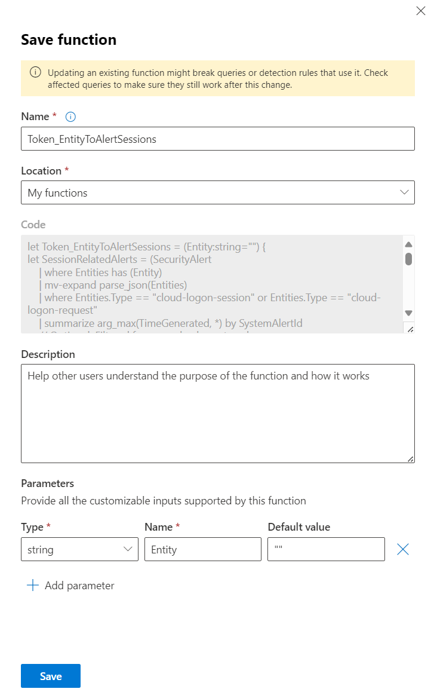</a>

**Token_EntityToAlertSignInRequest: Mapping XDR alert with RequestId to UniqueTokenIdentifiers, CorrelationIds and RequestIds**
Another function will be used if you must build a correlation between the XDR alert and the `UniqueTokenIdentifier`. This query relies on Microsoft Sentinel log data only and can be used for hunting events older than 30 days.

**Pre-requisites**

Pre-requisites for building correlation between the XDR alert and UniqueTokenIdentifier are defined on the table below. Besides the info on the table, you need to have proper permissions to be able to read the data.

| Name | Requirement                  |
|-------------|------------------------------|
| Data Connectors          | The Defender XDR deployed and Microsoft Entra ID sign-in logs connected to Microsoft Sentinel Workspace. <br> <br> No additional data connectors needed, the query is run in the Defender XDR Advanced Hunting - Unified Security Operations Platform |
| Unified XDR logs           |  XDR capabilities, you need to have AADSignInEventsBeta table in XDR | AADSignInEventsBeta contains information about Microsoft Entra ID sign-in events either by a user (interactive) or a client on the user's behalf (non-interactive) with data retention of 30 days    |
| Dependencies           | Sentinel integration to Defender XDR is needed to have the option to cover `SigninLogs` and `AADNonInteractiveUserSignInLogs` but also all entries from `SecurityAlert` table <br> <br> Microsoft Security solutions (Defender XDR, Entra ID Protection & Entra ID logs) needs to be integrated into Sentinel to get alert in to the workspace <br> <br> The query relies on both, Sentinel & Defender XDR data   |
|||

```
let Token_EntityToAlertSignInRequest = (Entity:string="") {
    let Lookback = 90d;
    let RequestRelatedAlerts = (
        SecurityAlert
            | where Entities has (Entity)
            | where TimeGenerated >ago(Lookback)
            | mv-expand parse_json(Entities)
            | where Entities.Type == "cloud-logon-request"
            | summarize arg_max(TimeGenerated, *) by SystemAlertId
            // Optional: Filter for resolved events only
            //| where Status != "Resolved"
            | project SignInAlertTime = TimeGenerated, OriginalRequestId = tostring(parse_json(ExtendedProperties).["Request Id"]), AlertName, Status, SystemAlertId, tostring(Tactics), tostring(Techniques), tostring(Entities), RequestId = tostring(Entities.RequestId)
        );
    let AssociatedSignIns = RequestRelatedAlerts
    | join kind=inner (
            union SigninLogs, AADNonInteractiveUserSignInLogs
            | where TimeGenerated >ago(Lookback)
            | extend SignInTime = TimeGenerated, AppId, ResourceId, RequestId = OriginalRequestId, CorrelationId, IPAddress, Application = AppDisplayName, ResourceDisplayName, AccountObjectId = UserId, AccountDisplayName = UserDisplayName, UniqueTokenIdentifier
        ) on RequestId;
    AssociatedSignIns
        | extend SignIns = bag_pack_columns(SignInTime, Application, AppId, ResourceId, ResourceDisplayName, IPAddress, CorrelationId, UniqueTokenIdentifier)
        | extend SignInAlert = bag_pack_columns(SignInAlertTime, SystemAlertId, AlertName, Status, Tactics, Techniques, Entities)
        | summarize SignInActivityStart=min(SignInTime), SignInActivityEnd=max(SignInTime), SignIns = make_set(SignIns), SignInAlerts = make_set(SignInAlert), OriginalRequestIds = make_set(OriginalRequestId) by AccountObjectId, RequestId
};
Token_EntityToAlertSignInRequest(Entity)
```

Below, you'll find a result example of the function "Token_EntityToAlertSignInRequest" which has been executed in Microsoft Sentinel with parameter of user object Id:

<a href="https://raw.githubusercontent.com/Cloud-Architekt/AzureAD-Attack-Defense/Chapter7-AiTM/media/aitm-attack/Token_EntityToAlertSignInRequest_QueryResult.png" target="_blank">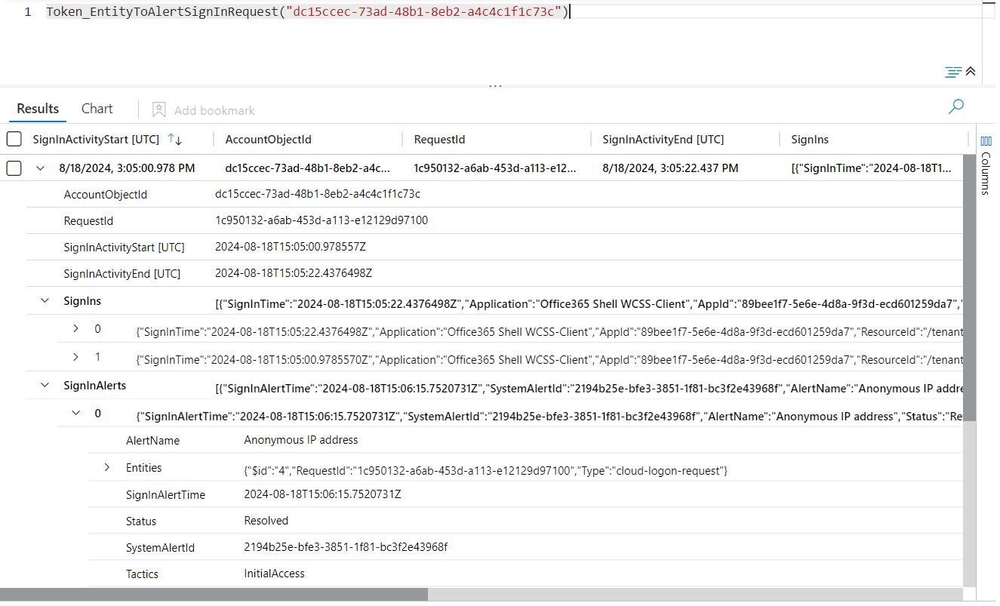</a>

Save the function as "[Token_EntityToAlertSignInRequest](./queries/AiTM/Functions/Token_EntityToAlertSignInRequest.func)" to use it later for further hunting use cases (it's a pre-requisite for the next two hunting queries):

<a href="https://raw.githubusercontent.com/Cloud-Architekt/AzureAD-Attack-Defense/Chapter7-AiTM/media/aitm-attack/Token_EntityToAlertSignInRequest_CreateFunction.png" target="_blank">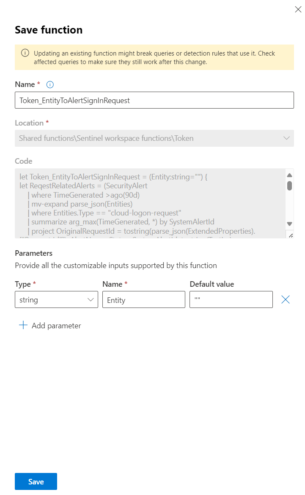</a>

#### Correlation of risky session to sensitive Exchange Online activity (CloudAppEvents)

The following hunting query takes advantage of the previously described function to identify sensitive user operations to Microsoft Exchange Online. All activities of unresolved risky sessions will be investigated if they match to a list of sensitive operations. The list of sensitive actions can be customized in the query (SensitiveEvents) and includes by default just some examples.

**Pre-requisites**

Pre-requisites for hunting Exchange Online activities from CloudAppEvents (MDA) table and correlate them on `SessionId's` are defined on the table below. Besides the info on the table, you need to have proper permissions to be able to read the data.

| Name | Requirement                  |
|-------------|------------------------------|
| Data Connectors          | Microsoft Defender XDR data connector enabled <br> <br> Contains whole Defender XDR suite: MDE, MDI, MDO, MDA, MDC, TMV, Purview DLP & Entra ID Protection  |
| Unified XDR logs           | XDR capabilities, you need to have AADSignInEventsBeta table in XDR but also enabled MDA App Connector for Microsoft 365 enabled  <br> <br> AADSignInEventsBeta contains information about Microsoft Entra ID sign-in events either by a user (interactive) or a client on the user's behalf (non-interactive) with data retention of 30 days  |
| Dependencies           | Microsoft Entra ID P2 and MDA license to collect and view activities for this table  <br>  <br>  Token_EntityToAlertSessions() & Token_SessionIdToXdrActivities functions saved to Sentinel/XDR  |
|||

```
// Hunting for sensitive activities in Exchange Online by risky sessions (lookback only 30 days)
let SessionId = Token_EntityToAlertSessions() | distinct tostring(SessionId);
let Token_SessionIdToXdrActivities = (T:(SessionId:string)) {
    let SensitiveEvents = dynamic([
        'New-InboxRule',
        'Set-InboxRule',
        'HardDelete'
        'AnonymousLinkCreated'
    ]);
    let XdrSessionIdActivities = CloudAppEvents
        | where tostring(RawEventData.SessionId) in~ (SessionId)
        | extend SessionId = tostring(RawEventData.SessionId)
        | extend SessionId = iff(isnotempty(SessionId), SessionId, tostring(tostring(parse_json(tostring(RawEventData.AppAccessContext)).AADSessionId)))
        | extend IsSensitive = iff(ActionType in~ (SensitiveEvents), true, false)
        | extend UniqueTokenIdentifier = parse_json(tostring(RawEventData.AppAccessContext)).UniqueTokenId
        | extend Activity = bag_pack_columns(ObjectType, ActionType, ActivityObjects, ActivityType, ReportId, IsSensitive, UniqueTokenIdentifier)
        | extend IsCritical = iff(Activity.IsSensitive contains "true", true, false)
        | extend IpTags = tostring(IPTags)
        | extend IpInsights = bag_pack_columns(IPAddress, ISP, IpCategory = IPCategory, IpTags, IsAnonymousProxy)
        | summarize Activity = make_set(Activity) by SessionId, Application, tostring(IpInsights), IsCritical;
    XdrSessionIdActivities
};
Token_SessionIdToXdrActivities(SessionId)
```

The following example shows a mailbox rule manipulation from a risky session (detected by XDR)

<a href="https://raw.githubusercontent.com/Cloud-Architekt/AzureAD-Attack-Defense/Chapter7-AiTM/media/aitm-attack/TokenHunting_RiskySessionAndSensitiveM365Actions_ExO.png" target="_blank">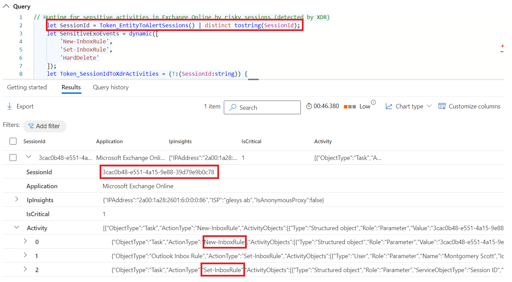</a>

#### Hunting for Session and Tokens with sensitive Azure management operations (AzureActivity)

As shown in the diagram, only Exchange Online covers `SessionId` in the activity log. `UniqueTokenIdentifier` is required to build a correlation between the related activities in Microsoft Azure and Microsoft 365 services.

Therefore, we need to define a table that holds all related token identifiers that should be included in the investigation. You can use the previously saved function  "Token_EntityToAlertSignInRequest" to correlate the `logon-request-id` (OriginalRequestId) with `UniqueTokenIdentifier`. In the following sample no entity has been defined for filtering the alerts by using an empty parameter `("")`. Some examples of sensitive events for Azure (SensitiveAzEvents) and Microsoft 365 (SensitiveSaasEvents) are already included but need to be customized based on your classification or requirements.

**Pre-requisites**

Pre-requisites for hunting session and tokens with sensitive Azure management operations from CloudAppEvents (MDA) table are defined on the table below. Besides the info on the table, you need to have proper permissions to be able to read the data in Azure side (Sentinel / Az Log Analytics).

| Name | Requirement                  |
|-------------|------------------------------|
| Data Connectors          | Entra ID & Cloud App Security data connectors enabled in Sentinel   |
| Unified XDR logs           | Cloud App Security (CloudAppEvents) raw event data integrated into Sentinel     |
| Dependencies           | Microsoft Entra ID P2  and Microsoft Defender for Cloud Apps (MDA) licenses to collect and view activities & raw data for this table   <br>  <br> Token_EntityToAlertSessions & Token_SessionIdToXdrActivities functions saved to Sentinel/XDR |
||||

```
let UniqueTokenId = Token_EntityToAlertSignInRequest("")
    | mv-expand SignIns
    | distinct UniqueTokenId = tostring(SignIns.UniqueTokenIdentifier);
```

Another approach is to filter for any issued token of a specific user:

```
let UniqueTokenId = union SigninLogs, AADNonInteractiveUserSignInLogs
                    | where UserPrincipalName == <UPN>
                    | distinct UniqueTokenId = tostring(UniqueTokenIdentifier);
```

The stored table in `UniqueTokenId` can be used as parameter to call the following function:

```
let Token_UtiToXdrActivities = (T:(UniqueTokenId:string)) {
    let SensitiveAzEvents = dynamic([
        'Microsoft.Authorization/roleAssignments/write',
        'Microsoft.Authorization/roleAssignmentScheduleRequests/write',
        'Microsoft.Authorization/roleEligibilityScheduleRequests/write',
        'Microsoft.Authorization/roleManagementPolicies/write',
        'Microsoft.Storage/storageAccounts/listKeys/action'
    ]);
    let SensitiveSaasEvents = dynamic([
        'New-InboxRule',
        'Set-InboxRule',
        'HardDelete'
        'AnonymousLinkCreated'
    ]);
    let AzTokenActivities = CloudAppEvents
        | where Application == "Microsoft Azure"
        | extend UniqueTokenIdentifier = tostring(parse_json(RawEventData).uniqueTokenId)
        | where UniqueTokenIdentifier in~ (UniqueTokenId)
        | where isnotempty(UniqueTokenIdentifier)
        | extend Operation = tostring(parse_json(tostring(RawEventData.properties)).message)
        | extend IsSensitive = iff(Operation in~ (SensitiveAzEvents), true, false)
        | extend Activity = bag_pack_columns(TimeGenerated, ObjectType, ActionType, ActivityObjects, ActivityType, ReportId, IsSensitive)
        | extend IsCritical = iff(Activity.IsSensitive contains "true", true, false)
        | extend IpTags = tostring(IPTags)
        | extend IpInsights = bag_pack_columns(IPAddress, ISP, IpCategory = IPCategory, IpTags, IsAnonymousProxy)
        | summarize Activity = make_set(Activity) by AccountObjectId, UniqueTokenIdentifier, Application, tostring(IpInsights), IsSensitive;
    let SaasTokenActivities = CloudAppEvents
        | where Application != "Microsoft Azure"
        | extend UniqueTokenIdentifier = tostring(parse_json(tostring(RawEventData.AppAccessContext)).UniqueTokenId)
        | where UniqueTokenIdentifier in~ (UniqueTokenId)
        | where isnotempty(UniqueTokenIdentifier)
        | extend Operation = tostring(parse_json(tostring(RawEventData.properties)).message)
        | extend IsSensitive = iff(ActionType in~ (SensitiveSaasEvents), true, false)
        | extend Activity = bag_pack_columns(TimeGenerated, ObjectType, ActionType, ActivityObjects, ActivityType, ReportId, IsSensitive)
        | extend IsCritical = iff(Activity.IsSensitive contains "true", true, false)
        | extend IpTags = tostring(IPTags)
        | extend IpInsights = bag_pack_columns(IPAddress, ISP, IpCategory = IPCategory, IpTags, IsAnonymousProxy)
        | summarize Activity = make_set(Activity) by AccountObjectId, UniqueTokenIdentifier, Application, tostring(IpInsights), IsSensitive;
    union AzTokenActivities, SaasTokenActivities
};
Token_UtiToXdrActivities(UniqueTokenId)
```

In the following example, the user has activated a PIM role by using a token that has been issued during a risky sign-in (detected by XDR):

<a href="https://raw.githubusercontent.com/Cloud-Architekt/AzureAD-Attack-Defense/Chapter7-AiTM/media/aitm-attack/Token_HuntingRiskySessionAndSensitiveM365Actions_Uti.png" target="_blank">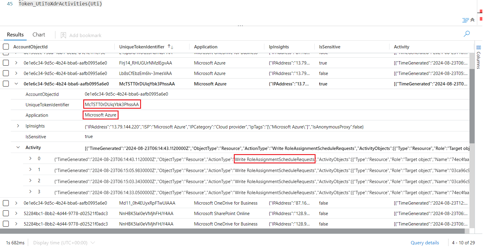</a>

#### Correlation of Session and Tokens which has been used outside of GSA for sensitive operations

Another function has been written to start hunting for any sensitive or privileged activity outside of Global Secure Access.
This includes any sign-in attempts which have been blocked by the "Compliant Network" CA Policy. Furthermore, this query is useful to identify if an access token has been replayed successfully.

**Pre-requisites**

Pre-requisites for hunting sessions and tokens that have been used outside of GSA are defined on the table below. Pre-requisites vary where you run the query because it can be executed in both, Defender XDR or in Microsoft Sentinel.

_Side Note: This query can also be executed in Microsoft Sentinel if you are ingesting XDR Advanced Hunting table `CloudAppEvents` to the workspace._

| Name | Requirement                  |
|-------------|------------------------------|
| Data Connectors          | In Microsoft Sentinel the following data connectors enabled: <br> - Microsoft Defender XDR data connector <br> - Microsoft Entra Sign-in/Non-interactive sign-in <br> - Network Access Logs from Global Secure Access <br> - Microsoft Graph Activity Logs <br><br> In Defender XDR: <br> - Defender XDR deployed   |
| Unified XDR logs           | XDR capabilities, you need to have AADSignInEventsBeta table in XDR but also M365 & Azure app connectors defined in Defender for Cloud Apps (MDA)        |
| Dependencies           | Microsoft Entra ID P2 license to collect and view activities for this table  <br>  <br>  Sentinel integrated into Defender XDR (Unified Security Operations Platform) <br> - If Sentinel is not integrated into the Defender XDR, you are not having `SecurityAlerts` data table in the XDR  <br>  <br> Token_EntityToAlertSessions() & Token_SessionIdToXdrActivities functions saved to Sentinel/XDR |
|||

```
let Token_GsaPrivilegedInterfaceActivity = (Entity:string="", CaPolicyBlockedOutsideGsa:string="", FilterByUniqueTokenIdentifier:string="", FilteredByActivityIpAddress:string="") {
    let PrivilegedInterfaces = datatable (ResourceDisplayName:string, Url:string) [
        "Windows Azure Service Management API", "management.azure.com",
        "Microsoft Graph", "graph.microsoft.com"
    ];
    let PrivilegedInterfacesAllUrls = dynamic(['graph.microsoft.com','management.azure.com']);
    let PrivilegedArmOperations = dynamic([
        'Microsoft.Authorization/roleAssignments/write',
        'Microsoft.Authorization/roleAssignmentScheduleRequests/write',
        'Microsoft.Authorization/roleEligibilityScheduleRequests/write',
        'Microsoft.Authorization/roleManagementPolicies/write',
        'Microsoft.Storage/storageAccounts/listKeys/action'
    ]);
    let PrivilegedGraphOperationsUri = dynamic([
        '/v1.0/applications/<UUID>/microsoft.graph.addPassword'
    ]);
    let PrivilegedGraphOperations = dynamic([
        'PATCH',
        'POST',
        'DELETE'
    ]);
    let SignInWithConnections = union SigninLogs, AADNonInteractiveUserSignInLogs
    // Currently no filtering for sign-in property "Through Global Secure Access", property isn't available in Sign-in logs
    | where UserPrincipalName == (Entity) or UserId == (Entity)
    // Extending Auth processing details for CAE
    | extend AuthProcessDetails = replace_string(AuthenticationProcessingDetails, " ", "")
    | extend AuthProcessDetails = replace_string(AuthProcessDetails, "\r\n", "")
    | parse-where AuthProcessDetails with * "IsCAEToken\",\"value\":\"" IsTokenCAE"\"" *
    // General filtering of sign-in events
    | where UniqueTokenIdentifier contains (FilterByUniqueTokenIdentifier)
    | where ResourceDisplayName in~ (PrivilegedInterfaces)
    // Enrichment of device and user details
    | extend DeviceDetail = iff(isempty( DeviceDetail_dynamic ), todynamic(DeviceDetail_string), DeviceDetail_dynamic)
    | extend DeviceName = tostring(toupper(DeviceDetail.displayName))
    | extend DeviceId = iff(isnotempty(parse_json(DeviceDetail).deviceId), tostring(parse_json(DeviceDetail).deviceId), "Unknown")
    | extend DeviceOS = tostring(parse_json(DeviceDetail).operatingSystem)
    | extend DeviceTrust = tostring(parse_json(DeviceDetail).trustType)
    | extend DeviceCompliance = tostring(parse_json(DeviceDetail).isCompliant)
    | extend AuthenticationMethod = tostring(parse_json(AuthenticationDetails)[0].authenticationMethod)
    | extend AuthenticationDetail = tostring(parse_json(AuthenticationDetails)[0].authenticationStepResultDetail)
    | extend DeviceInsights = bag_pack_columns(DeviceName, DeviceTrust, DeviceCompliance)
    | extend AuthInsights = bag_pack_columns(AuthenticationMethod, AuthenticationDetail)
    | extend SignInIpAddress = IPAddress
    // Get identifier if token is CAE-capable
    | extend JsonAuthCaeDetails = parse_json(AuthenticationProcessingDetails)
    // Enrichment of CA policy status
    | extend ConditionalAccessPolicies = iff(isempty( ConditionalAccessPolicies_dynamic ), todynamic(ConditionalAccessPolicies_string), ConditionalAccessPolicies_dynamic)
    | mv-apply ConditionalAccessPolicies on (
        where ConditionalAccessPolicies.displayName startswith (CaPolicyBlockedOutsideGsa)
    )
    | extend GsaCaStatus = ConditionalAccessPolicies.result
    | join kind=inner ( PrivilegedInterfaces ) on ResourceDisplayName
    // Correlation to GSA can't be established by SessionId (currently missing), connections with available identifier will be used in the TimeRange window will be used
    | join kind=leftouter (
        NetworkAccessTraffic
        | where DestinationFqdn in~ (PrivilegedInterfacesAllUrls)
        | summarize ConnectIds = make_set(ConnectionId) by UserId, DeviceId, Url = DestinationFqdn, GsaSourceIp = SourceIp, IPAddress = SourceIp
    ) on UserId, DeviceId, Url, IPAddress
    | project SignInTime = CreatedDateTime, ResultType, ResultDescription, TimeGenerated, CorrelationId, OriginalRequestId, UniqueTokenIdentifier, AppId, AppDisplayName, ResourceId = ResourceIdentity, ResourceDisplayName, Category, SignInIpAddress = IPAddress, DeviceInsights, AuthInsights, AuthenticationProcessingDetails, RiskLevelDuringSignIn, SignInIdentifierType, tostring(ConnectIds), GsaCaStatus, GsaSourceIp, AuthProcessDetails, IsTokenCAE, UserPrincipalName
    | sort by SignInTime desc;
    let GraphActivity = SignInWithConnections
    | join kind=inner ( MicrosoftGraphActivityLogs
        | where ClientAuthMethod == "0"
        | extend ParsedUri = parse_url(RequestUri)
        | extend NormalizedRequestUri = tostring(ParsedUri.Path)
        | extend NormalizedRequestUri = replace_string(NormalizedRequestUri, '//', '/')
        | extend NormalizedRequestUri = replace_regex(NormalizedRequestUri, @'[0-9a-fA-F]{8}\b-[0-9a-fA-F]{4}\b-[0-9a-fA-F]{4}\b-[0-9a-fA-F]{4}\b-[0-9a-fA-F]{12}', @'<UUID>'), ParsedUri
        | extend IsSensitive = iff((NormalizedRequestUri in~ (PrivilegedGraphOperationsUri) and RequestMethod in~ (PrivilegedGraphOperations)) == true, true, false)
        | extend GraphOperations = bag_pack_columns(ActivityTime = TimeGenerated, RequestId, OperationId, ClientRequestId, UserAgent, RequestUri, ResponseSizeBytes, UserAgent, IsSensitive)
        | summarize Operations = make_set(GraphOperations) by ActivityIpAddress = IPAddress, tostring(TokenIssuedAt), UniqueTokenIdentifier = SignInActivityId
    ) on UniqueTokenIdentifier
    | project-away UniqueTokenIdentifier1
    | extend OutsideOfGsa = iff(SignInIpAddress != ActivityIpAddress or isempty(ConnectIds), true, false);
    let AzureActivity = SignInWithConnections
    | join kind=inner ( CloudAppEvents
        | extend UniqueTokenIdentifier = tostring(RawEventData.uniqueTokenId)
        | extend TokenIssuedAt = tostring(parse_json(tostring(RawEventData.claims)).iat)
        | extend ClientIpAddress = tostring(parse_json(tostring(RawEventData.httpRequest)).clientIpAddress)
        | extend CorrelationId = RawEventData.ActivityId
        | extend OperationNameValue = parse_json(tostring(RawEventData.properties)).message
        | extend IsSensitive = iff((OperationNameValue in (PrivilegedArmOperations)) == true, true, false)
        | extend ArmOperations = bag_pack_columns(ActivityTime = TimeGenerated, CorrelationId, OperationNameValue, ResourceId = ObjectId, IsSensitive)
        | summarize Operations = make_set(ArmOperations) by ActivityIpAddress = ClientIpAddress, TokenIssuedAt, UniqueTokenIdentifier
    ) on UniqueTokenIdentifier
    | project-away UniqueTokenIdentifier1
    | extend OutsideOfGsa = iff(SignInIpAddress != ActivityIpAddress or isempty(ConnectIds), true, false);
    let BlockedSigIns = SignInWithConnections
        | where ResultType != "0" and GsaCaStatus == "failure"
        | extend OutsideOfGsa = true;
    union AzureActivity, GraphActivity, BlockedSigIns
    | sort by SignInTime desc
    | where ActivityIpAddress contains (FilteredByActivityIpAddress)
    | project-reorder SignInTime, UserPrincipalName, SignInIpAddress, ActivityIpAddress, OutsideOfGsa, GsaCaStatus, IsTokenCAE
    // Filter for sensitive Actions outside of GSA
    //| where OutsideOfGsa == true
    //| mv-expand parse_json(Operations) | where Operations.IsSensitive == "true" | project-reorder Operations
};
Token_GsaPrivilegedInterfaceActivity()
```

The following screenshots, shows some blocked sign-ins but also successful operations to Microsoft Graph API outside of the compliant network by replay access tokens:

<a href="https://raw.githubusercontent.com/Cloud-Architekt/AzureAD-Attack-Defense/Chapter7-AiTM/media/aitm-attack/Token_OutsideOfGlobalSecureAccessQuery.png" target="_blank">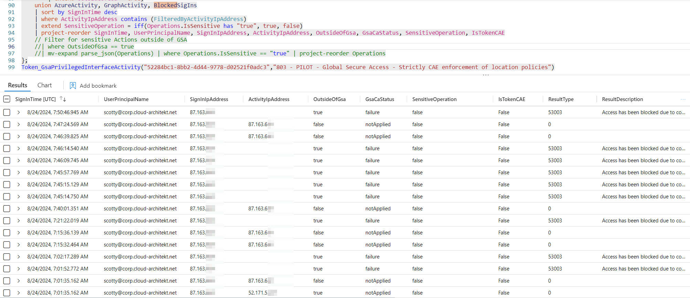</a>

The first parameter for this function needs to include the UserPrincipalName or UserId. The name of the CA Policy which blocks access outside of Compliant network needs to be provided in the second parameter.
In addition, you can uncomment the last few lines of code for hunting on sensitive operations only.

## Mitigations (and Reduced Attack Surface)

### Focus on proactive detection side and weak posture management issues in identities & devices

Staying ahead of potential threats is a top priority for organizations worldwide in the ever-evolving cybersecurity landscape. Modern and effective cybersecurity defenses are built on several essential pillars, where security posture management plays an important role. Where security monitoring is reactive and identifies when something malicious or unexpected happens in the environment, security posture is more proactive, and the goal is to identify vulnerabilities and weak configurations in the environment.

### Identity and Device Security

#### Configure Conditional Access to be align with best practices

One of the most important mitigations against AiTM attacks is Entra ID Conditional Access Policies and its configurations.

#### Require device states or compliant device (recommended)

Requiring device state (Entra ID Registered, Entra ID Joined & Hybrid Entra ID Joined) in CA policies mitigates AiTM attack. If an adversary can steal browser cookies (and the token inside) from an end-user the attack stops when the adversary tries to use the cookie. The reason behind the scenes are Cloud Authentication Provider (CloudAP) & Web Account Manager (WAM) plugins which are responsible for sending requests only to MS URLs. In addition, there is certificate-based authentication that the device is forced to do when compliant state is a requirement in Conditional Access policies. Credentials can be stolen, but tokens cannot by adversaries in this scenario. The recommendation is to use compliant device requirement in CA for much more secure method. It contains a stronger state than other methods of endpoint security configuration & risk level. In addition, it also has better granularity compared to other device states. 
 
Side note: Kudos to Robbe Van den Daele for pointing out ability for using the different device states in CA for AiTM mitigation. 

#### Phishing-resistant MFA

Using phishing-resistant MFA is the strongest method for protecting users from AiTM attacks. The following authentication methods are identified as phishing-resistant:

- Passkeys (Passkeys aka FIDO2 & device-bound passkeys)
- Windows Hello for Business
- Certificate-based authentication (CBA)

[More information about Entra ID authentication strengths policies](https://learn.microsoft.com/en-us/entra/identity/authentication/concept-authentication-strengths)

#### Entra ID Protection (EIDP)

Entra ID Protection is often overlooked as a security solution. It's very straightforward to configure and we've seen many situations where it has been the protector for user compromise.

EIDP has two types of detections available; real-time detection (evaluated during sign-in/authentication process) and offline detection (evaluated after sign-in process based on the activities). That being said, you need to configure at least two (2) EIDP risk-based policies to your Entra ID Conditional Access. How many policies you need depends on the scenarios, use cases and security policies. For example, do you want to threat admins differently than end-users when high risk is detected.

Side note: Remember to require sign-in frequency as 'every time' to real-time risk policy. It requires full reauthentication when the session is evaluated.

### Invest in advanced anti-phishing solutions that monitor and scan incoming emails

As stated earlier in the detection section, globally known campaigns and threat actors' activities can be detected by MDO if your organization is targeted assuming that whole Defender XDR stack is fully deployed. That being said, it's important to invest in advanced anti-phishing solutions that monitor and scan incoming emails and visited websites (with MDE/MDA). If you are leveraging MDO, it plays an important role in detecting AiTM attacks even though it's not seen in our example incidents. The case would be different if the attack were part of a globally known campaign or a known threat actor.

### Microsoft’s Security Exposure Management (XSPM)

One of the solutions that can be used to address this challenge is XSPM. It is a new innovation in the posture management domain. It can be imagined as a combination of the next-generation vulnerability management & posture management solution that modernizes posture management in the same way XDR modernizes threat management. Where XDR (detect, investigate, and respond) provides unified threat management for workloads, the XSPM (identify and protect) provides unified exposure management for the same workloads (see figure below – initial version from Microsoft Secure presentation).

 According to Microsoft: _'XSPM is a security solution that provides a unified view of security posture across company assets and workloads. Security Exposure Management enriches asset information with a security context that helps you to manage attack surfaces, protect critical assets, and explore and mitigate exposure risk'._

 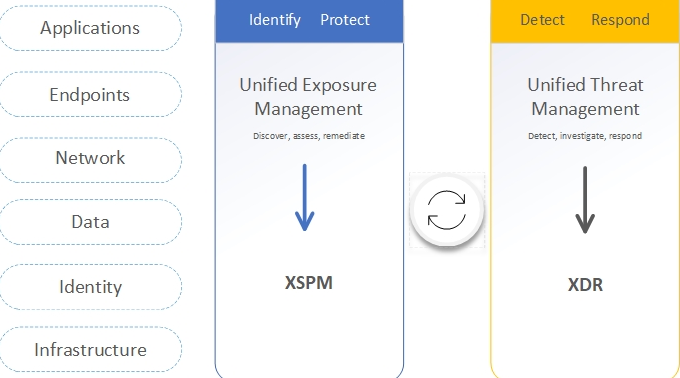

_XSPM and Defender XDR comparison_

XSPM can enrich hunting by providing information about the stored browser cookies as seen in the figures below.

<a href="https://raw.githubusercontent.com/Cloud-Architekt/AzureAD-Attack-Defense/Chapter7-AiTM/media/aitm-attack/XSPM-1.png" target="_blank"></a>

<a href="https://raw.githubusercontent.com/Cloud-Architekt/AzureAD-Attack-Defense/Chapter7-AiTM/media/aitm-attack/XSPM-2.png" target="_blank">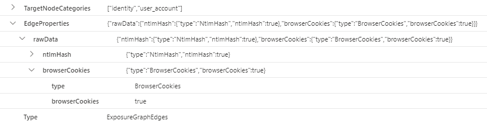</a>

### Deploy and configure Automatic Attack Disruption in Defender XDR

If your organization is leveraging Defender XDR capabilities, it's important to verify that automatic attack disruption pre-requisites are configured properly, and the feature can do the mitigations in hand when high confidence incident is detected. The feature leverages the full Microsoft Defender XDR security stack, and in a nutshell, the wider the Defender XDR deployment is, the more coverage you will get. Below are the recommendations found in Microsoft Learn documentation:

- Deploy the entire Microsoft Defender XDR stack (MDE, MDO, MDI, and MDA).
- Automated response actions are key features in attack disruption. To leverage automated response actions, the following settings need to be configured:
  - MDI: Configure and enable an action account to an on-premises AD (follow the least privilege permissions principle)
  - MDE: It is recommended to configure the automation level as Full - remediate threats automatically, allowing Microsoft Defender XDR to automatically contain a device
  - MDE: Device discovery is set to standard

Side note: If you want to exclude some of the device groups or user entities from the automated containment you can:

- Set automation level to 'no automated response' in MDE
- Exclude user entity from Defender XDR automation scope. This can be done from Defender XDR settings (settings - Microsoft Defender XDR - Identity automated response)

#### How to configure automatic attack disruption

The automatic attack disruption feature leverages the full Microsoft Defender XDR security stack, and in a nutshell, the wider the Defender XDR deployment is, the more coverage you will get. The following list contains the items that need to be configured to fully utilize this feature in an environment:

- Deploy the entire Microsoft Defender XDR stack (MDE, MDO, MDI, and MDA)
- Automated response actions are key features in attack disruption. To leverage automated response actions, the following settings need to be configured:
  - MDI: Configure and enable an action account to an on-premises AD (follow the least privilege permissions principle)
  - MDE: It is recommended to configure the automation level as Full - remediate threats automatically, allowing Microsoft Defender XDR to automatically contain a device in case of a high confidence incident (and supported scenario)
  - MDE: Device discovery is set to standard

In October 2023, Microsoft announced capability for MDE to be able to automatically disrupt human-operated attacks, such as ransomware, early in the kill chain without needing to deploy any other features. With this new capability, full XDR deployment is not required, but it is still recommended because of enhanced protection for attack scenarios. At the time of writing, the new MDE capability is included with MDE Plan 2 as well as Defender for Business standalone licenses. [You can find detailed instructions at](https://learn.microsoft.com/en-us/defender-xdr/configure-attack-disruption?WT.mc_id=AZ-MVP-5004291).

#### Automatic attack disruption key stages

Let’s look at the various stages of attack disruption, starting with data collection:

**Correlating signals:**
Microsoft security solutions share signals, events and alerts with each other, and the attack disruption leverages this collected data to identify a possible adversary high-confidence attack. Insights are collected from endpoints, identities, email (and collaboration tools such as Teams), and SaaS applications.

**Identifying assets:** Attack disruption identifies assets managed by an adversary and used to spread an attack.
Automated actions: Attack disruption automatically responds with actions across relevant Microsoft Defender products. Also, remember that the wider the deployment, the wider the coverage. Available automated actions at the time of writing are as follows:

**Contain device:** This action involves the automatic containment of a suspicious device to block any incoming/outgoing communication to/from the affected device.

**Disable user:** The action is a MDI capability, and it requires having MDI deployed with Action Account configured. Disable user is an automatic suspension of a compromised account in an on-premises environment to prevent additional damage, such as lateral movement, malicious mailbox use, or malware execution.

**Contain user:** The action automatically contains suspicious identities temporarily. By containing identities, organizations can block any lateral movement and remote encryption related to incoming communication with MDE onboarded devices in the early stages.

_Side note: Even though Microsoft Defender XDR’s automatic attack disruption is fully automated, it doesn’t mean that a security team doesn’t need to investigate incidents._

Defender XDR’s automatic attack disruption is a powerful feature that can help to enhance security in certain scenarios, faster response times, and resiliency against attacks. If a supported attack scenario is detected on a single device, the Microsoft Defender XDR attack disruption will simultaneously stop the campaign on that device and all other affected devices in the organization where the compromised user operates. In a nutshell, the mitigation ideology is the same, whether the full XDR deployment is in use or only MDE. To realize the difference it can make, see the following figures, which show defenses without attack disruption and with attack disruption.

<a href="https://raw.githubusercontent.com/Cloud-Architekt/AzureAD-Attack-Defense/Chapter7-AiTM/media/aitm-attack/AttackDisruption-1.png" target="_blank">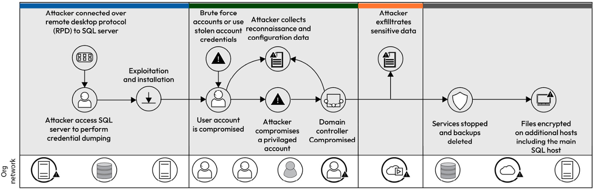</a>

_Without Microsoft Defender XDR’s automatic attack disruption in place (initial figure from Microsoft presentation)_

<a href="https://raw.githubusercontent.com/Cloud-Architekt/AzureAD-Attack-Defense/Chapter7-AiTM/media/aitm-attack/AttackDisruption-2.png" target="_blank">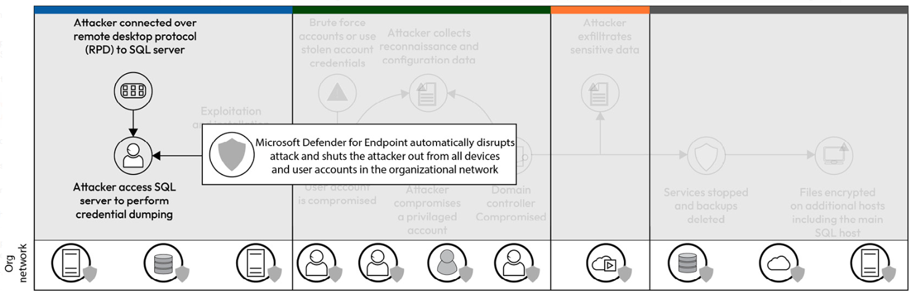</a>

_With Microsoft Defender XDR’s automatic attack disruption in place (initial figure from Microsoft presentation)_

As you can see from the preceding figures, there is a significant difference in capabilities if attack disruption is not configured with automated remediation. Keep in mind that the feature doesn’t cover all the possible attack scenarios, but it covers some major ones when an attack is detected with high confidence.

### Global Secure Access

Microsoft has introduced Entra Internet Access secure access and traffic to internet and SaaS applications (including Microsoft 365 ) by taking benefit of an identity-centric secure web gateway solution. It offers full integration to Microsoft Entra and supports Source IP restoration which is needed to take benefit of XDR signals and full visibility for SOC. All connections will be routed through Global Secure Access (GSA) network which are provided from Microsoft's Wide Area Network.

<a href="https://raw.githubusercontent.com/Cloud-Architekt/AzureAD-Attack-Defense/Chapter7-AiTM/media/aitm-attack/GsaOverview.png" target="_blank">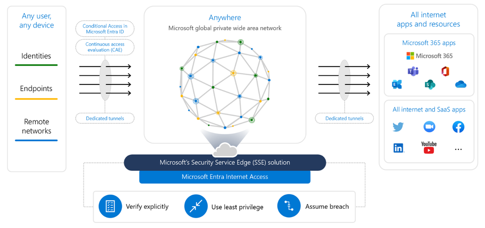</a>
_Overview of Microsoft's Security Service Edge (SSE) solution which also allows to apply Conditional Access to restrict access on Cloud Apps and other resources through Global Secure Access._

GSA also brings a new capability to use a condition which presents a compliant network within Conditional Access. This allows you to limit token acquisition for cloud apps on "compliant network" by Microsoft Entra but also blocking access to workloads or data plane outside for clients or remote networks which are not connected by Global Secure Access. There's no need or effort to manage IP addresses for defining a "Compliant network". Microsoft takes care that connectivity from GSA is covered by this condition. A Conditional Access Policy defines which cloud apps will be accessible only by GSA-connected endpoints.

<a href="https://raw.githubusercontent.com/Cloud-Architekt/AzureAD-Attack-Defense/Chapter7-AiTM/media/aitm-attack/GsaPolicyConfig.png" target="_blank">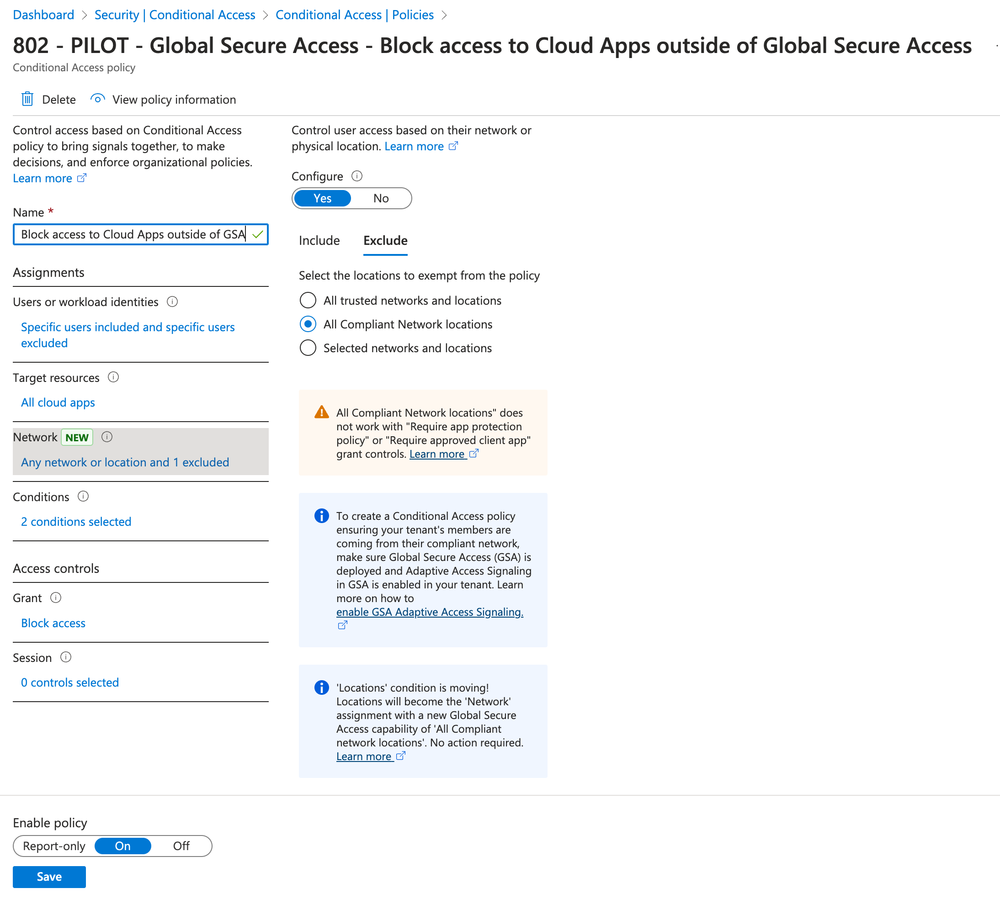</a>
_Conditional Access supports restriction on Network conditions, for example blocking all access outside of compliant networks._

The malicious actor still owns the credentials, but device compliance and/or non-compliant network cannot be satisfied to gain access to resources.

<a href="https://raw.githubusercontent.com/Cloud-Architekt/AzureAD-Attack-Defense/Chapter7-AiTM/media/aitm-attack/GsaSignInEvent.png" target="_blank">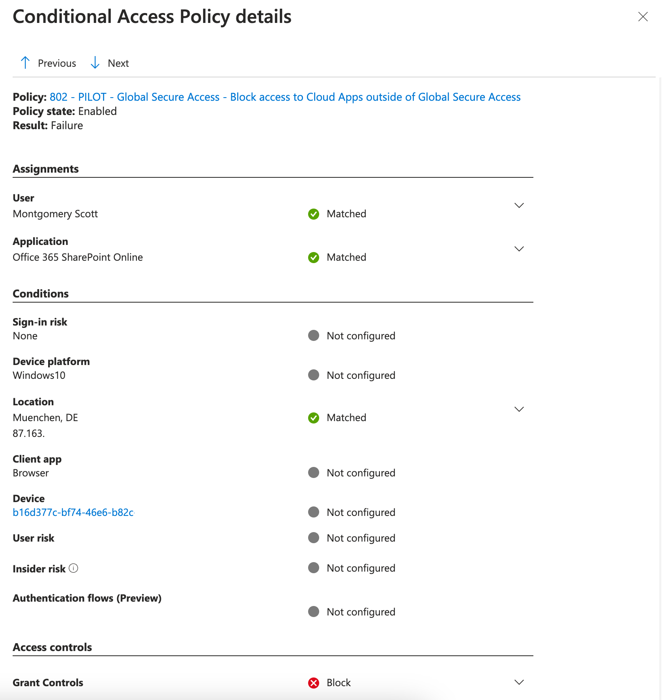</a>

_Requesting access with valid MFA credentials from AiTM attack will be blocked outside of GSA._

Sign-in events in Microsoft Entra shows network details of accessing resources, this includes the original IP address but also the IP Address by Global Secure Access.[Enriched logs for Microsoft 365](https://learn.microsoft.com/en-us/entra/global-secure-access/how-to-view-enriched-logs) allows also insights about the cloud app traffic from Microsoft to the M365 Apps. How to detect access outside of GSA or blocked access has been covered in one of our hunting queries.

More details on Global Secure Access can be found in this blog posts from the community:

- [Prevent AiTM with Microsoft Entra Global Secure Access and Conditional Access](https://janbakker.tech/prevent-aitm-with-microsoft-entra-global-secure-access-and-conditional-access/)
- [How to use Microsoft Entra | Internet Access to prevent AiTM attack(s)](https://derkvanderwoude.medium.com/microsoft-entra-internet-access-to-prevent-aitm-attack-s-31171db43a83)

### Microsoft Defender for Cloud Apps (MDA) Session Proxy

Even though requiring compliant devices and phishing-resistant mfa are the most powerful mitigations into the AiTM attack, the MDA's session proxy, Conditional Access together with Edge for Business in-browser protection can help as well. This is more or less a niche scenario, but it is good to know that if you're using session proxy to protect & monitor access to sensitive applications you will protect the users at the same time from this type of attack.

More information about in-browser protection with [Microsoft Edge for Business (in preview at the time of writing) in MDA](https://learn.microsoft.com/en-us/defender-cloud-apps/in-browser-protection) is found in Microsoft Learn.

<a href="https://raw.githubusercontent.com/Cloud-Architekt/AzureAD-Attack-Defense/Chapter7-AiTM/media/aitm-attack/MDA-proxy.png" target="_blank">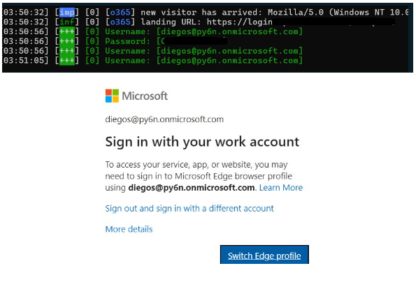</a>

_Access with replayed token will be blocked by using MDA Session Proxy even password has been stolen._

## Summary

This chapter provides a comprehensive analysis of Adversary-in-the-Middle (AiTM) attacks, highlighting their ability to bypass multifactor authentication (MFA) by hijacking session cookies. We covered a few attack scenarios and highlighted two different approaches in the hunting section. Key points include:

- Techniques: AiTM phishing through reverse proxy and synchronous relay.
- Detection: Utilizing Microsoft security solutions like Defender XDR, Entra ID Protection, and Microsoft Sentinel. Also, highlighted importance of threat hunting to detect possible AiTM-related malicious activity in the environment.
- Mitigation: Implementing proactive measures such as phishing-resistant MFA and advanced anti-phishing solutions.

The document aligns with the MITRE ATT&CK Framework and underscores the importance of continuous monitoring and proactive threat hunting to safeguard against AiTM attacks.

## Technical Background and References

- [Microsoft Token Theft Playbook](https://learn.microsoft.com/en-us/security/operations/token-theft-playbook/)
- [How to prevent, detect, and respond to cloud token theft](https://www.microsoft.com/en-us/security/blog/2022/11/16/token-tactics-how-to-prevent-detect-and-respond-to-cloud-token-theft/)
- [From cookie theft to BEC: Attackers use AiTM phishing sites as entry point to further financial fraud](https://www.microsoft.com/en-us/security/blog/2022/07/12/from-cookie-theft-to-bec-attackers-use-aitm-phishing-sites-as-entry-point-to-further-financial-fraud/?msockid=28c8c6feb17d6e740accd40eb04a6f51/)
- [Microsoft Defender XDR threat analytics report - Technique Profile: Adversary-in-the-Middle](https://security.microsoft.com/threatanalytics3/edd01a8c-283d-42f6-bdd4-0b7b4dbd369b/analystreport/)
- [How to break the token theft cyber-attack chain](https://techcommunity.microsoft.com/t5/microsoft-entra-blog/how-to-break-the-token-theft-cyber-attack-chain/ba-p/4062700/)
