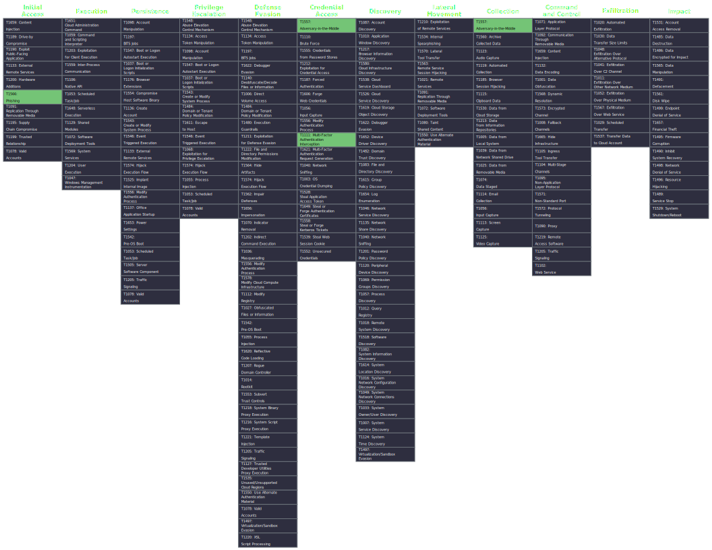
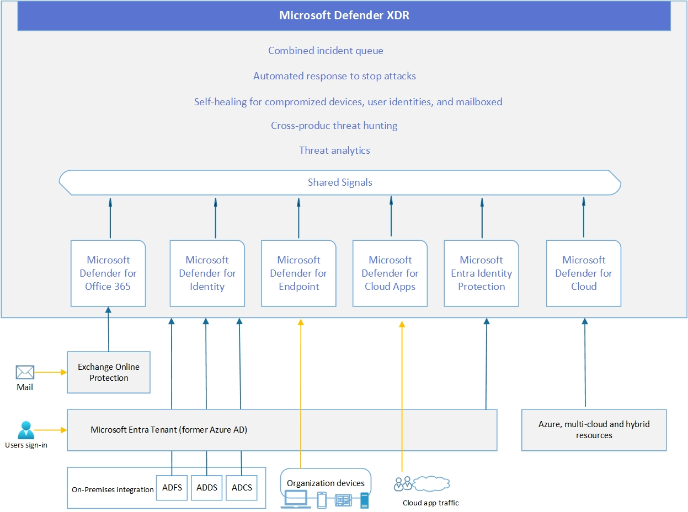
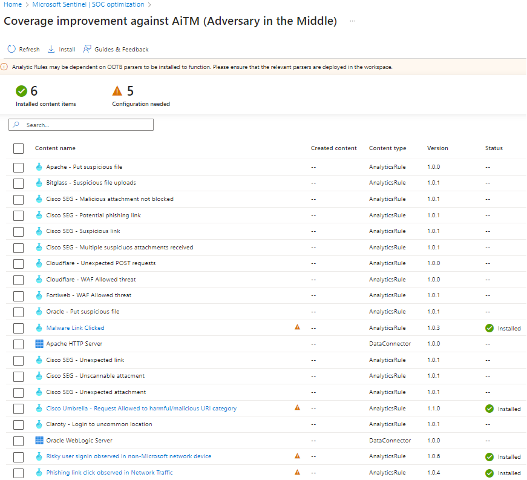
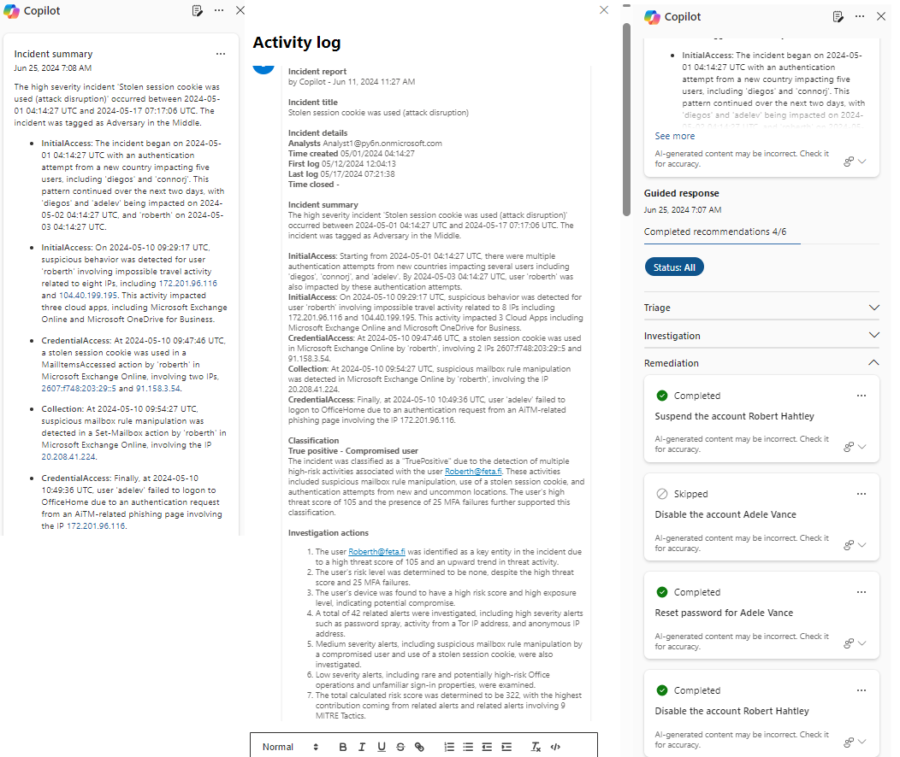

# Adversary-in-the-Middle (AiTM) Attacks

_Authors: Sami Lamppu, Thomas Naunheim_
_Created: July 2024_

*"An adversary-in-the-middle(AiTM) attack leverages sophisticated phishing techniques that can bypass multifactor authentication (MFA) by hijacking session cookies. These attacks often involve the use of reverse-proxy functionality to intercept credentials and session cookies, allowing attackers to gain unauthorized access to user accounts without needing the second authentication factor.”*

*MITRE ATT&CK: [Credential Access (T1110)](https://attack.mitre.org/techniques/T1110/003/)*

- [Adversary-in-the-Middle (AiTM) Attacks](#adversary-in-the-middle-aitm-attacks)
  - [Attack](#attack)
    - [Background of AiTM attacks](#background-of-aitm-attacks)
    - [Status Today based on Microsoft Threat Intelligence](#status-today-based-on-microsoft-threat-intelligence)
  - [MITRE ATT\&CK Framework](#mitre-attck-framework)
    - [Tactics, Techniques \& Procedures (TTPs) in AiTM Attack](#tactics-techniques--procedures-ttps-in-aitm-attack)
    - [Technique Overview](#technique-overview)
      - [AiTM phishing through reverse proxy](#aitm-phishing-through-reverse-proxy)
      - [AiTM phishing through synchronous relay](#aitm-phishing-through-synchronous-relay)
    - [Tools to simulate AiTM attack](#tools-to-simulate-aitm-attack)
  - [Detections](#detections)
    - [Defender XDR \& Microsoft Sentinel](#defender-xdr--microsoft-sentinel)
    - [Attack Disruption](#attack-disruption)
      - [Scenarios covered today​ in Attack Disruption](#scenarios-covered-today-in-attack-disruption)
    - [XDR Detections](#xdr-detections)
    - [Microsoft Defender for Office 365 (MDO)](#microsoft-defender-for-office-365-mdo)
    - [Entra ID Protection](#entra-id-protection)
    - [Microsoft Defender for Cloud Apps (MDA)](#microsoft-defender-for-cloud-apps-mda)
        - [Behaviors Data Layer](#behaviors-data-layer)
    - [Microsoft Sentinel](#microsoft-sentinel)
    - [Copilot for Security (CfS)](#copilot-for-security-cfs)
    - [Custom Detections and Hunting](#custom-detections-and-hunting)
      - [Queries](#queries)
  - [Mitigations (and Reduced Attack Surface)](#mitigations-and-reduced-attack-surface)
    - [Focus on proactive detection side and weak posture management issues in identities \& devices](#focus-on-proactive-detection-side-and-weak-posture-management-issues-in-identities--devices)
    - [Identity and Device Security](#identity-and-device-security)
    - [Microsoft’s Security Exposure Management (XSPM)](#microsofts-security-exposure-management-xspm)
    - [Deploy and configure Automatic Attack Disruption in Defender XDR](#deploy-and-configure-automatic-attack-disruption-in-defender-xdr)
      - [How to configure automatic attack disruption](#how-to-configure-automatic-attack-disruption)
      - [Automatic attack disruption key stages](#automatic-attack-disruption-key-stages)
    - [Configure Conditional Access to be align with best practices](#configure-conditional-access-to-be-align-with-best-practices)
      - [Require compliant device](#require-compliant-device)
      - [Phishing-resistant MFA](#phishing-resistant-mfa)
    - [Entra ID Protection](#entra-id-protection-1)
    - [Invest in advanced anti-phishing solutions that monitor and scan incoming emails and visited websites](#invest-in-advanced-anti-phishing-solutionsthatmonitorand-scan-incoming-emails-and-visited-websites)
    - [Continuously monitor suspicious or anomalous activities](#continuouslymonitorsuspicious-or-anomalous-activities)
  - [Summary](#summary)
  - [Technical Background and References](#technical-background-and-references)

## Attack

### Background of AiTM attacks

Typically, adversary target in AiTM attack is to steal user credentials or to deliver malware. AiTM attacks have been used for many years already by threat actors. According to Microsoft Threat Intelligence report, open source free phishing kits with AiTM capabilities have been available since 2017, but AiTM capabilities were not commonly paired with large-scale phishing campaigns until 2021. In 2022 the technique became common, replacing more traditional forms of credential phishing. Outcome from this is that many organizations have been struggling with these type of attacks and have been incapable to detect and mitigate AiTM attacks in their environments. 


Microsoft Threat Intelligence report has great description about [Adversary-in-the-middle (AiTM) credential phishing attacks](https://security.microsoft.com/threatanalytics3/edd01a8c-283d-42f6-bdd4-0b7b4dbd369b/overview)). 

### Status Today based on Microsoft Threat Intelligence
Cybercriminals currently use AiTM phishing techniques to bypass multifactor authentication (MFA) protections at scale. These advanced techniques are democratized and proliferated through the phishing-as-a-service (PhaaS) cybercrime economic model, which has spawned several service offerings since 2021.  

Nowadays there are number of AiTM apable PhaaS platforms have continued to grow throughout 2023-2024, with previously existing services adding AiTM capabilities to their platforms and newly created services incorporating AiTM phishing techniques natively. While traditional forms of credential phishing still exist, the amount of AiTM phishing attacks exceed those without this capability. 

The ultimate goal of AiTM phishing is to steal user credentials and session cookies. Session cookies are stored by browsers to allow users access to services without having to repeatedly authenticate. AiTM phishing targets session cookies and credentials to bypass traditional MFA protections. 

[More information about PhaaS](https://thehackernews.com/2023/08/phishing-as-service-gets-smarter.html)

## MITRE ATT&CK Framework
MITRE ATT&CK framework is commonly used for mapping Tactics, Techniques and Procedures (TTPs) for adversary actions and emulating defenses on organizations around the world.

### Tactics, Techniques & Procedures (TTPs) in AiTM Attack
The nature of the AiTM attacks includes several methods and it falls into a several TTPs in MITRE ATT&CK framework. The following TTPs are mapped for the 'Adversary-in-the-Middle' attack scenario. From the table below, you can find TTPs description and link to the MITRE ATT&CK official documentation.

| TTPs         |  Description  |
|--------------|-----------|
|  Adversary-in-the-Middle - [T1557 Adversary-in-the-Middle](https://attack.mitre.org/techniques/T1557/)| Adversaries may use a single or small list of commonly used passwords against many different accounts to attempt to acquire valid account credentials. Password spraying uses one password (e.g. 'Password01'), or a small list of commonly used passwords, that may match the complexity policy of the domain. Logins are attempted with that password against many different accounts on a network to avoid account lockouts that would normally occur when brute forcing a single account with many passwords |
| Multi-factor Authentication Interception - [T1111 Multi-factor Authentication Interception](https://attack.mitre.org/techniques/T1111/) |Adversaries may target multi-factor authentication (MFA) mechanisms, (i.e., smart cards, token generators, etc.) to gain access to credentials that can be used to access systems, services, and network resources. Use of MFA is recommended and provides a higher level of security than usernames and passwords alone, but organizations should be aware of techniques that could be used to intercept and bypass these security mechanisms.|
| Phishing - [T1566 Phishing](https://attack.mitre.org/techniques/T1566/)| Adversaries may send phishing messages to gain access to victim systems. All forms of phishing are electronically delivered social engineering. Phishing can be targeted, known as spearphishing. In spearphishing, a specific individual, company, or industry will be targeted by the adversary. More generally, adversaries can conduct non-targeted phishing, such as in mass malware spam campaigns.

Figure below shows TTPs used in this scenario in MITRE ATT&CK framework.

<a href="https://raw.githubusercontent.com/Cloud-Architekt/AzureAD-Attack-Defense/Chapter7-AiTM/media/mitre/AttackScenarios/AiTM.svg" target="_blank"></a>

<a style="font-style:italic" href="https://mitre-attack.github.io/attack-navigator/#layerURL=https%3A%2F%2Fraw.githubusercontent.com%2FCloud-Architekt%2FAzureAD-Attack-Defense%2FChapter7-AiTM%2Fmedia%2Fmitre%2FAttackScenarios%2FAiTM.json&tabs=false&selecting_techniques=false" >Open in MITRE ATT&CK Navigator</a>


### Technique Overview
TBA

#### AiTM phishing through reverse proxy
TBA

<a href="https://raw.githubusercontent.com/Cloud-Architekt/AzureAD-Attack-Defense/Chapter7-aitm/media/aitm-attack/AiTM.png" target="_blank"></a>
  
*AiTM phishing through reverse proxy attack diagram (initial figure from Microsoft Defender XDR Threat Intelligence reports).*

#### AiTM phishing through synchronous relay
TBA

<a href="https://raw.githubusercontent.com/Cloud-Architekt/AzureAD-Attack-Defense/Chapter7-aitm/media/aitm-attack/AiTM-2.png" target="_blank"></a>

*AiTM phishing through synchronous relay diagram (initial figure from Microsoft Defender XDR Threat Intelligence reports).*

### Tools to simulate AiTM attack
TBA

John Hammond
https://www.youtube.com/watch?reload=9&app=desktop&v=sZ22YulJwao&feature=youtu.be

Jan Bakker
https://janbakker.tech/how-to-set-up-evilginx-to-phish-office-365-credentials/

https://janbakker.tech/running-evilginx-3-0-on-windows/


## Detections
*Assumption on the next section is that your organization is using Defender XDR security solutions.*

### Defender XDR & Microsoft Sentinel
Microsoft Unified XDR solution provides several ways to detect AiTM attacks out of the box but you need to take into account that there isn't silverbullet solution (or even one solution) that detects alla attacks, and mitigates them. Than being said, it's important to know you data and do proactive threat hunting as well. But let's come back on that later. 

To get best possible coverage from detection point of view, full Defender XDR deployment is recommended even though all products are not included in the detection side. This attack is targeting end-users, so the main detections are based on Defender for Cloud Apps, Entra ID Protection, Defender for Office 365, and XDR correction capabilities. As said earlier, it's also important to know you data and do proactive threat hunting.

What we also want to highlight is Defender XDR configurations. The solution has automated investigation and response (AIR) and attack disruption capabilities but we see quite often situations where XDR solution is not able to mitigate possible high confidence incidents because lack of proper configurations. 

**Key takeaway:** Evaluate and monitor your Defender XDR solution baseline configurations in regular basis.

<a href="https://raw.githubusercontent.com/Cloud-Architekt/AzureAD-Attack-Defense/Chapter7-aitm/media/aitm-attack/Defender-XDR-Architecture.png" target="_blank"></a>


### Attack Disruption
Microsoft Defender XDR, as well as other Microsoft security solutions, shares and correlates a huge number of signals daily. Automatic attack disruption was introduced initially in 2022, and the idea behind is to identify ongoing complex and sophisticated attacks with high confidence and execute mitigation actions automatically (containing compromised assets, such as identity and endpoints). Microsoft Defender XDR’s automatic attack disruption mechanism leverages Microsoft AI models and threat research insights to detect possible attacks. One of the main advantages of using automatic attack disruption (compared to other XDR and SIEM solutions) is that the feature is built into the Microsoft Defender XDR platform. It’s automatically enabled when solutions are deployed, but to make it work as intended (i.e., disrupt attacks), you need to make sure that prerequisites are met as mentioned above.


#### Scenarios covered today​ in Attack Disruption
- Human Operator Ransomware (HumOR)​
- Business email compromise (BEC)​
- Adversary in the middle (AiTM)​
- SAP (in XDR)​
- AI-powered disruption of SaaS attacks
  

### XDR Detections
If high confidence attack is detected the detection could look like the one below. The key characteristics in the detection are:
- Disrupted incidents include a tag for 'Attack Disruption' and the specific threat type identified (i.e., ransomware). If you subscribe to incident email notifications, these tags also appear in the emails.
- A highlighted notification below the incident title indicating that the incident was disrupted.
- Suspended users and contained devices appear with a label indicating their status

In the example incident below you can find:
- Incident name (attack disruption)
- Tag (AiTM attack)
- Mitigations in the XDR action center

<a href="https://raw.githubusercontent.com/Cloud-Architekt/AzureAD-Attack-Defense/Chapter7-aitm/media/aitm-attack/AttackDisruption-4.png" target="_blank"></a>

Not all AiTM attacks are identified as high confidence attack but the attack pattern is similar than in an attack where attack disruption does its magic. In the figure below, you can see an incident where XDR has detected multiple suspicious activities but the attack is not tagged or identified as high confidence attack. 
<a href="https://raw.githubusercontent.com/Cloud-Architekt/AzureAD-Attack-Defense/Chapter7-aitm/media/aitm-attack/XDR-detections" target="_blank"></a>

### Microsoft Defender for Office 365 (MDO)
Tt's important to invest in advanced anti-phishing solutions that monitor and scan incoming emails and visited websites. If you are leveraging MDO, it plays and important role in detecting AiTM attacks even though it's not seen in our example incidents. The case would be different if the attack would be part of globally known campaign or known threat actor. 

In MDO, you could see the following alerts in a case of possible AiTM attack:
- A potentially malicious URL click was detected   
- A user clicked through to a potentially malicious URL​   
- Suspicious email sending patterns detected 

These alerts are typically correlated to multi-stage incident if XDR is the detection source.

### Entra ID Protection
TBA

### Microsoft Defender for Cloud Apps (MDA)
AiTM related alerts in MDA are actually forwarder to Entra ID Protection. The alerts you can see related with AiTM attack, where detection source is MDA are:
- Suspicious inbox forwarding
- Suspicious inbox manipulation rules

These alerts are forwarded from MDA to EIDP, where the latter one calculates user risk. The detection are so called offline detections and if you would like to have more information about EIDP detections and integrations underneath the hood please take a look at [Identity Protection Integrations with Microsoft Security Solutions]( https://samilamppu.com/2022/11/22/azure-ad-identity-protection-integration-with-microsoft-security-solutions/)


##### Behaviors Data Layer
The last piece of the puzzle is to use MDA Behaviors data layer in hunting. In the past, MDA raised quite a lot false/positive (FP) alerts based on the built-in detection rules. These rules were disabled completely from MDA in late 2023 by Microsoft to decrease FP alerts in MDA. At the same time, Behaviors data layer was presented in Defender XDR. It's abstract data layer above raw data layer that provides deeper understanding of MDA events. They have similarities with alerts such as mapping to MITRE ATT&CK TTPs. 

Behaviors data layer provides the following use cases:
- Focus on scenario-based alerts, such as “Suspicious inbox manipulation rule” that detects specific patterns of inbox rules created by adversaries.
- Use anomaly detection data that doesn’t have security ramifications as part of your investigation and custom detections.
- Enrich the context of related incidents, anomalies will be correlated to existing incidents when they are relevant, for example when an impossible travel behavior is detected before a “Risky user created global admin” XDR detection.

At the time of writing, the following detections are identified as Behaviors in MDA CloudAppEvents data table:

|Alert name | Policy name|
|-----|-----|
|Activity from infrequent country |	Activity from infrequent country/region |
| Impossible travel activity| Impossible travel |
| Mass delete	| Unusual file deletion activity (by user) | 
|  Mass download	| Unusual file download (by user) | 
|  Mass share | 	Unusual file share activity (by user)| 
|  Multiple delete VM activities	|  Multiple delete VM activities | 
|  Multiple failed login attempts | 	Multiple failed sign-in attempts | 
|  Multiple Power BI report sharing activities | 	Multiple Power BI report sharing activities | 
|  Multiple VM creation activities | 	Multiple VM creation activities | 
|  Suspicious administrative activity | 	Unusual administrative activity (by user) | 
|  Suspicious impersonated activity | 	Unusual impersonated activity (by user) | 
|  Suspicious OAuth app file download activities | 	Suspicious OAuth app file download activities | 
|  Suspicious Power BI report sharing	|  Suspicious Power BI report sharing | 
|  Unusual addition of credentials to an OAuth app	|  Unusual addition of credentials to an OAuth app | 
|||

You might be wondering how MDA and Behaviors data layer is related into to AiTM attack? Behaviors datalayer in Defender XDR is divided to two different data tables, BehaviorInfo & BehaviorEntities. These tables stores important piece of information that can be leveraged when investigating possible AiTM attacks.

- **BehaviorEntities:** Contains information about entities (file, process, device, user, and others) that are involved in a behavior.
- **BehaviorInfo:** Contains information about behaviors, which in the context of Microsoft Defender XDR refers to a conclusion or insight based on one or more raw events, which can provide analysts more context in investigations.

By correlating data from both tables we can identify pieces of information that might be related to malicious activity, impossible travel activity, that might be related with AiTM attack. You can use the following query to find out such events. If you want to investigate a specific event you can include 'BehaviorId' & 'userPrincipalName' into the query.

```
//Investigate behaviors for a specific user
BehaviorInfo
| where Timestamp >ago(7d) 
| where ServiceSource == "Microsoft Cloud App Security"
//| where BehaviorId == "<insert behavior id>"
//| where AccountUpn == "<insert entity UPN>"
| join BehaviorEntities on BehaviorId
| project Timestamp, BehaviorId, ActionType, Description, Categories, AttackTechniques, ServiceSource, AccountUpn, AccountObjectId, EntityType, EntityRole, RemoteIP, AccountName, AccountDomain, Application
```

### Microsoft Sentinel
Microsoft Sentinel has a new feature called SOC optimization that has AiTM as one of the threat scenarios in it. Main driver for using SOC optimization is to provide information to the organizations that they can close coverage gaps against specific threats and tighten ingestion rates against data that doesn't provide security value. In a nutshell: better detection coverage and decreased costs. 

<a href="https://raw.githubusercontent.com/Cloud-Architekt/AzureAD-Attack-Defense/Chapter7-aitm/media/aitm-attack/SOC-optimatization-1.png" target="_blank"></a>

AiTM threat scenario provides total of 32 configurable items which includes 18 analytic rules and 14 data connectors. If you have any of these solutions in your environment it's recommended to ingest data from the solution to Sentinel and enable analytic rules.

<a href="https://raw.githubusercontent.com/Cloud-Architekt/AzureAD-Attack-Defense/Chapter7-aitm/media/aitm-attack/SOC-optimatization-2.png" target="_blank"></a>

### Copilot for Security (CfS)
Microsoft AI solution, Copilot for Security is in every security professionals mind as we speak. The hype is real, but the important question is: how it can help with investigating AiTM attacks, or does it? We leave the decision up to you, here are sneak peak what you can get with it.

- We can use incident summary skill for creating summary and guided response about the incident
- After we have run automation and enrich the incident we can ran incident report skill that summarizes all the activities done to the incident including comments, automation enrichment etc, or we can do post-morterm report after investiation has been done and incident has been closed.


<a href="https://raw.githubusercontent.com/Cloud-Architekt/AzureAD-Attack-Defense/Chapter7-aitm/media/aitm-attack/CfS.png" target="_blank"></a>
 
### Custom Detections and Hunting
Even though Microsoft security solutions are terrific, there isn't such thing than perfect and bulletproof security defense solution. That being said, it's crucial to know your data and do proactive threat hunting. What we can do is to track SessionId attribute in AADSignInEventsBeta table in Defender XDR. When an attacker uses a stolen session cookie, the SessionId attribute in the AADSignInEventsBeta table will be identical to the SessionId value used in the authentication process against the phishing site.

*Side note: Unfortunately, SessionId attribute is not found in Sentinel SigninLogs*

We can trace logins from different geo-locations against OfficeHome application to idenfity uncommon and untrusted locations. Wecan continue hunting by finding new email inbox rules created during a suspicious sign-in session. OfficeHome application has been widely used in globaly known attack campaigns.

#### Queries
Some of these hunting queries are from Microsoft DART team blogs and threat intelligence reports. 

```
//Search for cookies that were first seen after OfficeHome application authentication (as seen when the user authenticated to the AiTM phishing site) and then seen being used in other applications in other countries
let OfficeHomeSessionIds = 
AADSignInEventsBeta
| where Timestamp > ago(14d)
| where ErrorCode == 0
| where ApplicationId == "4765445b-32c6-49b0-83e6-1d93765276ca" //OfficeHome application 
| where ClientAppUsed == "Browser" 
| where LogonType has "interactiveUser" 
| summarize arg_min(Timestamp, Country) by SessionId;
AADSignInEventsBeta
| where Timestamp > ago(14d)
| where ApplicationId != "4765445b-32c6-49b0-83e6-1d93765276ca"
| where ClientAppUsed == "Browser" 
| project OtherTimestamp = Timestamp, Application, ApplicationId, AccountObjectId, AccountDisplayName, OtherCountry = Country, SessionId
| join OfficeHomeSessionIds on SessionId
| where OtherTimestamp > Timestamp and OtherCountry != Country
```

The query summarize for each user the countries that authenticated to the OfficeHome application and find uncommon or untrusted ones

```
//Summarize for each user the countries that authenticated to the OfficeHome application and find uncommon or untrusted ones
AADSignInEventsBeta 
| where Timestamp >ago(7d) 
| where ApplicationId == "4765445b-32c6-49b0-83e6-1d93765276ca" //OfficeHome application 
| where ClientAppUsed == "Browser" 
| where LogonType has "interactiveUser" 
| summarize Countries = make_set(Country) by AccountObjectId, AccountDisplayName
```

Query lists BehaviorInfo & BehaviorEntities which can be used for investigating possible malicious activity
```
//Investigate behaviors for a specific user
BehaviorInfo
| where Timestamp >ago(7d) 
| where ServiceSource == "Microsoft Cloud App Security"
//| where BehaviorId == "oa6de12ea746ff74ce49077a27c608bfed301061bb46ce1b43e35ef3bad0b6c4ab"
//| where AccountUpn == "<UPN>"
| join BehaviorEntities on BehaviorId
| project Timestamp, BehaviorId, ActionType, Description, Categories, AttackTechniques, ServiceSource, AccountUpn, AccountObjectId, EntityType, EntityRole, RemoteIP, AccountName, AccountDomain, Application
```


## Mitigations (and Reduced Attack Surface)

### Focus on proactive detection side and weak posture management issues in identities & devices
Staying ahead of potential threats is a top priority for organizations worldwide in the ever-evolving cybersecurity landscape. Modern and effective cybersecurity defenses are built on several essential pillars, where security posture management plays an important role. Where security monitoring is reactive, and identifies when something malicious or unexpected happens in the environment, security posture is more of proactive and goal is to identify vulnerabilities and weak configurations in the environment. 

### Identity and Device Security
TBA

### Microsoft’s Security Exposure Management (XSPM)
One of the solution that can be used to address this challenge is XSPM. It is a new innovation in the posture management domain. It can be imagined as a combination of the next-generation vulnerability management & posture management solution that modernizes posture management in the same way XDR modernizes threat management. Where XDR (detect, investigate, and respond) provides unified threat management for workloads, the XSPM (identify and protect) provides unified exposure management for the same workloads (see figure below – initial version from Microsoft Secure presentation).

 According to Microsoft: *'XSPM is a security solution that provides a unified view of security posture across company assets and workloads. Security Exposure Management enriches asset information with a security context that helps you to manage attack surfaces, protect critical assets, and explore and mitigate exposure risk'.*

 
*With Microsoft Defender XDR’s automatic attack disruption in place*

### Deploy and configure Automatic Attack Disruption in Defender XDR
If yout organization is leveraging Defender XDR capabilities it's important to verify that automatic attack disruption pre-requisites are configured properly and the feature is able to do the mitigations in hand when high confidence incident is detected. The feature leverages the full Microsoft Defender XDR security stack, and in a nutshell, the wider the Defender XDR deployment is, the more coverage you will get. Below are the recommendations found in Microsoft Learn documentation:

- Deploy the entire Microsoft Defender XDR stack (MDE, MDO, MDI, and MDA).
- Automated response actions are key features in attack disruption. To leverage automated response actions, the following settings need to be configured:
  - MDI: Configure and enable an action account to an on-premises AD (follow the least privilege permissions principle)
  - MDE: It is recommended to configure the automation level as Full - remediate threats automatically, allowing Microsoft Defender XDR to automatically contain a device
  - MDE: Device discovery is set to standard

Side note: If you want to exclude some of the device groups or user entities from the automated containment you can:
- Set automation level to 'no automated response' in MDE
- Exclude user entity from Defender XDR automation scope. This can be done from Defender XDR settings (settings - Microsoft Defender XDR - Identity automated response)
- 
#### How to configure automatic attack disruption

The automatic attack disruption feature leverages the full Microsoft Defender XDR security stack, and in a nutshell, the wider the Defender XDR deployment is, the more coverage you will get. The following list contains the items that need to be configured to fully utilize this feature in an environment:
- Deploy the entire Microsoft Defender XDR stack (MDE, MDO, MDI, and MDA)
- Automated response actions are key features in attack disruption. To leverage automated response actions, the following settings need to be configured:
  - MDI: Configure and enable an action account to an on-premises AD (follow the least privilege permissions principle)
  - MDE: It is recommended to configure the automation level as Full - remediate threats automatically, allowing Microsoft Defender XDR to automatically contain a device in case of a high confidence incident (and supported scenario)
  - MDE: Device discovery is set to standard

In October 2023, Microsoft announced capability for MDE to be able to automatically disrupt human-operated attacks, such as ransomware, early in the kill chain without needing to deploy any other features. With this new capability, full XDR deployment is not required, but it is still recommended because of enhanced protection for attack scenarios. At the time of writing, the new MDE capability is included with MDE Plan 2 as well as Defender for Business standalone licenses. [You can find detailed instructions at](https://learn.microsoft.com/en-us/defender-xdr/configure-attack-disruption?WT.mc_id=AZ-MVP-5004291).

#### Automatic attack disruption key stages
Let’s look at the different stages of attack disruption, starting with data collection:

**Correlating signals:**
Microsoft security solutions shares signals, events and alerts with each other, and the attack disruption leverages this collected data to identify a possible adversary high-confidence attack. Insights are collected from endpoints, identities, email (and collaboration tools such as Teams), and SaaS applications.

**Identifying assets:** Attack disruption identifies assets managed by an adversary and used to spread an attack.
Automated actions: Attack disruption automatically responds with actions across relevant Microsoft Defender products. Also, remember that the wider the deployment, the wider the coverage.Available automated actions at the time of writing are as follows:

**Contain device:** This action involves the automatic containment of a suspicious device to block any incoming/outgoing communication to/from the affected device.

**Disable user:** The action is a MDI capability, and it requires having MDI deployed with Action Account configured. Disable user is an automatic suspension of a compromised account in an on-premises environment to prevent additional damage, such as lateral movement, malicious mailbox use, or malware execution.

**Contain user:** The action automatically contains suspicious identities temporarily. By containing identities, organizations can block any lateral movement and remote encryption related to incoming communication with MDE onboarded devices in the early stages.

*Side note: Even though Microsoft Defender XDR’s automatic attack disruption is fully automated, it doesn’t mean that a security team doesn’t need to investigate incidents.*

Defender XDR’s automatic attack disruption is a powerful feature that can help to enhance security in certain scenarios, faster response times, and resiliency against attacks. If a supported attack scenario is detected on a single device, the Microsoft Defender XDR attack disruption will simultaneously stop the campaign on that device and all other affected devices in the organization where the compromised user operates. In a nutshell, the mitigation ideology is the same, whether the full XDR deployment is in use or only MDE. To realize the difference it can make, see the following figures, which show defenses without attack disruption and with attack disruption.

<a href="https://raw.githubusercontent.com/Cloud-Architekt/AzureAD-Attack-Defense/Chapter7-aitm/media/aitm-attack/AttackDisruption-1.png" target="_blank"></a>

*Without Microsoft Defender XDR’s automatic attack disruption in place (initial figure from Microsoft presentation)*

<a href="https://raw.githubusercontent.com/Cloud-Architekt/AzureAD-Attack-Defense/Chapter7-aitm/media/aitm-attack/AttackDisruption-2.png" target="_blank"></a>

*With Microsoft Defender XDR’s automatic attack disruption in place (initial figure from Microsoft presentation)*

As you can see from the preceding figures, there is a significant difference on capabilities if attack disruption is not configured with automated remediation. Keep in mind that the feature doesn’t cover all the possible attack scenarios, but it covers some major ones when attack is detected with high confidence.

### Configure Conditional Access to be align with best practices
One of the most important mitigations agains AiTM attacks is Entra ID Conditional Access Policies and its configurations. 

#### Require compliant device
Requiring compliant device in CA policies mitigates AiTM attack. If an adversary is able to steal browser cookies (and token inside) from end-user the attack stops when adversary is trying to use the cookie. The reason behind the scene is certificate based authentication that compliant device is forced to do when compliant device is requirement in CAP. Credentials are stolen but tokens are not in this scenario.

#### Phishing-resistant MFA
Using phishing-resistant MFA is the strongest method for protecting users from AiTM attacks. The following authentication methods are identified as phishing-resistant:
- Passkeys (Passkeys aka FIDO2 & device-bound passkeys)
- Windows Hello for Business
- Certificate-based authentication (CBA) 

[More information about Entra ID authentication strenghts policies](https://learn.microsoft.com/en-us/entra/identity/authentication/concept-authentication-strengths)


### Entra ID Protection
Entra ID Protection is often overlooked security solution. It's very straightforward to configure and we've seen many situation where it has been the protector for user compromise. 

- Require compliant devices (cert auth behind the scenes), EIDP risk-based policies
- Go for phishing-resistant MFA – FIDO2 security keys, passkeys, WHfB, CBA
- Implement Entra ID Protection

### Invest in advanced anti-phishing solutions that monitor and scan incoming emails and visited websites

### Continuously monitor suspicious or anomalous activities
- Investigate sign-in attempts with suspicious characteristics, for example, location, ISP, user agent, and use of anonymizer services

## Summary
- Note here that when testing the attack only roughly 50% of the attempt were detected.
- This might be different in a prod environment because of more persistent sign-in data in place
- TBA


## Technical Background and References

- [Protecting your organization against password spray attacks](https://www.microsoft.com/security/blog/2020/04/23/protecting-organization-password-spray-attacks/)
- [Inside Microsoft Threat Protection: Mapping attack chains from cloud to endpoint](https://www.microsoft.com/security/blog/2020/06/18/inside-microsoft-threat-protection-mapping-attack-chains-from-cloud-to-endpoint/)
- [Incident Response Playbook - Password Spray Investigation](https://docs.microsoft.com/en-us/security/compass/incident-response-playbook-password-spray)
- [Protecting your organization against password spray attacks(https://www.microsoft.com/security/blog/2020/04/23/protecting-organization-password-spray-attacks/)]


- https://learn.microsoft.com/en-us/defender-xdr/session-cookie-theft-alert