# Agent Identities

_Authors: Robbe Van Den Daele, Sami Lamppu, Thomas Naunheim_
_Created: September 2026_
_Reviewers: Derk van der Woude_

_"An attacker with overly broad Entra ID privileges can abuse Agent Identity ownership, blueprint permissions, and consent grants to create or modify agent identities, granting unauthorized access to AI workloads and enabling persistence, privilege escalation, and lateral movement across the tenant."_

_MITRE ATT&CK: [Valid Accounts: Cloud Accounts (T1078.004)](https://attack.mitre.org/techniques/T1078/004/), [Abuse Elevation Control Mechanism: Temporary Elevated Cloud Access (T1548.005)](https://attack.mitre.org/techniques/T1548/005/), [Account Manipulation: Additional Cloud Roles (T1098.003)](https://attack.mitre.org/techniques/T1098/003/), [Cloud Administration Command (T1651)](https://attack.mitre.org/techniques/T1651/), [Use Alternate Authentication Material: Application Access Token (T1550.001)](https://attack.mitre.org/techniques/T1550/001/), [Create Account: Cloud Account (T1136.003)](https://attack.mitre.org/techniques/T1136/003/), [Account Manipulation (T1098)](https://attack.mitre.org/techniques/T1098/), [Account Manipulation: Additional Cloud Credentials (T1098.001)](https://attack.mitre.org/techniques/T1098/001/), [Steal Application Access Token (T1528)](https://attack.mitre.org/techniques/T1528/), [Trusted Relationship (T1199)](https://attack.mitre.org/techniques/T1199/), [Supply Chain Compromise: Compromise Software Supply Chain (T1195.002)](https://attack.mitre.org/techniques/T1195/002/)_

_MITRE ATLAS: [Valid Accounts (AML.T0012)](https://atlas.mitre.org/techniques/AML.T0012), [Use Alternate Authentication Material: Application Access Token (AML.T0091.000)](https://atlas.mitre.org/techniques/AML.T0091.000), [Establish Accounts (AML.T0021)](https://atlas.mitre.org/techniques/AML.T0021), [Modify AI Agent Configuration (AML.T0081)](https://atlas.mitre.org/techniques/AML.T0081), [AI Supply Chain Compromise: AI Agent Tool (AML.T0010.005)](https://atlas.mitre.org/techniques/AML.T0010.005), [AI Supply Chain Rug Pull (AML.T0109)](https://atlas.mitre.org/techniques/AML.T0109), [Discover AI Agent Configuration (AML.T0084)](https://atlas.mitre.org/techniques/AML.T0084)_

- [Agent Identities](#agent-identities)
- [Introduction](#introduction)
  - [AI Agent Attack Lifecycle: A Three-Phase Threat Model](#ai-agent-attack-lifecycle-a-three-phase-threat-model)
    - [Phase 1 - Pre-Breach: Targeting the Agent Entity](#phase-1---pre-breach-targeting-the-agent-entity)
    - [Phase 2 - Initial Access: The Dual Attack Surface](#phase-2---initial-access-the-dual-attack-surface)
    - [Phase 3 - Post-Breach: Living off the Agent's Tools (LOAT)](#phase-3---post-breach-living-off-the-agents-tools-loat)
    - [References](#references)
  - [Agent Identities in Microsoft Entra](#agent-identities-in-microsoft-entra)
  - [Microsoft Agent ID Foundation](#microsoft-agent-id-foundation)
    - [Authorization and permission model](#authorization-and-permission-model)
      - [Agent Identity Blueprint (Application)](#agent-identity-blueprint-application)
      - [Agent Identity Blueprint Principal (Service Principal)](#agent-identity-blueprint-principal-service-principal)
      - [Agent Identity (Service Principal)](#agent-identity-service-principal)
      - [Agent's User Account (User)](#agents-user-account-user)
      - [The authorization flow in brief](#the-authorization-flow-in-brief)
    - [Authentication Autonomous App Flow](#authentication-autonomous-app-flow)
      - [The four-step autonomous flow](#the-four-step-autonomous-flow)
    - [Single-tenant vs. multi-tenant blueprints](#single-tenant-vs-multi-tenant-blueprints)
- [Attack scenarios](#attack-scenarios)
  - [Privileges to gain control of Agent Identity objects and permissions (Privilege Escalation)](#privileges-to-gain-control-of-agent-identity-objects-and-permissions-privilege-escalation)
    - [Entra ID Roles to manage Agent ID objects](#entra-id-roles-to-manage-agent-id-objects)
    - [Risk of (default) ownership of Agent ID objects (Persistence)](#risk-of-default-ownership-of-agent-id-objects-persistence)
    - [Design blocking of high privileged permissions](#design-blocking-of-high-privileged-permissions)
    - [Backdoor of credentials to Agent Identity and Agent User objects (Persistence - blocked)](#backdoor-of-credentials-to-agent-identity-and-agent-user-objects-persistence---blocked)
    - [Limited visibility of inherited agent permissions on multi-tenant blueprints (Initial Access)](#limited-visibility-of-inherited-agent-permissions-on-multi-tenant-blueprints-initial-access)
  - [Mapping to MITRE ATT\&CK Framework](#mapping-to-mitre-attck-framework)
    - [Tactics, Techniques \& Procedures (TTPs) of the named attack scenarios](#tactics-techniques--procedures-ttps-of-the-named-attack-scenarios)
    - [All Tactics, Techniques \& Procedures (TTPs) - Enterprise Matrix](#all-tactics-techniques--procedures-ttps---enterprise-matrix)
    - [All Tactics, Techniques \& Procedures (TTPs) - Atlas Matrix](#all-tactics-techniques--procedures-ttps---atlas-matrix)
- [Detections](#detections)
  - [Built-in Detections](#built-in-detections)
    - [ID Protection for Agents](#id-protection-for-agents)
      - [Defender XDR Integration](#defender-xdr-integration)
  - [Custom Detections](#custom-detections)
      - [Custom Agent Risk Detections](#custom-agent-risk-detections)
    - [Agent ID-related Advanced Hunting tables](#agent-id-related-advanced-hunting-tables)
      - [Table correlations](#table-correlations)
      - [Detection examples](#detection-examples)
    - [Agent 365 Data Connector to Sentinel](#agent-365-data-connector-to-sentinel)
      - [CloudAppEvents VS UnifiedAgentObservability](#cloudappevents-vs-unifiedagentobservability)
    - [Visibility of Multi-Tenant Agents](#visibility-of-multi-tenant-agents)
    - [Monitoring and Reporting of Agent ID privileges](#monitoring-and-reporting-of-agent-id-privileges)
- [Mitigations](#mitigations)
    - [Securing the AI Administrator Role: Treat it as Control Plane (Tier0)](#securing-the-ai-administrator-role-treat-it-as-control-plane-tier0)
    - [Rethinking Object Ownership: Use Sponsors and Object-Level Scoped Entra Role Delegation over Owners](#rethinking-object-ownership-use-sponsors-and-object-level-scoped-entra-role-delegation-over-owners)
    - [Application Management Policies](#application-management-policies)
    - [Block unauthorized or allowlist Agents by Conditional Access Policies](#block-unauthorized-or-allowlist-agents-by-conditional-access-policies)
    - [Taming Shadow AI: Discovering and Blocking Third-Party Agents](#taming-shadow-ai-discovering-and-blocking-third-party-agents)


# Introduction

Artificial Intelligence (AI) solutions and AI agents adoption have been increasing significantly globally in organizations over the past few years. Every CISO we have spoken with is concerned about the safety of their AI solutions and whether the AI agents deployed to their environment are configured safely.

At the same time, we live in a world where many of the potential attack scenarios in this domain are new to the defensive side. Most of you have probably heard the following statement: ‘AI increases the attack surface’. That’s true, but some might be wondering - why, or how?

AI solutions, especially AI agents, include multiple layers that we need to consider on the defensive side, and some of these layers differ from those in traditional defenses. Microsoft Digital Defense Report 2025 (MDDR) highlights the following layers that expand the risks across the AI stack (see Figure below):

- Usage Layer - How employees interact with AI
- Application - How AI apps can be exploited
- Platform - How AI infrastructure is targeted
- Agent - Adversaries steer the agent's objectives to act against your interest

<p align="center"><a href="https://raw.githubusercontent.com/Cloud-Architekt/AzureAD-Attack-Defense/main/media/ai-agent-identities/image.png" target="_blank">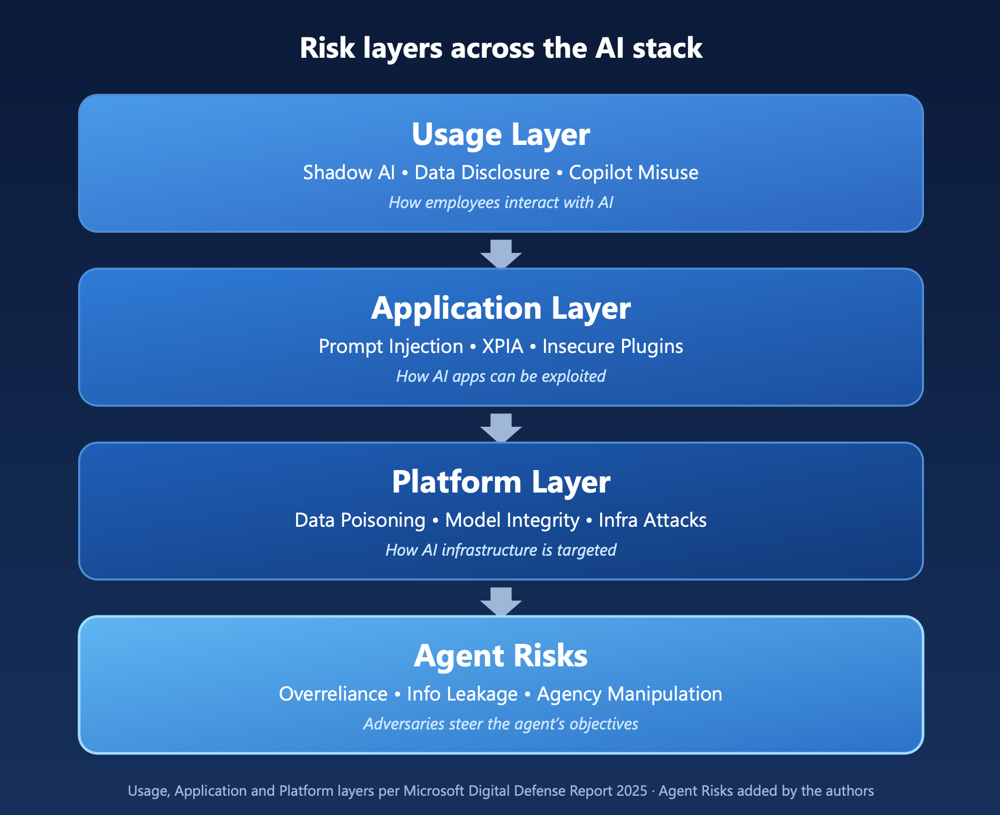</a></p>

The last one, agent risks, is not defined in the MDDR report, but we see it as an important piece of a puzzle when building detections and planning mitigations for AI agents.

In this Entra ID Attack and Defense Playbook Chapter, we will explore agent identities focusing on three stages of the AI-based attacks: pre-breach, initial access, and post-breach. The AI domain is wide and complex, and for that reason, this paper will be a living document that starts with the Entra ID foundation and dives deeper into AI agent-focused scenarios. The Chapter will be expanded with sub-chapters and additional scenarios in the later stages.

## AI Agent Attack Lifecycle: A Three-Phase Threat Model

This diagram maps the full adversary lifecycle targeting enterprise AI agents, using the MITRE ATT&CK (v16) and MITRE ATLAS (v4) frameworks. Unlike traditional identity-focused breach models, AI agents introduce a fundamentally different problem: they can be compromised through the data they process and not just through stolen credentials. This dual attack surface is the central insight that drives the three-phase structure.

Publicly available security frameworks are great (MITRE ATT&CK, OWASP Top 10 for LLM & AI, NVIDIA AI Attack Kill Chain, and more) to identify threats and evaluate risks for the AI domain. We wanted to share our view on it and create an additional one that focuses on AI Agents in the Microsoft domain.

### Phase 1 - Pre-Breach: Targeting the Agent Entity

Before any breach occurs, the adversary enumerates the agent landscape; discovering Entra Agent IDs, mapping tool integrations (MCP servers, plugins, connectors), profiling Graph API scopes, and identifying the humans who create and administer agents. They develop offensive tooling: prompt injection payloads, poisoned documents for indirect injection, and malicious MCP servers. 

They can also pursue classic credential vectors such as service principal key theft, OAuth consent phishing, and operator account compromise (T1078/T1078.004). The key ATLAS techniques at this stage are AML.T0095 (Search Open Websites/Domains) for agent reconnaissance and AML.T0017 (Develop Capabilities) for weaponization.

### Phase 2 - Initial Access: The Dual Attack Surface

This is the critical phase that the diagram deliberately isolates. AI agents can be breached through two independent vectors that demand different detection strategies. The identity-based vector (T1078/TA0001) follows traditional patterns such as brute-force, token replay, and compromised operators. These activities generate detectable signals in Entra ID sign-in Logs and may appear in Identity Protection detections. 

The AI-native vector (AML.T0051/AML.T0043) operates below the identity layer through direct and indirect prompt injection, tool/plugin poisoning, and RAG knowledge base corruption. The injection itself produces no sign-in or Identity Protection signal; it never touches the token pipeline, which is exactly what makes this vector a detection blind spot. What is observable is the downstream effect: once a first-party (1P) agent is hijacked, its subsequent token acquisitions and actions still surface in Entra ID sign-in Logs and Identity Protection. For these scenarios, we can rely on native detections from the Defender solution, modern detection capabilities (AI Agent protection), or build custom detections. 

### Phase 3 - Post-Breach: Living off the Agent's Tools (LOAT)

Once inside, the adversary leverages the agent's legitimate integrations to operate. Rather than deploying their own tooling, they abuse the agent's MCP servers, Graph API scopes, KQL query access, and business connectors, actions that look identical to normal agent operations. The kill chain cascades through Execution (TA0002), Persistence (TA0003), Privilege Escalation (TA0004), Defense Evasion (TA0005), Discovery (TA0007), Lateral Movement (TA0008), Collection & Exfiltration (TA0009–TA0010), and Impact (TA0040). Detection here relies on behavioral analytics and anomaly detection across the agent's activity baseline, not signature-based rules.

**Key Highlights from the diagram:**

- **Dual attack surface gap:** Traditional identity monitoring covers only the identity-based vector. The AI-native vector (prompt injection, memory poisoning) produces no sign-in, no Conditional Access evaluation, and no IdP signal at the moment of injection. It must be detected on a different plane (agent runtime + observability telemetry), not on the identity plane. 
- **LOAT concept:** Post-breach adversaries don't need to bring tools, they use the agent's existing integrations. Those tool calls are logged (CloudAppEvents / UAL log pipeline) and can be evaluated or blocked by real-time protection rules. What makes post-breach detections hard, is that most of the actions are legitimate in form.
- **AML.T0095 → T1078 pipeline:** Pre-breach reconnaissance of public agent endpoints and documentation feeds directly into credential acquisition for Valid Accounts — a direct ATT&CK-to-ATLAS attack chain.
- **Detection asymmetry:** Identity-based vectors have mature, well-understood detection (agent sign-in logs, Identity Protection for agents, Conditional Access, CAE, token binding). AI-native detection is newer but present: Defender XDR real-time protection evaluates MCP tool invocations and responses, Defender for Endpoint runtime protection covers local agents, Global Secure Access — Secure Web & AI Gateway enforces at the network, and Purview DSPM AI observability plus Insider Risk Management cover data-side risk. The remaining asymmetry is conditional availability, it depends on Agent 365 licensing and correct observability instrumentation, not on absence of telemetry.

<br>

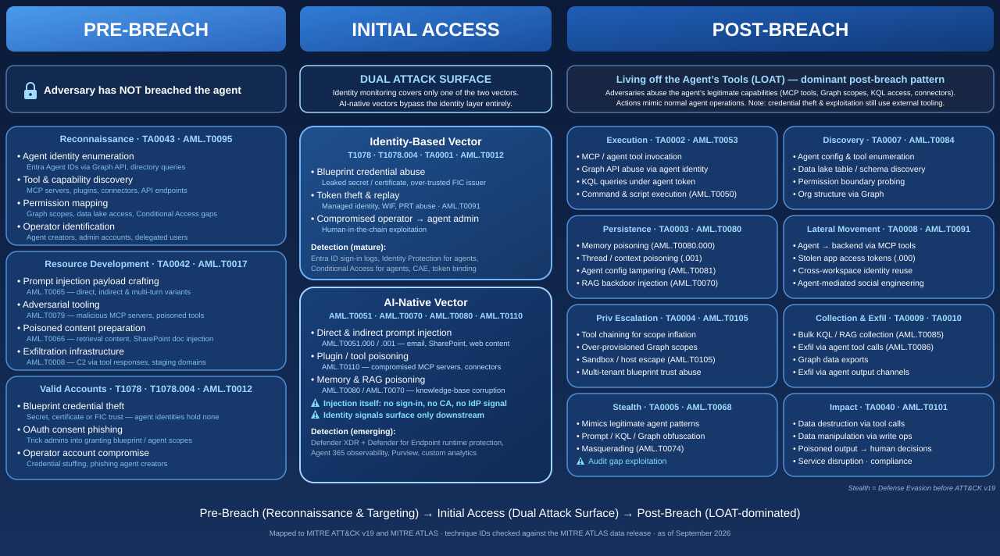

### References

- [ATLAS Matrix | MITRE ATLAS](https://atlas.mitre.org/matrices/ATLAS)
- [Agentic AI - OWASP Lists Threats and Mitigations](https://genai.owasp.org/resource/agentic-ai-threats-and-mitigations/)

## Agent Identities in Microsoft Entra

Entra ID provides core foundation capabilities for AI Agents that need the same protection mechanisms as user identities. In the table below, we have covered the five pillars from Entra that provide protection capabilities in the agent lifecycle.

| **Pillar**                                                  | **Entra capability**                                     | **What it does**                                                                                                                                                    |
| ----------------------------------------------------------- | -------------------------------------------------------- | ------------------------------------------------------------------------------------------------------------------------------------------------------------------- |
| Manage agent identities & lifecycle                         | Entra Agent ID / Agent identity platform                 | Gives each agent a first-class identity construct (not just a tool's service principal); supports OAuth 2.0, MCP, and A2A for auth and agent-to-agent communication |
| Govern who can create & manage agents                       | Entra ID Governance                                      | Prevents "agent sprawl"/shadow AI; ensures every agent has a human accountable for it                                                                               |
| Govern agent permissions                                    | Entra ID Governance — entitlement management             | Makes agent access intentional, auditable, time-bound                                                                                                               |
| Protect agent access to apps, tools, systems & other agents | Conditional Access for agents + ID Protection for agents | Zero Trust evaluation on every token acquisition by an agent identity or agent user                                                                                 |
| Protect agents from malicious / non-compliant traffic       | Global Secure Access — Secure Web & AI Gateway           | Applies network security policy to agent traffic the same way as user traffic                                                                                       |

You can dive into details on each of these by reading Microsoft Learn articles about Entra Agent ID and how Entra protects the agent workflows:

[What is Microsoft Entra Agent ID? - Microsoft Entra Agent ID | Microsoft Learn](https://learn.microsoft.com/en-us/entra/agent-id/what-is-microsoft-entra-agent-id)

[Microsoft Entra security for AI overview - Microsoft Entra Agent ID | Microsoft Learn](https://learn.microsoft.com/en-us/entra/agent-id/security-for-ai-overview)

## Microsoft Agent ID Foundation

### Authorization and permission model

The authorization model is built around four objects that work together, also across tenant boundaries, in the case of multi-tenant agents.

<a href="https://raw.githubusercontent.com/Cloud-Architekt/AzureAD-Attack-Defense/main/media/ai-agent-identities/AgentId_AuthZ_Authorization.png" target="_blank">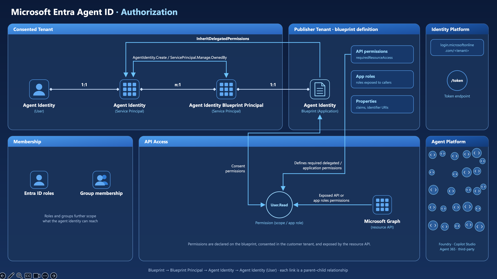</a>

#### Agent Identity Blueprint (Application)

The **blueprint** lives in the **Publisher Tenant** - the organization that builds the agent. Think of it less like a simple template and more like an architectural drawing: it defines app roles, verified publisher information, and the credential methods that every agent derived from it will share.

According to the [agent blueprint documentation](https://learn.microsoft.com/entra/agent-id/agent-blueprint), properties shared across all agent identities created from a blueprint include:

- **API Permissions (delegated and application)** — declared in the blueprint's `requiredResourceAccess` configuration, covering both permission types:
    - **Delegated permissions** (scopes) — used when the agent acts on behalf of a signed-in user via an OBO flow. The effective permission is the intersection of what the user is allowed to do and what the agent has been consented. These appear in the `scp` claim of the resulting token.
    - **Application permissions** (app roles) — used when the agent acts autonomously without any user context, as in the autonomous app flow. An administrator must explicitly consent to these. They appear in the `roles` claim of the token.
- **App Roles** — roles that can be assigned to users and other principals interacting with the agent
- **Authentication settings** - optional claims, token configuration, and identifier URIs

Blueprints hold the credentials (federated identity credentials, certificates / cryptographic keys, or client secrets) used for token acquisition. **Agent identities themselves hold no credentials** - the blueprint acquires tokens on their behalf. For production deployments, Microsoft recommends FIC with managed identities or client certificates rather than client secrets.

#### Agent Identity Blueprint Principal (Service Principal)

When a blueprint is added to a tenant, Microsoft Entra ID creates an **Agent Identity Blueprint Principal** - a service principal that acts as the blueprint's runtime representative inside that tenant.

This principal has two critical responsibilities, as described in [Agent identity blueprints – Agent identity blueprint principals](https://learn.microsoft.com/entra/agent-id/agent-blueprint#agent-identity-blueprint-principals):

- **Token issuance for blueprint operations** - when the blueprint is used to acquire tokens within a tenant, those tokens carry the blueprint principal's object ID (`oid` claim), making blueprint operations traceable to a specific directory object
- **Audit logging** - actions performed by the blueprint, such as creating agent identities and managing their lifecycle, are recorded as performed by the blueprint principal, providing accountability for blueprint-initiated operations

Importantly, the blueprint principal is what "adding a blueprint to a tenant" means. The Microsoft Entra admin-center wizard and the multi-tenant catalog add flow create it for you. When a blueprint is built via Microsoft Graph or PowerShell, the principal must be created explicitly with `POST /servicePrincipals/microsoft.graph.agentIdentityBlueprintPrincipal`; until then the blueprint has no principal, cannot be used to create agent identities, and is not listed in the Blueprint blade of the Entra admin center (see the Note in the [Limited visibility](#limited-visibility-of-inherited-agent-permissions-on-multi-tenant-blueprints-initial-access) section). Adding the blueprint is the conscious consent gate: a customer administrator must add (and consent to) the blueprint, and removing it is done by deleting the blueprint principal.

#### Agent Identity (Service Principal)

The **agent identity** is the individual AI agent's identity - a single-tenant service principal with a new "agent" subtype. This is the object that holds permissions, appears in sign-in logs, and that administrators reason about when governing access.

Unlike standard service principals, agent identities operate through an **impersonation model**: the blueprint acquires tokens on their behalf, so the agent identity appears as the client in every token and audit event, even though the blueprint performed the actual token exchange. The blueprint holds credentials; the agent identity holds permissions, and the audit trail.

A single blueprint can produce many agent identities - the one-to-many relationship shown in the authorization diagram reflects a real fleet: dozens or hundreds of agents, each with its own auditable identity, all sharing a common authentication foundation.

**Permissions: how they flow from blueprint to agent identity**

**`AgentIdentity.CreateAsManager` and `ServicePrincipal.Manage.OwnedBy`**

The diagram annotates two application (app-only) permissions on the relationship between the blueprint principal and the agent identity service principals. These are permissions **granted to the blueprint principal**, which obtains app-only tokens for these Microsoft Graph calls - they define what it is allowed to do inside the tenant:

- **`AgentIdentity.CreateAsManager`** — Authorizes the blueprint principal to create agent identities as the parent agent identity blueprint and fully manage them, including reading, updating, and deleting, without a signed-in user.
- **`ServicePrincipal.Manage.OwnedBy`** — Scopes management rights to only the service principals that the blueprint principal itself created. The blueprint principal can update or delete its own agent identities, but cannot touch any other service principal in the tenant. This is a deliberate security boundary.

Together, these two permissions define a least-privilege management envelope: the blueprint principal can create and manage its children, and nothing else.

**Inheritable permissions**

`InheritDelegatedPermissions` Is the flow shown in the diagram from the blueprint principal down to the agent identity service principals. Rather than a simple toggle, it is a two-condition model, as described in the [inheritable permissions documentation](https://learn.microsoft.com/entra/agent-id/concept-inheritable-permissions): the resource app must be listed as inheritable on the blueprint, *and* an administrator must actively consent to the permission on the blueprint principal. A declaration alone grants nothing.

Per resource app, two patterns are available — and delegated scopes and application roles can be set independently:

| Pattern         | Behaviour                                                                                        |
| --------------- | ------------------------------------------------------------------------------------------------ |
| **All allowed** | All granted scopes or roles flow automatically to every agent identity, including future grants. |
| **None**        | No scopes or roles for that resource app are inherited; direct assignment is required.           |

Inherited permissions are not visible as explicit grants on agent identities in the admin center or via Graph API — they only surface at runtime in the token's `scp` or `roles` claims (decode tokens with [https://jwt.ms](https://jwt.ms) or an offline decoder; never paste production tokens into third-party web tools). Blueprint-level inheritance sets the baseline permissions; direct grants on individual agent identities handle differentiated access above it.

**Static vs. Dynamic Consent**

An agent identity blueprint declares two separate, non-authorizing configurations: [required resource access](https://learn.microsoft.com/en-us/entra/agent-id/concept-inheritable-permissions#required-resource-access) (the up-front permission list admins review) and [inheritable permissions](https://learn.microsoft.com/en-us/entra/agent-id/concept-inheritable-permissions#inheritable-permissions) (which resource apps are allowed to flow down to every agent identity once granted on the [blueprint principal](https://learn.microsoft.com/en-us/entra/agent-id/agent-blueprint#agent-identity-blueprint-principals)). Neither list grants access on its own — only admin consent does.

The catch, per Microsoft's own [cheat sheet](https://learn.microsoft.com/en-us/entra/agent-id/concept-inheritable-permissions#permission-configuration-cheat-sheet), is that these two lists are independent: a scope can be **inheritable without ever being in the required resource access list**. If an admin dynamically consents to such a scope on the blueprint principal, it's inherited by every current and future agent identity — but stays invisible in the up-front review, since that only reflects required resource access. Static consent doesn't have this gap (an undeclared-but-inheritable scope simply isn't inherited); dynamic consent is what turns it on.

Because of this, [Microsoft states directly](https://learn.microsoft.com/en-us/entra/agent-id/concept-inheritable-permissions#declaration-grant-and-inheritance) that inherited permissions "aren't visible as permissions on agent identities in the Microsoft Entra admin center or through Microsoft Graph. They're only observable in the token contents at runtime" — as the `scp` claim for delegated scopes or the `roles` claim for application roles. The grants themselves remain visible on the **blueprint principal** (Enterprise applications → Permissions, or `oauth2PermissionGrants` / `appRoleAssignments` via Graph); what cannot be seen on the agent identity is which of those grants apply to it. Decoding the token an agent identity acquires is the only reliable way to confirm what it actually got.

One more asymmetry: a grant on the **blueprint principal** inherits to every agent identity from that blueprint, while consent granted directly on a **single agent identity** applies only to that one — the two are easy to conflate but behave very differently.

For the full mechanics — the two conditions for inheritance, the complete static-vs-dynamic comparison tables, and configuration guidance — see the source article linked below; this summary intentionally leaves out the finer edge cases it covers.

**Restriction of API Permissions**

Microsoft Entra Agent ID addresses this by enforcing **least privilege by design**. Certain high-privilege Microsoft Graph permissions — such as `Application.ReadWrite.All`, `User.ReadWrite.All`, and `RoleManagement.ReadWrite.All` — are explicitly blocked for all agent identities, and even a Global Administrator cannot override these restrictions. For the full authorization model, see [Authorization in Microsoft Entra Agent ID](https://learn.microsoft.com/entra/agent-id/authorization-agent-id).

#### Agent's User Account (User)

The **agent's user account** is an optional, specialized user object that pairs 1:1 with an agent identity. It exists for a specific purpose: some systems and APIs only accept user identities — not service principals. A mailbox, a Teams presence, an HR record — these require a user object. The agent's user account fills that gap.

As described in the [agent's user account documentation](https://learn.microsoft.com/entra/agent-id/agent-users), this object receives tokens with `idtyp=user`, allowing it to reach APIs and services that specifically require a user identity, while still operating under the security constraints of a non-human identity:

- **No passwords or passkeys** — the only credential it supports is an indirect reference to its parent agent identity. Authentication flows through the blueprint's FIC credentials, then the agent identity, then the user account.
- **No *privileged* administrator roles** — the agent's user account cannot be assigned high-privilege admin roles, preventing privilege escalation. Custom roles and role-assignable groups are not available either. Non-privileged directory roles, group memberships (except role-assignable groups), and licenses can be assigned normally, and the account can be added to administrative units like any other user.
- **Immutable parent relationship** — once linked to an agent identity at creation, that 1:1 relationship cannot be changed.

The agent's user account is not created automatically and is not always needed. It should only be provisioned when the agent genuinely requires user-object access — for example, to send email from its own mailbox, participate in Teams as a team member, or integrate with HR systems. For full Microsoft 365 participation (mailbox, Teams presence), creation via the [Microsoft 365 Agents SDK](https://learn.microsoft.com/microsoft-365/agents-sdk/) is recommended over the Graph API alone.

The complete identity chain is therefore: **Blueprint → Blueprint Principal → Agent Identity → Agent's User Account**, where each link is a parent-child relationship and each step is provisioned explicitly.

#### The authorization flow in brief

1. The **blueprint** (Publisher Tenant) defines required permissions and holds credentials.
2. A customer administrator adds the blueprint to their tenant, creating a **blueprint principal** (Consented Tenant) — the consent gate.
3. The blueprint principal, holding `AgentIdentity.CreateAsManager` and `ServicePrincipal.Manage.OwnedBy` application (app-only) permissions, provisions **agent identities,** and manages their lifecycle.
4. Optionally, an **agent's user account** is created and linked 1:1 to an agent identity for scenarios that require a user object (e.g., mailbox, Teams, HR systems).
5. When an agent operates, the blueprint acquires a token from the **Microsoft Identity Platform** (`/token` endpoint) on behalf of the agent identity (or its user account, for user-context scenarios).
6. The resulting token carries the agent identity's `oid` — The agent appears as the client in **Microsoft Graph** calls and all audit logs.
7. Membership in Entra ID roles and security groups further controls what resources the agent can access.

### Authentication Autonomous App Flow

The following diagram shows what happens at runtime when an agent acts without a signed-in user. Where the first diagram explained *what the objects are and how they relate to one another*, this one shows *how tokens move between them*. The object model and relationships are the same; only the token flow is new here.

<a href="https://raw.githubusercontent.com/Cloud-Architekt/AzureAD-Attack-Defense/main/media/ai-agent-identities/AgentId_AuthN_AutonomousAppFlow.png" target="_blank">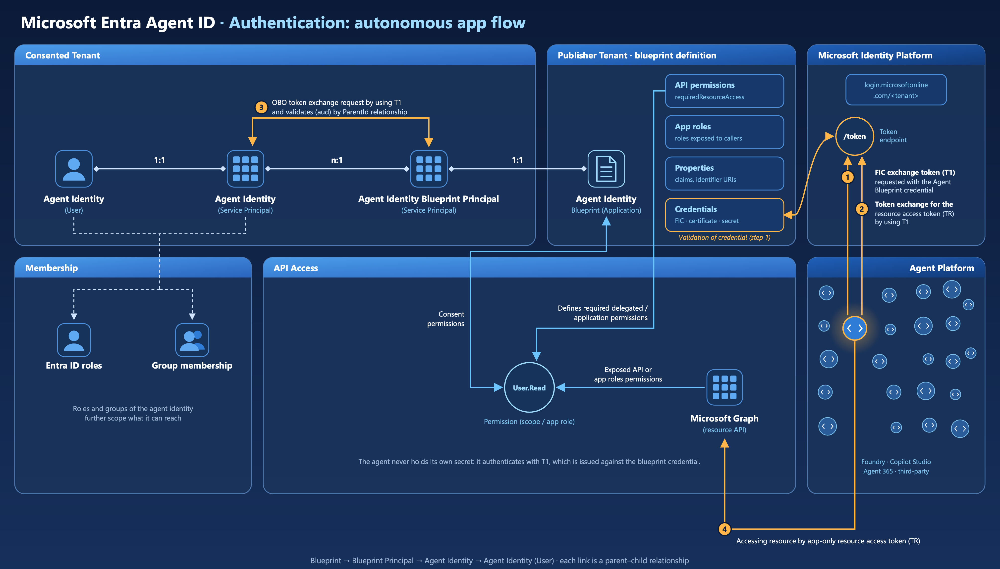</a>

The diagram introduces **Credentials** explicitly in the Publisher Tenant, connecting the Agent Identity Blueprint to the `/token` endpoint. It also numbers four runtime steps, annotated directly on the diagram. The `AgentIdentity (User)` and `AgentIdentity (Service Principal)` objects in the Consented Tenant now show inbound arrows from the token flow, making it clear which object receives the final resource access token and which the user account impersonation targets.

Step 3 in the diagram is labeled: *"OBO token exchange requests by using T1 and validates (aud) by ParentId relationship"* — this is the critical validation step where Microsoft Entra ID verifies the token chain before issuing a resource token. Note that despite the "OBO" label on the diagram, this is an **app-only token exchange**: both requests use `grant_type=client_credentials`, no user is involved, and Microsoft's OAuth 2.0 on-behalf-of flow (which requires a user assertion and `requested_token_use=on_behalf_of`) is a different, delegated protocol that is not used here.

#### The four-step autonomous flow

The [autonomous app OAuth flow documentation](https://learn.microsoft.com/entra/agent-id/agent-autonomous-app-oauth-flow) provides detailed instructions. The diagram maps to these steps:

**Step 1 — FIC Exchange Token (T1) Request** The Agent Identity Blueprint presents its credential to the `/token` endpoint. In the recommended production pattern this is a Federated Identity Credential (FIC) backed by a managed identity — not a client secret. The request includes an `fmi_path` parameter set to the client ID of the specific agent identity being impersonated, telling Microsoft Entra ID exactly which child identity the blueprint is acting on behalf of. Microsoft Entra ID returns **T1**, an intermediate exchange token.

**Step 2 — Token Exchange Request for resource access token (TR)** The Agent Identity (Service Principal) now presents T1 as its `client_assertion` in a second request to the `/token` endpoint, this time scoped to the actual downstream resource (e.g. `https://graph.microsoft.com/.default`). This is the step where the agent identity — not the blueprint — becomes the client in the request.

**Step 3 — Validation by ParentId relationship** Before issuing the resource token, Microsoft Entra ID validates the token chain: `T1 (aud) == Agent Identity parent app == Agent Identity Blueprint`. This is the ParentId relationship working as a security enforcement point. The blueprint can only produce tokens for agent identities it owns; a T1 issued for one blueprint cannot be used to impersonate an agent identity belonging to a different blueprint. This is the app-only token exchange validation that the diagram labels as "OBO".

**Step 4 — Resource access using TR** The Agent Identity (Service Principal) calls Microsoft Graph (or any other protected resource) using the app-only resource access token TR. From the resource's perspective, the caller is the agent identity — its `oid` appears in the token, ensuring full auditability.

**The token chain at a glance**

| Token  | Issued to                          | Used for                                                                        |
| ------ | ---------------------------------- | ------------------------------------------------------------------------------- |
| **T1** | Agent Identity Blueprint           | Impersonating a specific agent identity; scoped to `api://AzureADTokenExchange` |
| **TR** | Agent Identity (Service Principal) | Accessing the downstream resource (e.g. Microsoft Graph)                        |

### Single-tenant vs. multi-tenant blueprints

A single-tenant blueprint is created in and used within the **same tenant**. The publisher and the consumer are the same organization. This is the right model for internal tooling - an enterprise building its own agents for internal use, where there's no need to distribute the blueprint externally.

**Multi-tenant blueprints**

A multi-tenant blueprint is created in the **Publisher Tenant** but is designed to be added to **customer (Consented) tenants** via Microsoft catalogs. When a customer adds the blueprint to their tenant, Microsoft Entra creates a blueprint principal in that customer's directory — the consent and provisioning step that gates deployment.

As the [blueprint documentation](https://learn.microsoft.com/entra/agent-id/agent-blueprint#agent-identity-blueprint-principals) explains:

> An agent identity blueprint principal is always created when a blueprint is added to a tenant. Customers can remove a blueprint from their tenant by deleting the agent identity blueprint principal.
> 

This is the ISV or platform publisher scenario: a company like Contoso publishes an agent blueprint via a Microsoft catalog, and customer organizations add it to their own tenant, consent to the required permissions, and then create agent identities from it — all within their own governance boundary.

**A key nuance:** while blueprints can be multi-tenant, the agent identities they create are **always single-tenant**. As stated in the [agent identities documentation](https://learn.microsoft.com/entra/agent-id/agent-identities#authorizing-agent-identities):

> Agent identities can only be issued tokens in the Microsoft Entra tenant where they're created. They can't access resources or APIs in other tenants.
> 

The table below summarizes the key differences:

|                              | Single-tenant Blueprint | Multi-tenant Blueprint              |
| ---------------------------- | ----------------------- | ----------------------------------- |
| **Publisher and consumer**   | Same organization       | Different organizations             |
| **Blueprint location**       | Publisher Tenant only   | Publisher Tenant                    |
| **Where agents are created** | Publisher Tenant        | Each customer's Consented Tenant    |
| **Agent identity scope**     | Single-tenant           | Single-tenant (per customer tenant) |
| **Typical use case**         | Internal tooling        | ISV / platform distribution         |

# Attack scenarios

As shown above, there are many attack vectors and angles in the AI agent domain. We are not covering all the possible scenarios in this paper, but rather highlighting some of the scenarios we have researched during the last few months. In the attack scenarios, we are focusing on the foundation, Agent identities, where an enhanced security posture builds a strong core for the AI solutions. 

## Privileges to gain control of Agent Identity objects and permissions (Privilege Escalation)

### Entra ID Roles to manage Agent ID objects

Microsoft Entra ID introduces "Agent ID" as a first-class identity type to represent autonomous AI agents alongside users and service principals. Managing these objects (creating, updating, deleting, and assigning permissions) currently relies entirely on built-in Entra ID directory roles, since custom roles do not yet support Agent-specific role actions. This means organizations must grant broad, built-in administrative roles to manage agent identities, rather than scoping access narrowly with custom roles. Understanding which built-in roles carry Agent ID management permissions is therefore essential for applying least-privilege access until custom role support is available.

Additionally, agent identities, agent identity blueprints, and blueprint principals cannot currently be assigned to (Restricted Management) Administrative Units, so scoping management permissions for these objects via Administrative Units is not possible. Built-in roles that grant Agent ID management permissions can only be assigned at directory scope, further reinforcing the need for careful role assignment given the lack of narrower scoping options. The exception is the agent's user account, which can be added to administrative units like any other user.

**Built-in Entra ID directory roles for managing Agent ID objects**

[**Agent ID Administrator**](https://learn.microsoft.com/en-us/entra/identity/role-based-access-control/permissions-reference#agent-id-administrator) is the role purpose-built for managing Agent ID objects. It is a privileged role and grants the full lifecycle management of agent identities, agent identity blueprints, agent identity blueprint principals, and agent users, including:

- Create, update, enable/disable, and delete agent identities, blueprints, and blueprint principals
- Permanently delete and restore soft-deleted agent objects
- Assign licenses, invalidate refresh tokens, and revoke sign-in sessions for agent users
- Read audit logs and sign-in reports, and manage Azure/Microsoft 365 support tickets and service health

[**AI Administrator**](https://learn.microsoft.com/en-us/entra/identity/role-based-access-control/permissions-reference#ai-administrator) is also a privileged role, primarily scoped to Microsoft 365 Copilot and AI-related enterprise services. According to Microsoft's documentation, it has been granted the agent-object permissions of Agent ID Administrator — full lifecycle management of agent identities, agent identity blueprints, agent identity blueprint principals, and agent users, including restoration of deleted items — plus additional actions such as `agentIdentityBlueprints/verification/update` and `allProperties/read` on agent identities and blueprint principals. This makes AI Administrator a superset of Agent ID Administrator with respect to Agent ID object management, in addition to its Copilot/AI administrative scope.

**Consent-related permissions**

Of the two roles, only AI Administrator can manage **admin consent request policies** (via the `microsoft.directory/adminConsentRequestPolicy/allProperties/allTasks` action) — this is the workflow that lets end users ask an admin to approve app permissions on their behalf. Agent ID Administrator does not have this action at all. Even so, managing the *request* workflow is not the same as actually granting consent. That stronger ability belongs to [Application Administrator](https://learn.microsoft.com/en-us/entra/identity/role-based-access-control/permissions-reference#application-administrator), which holds the `microsoft.directory/servicePrincipals/managePermissionGrantsForAll.microsoft-application-admin` action — letting it directly **approve (consent to)** delegated and application permissions on behalf of users, except for **application permissions** for Microsoft Graph and Azure AD Graph (Graph delegated permissions can still be consented).
This is documented on [Microsoft Learn](https://learn.microsoft.com/en-us/entra/identity/enterprise-apps/grant-admin-consent?pivots=portal#prerequisites), but it isn't visible in the role definition in the portal/API, and not even in the role description on Microsoft Learn.

> **Risk note:** The `managePermissionGrantsForAll.microsoft-application-admin` action is high-risk precisely because that carve-out only covers Microsoft Graph and Azure AD Graph *application* permissions. It still permits granting consent to Graph delegated permissions and to **any other API's** application and delegated permissions — including third-party or Microsoft first-party APIs outside Graph. A notable example is Microsoft Defender for Endpoint (WindowsDefenderATP), whose application permissions include highly sensitive scopes such as `Machine.LiveResponse` ("Run live response" — the permission behind the Live Response API), which lets a caller execute commands, scripts, and file operations on onboarded devices. An Application Administrator or Cloud Application Administrator (which hold the same action), or a Global Administrator / Privileged Role Administrator (which hold the broader `managePermissionGrantsForAll.microsoft-company-admin` action covering any permission), could therefore consent to grant a service principal the `Machine.LiveResponse` permission without further approval, effectively enabling remote code execution capability across managed endpoints. This makes the permission a prime candidate for privilege-escalation paths and a key reason to treat Application Administrator (and any role with `managePermissionGrantsForAll`) as highly privileged, even though it cannot directly manage Agent ID objects.
> 

**References:**

- [Microsoft Entra built-in roles reference](https://learn.microsoft.com/en-us/entra/identity/role-based-access-control/permissions-reference)
- [Agent ID Administrator](https://learn.microsoft.com/en-us/entra/identity/role-based-access-control/permissions-reference#agent-id-administrator)
- [AI Administrator](https://learn.microsoft.com/en-us/entra/identity/role-based-access-control/permissions-reference#ai-administrator)
- [Application Administrator](https://learn.microsoft.com/en-us/entra/identity/role-based-access-control/permissions-reference#application-administrator)

### Risk of (default) ownership of Agent ID objects (Persistence)

If you want to delegate the privilege to create Agent Blueprints the least privilege is “Agent ID Developer” which includes the Role Action `microsoft.directory/agentIdentityBlueprints/createAsOwner`. However this gives the creator some persistent permission to manage object(s).

By default, the Portal UI set the ownership for Agent blueprints, Agent blueprint principal and Agent Identity to the creator. This gives the individual user permanently full control of the related Entra Object. For example, when an eligible/active Agent ID or AI Administrator has created the object, it has also outside of the assigned directory role or PIM assignment the permissions, for example to add credentials or adding other user as owner of the objects. This should also be avoided to prevent permanent permissions to create/modify all other child agent objects.

<a href="https://raw.githubusercontent.com/Cloud-Architekt/AzureAD-Attack-Defense/main/media/ai-agent-identities/image3.png" target="_blank">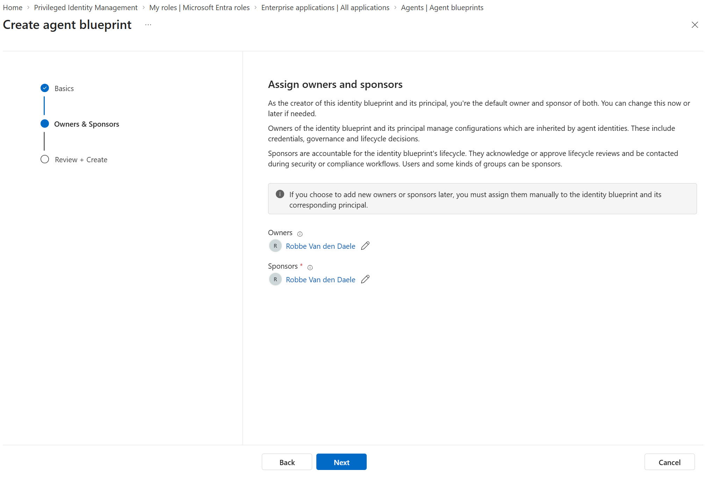</a>

By default, any member of the tenant has the permission to create Agent Identities if they owned the Blueprint Principals or create Agent Blueprint Principals if they are owner of the Agent Blueprint. You’ll find the Role Actions [`microsoft.directory/agentIdentities/createAsOwner`](http://microsoft.directory/agentIdentities/createAsOwner) and [`microsoft.directory/agentIdentityBlueprintPrincipals/createAsOwner`](http://microsoft.directory/agentIdentityBlueprintPrincipals/createAsOwner) as part of the “User” role definition. This is also documented in the [default member permissions in Microsoft Learn](https://learn.microsoft.com/en-us/entra/fundamentals/users-default-permissions#compare-member-and-guest-default-permissions). 

### Design blocking of high privileged permissions

Microsoft natively blocks a set of highly privileged permissions from being granted to Agent ID, and states that this allow/block list will continue to evolve over time - the following reflects the situation at the time of writing.

The blocked permissions can be thought of as a guardrail against identity escalation and tenant takeover. On the Microsoft Entra role side, agents can't be assigned Global Administrator, Privileged Role Administrator, or User Administrator; custom roles can't be assigned to agents at all, and agents can't be members of role-assignable groups (as documented on [Microsoft Learn](https://learn.microsoft.com/en-us/entra/agent-id/authorization-agent-id#microsoft-entra-role-assignments-for-agent-identities)) On the Microsoft Graph permission side, agents are blocked from `Application.ReadWrite.All` (manage all app registrations), `RoleManagement.ReadWrite.All` (full control over users, groups, roles, and directory settings), `User.ReadWrite.All` (full control of all user accounts), and `Directory.AccessAsUser.All` (broad directory write access as the signed-in user) — the last of which can't be granted even with explicit admin consent.

What *is* allowed is broader than that carve-out suggests: powerful workload-admin roles (Exchange, SharePoint, Teams, Purview/Compliance, Power Platform) and tenant-wide read permissions can still be assigned to Agent ID.

The full, current list of allowed and blocked permissions is documented in [Authorization in Microsoft Entra Agent ID | Microsoft Learn](https://learn.microsoft.com/en-us/entra/agent-id/authorization-agent-id).

**Why "not privileged" doesn't mean "safe to assign to an agent"**

Microsoft's high-privileged label mostly covers roles with a direct path to full tenant compromise, such as Global Administrator. It doesn't reflect actions that could still have a high impact on your security posture, or that can modify sensitive objects such as security groups — so it's not a reliable signal for whether a role is safe to hand to an Agent Identity. This includes especially the following roles:

- **AI Administrator** grants full lifecycle actions on agent objects, such as `microsoft.directory/agentIdentities/create`, `microsoft.directory/agentIdentities/delete`, `microsoft.directory/agentIdentityBlueprints/credentials/update`, and owner updates on agent objects. An agent holding this role could create *new* agent identities, take ownership of existing ones, or add credentials to the blueprint that authenticates every agent in the fleet. Creating an agent identity does not by itself grant it API consent or Entra roles — that still requires a consent or role-assignment actor (for example an Application Administrator for API consent) — but combined with an over-permissive existing grant or an already privileged blueprint, this is a stepping stone across the agent fleet.
- **Cloud App Security Administrator** holds `microsoft.directory/cloudAppSecurity/allProperties/allTasks`, full control of Defender for Cloud Apps policy. An agent with this action could silently disable or loosen the CASB policy that would otherwise flag its own anomalous downloads or data exfiltration — it's the same action a human Cloud App Security Administrator would use, but there's no legitimate reason an autonomous agent needs to *change* that policy rather than just be *subject* to it.
- **Compliance Data Administrator** carries the exact same `cloudAppSecurity/allProperties/allTasks` action, even though the role's stated purpose is only to *view* compliance data in the Purview, Exchange, and Teams admin centers. A reporting-only workload never needs write access to CASB policy, so this single action is disproportionate to the role's intended use and should disqualify it for agent assignment.
- **Windows 365 Administrator** combines full device-object lifecycle actions (`microsoft.directory/devices/create`, `.../devices/delete`, `.../devices/registeredOwners/update`) with full security-group lifecycle and membership actions (`microsoft.directory/groups.security/create`, `.../groups.security/members/update`, `.../groups.security/owners/update`). An agent with this role could register a rogue device object *and* add it (or another principal) to a security group that's used elsewhere to grant Conditional Access exemptions or app-role assignments — a two-step path from "manage Cloud PCs" to broader directory access.

> **Tip:** [EntraOps](https://github.com/Cloud-Architekt/AzurePrivilegedIAM) helps identify privileged access of Agent identities across the various RBAC systems in the Microsoft Cloud — including Entra ID directory roles, API permissions, and many others.

### Backdoor of credentials to Agent Identity and Agent User objects (Persistence - blocked)

We tested adding credentials of every type - client secret, federated credentials, and certificate - to both the Agent Identity and the Agent User, and all attempts were blocked by Microsoft. This aligns with Microsoft's own documentation, which states that adding credentials to these object types is not permitted and will be blocked. Screenshots below:

<a href="https://raw.githubusercontent.com/Cloud-Architekt/AzureAD-Attack-Defense/main/media/ai-agent-identities/image4.png" target="_blank">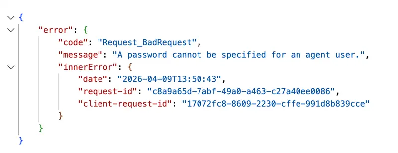</a>

<a href="https://raw.githubusercontent.com/Cloud-Architekt/AzureAD-Attack-Defense/main/media/ai-agent-identities/image5.png" target="_blank">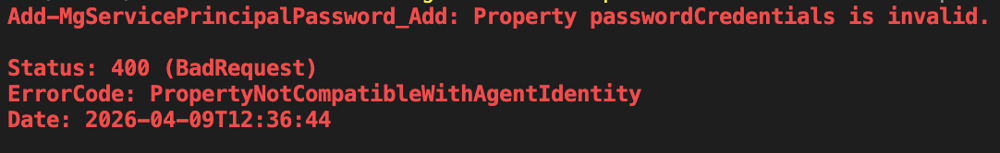</a>

### Limited visibility of inherited agent permissions on multi-tenant blueprints (Initial Access)

**Visibility of inherited permissions.** In our tests with a third-party multi-tenant blueprint, every permission consented in the consuming tenant — whether declared up front in `requiredResourceAccess` or requested dynamically at runtime — was recorded on the blueprint principal and enumerable via the Entra admin center (Enterprise applications → Permissions) and Microsoft Graph (`oauth2PermissionGrants`, `appRoleAssignments`). Dynamic consent does not hide a grant; it only means the permission was not declared in `requiredResourceAccess` and is first seen by the administrator in the consent prompt itself. What the consuming tenant *cannot* see is (1) the blueprint's `inheritablePermissions` configuration, which lives on the application object in the publishing tenant and determines whether a grant fans out to all current and future agent identities, and (2) the effective permissions on each agent identity, which are merged only at token issuance and surface solely in the `scp` / `roles` claims (see Microsoft: [Configure inheritable permissions on blueprints](https://learn.microsoft.com/en-us/entra/agent-id/configure-inheritable-permissions-blueprints) and [Inheritable permissions](https://learn.microsoft.com/en-us/entra/agent-id/concept-inheritable-permissions)). An administrator therefore sees which permissions were granted, but not which of them are inherited by which agent identity.

**Observation (first-party):** For Microsoft Security Copilot agents we observed no permissions on the blueprint principal beyond those needed for agent lifecycle management. We were unable to reproduce this with our own multi-tenant blueprint. We assume this is a first-party pre-authorization behavior rather than a property of the Agent ID model and have raised it with Microsoft; it should not be assumed for third-party blueprints.

**Our concern:** Inheritance and dynamic consent combine into a supply-chain risk that is amplified in multi-tenant scenarios. A blueprint used across tenants becomes a *third-party blueprint* in each consuming tenant, and the blueprint remains the single source of authentication for all of its associated identities regardless of the tenant they reside in. A publisher can onboard with a minimal declaration, configure `allAllowed` inheritance for a resource app, and later have the agent dynamically request a scope that was never declared up front — Microsoft's own [cheat sheet](https://learn.microsoft.com/en-us/entra/agent-id/concept-inheritable-permissions#permission-configuration-cheat-sheet) marks this case as "inherited: yes, visible to admins up front: no". The administrator is asked to consent for *one* principal without being able to see that the grant will apply to *every* current and future agent identity from that blueprint. Expansion still requires a consent action in the consuming tenant — it is not a silent bypass — but the grant is not attributable to specific agents afterwards, and the publisher holds the only credential for all of them. A compromised or malicious publisher therefore inherits the full set of consented access across every consuming tenant: an increased "blast radius" comparable in shape to cross-tenant incidents such as Midnight Blizzard, as Katie Knowles has spotlighted in her blog post. This limits the ability of a consuming tenant to assess and govern the risk it is accepting when instantiating agents from an external blueprint.

These concerns closely align with the excellent research published by Katie Knowles of Datadog Security Labs, "Entra Agent ID: The blueprint blast radius" (June 11, 2026), which details the inheritable-permissions model, the invisibility of inherited delegated scopes on agent identities, and the multi-tenant blast radius of third-party blueprints. Original source: [https://securitylabs.datadoghq.com/articles/agent-id-blueprint-blast-radius/](https://securitylabs.datadoghq.com/articles/agent-id-blueprint-blast-radius/)

**Mitigations and detections:** Admin consent workflow and permission grant policies apply to blueprint principals like any other service principal, so restrict who can consent on them. Alert on `AuditLogs` operations "Consent to application" and "Add app role assignment to service principal" where the target is a blueprint principal — every expansion is observable at that point. Treat every grant on a third-party blueprint principal as potentially inherited by all of its agent identities, since the inheritance configuration cannot be verified locally.

> **Note:** During our tests, we recognized that if a blueprint object has only been created and has no blueprint principal, the object is not visible in the Blueprint blade of the Microsoft Entra portal. Make sure to monitor blueprint objects specifically.

## Mapping to MITRE ATT&CK Framework

MITRE ATT&CK framework is commonly used for mapping Tactics, Techniques, and Procedures (TTPs) for adversary actions and emulating defenses on organizations around the world.

MITRE ATLAS (Adversarial Threat Landscape for Artificial-Intelligence Systems) is the companion knowledge base for adversary tactics and techniques against AI-enabled systems. It follows the ATT&CK structure and adds AI-specific techniques such as prompt injection, model and agent manipulation, and AI supply-chain compromise. Because the scenarios in this chapter span both classic identity abuse and agent-specific abuse, we map them to both frameworks.

### Tactics, Techniques & Procedures (TTPs) of the named attack scenarios

The figure below shows TTPs used in this scenario in the MITRE ATT&CK framework.

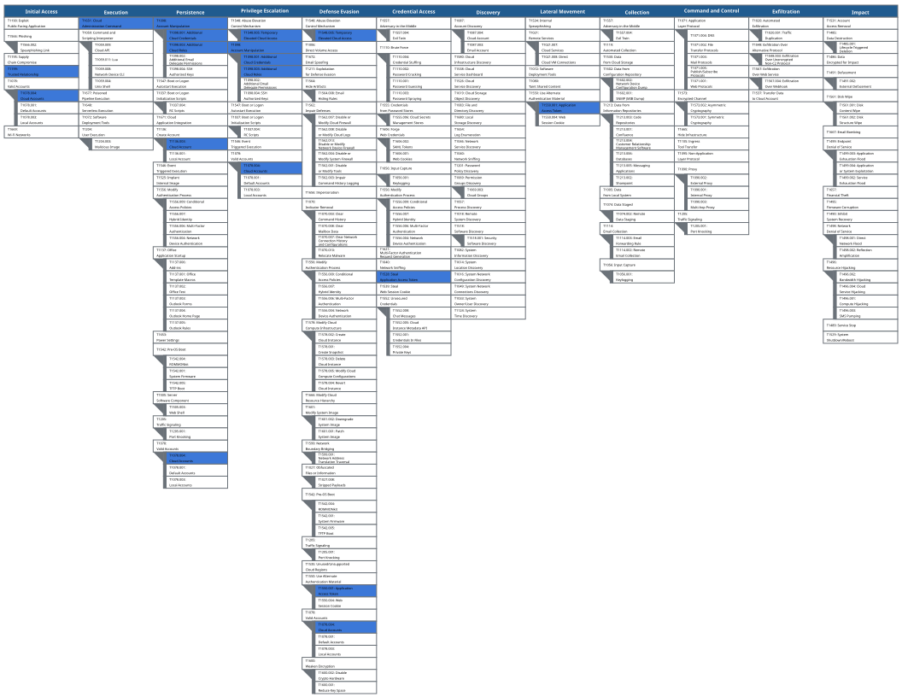

<a style="font-style:italic" href="https://mitre-attack.github.io/attack-navigator/#layerURL=https%3A%2F%2Fraw.githubusercontent.com%2FCloud-Architekt%2FAzureAD-Attack-Defense%2Fmain%2Fmedia%2Fmitre%2FAttackScenarios%2FEIDAgents-Mitre.json&tabs=false&selecting_techniques=false" target="_blank" rel="noopener">Open in MITRE ATT&CK Navigator</a>

<br>

### All Tactics, Techniques & Procedures (TTPs) - Enterprise Matrix

| **Attack Scenario**                                                              | **Tactic**                            | **ATT&CK Technique**                                                                                                           | **ATLAS Technique**                                                                                                               | **Description**                                                                                                                                                                                                                                                                                                                                    |
| -------------------------------------------------------------------------------- | ------------------------------------- | ------------------------------------------------------------------------------------------------------------------------------ | --------------------------------------------------------------------------------------------------------------------------------- | -------------------------------------------------------------------------------------------------------------------------------------------------------------------------------------------------------------------------------------------------------------------------------------------------------------------------------------------------- |
| **Privileges to gain control of Agent ID objects**                               | Initial Access / Privilege Escalation | Valid Accounts: Cloud Accounts [T1078.004](https://attack.mitre.org/techniques/T1078/004/)                                     | Valid Accounts [AML.T0012](https://atlas.mitre.org/techniques/AML.T0012)                                                          | Compromise of an account holding a role with Agent ID lifecycle actions grants full control over every agent identity, blueprint, blueprint principal and agent user in the tenant. The absence of AU scoping means there is no blast-radius reduction available.                                                                                  |
|                                                                                  | Privilege Escalation                  | Abuse Elevation Control Mechanism: Temporary Elevated Cloud Access [T1548.005](https://attack.mitre.org/techniques/T1548/005/) | —                                                                                                                                 | Activation of an eligible PIM assignment for Agent ID Administrator or AI Administrator to obtain agent-object management actions on demand.                                                                                                                                                                                                       |
|                                                                                  | Persistence / Privilege Escalation    | Account Manipulation: Additional Cloud Roles [T1098.003](https://attack.mitre.org/techniques/T1098/003/)                       | —                                                                                                                                 | Application Administrator holds `microsoft.directory/servicePrincipals/managePermissionGrantsForAll.microsoft-application-admin`, permitting admin consent to application and delegated permissions for any API, except application permissions for Microsoft Graph and Azure AD Graph.                                                            |
|                                                                                  | Execution                             | Cloud Administration Command [T1651](https://attack.mitre.org/techniques/T1651/)                                               | —                                                                                                                                 | Consent to `Machine.LiveResponse` (WindowsDefenderATP) enables command, script and file operations against onboarded devices through the Live Response API — cloud-brokered code execution on managed endpoints.                                                                                                                                   |
|                                                                                  | Lateral Movement                      | Use Alternate Authentication Material: Application Access Token [T1550.001](https://attack.mitre.org/techniques/T1550/001/)    | Use Alternate Authentication Material: Application Access Token [AML.T0091.000](https://atlas.mitre.org/techniques/AML.T0091.000) | The app-only token issued after consent is used against the downstream resource; the agent identity `oid` is the caller, so activity blends into legitimate agent traffic.                                                                                                                                                                         |
| **Risk of (default) ownership of Agent ID objects**                              | Persistence                           | Create Account: Cloud Account [T1136.003](https://attack.mitre.org/techniques/T1136/003/)                                      | Establish Accounts [AML.T0021](https://atlas.mitre.org/techniques/AML.T0021)                                                      | `microsoft.directory/agentIdentities/createAsOwner` and `microsoft.directory/agentIdentityBlueprintPrincipals/createAsOwner` are part of the default User role, so any tenant member who owns a parent object can create child agent objects.                                                                                                      |
|                                                                                  | Persistence / Privilege Escalation    | Account Manipulation [T1098](https://attack.mitre.org/techniques/T1098/)                                                       | Modify AI Agent Configuration [AML.T0081](https://atlas.mitre.org/techniques/AML.T0081)                                           | Ownership is a standing, object-level grant that survives PIM deactivation and removal of the directory role. The creator retains the ability to add further owners and manage all child objects indefinitely.                                                                                                                                     |
|                                                                                  | Persistence                           | Account Manipulation: Additional Cloud Credentials [T1098.001](https://attack.mitre.org/techniques/T1098/001/)                 | —                                                                                                                                 | Ownership of the blueprint confers the ability to add client secrets, certificates or federated identity credentials — the blueprint is the only object in the chain that holds credentials.                                                                                                                                                       |
| **Limited visibility of inherited agent permissions on multi-tenant blueprints** | Initial Access                        | Trusted Relationship [T1199](https://attack.mitre.org/techniques/T1199/)                                                       | AI Supply Chain Compromise: AI Agent Tool [AML.T0010.005](https://atlas.mitre.org/techniques/AML.T0010.005)                       | The publishing tenant holds the sole credential for agent identities living inside the consuming tenant, and the consuming tenant cannot determine which blueprint-principal grants are inherited by those identities.                                                                                                                             |
|                                                                                  | Initial Access                        | Supply Chain Compromise: Compromise Software Supply Chain [T1195.002](https://attack.mitre.org/techniques/T1195/002/)          | AI Supply Chain Rug Pull [AML.T0109](https://atlas.mitre.org/techniques/AML.T0109)                                                | An operator controlling a multi-tenant blueprint can steer an undeclared scope into the tenant via dynamic consent on the blueprint principal; with `allAllowed` inheritance a single admin consent propagates it to every current and future agent identity without per-agent review. The grant is auditable post-consent but its fan-out is not. |
|                                                                                  | Lateral Movement                      | Use Alternate Authentication Material: Application Access Token [T1550.001](https://attack.mitre.org/techniques/T1550/001/)    | Use Alternate Authentication Material: Application Access Token [AML.T0091.000](https://atlas.mitre.org/techniques/AML.T0091.000) | Inherited scopes are not rendered on the agent identities; they surface on the blueprint principal's grants and in the `scp` / `roles` claims at runtime — decoding an issued token is the only reliable way to enumerate a specific agent identity's effective permissions.                                                                       |
|                                                                                  | Discovery (defender-side gap)         | —                                                                                                                              | Discover AI Agent Configuration [AML.T0084](https://atlas.mitre.org/techniques/AML.T0084)                                         | A blueprint object created without a blueprint principal is not listed in the Blueprint blade of the Entra portal, so inventory built from the portal alone is incomplete.                                                                                                                                                                         |
|                                                                                  |


### All Tactics, Techniques & Procedures (TTPs) - Atlas Matrix

The figure below shows the ATLAS techniques used in these scenarios in the MITRE ATLAS framework.

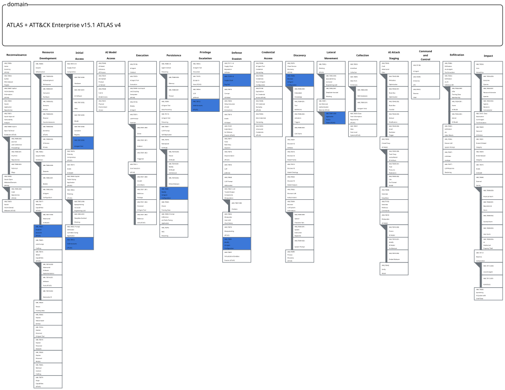

<a style="font-style:italic" href="https://mitre-atlas.github.io/atlas-navigator/#layerURL=https%3A%2F%2Fraw.githubusercontent.com%2FCloud-Architekt%2FAzureAD-Attack-Defense%2Fmain%2Fmedia%2Fmitre%2FAttackScenarios%2FEIDAgents-Mitre-Atlas.json&tabs=false&selecting_techniques=false" target="_blank" rel="noopener">Open in MITRE ATT&CK Navigator</a>

<br>

# Detections

AI agents can be created on multiple platforms, such as Microsoft Foundry, Copilot Studio, M365 Copilot Agent Builder, Security Copilot, 3rd party platforms, or even locally. The platform on which the agents are created affects how we can detect potential malicious activity and which built-in or custom detections we can use.

When building detections for Agent ID scenarios, you have to take into account the data flows and also consider using both built-in detections and custom detections based on the raw event data. One of the challenges in this area is that there isn’t a single product or solution an organization can leverage to cover all platforms and all forms of agents.

To understand the landscape, the figure below provides a high-level overview of how agent creation platforms, Agent 365, and Microsoft security solutions are integrated. The core pillars for protection (besides Agent 365) are Entra ID, Defender, Purview, and Sentinel.

<a href="https://raw.githubusercontent.com/Cloud-Architekt/AzureAD-Attack-Defense/main/media/ai-agent-identities/image6.png" target="_blank">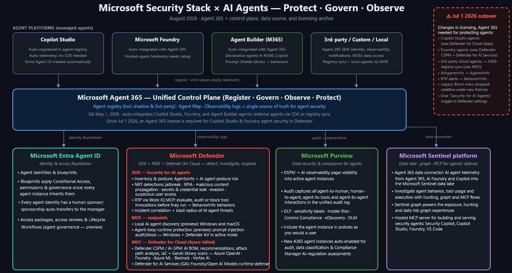</a>

The following section covers how built-in detections can be used to protect Agent IDs.

## Built-in Detections

At the time of writing this Chapter, Agent ID built-in detections are based on Microsoft Entra ID and ID Protection. There are several ways to ingest agent-related data into Sentinel, but no Agent ID-related detections are available.

### ID Protection for Agents

Microsoft Entra ID Protection is a security solution in the Entra ID platform that helps organizations detect, investigate, and remediate identity-based risks. In addition to protecting users and workload identities, it supports risk detection for AI agents across multiple attack scenarios. At the time of writing, Microsoft documents the following agent risk detections:

<a href="https://raw.githubusercontent.com/Cloud-Architekt/AzureAD-Attack-Defense/main/media/ai-agent-identities/image7.png" target="_blank">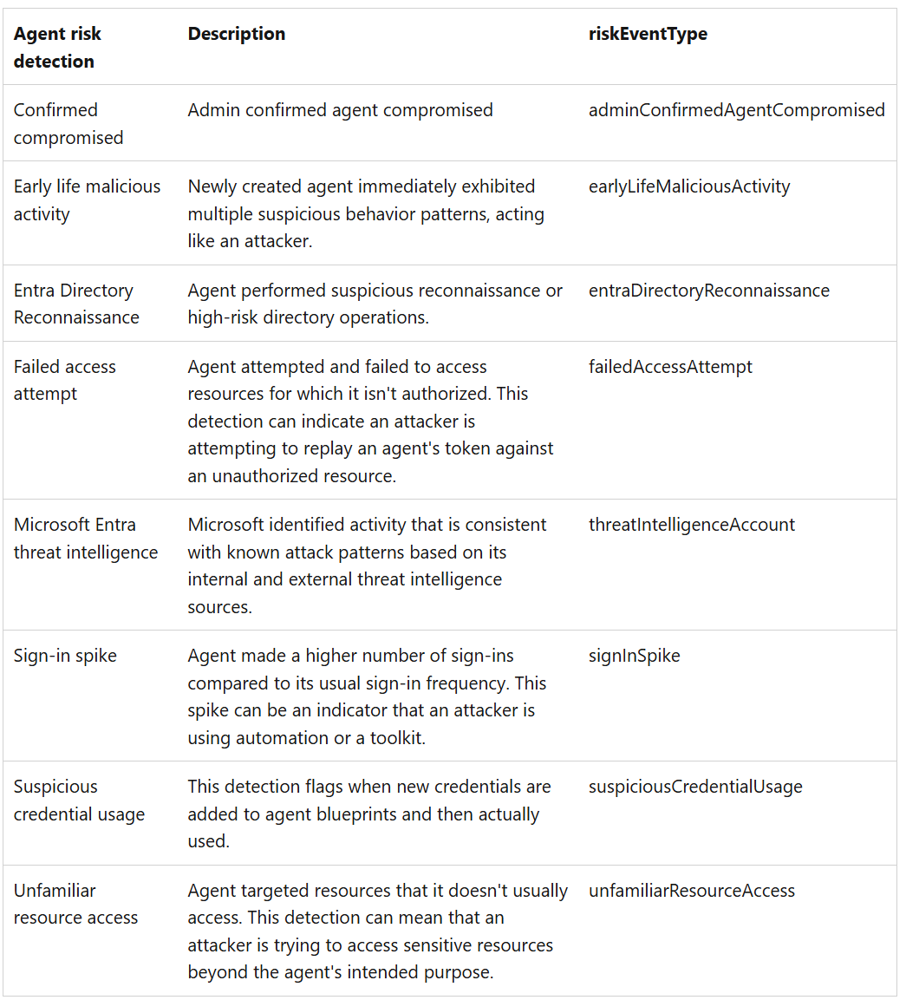</a>


In regard to these detections, it is important to understand that these risk detections only work for certain agent types and authentication flows. 

- **Does not support agents using On-Behalf-Of authentication flow** - In this scenario risk is attributed to the user account using the agent, instead of to the Agent Identity. This means the above mentioned risk detections are only applicable to autonomous agents. Risk detections for users using an agent with the OBO flow are [documented here](https://learn.microsoft.com/en-us/entra/id-protection/concept-identity-protection-risks).
- **Does support classic agent identities** - Classic Agent Identities, which are normal service principals used for AI Agents, are now supported for AI Risk detection. This was not the case in the past.

Additionally, [Microsoft mentions](https://learn.microsoft.com/en-us/entra/id-protection/concept-risky-agents#how-it-works) a **learning mode** for agent detections that automatically suppresses behavioral alerts for agents with insufficient activity history, preventing false positives **during onboarding and after periods of inactivity**. While great for false positive reduction, it is not clearly documented for how long this learning mode is active. While there are parallel detections to ensure genuinely malicious behavior is still caught, it is important to understand that not all of the above mentioned detections might work at the beginning of the Agent Identity activity. 

With regard to the Microsoft Graph API, two endpoints are available for Identity Protection on agents: `agentRiskDetection(`[agentRiskDetection resource type - Microsoft Graph beta | Microsoft Learn](https://learn.microsoft.com/en-us/graph/api/resources/agentriskdetection?view=graph-rest-beta)) and `riskyAgent` ([riskyAgent resource type - Microsoft Graph beta | Microsoft Learn](https://learn.microsoft.com/en-us/graph/api/resources/riskyagent?view=graph-rest-beta)). These two resource types can be used to list, dismiss, confirm compromise, or confirm safe for an agent identity, and to list all agent risk detections in the tenant. 

> **Note:** The Agents 365 license is required to use risk detections for AI Agent Identity Protection.

With Identity Protection for Agents, Microsoft Entra ID introduces new diagnostic tables called `RiskyAgents` and `AgentRiskEvents` as well. These are very useful for defenders in creating hunting and detection rules for compromised agent identities. To configure the logs, they must be enabled in Entra ID's diagnostic settings. You will find them there as below:

<a href="https://raw.githubusercontent.com/Cloud-Architekt/AzureAD-Attack-Defense/main/media/ai-agent-identities/image8.png" target="_blank">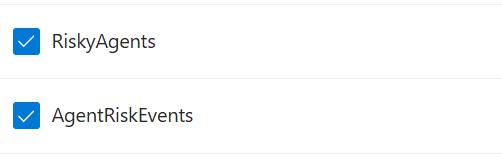</a>

Interesting to notice though, is that when you enable these diagnostic settings, the tables are named differently when you want to query them. The `RiskyAgents` are being logged in the table `AADRiskyAgents` ([Azure Monitor Logs reference - AADRiskyAgents - Azure Monitor | Microsoft Learn](https://learn.microsoft.com/en-us/azure/azure-monitor/reference/tables/AADRiskyAgents)), and the `AgentRiskEvents`  are logged in the table `AADAgentRiskEvents` ([Azure Monitor Logs reference - AADAgentRiskEvents - Azure Monitor | Microsoft Learn](https://learn.microsoft.com/en-us/azure/azure-monitor/reference/tables/AADAgentRiskEvents)). 

#### Defender XDR Integration

While risk detections for users and workload identities are visible in the Defender XDR portal as alerts via the Identity Protection integration, we were unable to surface built-in agent risk detections from Identity Protection in the Defender XDR portal. During our tests, we enabled all Identity Protection detections in Defender XDR:

<a href="https://raw.githubusercontent.com/Cloud-Architekt/AzureAD-Attack-Defense/main/media/ai-agent-identities/image9.png" target="_blank">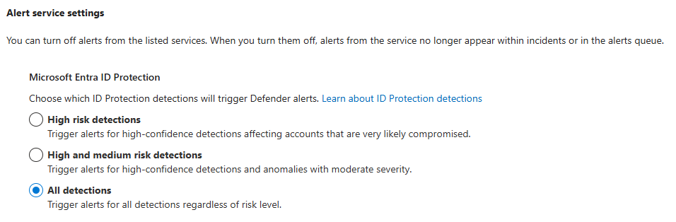</a>

And manually confirmed a compromise for an Agent Identity in Entra ID Protection:

<a href="https://raw.githubusercontent.com/Cloud-Architekt/AzureAD-Attack-Defense/main/media/ai-agent-identities/image10.png" target="_blank"></a>

This event can be seen in the `AADAgentRiskEvents` table:

<a href="https://raw.githubusercontent.com/Cloud-Architekt/AzureAD-Attack-Defense/main/media/ai-agent-identities/image11.png" target="_blank">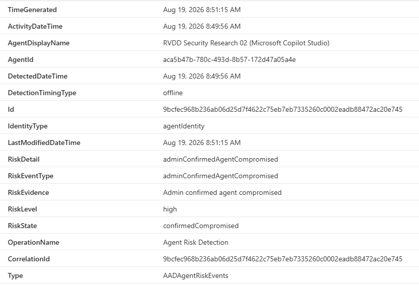</a>

And in the `AADRiskyAgents` table:

<a href="https://raw.githubusercontent.com/Cloud-Architekt/AzureAD-Attack-Defense/main/media/ai-agent-identities/image12.png" target="_blank">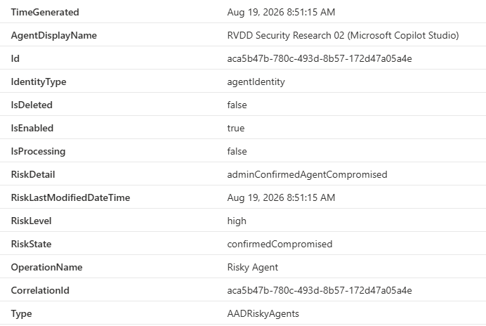</a>

But it did not generate an incident or alert in Defender XDR by default. Because of this, **custom agent risk detection use cases are important for a Security Operations Center.** 

## Custom Detections

In the following section, you can find custom detections (KQL queries) for hunting possible malicious activities in your environment. We created the queries for the Agent ID scenarios. The GitHub repo contains even more hunting queries [in the query folder](https://github.com/Cloud-Architekt/AzureAD-Attack-Defense/blob/main/queries/AiTM); take a look at that one as well. Every query has prerequisites, which are listed in the query section.

#### Custom Agent Risk Detections

To run this query, the following requirements should be met in your environment:

| Name            | Requirements                                                                                                                                  |
| --------------- | --------------------------------------------------------------------------------------------------------------------------------------------- |
| Data Connectors | In Microsoft Sentinel the ‘Entra ID - AADAgentRiskEvents’ data connector should be connected.                                                 |
| Licenses        | In order to get risk events for agents via Microsoft Entra Identity protection and Agent Info, Agent365 licenses are required in your tenant. |
| Licenses        | To query the AgentsInfo table in Defender XDR Advanced Hunting, a license for Defender XDR is required.                                       |

Detecting agent risk events is as easy as monitoring the `AADAgentRiskEvents` table in Microsoft Sentinel:

```kql
AADAgentRiskEvents
| where TimeGenerated > ago(5m)
| project ActivityDateTime, DetectionTimingType, AgentDisplayName, EntraAgentID = AgentId, IdentityType, RiskDetail, RiskEventType, RiskLevel, RiskState
| join kind=leftouter (
    AgentsInfo 
    | where TimeGenerated > ago(1d)
    | summarize arg_max(TimeGenerated, *) by AgentId 
    | project-away TimeGenerated, Timestamp
) on EntraAgentID
```
Depending on the environment, you might want to filter on specific severities or detection types. The `RiskLevel` and `RiskEventType` are the most interesting columns to create filters on in this case. 

### Agent ID-related Advanced Hunting tables

Advanced hunting currently has two table schemas related to AI Agents:

- `AIAgentsInfo`
- `AgentsInfo`

Starting from **1st of July 2026**, Defender XDR is transitioning from the `AIAgentsInfo` table to the `AgentsInfo` table. The difference between the tables is that the `AIAgentsInfo` table was created specifically for Copilot Studio Agents and populated through the Defender for Cloud Apps AI Agents inventory connector, while the new `AgentsInfo`table provides one schema populated through Security for AI for agents running in different ecosystems like Copilot Studio, Microsoft Foundry, third-party agents, and more. 

> **Note:** The Agents 365 license is needed to enable Security for AI and use the `AgentsInfo` table.

More information on the transition between the two tables can be found at [AIAgentsInfo → AgentsInfo: A Technical Migration Guide Before the July 1, 2026 Cutoff | by Derk van der Woude | Jun, 2026 | Medium](https://derkvanderwoude.medium.com/aiagentsinfo-agentsinfo-a-technical-migration-guide-before-the-july-1-2026-cutoff-e35052fd616c).

#### Table correlations

While the `AgentsInfo` table is great to find more information regarding the configuration and metadata of an agent, in a lot of detection use cases we will use this table in combination with other tables to find potential malicious activity. One of those tables is the `CloudAppEvents`tables in Defender XDR populated by Defender for Cloud Apps. While this table contains a lot more information outside of agent activity, it also logs specific agent events certain AI Agents triggered. 

The challenge with correlating the AI Agents information in `AgentsInfo` with the activity in `CloudAppEvents` , are the confusing Agents IDs and inconsistent ID usage. Because of the complexity of this topic, we will focus on the correlation KQL queries that can be used in hunting and detection rules, and reference to another blogpost detailing how the exact correlation works: [Correlating AgentsInfo with CloudAppEvents | Hybrid Brothers](https://hybridbrothers.com/posts/agentinfo-cloudappevents-correlation/). 

The below KQL query can be used as a starting point for agent correlation between the two tables.

To run this query, the following requirements should be met in your environment:

| Name       | Requirements                                                                                                 |
| ---------- | ------------------------------------------------------------------------------------------------------------ |
| Licenses   | In order to use the CloudAppEvents table, a Defender for Cloud Apps licenses is needed.                      |
| Licenses   | To query the AgentsInfo table in Defender XDR Advanced Hunting, a license for Defender XDR is required.      |
| XDR Config | Security for AI needs to be enabled in Defender for Cloud Apps in order to have agent related activity logs. |

```kql
// Fill in agent name or one of the Agent IDs you have found
let agent_name = "";
let some_agent_id = "";
AgentsInfo 
| where TimeGenerated > ago(1d)
| summarize arg_max(TimeGenerated, *) by AgentId
| where (isempty(some_agent_id) and Name =~ agent_name) or (isempty(agent_name) and * has some_agent_id)
// Skip local AI Agents
| where Platform != "LocalAgents"
| extend ExtractedObservabilityID = iff(
    ObservabilityID matches regex @"(\{{0,1}([0-9a-fA-F]){8}-([0-9a-fA-F]){4}-([0-9a-fA-F]){4}-([0-9a-fA-F]){4}-([0-9a-fA-F]){12}\}{0,1})",
    extract(@"(\{{0,1}([0-9a-fA-F]){8}-([0-9a-fA-F]){4}-([0-9a-fA-F]){4}-([0-9a-fA-F]){4}-([0-9a-fA-F]){12}\}{0,1})", 1, ObservabilityID),
    ObservabilityID
)
// Add fallback on titleId if ObservabilityID is empty
| extend ExtractedObservabilityID = iff(ExtractedObservabilityID == "", extract(@"(\{{0,1}([0-9a-fA-F]){8}-([0-9a-fA-F]){4}-([0-9a-fA-F]){4}-([0-9a-fA-F]){4}-([0-9a-fA-F]){12}\}{0,1})", 1, tostring(parse_json(RawAgentInfo).titleId)), ExtractedObservabilityID)
| project Name, Platform, ExtractedObservabilityID
| join kind=inner (
    CloudAppEvents
    | where TimeGenerated > ago(7d)
    | where ActionType in ("InvokeAgent","InferenceCall","ExecuteToolBySDK","ExecuteToolByGateway","ExecuteToolByMCPServer")
    // Extract the platformIDs and ObservabilityID
    | extend PlatformAgentId = tostring(parse_json(RawEventData)["PlatformAgentId"]), 
        PlatformTargetAgentId = tostring(parse_json(RawEventData)["PlatformTargetAgentId"])
    | extend PlatformId = iff(isempty(PlatformAgentId) and isnotempty(PlatformTargetAgentId), PlatformTargetAgentId, PlatformAgentId)
    | extend ObservabilityID = iff(
        PlatformId matches regex @"(\{{0,1}([0-9a-fA-F]){8}-([0-9a-fA-F]){4}-([0-9a-fA-F]){4}-([0-9a-fA-F]){4}-([0-9a-fA-F]){12}\}{0,1})", 
        extract(@"(\{{0,1}([0-9a-fA-F]){8}-([0-9a-fA-F]){4}-([0-9a-fA-F]){4}-([0-9a-fA-F]){4}-([0-9a-fA-F]){12}\}{0,1})", 1, PlatformId),
        PlatformId
    )
) on $left.ExtractedObservabilityID == $right.ObservabilityID
```

#### Detection examples

In the detection use case below, we try to detect AI Agents with third-party tools accessing O365 apps like Teams, SharePoint, Outlook, etc. By searching for the agents with third-party tools in the `AgentsInfo` table and correlating these agents with their activity in `CloudAppEvents` we can detect data exposure via AI Agents Tools, MCPs, or others.

To run this query, the following requirements should be met in your environment:

| Name       | Requirements                                                                                                 |
| ---------- | ------------------------------------------------------------------------------------------------------------ |
| Licenses   | In order to use the CloudAppEvents table, a Defender for Cloud Apps licenses is needed.                      |
| Licenses   | To query the AgentsInfo table in Defender XDR Advanced Hunting, a license for Defender XDR is required.      |
| XDR Config | Security for AI needs to be enabled in Defender for Cloud Apps in order to have agent related activity logs. |

```kql
AgentsInfo 
| where TimeGenerated > ago(1d)
| summarize arg_max(TimeGenerated, *) by AgentId
// Skip local AI Agents
| where Platform != "LocalAgents"
| extend ExtractedObservabilityID = iff(
    ObservabilityID matches regex @"(\{{0,1}([0-9a-fA-F]){8}-([0-9a-fA-F]){4}-([0-9a-fA-F]){4}-([0-9a-fA-F]){4}-([0-9a-fA-F]){12}\}{0,1})",
    extract(@"(\{{0,1}([0-9a-fA-F]){8}-([0-9a-fA-F]){4}-([0-9a-fA-F]){4}-([0-9a-fA-F]){4}-([0-9a-fA-F]){12}\}{0,1})", 1, ObservabilityID),
    ObservabilityID
)
// Add fallback on titleId if ObservabilityID is empty
| extend ExtractedObservabilityID = iff(ExtractedObservabilityID == "", extract(@"(\{{0,1}([0-9a-fA-F]){8}-([0-9a-fA-F]){4}-([0-9a-fA-F]){4}-([0-9a-fA-F]){4}-([0-9a-fA-F]){12}\}{0,1})", 1, tostring(parse_json(RawAgentInfo).titleId)), ExtractedObservabilityID)
// Get raw info for role information
| extend RawInfo = parse_json(RawAgentInfo)
| extend ImpactedSettings = RawInfo.impactedSettings,
    AppType = RawInfo.appType
// Focus on third-party tool usage
| where AppType =~ "thirdParty" or ImpactedSettings has "allowThirdPart"
| project Name, Platform, ExtractedObservabilityID
| join kind=inner (
    CloudAppEvents
    | where TimeGenerated > ago(7d)
    | where ActionType in ("InvokeAgent","InferenceCall","ExecuteToolBySDK","ExecuteToolByGateway","ExecuteToolByMCPServer")
    // Extract the platformIDs and ObservabilityID
    | extend PlatformAgentId = tostring(parse_json(RawEventData)["PlatformAgentId"]), 
        PlatformTargetAgentId = tostring(parse_json(RawEventData)["PlatformTargetAgentId"])
    | extend PlatformId = iff(isempty(PlatformAgentId) and isnotempty(PlatformTargetAgentId), PlatformTargetAgentId, PlatformAgentId)
    | extend ObservabilityID = iff(
        PlatformId matches regex @"(\{{0,1}([0-9a-fA-F]){8}-([0-9a-fA-F]){4}-([0-9a-fA-F]){4}-([0-9a-fA-F]){4}-([0-9a-fA-F]){12}\}{0,1})", 
        extract(@"(\{{0,1}([0-9a-fA-F]){8}-([0-9a-fA-F]){4}-([0-9a-fA-F]){4}-([0-9a-fA-F]){4}-([0-9a-fA-F]){12}\}{0,1})", 1, PlatformId),
        PlatformId
    )
) on $left.ExtractedObservabilityID == $right.ObservabilityID
```

Another detection rule below tries to spot agent invocations from a new country, anonymous proxy, or external caller. These are signs an adversary is potentially using an agent and its tools to manipulate or query data and settings in the environment. Baselining and finetuning might be needed for each environment.

To run this query, the following requirements should be met in your environment:

| Name       | Requirements                                                                                                 |
| ---------- | ------------------------------------------------------------------------------------------------------------ |
| Licenses   | In order to use the CloudAppEvents table, a Defender for Cloud Apps licenses is needed.                      |
| XDR Config | Security for AI needs to be enabled in Defender for Cloud Apps in order to have agent related activity logs. |

```kql
let lookback = 1d;
let baseline = 14d;
// Per-agent baseline of caller countries
let GeoBaseline =
    CloudAppEvents
    | where Timestamp between (ago(baseline) .. ago(lookback))
    | where ActionType == "InvokeAgent"
    | extend rd = parse_json(tostring(RawEventData))
    | extend AgentName = coalesce(tostring(rd.TargetAgentName), tostring(rd.AgentName))
    | summarize KnownCountries = make_set(CountryCode) by AgentName;
CloudAppEvents
| where Timestamp > ago(lookback)
| where ActionType == "InvokeAgent"
| extend rd = parse_json(tostring(RawEventData))
| extend AgentName = coalesce(tostring(rd.TargetAgentName), tostring(rd.AgentName)),
         ClientIP = tostring(rd.ClientIP),
         CallerUpn = tostring(rd.UserId),
         CallerKey = tostring(rd.UserKey),
         Channel = tostring(rd.ChannelName)
| join kind=leftouter GeoBaseline on AgentName
| extend NewCountry = isnotempty(CountryCode) and not(set_has_element(KnownCountries, CountryCode))
| where IsAnonymousProxy == true or IsExternalUser == true or NewCountry
| project Timestamp, AgentName, CallerUpn, CallerKey, ClientIP, IPAddress, CountryCode, City, ISP,
          IsAnonymousProxy, IsExternalUser, NewCountry, Channel, ReportId
| order by Timestamp desc
```

### Agent 365 Data Connector to Sentinel

The Agent 365 solution in Microsoft Sentinel contains two different data connectors: Agent 365 and Microsoft Agent Identities.

<a href="https://raw.githubusercontent.com/Cloud-Architekt/AzureAD-Attack-Defense/main/media/ai-agent-identities/image13.png" target="_blank">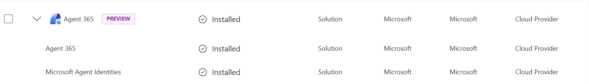</a>

The Agent 365 connector ingests data into the `UnifiedAgentObservability` table in the Microsoft Sentinel Data lake containing AI agent telemetry data from Agent 365, Microsoft Foundry, and Copilot, such as tool usage, execution, and MCP workflows. 

The Microsoft Agent Identities data connector, on the other hand, exports data into tables `EntraAgentIdentities`, `EntraAgentIdentityBlueprintPrincipals`, `EntraAgentIdentityBlueprints`, and `EntraAgentUsers`. As the table names speak for themselves, each table contains different Agent Identity objects in the Entra ID tenant, which allows you to query the different object properties using KQL.

<a href="https://raw.githubusercontent.com/Cloud-Architekt/AzureAD-Attack-Defense/main/media/ai-agent-identities/image14.png" target="_blank">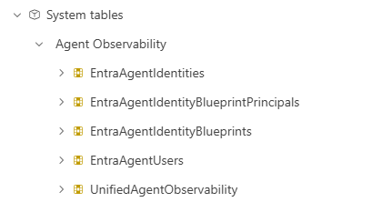</a>

> **Note:** The Microsoft Sentinel Data Lake must be enabled to use these data connectors.

#### CloudAppEvents VS UnifiedAgentObservability

Since both tables contain telemetry on agent usage, tool invocation, and more via Agent365, the data in these tables are very similar. As mentioned earlier, the `CloudAppEvents`  table is provisioned through Defender for Cloud Apps, while the `UnifiedAgentObservability` is a direct logging table from the Agent365 service. Even though there might be duplicate data when using both tables, some key differences were found. 

1. The `CloudAppEvents` table does not log token usage, while the `UnifiedAgentObservability` table does.
2. The `CloudAppEvents` table logs the client IP of related to the event, while the `UnifiedAgentObservability` table does not.
3. The `CloudAppEvents` table contain events where Security for AI detected exploit attempts such as XPIA, jailbreak, or prompt shield triggers, while the `UnifiedAgentObservability` table does not.

More information regarding the table differences and which KQL queries can be used for hunting can be found at the follow great community project: [security-investigator/queries/cloud/agent365_observability.md at main · SCStelz/security-investigator · GitHub](https://github.com/SCStelz/security-investigator/blob/main/queries/cloud/agent365_observability.md#queries). 

Generally speaking, the `UnifiedAgentObservability` is the better table to use during incident investigations and hunting exercises because of the extended logging it contains. At the other side the `CloudAppEvents` table is more interesting for detection rules since this table also contains alerts from Security for AI and is included in Defender for Cloud Apps by default. 

Going deeper on the detections area, it is also important to understand the raw events data flows and how these services are connected together. The following figure (created by **Derk van der Woude**) describes the data flows to get better understanding of event data flows. This helps on understanding and creating custom detection rules for AI agent scenarios.

<a href="https://raw.githubusercontent.com/Cloud-Architekt/AzureAD-Attack-Defense/main/media/ai-agent-identities/image15.png" target="_blank">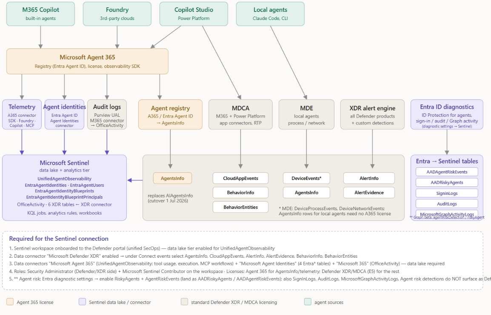</a>

### Visibility of Multi-Tenant Agents

The workbook ["Agent Inventory and Permissions Risks"](https://github.com/Cloud-Architekt/AzureAD-Attack-Defense/blob/main/queries/AgentIdentities/AgentInventoryPermissionsRisks.workbook) has been developed to take benefit of using sign-in and Microsoft Graph Activity logs in Microsoft Sentinel to show details about your single- and multi-tenant agents. The workbook can be deployed directly to Azure with the ARM template:

[](https://portal.azure.com/#create/Microsoft.Template/uri/https%3A%2F%2Fraw.githubusercontent.com%2FCloud-Architekt%2FAzureAD-Attack-Defense%2Fmain%2Fqueries%2FAgentIdentities%2FAgentInventoryPermissionsRisks.json)

<a href="https://raw.githubusercontent.com/Cloud-Architekt/AzureAD-Attack-Defense/main/media/ai-agent-identities/image16.png" target="_blank">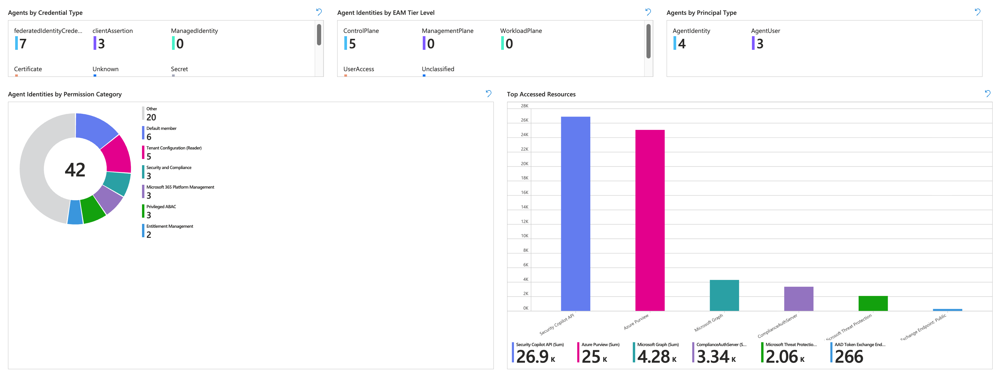</a>

<a href="https://raw.githubusercontent.com/Cloud-Architekt/AzureAD-Attack-Defense/main/media/ai-agent-identities/image17.png" target="_blank">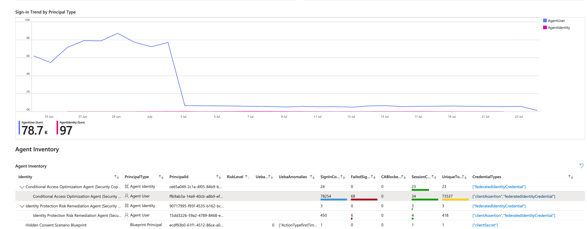</a>

This includes also details about the status of Conditional Access evaluation and Sign-in attempts. In addition, details of the Microsoft Sentinel UEBA and used credential types are also visible.

<a href="https://raw.githubusercontent.com/Cloud-Architekt/AzureAD-Attack-Defense/main/media/ai-agent-identities/image18.png" target="_blank">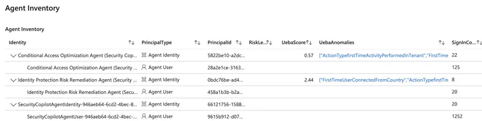</a>

Furthermore, details of the activity and permissions of the agent identity to Microsoft Graph API is visible in this workbook based on the `MicrosoftGraphActivityLogs` . This includes also activity by multi-tenant and/or first party agents, like Microsoft Security Copilot (incl. Conditional Access Optimization Agent).

The workbook is available from here and can be directly deployed to Azure.

### Monitoring and Reporting of Agent ID privileges

EntraOps includes a workbook for “[Agent Identities](https://www.entraops.com/docs/reportings/index.html#workbooks-for-visualizing-entraops-classification-data)” which allows to review the privileges that are assigned (and visible) in your tenant. All assignments to API Permissions, Entra ID and Azure roles will be also classified based on the Enterprise Access Model to identify sensitivity level of access.

<a href="https://raw.githubusercontent.com/Cloud-Architekt/AzureAD-Attack-Defense/main/media/ai-agent-identities/image19.png" target="_blank">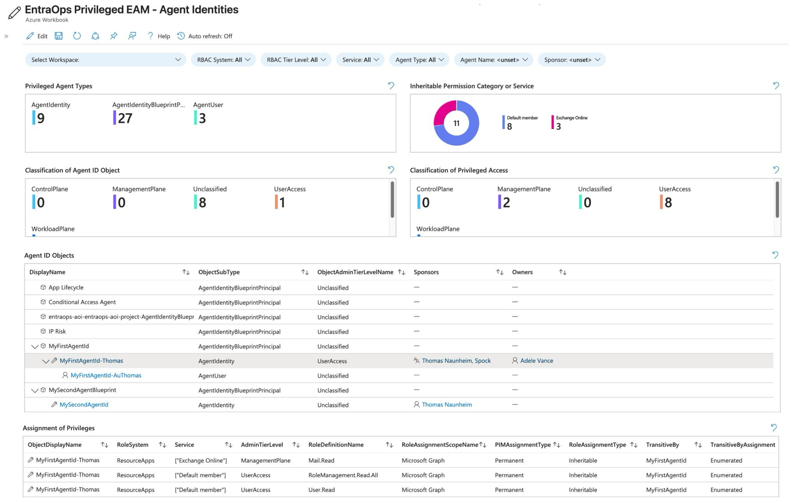</a>

The community tool EntraOps is available on [GitHub](https://github.com/Cloud-Architekt/EntraOps).

# Mitigations

### Securing the AI Administrator Role: Treat it as Control Plane (Tier0)

When organizations start deploying Copilot connectors and AI agents, the [AI Administrator role](https://learn.microsoft.com/en-us/microsoft-365/copilot/extensibility/connector-admin-delegation) is often handed out to facilitate rapid development. However, this role carries massive security implications. Beyond basic app registration, AI Administrators can be granted powerful consent policy privileges, allowing them to authorize agents to access sensitive data also for Non-Graph APIs. Because an AI Administrator can dictate what data an autonomous agent can read, modify, or expose, this role must be treated as Tier-0 (Control Plane) privilege. To mitigate the risk of compromise, you must protect this role with the same rigor as a Global Administrator:

- Enforce strict access controls: Require the use of dedicated Secure Admin Workstations (SAWs/PAWs) for anyone acting as an AI Admin.
- Mandate phishing-resistant authentication: Access should be gated behind FIDO2 security keys, passkeys, or certificate-based authentication.
- Zero standing privileges: Never assign the role permanently. Use Privileged Identity Management (PIM) to ensure time-bound, approved, and logged activation, and strictly limit the number of eligible users.

### Rethinking Object Ownership: Use Sponsors and Object-Level Scoped Entra Role Delegation over Owners

A common pitfall in identity governance is granting standard "Owner" rights over agent applications and service principals directly to the developers who requested them. Standard object ownership is inherently flawed for highly privileged workloads: it bypasses PIM, relies on permanent direct user assignments, lacks visibility, and is frequently assigned to lower-privileged users who may not understand the security implications of modifying redirect URIs, adding secrets, or consenting to new permissions.

For Entra Agent IDs, you should explicitly avoid direct user ownership. Instead, adopt Microsoft's modern governance model by leveraging Sponsors. A [Sponsor](https://learn.microsoft.com/en-us/entra/agent-id/agent-owners-sponsors-managers) acts as the business owner—providing justification, lifecycle management, and accountability for the agent—without holding the technical rights to modify the identity object's credentials or permissions (sponsors of Agent ID objects can disable, soft-delete, and update the sponsor list, but not add credentials or owners). For technical management, rely on centralized application management teams using PIM-governed built-in roles (Agent ID Administrator, or Agent ID Developer for blueprint creation) and harden the blueprint with Application Management Policies. Note that custom roles do not yet support Agent ID actions and agent identities, blueprints, and blueprint principals cannot be scoped to administrative units, so object-level delegation via custom roles or AUs is not available today. This ensures that while the business maintains accountability through a Sponsor, technical modifications remain subject to PIM, audit logs, and strict IT governance.

### Application Management Policies

While Microsoft automatically blocks credential backdooring on various object types (such as agent user or agent identity), applying [Application management policies](https://learn.microsoft.com/en-us/graph/api/resources/applicationauthenticationmethodpolicy?view=graph-rest-1.0) on the agent blueprint application object is one of the most effective ways to harden these objects against credential-based attacks.

**Targeting Policies at the Application Level**
Rather than relying solely on the tenant-wide default policy (which is for most organization hard to define with strong block/restrict enforcement), you can assign custom app management policies directly to individual agent applications and service principals. This targeted approach allows you to implement strict credential boundaries without disrupting other types of non-human identities elsewhere in your tenant:

- Block client secrets: You can configure the policy's `⁠passwordAddition`⁠ restriction to outright block the creation of new client secrets (passwords) on the agent object. This forces developers to adopt more secure authentication methods.
- Limit certificate lifetimes: If certificates are absolutely required for specific agent interactions, you can use the ⁠`keyCredentials`⁠ restriction to enforce a strict maximum lifetime (e.g., forcing rotation every 90 days).

**The State of Federated Credentials**
If you are looking to restrict Federated Identity Credentials (FIC) using application management policies, be aware that you currently cannot. The restrictions built into the ⁠appManagementPolicy⁠ API target `passwordCredentials` and `keyCredentials` (symmetric and asymmetric keys, including certificate lifetime and trusted certificate authorities); no restriction type exists for federated identity credentials today.

However, this lack of restriction actually aligns directly with [Microsoft's best practices for Agent IDs](https://learn.microsoft.com/en-us/entra/agent-id/best-practices-agent-id). Federated credentials are the preferred "secretless" standard. By establishing a trust relationship between your agent environment and Microsoft Entra, the workload authenticates via token exchange - meaning there are no static secrets but the trust relies on the agent environment. There’s no proactive way to avoid establishing federation to untrusted providers or platforms. However, this is still best recommended and most secure way to avoid leak or exposed secrets.

### Block unauthorized or allowlist Agents by Conditional Access Policies

As shadow AI becomes a reality, organizations need a layered approach to allowlist approved agents and block unauthorized ones. Microsoft provides a dedicated [Conditional Access for agents](https://learn.microsoft.com/en-us/entra/identity/conditional-access/agent-id) model that can target agent identities, agent identity blueprints, and agents' user accounts, and can use agent risk from ID Protection as a condition. Because managing policies for individual agent identities doesn't scale, you can use Custom Security Attributes (CSAs). By tagging approved Agent IDs with specific CSAs (e.g., `⁠ApprovedAgent = True`⁠), you can build dynamic Conditional Access policies that explicitly block token issuance for any agent attempting to access corporate resources without the proper attribute.

However, Conditional Access only works if the agent actually has an Entra Agent ID and is attempting to authenticate against your tenant. Agent-targeted policies apply to autonomous (app-only) token requests; when an agent acts on behalf of a signed-in user (OBO flow, as most Copilot Studio agents do), Conditional Access is evaluated against the *user*, so those requests are governed by your user policies rather than by agent policies. Microsoft also documents [boundaries and limitations](https://learn.microsoft.com/en-us/entra/identity/conditional-access/agent-id#conditional-access-boundaries-and-limitations): the blueprint's own token requests for provisioning and the token-exchange requests are not evaluated, "all users" policies do not include agents' user accounts, and targeting a blueprint does not cover its agents' user accounts. These nuances are important to understand since not all agent authentication can be blocked or governed using Conditional Access alone.

### Taming Shadow AI: Discovering and Blocking Third-Party Agents

While securing your own internal Entra Agent IDs is vital, your users are likely already interacting with third-party AI platforms like Anthropic Claude, OpenAI, and DeepSeek. This introduces massive "Shadow AI" risks, from employees pasting sensitive corporate data into public web prompts to developers running autonomous CLI agents locally.
Microsoft provides a layered approach to discover, monitor, and block these third-party platforms across your environment:

- Discover usage with Defender for Cloud Apps: Microsoft Defender for Cloud Apps (MDCA) automatically monitors endpoint traffic and groups these services under a dedicated Generative AI category in the [Cloud App Catalog](https://learn.microsoft.com/en-us/microsoft-365/copilot/manage-generative-ai-apps). This gives your security team a clear dashboard to audit exactly which third-party AI web apps are being used, who is using them, and their inherent security risk scores.
- Block web access at the endpoint: Once you identify a non-compliant or high-risk AI platform, you can simply tag it as "Unsanctioned" in MDCA. Thanks to native integration, this classification syncs directly to Microsoft Defender for Endpoint (MDE). MDE’s Network Protection then seamlessly blocks web access to those domains (e.g., ⁠deepseek.com⁠ or ⁠claude.ai⁠) across your managed Windows and macOS devices, regardless of what browser they use or what network they are connected to.
- Secure local developer agents: The threat isn't restricted to web browsers; developers are increasingly installing local AI agents (like Claude Code, OpenClaw, or GitHub Copilot CLI) directly on their machines. To control these, Microsoft introduced [AI agent runtime protection in Defender XDR](https://learn.microsoft.com/en-us/defender-endpoint/ai-agent-runtime-protection-overview). Rather than just blocking the application binary, Defender hooks directly into the local agent's execution loop. It intercepts user prompts, inspects the agent's tool requests before they run, and can block malicious commands—such as prompt injections attempting to exfiltrate files—before the third-party agent executes them.
