# Consent Grant Attack

_Author: Thomas Naunheim, Joosua Santasalo & Sami Lamppu_

_Created: February 2021_

_The initial update: September 2021_

_The second update: October 2022_

- [Consent Grant Attack](#consent-grant-attack)
- [Attack](#attack)
  - [In practice](#in-practice)
- [MITRE ATT&CK Framework](#mitre-attck-framework)
  - [TTPs](#ttps)
    - [TTP Description & Built-in Rules](#ttp-description--built-in-rules)
    - [Detection Rules for Consent Grant Scenario](#detection-rules-for-consent-grant-scenario)
      - [Sentinel Rules](#sentinel-rules)
      - [Defender for Cloud Apps Rules](#defender-for-cloud-apps-rules)
- [Detection](#detection)
  - [Azure AD Audit Logs](#azure-ad-audit-logs)
  - [Azure Workbooks](#azure-workbooks)
  - [PowerShell](#powershell)
    - [Script to list delegated permission grants](#script-to-list-delegated-permission-grants)
  - [Integration of PowerShell + Azure Log Analytics and some magic with KQL](#integration-of-powershell--azure-log-analytics-and-some-magic-with-kql)
  - [Microsoft Cloud App Security (MCAS)](#microsoft-cloud-app-security-mcas)
    - [MCAS Built-In Rules](#mcas-built-in-rules)
    - [Application Governance Built-in Policies](#application-governance-built-in-policies)
    - [Example Alert based on built-in rule](#example-alert-based-on-built-in-rule)
    - [MCAS Custom Rules](#mcas-custom-rules)
  - [App Governance - Microsoft Cloud App Security (MCAS) add-on (AppG)](#app-governance---microsoft-cloud-app-security-mcas-add-on-appg)
    - [Architecture](#architecture)
    - [Detection Policies and Visibility in App Governance](#detection-policies-and-visibility-in-app-governance)
  - [Azure Sentinel](#azure-sentinel)
- [Mitigation (and Reduced Attack Surface)](#mitigation-and-reduced-attack-surface)
  - [Disable Default Permissions for App Registrations](#disable-default-permissions-for-app-registrations)
  - [Restrict User Consent Permissions for End-Users](#restrict-user-consent-permissions-for-end-users)
  - [Permission Classification as “Low-Risk”](#permission-classification-as-low-risk)
  - [Advanced policies to restrict user consent](#advanced-policies-to-restrict-user-consent)
    - [Custom Roles and App Consent Policies](#custom-roles-and-app-consent-policies)
  - [Approval Workflow for (Tenant-Wide) Admin Consent](#approval-workflow-for-tenant-wide-admin-consent)
  - [Alternate options or restrictions to Tenant-Wide Admin Consent](#alternate-options-or-restrictions-to-tenant-wide-admin-consent)
- [Recommendations](#recommendations)
- [Further reading](#further-reading)
- [References](#references)

*"In an illicit consent grant attack, the attacker creates an Azure-registered application that requests access to data such as contact information, email, or documents. The attacker then tricks an end-user into granting that application consent to access their data either through a phishing attack or by injecting illicit code into a trusted website. After the illicit application has been granted consent, it has account-level access to data without the need for an organizational account.*

*Normal remediation steps, like resetting passwords for breached accounts or requiring Multi-Factor Authentication (MFA) on accounts, are not effective against this type of attack since these are third-party applications and are external to the organization. These attacks leverage an interaction model that presumes the entity that is calling the information is automation and not a human.”*

*Source: [Detect and Remediate Illicit Consent Grants - Office 365 | Microsoft Docs](https://docs.microsoft.com/en-us/microsoft-365/security/office-365-security/detect-and-remediate-illicit-consent-grants)*

*Related MITRE ATT&CK Tactics: [Credential Access (T1110)](https://attack.mitre.org/tactics/TA0006/)* & 
*[Steal Application Token (T158)](https://attack.mitre.org/techniques/T1528/)*

*Youtube Video: [Demonstration - Illicit consent grant attack in Azure AD / Office 365](https://www.youtube.com/watch?v=h2dy23-S2to)*

# Attack

Consent Grant is the perfect tool to create backdoors, and MFA bypasses in the victim’s environment. There are two scenarios for attacker to pursue targeting individual users; Individual consent grants for non-admin permissions, and/or targeting admins for requiring permissions that only admins can grant.

Both scenarios allow data exfiltration, while the latter also offers perfect backdooring entry (App permissions for multi-tenant app).

## In practice

Attacker would start with some form of phishing; For example, perhaps a newsletter copied from trustworthy source, embedded with links to the attacker-controlled app.

Other more direct way is to create tool for M365 / Azure AD Admins, that collects useful data, and implements an actually useful service, but also misuses the permissions of that service (The service could create also new credentials for existing SPN, and continue using them in the guise of assumed legitimate actions)

The list possibilities are endless... 😊

# MITRE ATT&CK Framework
Mitre Att&ck framework is commonly used for mapping Tactics, Techniques & Procedures (TTPs) for adversary actions and emulating defenses on organizations around the world. 

## TTPs
The TTPs found from the picture below could be used on the consent grant based attack. The used framework is modified from MITRE ATT&CK V12 with Office 365 & Azure AD included from the cloud matrix.

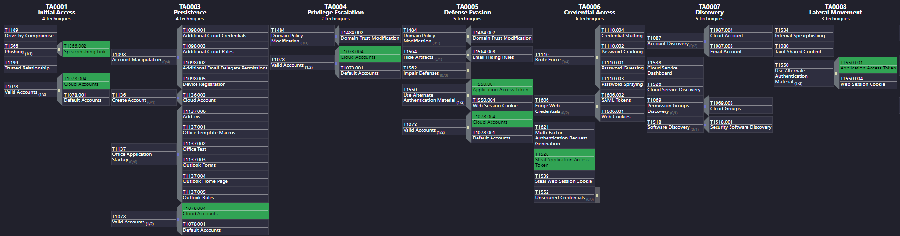

### TTP Description & Built-in Rules
The following TTPs are mapped for the 'Consent Grant' attack scenario. From the table below, you can find TTPs description and link to the MITRE ATT&CK official documentation.

| TTPs         | Description  |
|--------------|-----------| 
| Initial Access - [T1566.002](https://attack.mitre.org/techniques/T1566/002/) | Adversaries may also utilize links to perform consent phishing, typically with OAuth 2.0 request URLs that when accepted by the user provide permissions/access for malicious applications, allowing adversaries to Steal Application Access Tokens.
| Initial Access - [T1078](https://attack.mitre.org/techniques/T1078/) | Adversaries may obtain and abuse credentials of existing accounts as a means of gaining Initial Access, Persistence, Privilege Escalation, or Defense Evasion. Compromised credentials may be used to bypass access controls placed on various resources on systems within the network and may even be used for persistent access to remote systems and externally available services, such as VPNs, Outlook Web Access and remote desktop.
| Defense Evasion - [T1550 - T1550.002](https://attack.mitre.org/techniques/T1550/001/) | Adversaries may also utilize links to perform consent phishing, typically with OAuth 2.0 request URLs that when accepted by the user provide permissions/access for malicious applications, allowing adversaries to Steal Application Access Tokens. 
|Credential Access - [T1528](https://attack.mitre.org/techniques/T1528/) | Adversaries can steal application access tokens as a means of acquiring credentials to access remote systems and resources. 
|Lateral Movement - [T1550.001](https://attack.mitre.org/techniques/T1550/001/) | Adversaries may use stolen application access tokens to bypass the typical authentication process and access restricted accounts, information, or services on remote systems. These tokens are typically stolen from users or services and used in lieu of login credentials. Application access tokens are used to make authorized API requests on behalf of a user or service and are commonly used as a way to access resources in cloud and container-based applications and software-as-a-service (SaaS). |

### Detection Rules for Consent Grant Scenario

#### Sentinel Rules
- [Suspicious Service Principal creation activity](https://github.com/Azure/Azure-Sentinel/blob/master/Solutions/Azure%20Active%20Directory/Analytic%20Rules/SuspiciousServicePrincipalcreationactivity.yaml) - T1078, T1528
- [Suspicious application consent for offline access](https://github.com/Azure/Azure-Sentinel/blob/master/Solutions/Azure%20Active%20Directory/Analytic%20Rules/SuspiciousOAuthApp_OfflineAccess.yaml) - T1528
- [Suspicious application consent similar to PwnAuth](https://github.com/Azure/Azure-Sentinel/blob/master/Solutions/Azure%20Active%20Directory/Analytic%20Rules/MaliciousOAuthApp_PwnAuth.yaml) - T1528, T1550
- [Azure Active Directory Hybrid Health AD FS Application](https://github.com/Azure/Azure-Sentinel/blob/master/Detections/AzureActivity/AADHybridHealthADFSSuspApp.yaml) - T1528, T1550
- [Suspicious application consent similar to O365 Attack Toolkit](https://github.com/Azure/Azure-Sentinel/blob/master/Solutions/Azure%20Active%20Directory/Analytic%20Rules/MaliciousOAuthApp_O365AttackToolkit.yaml) - T1528, T1550

#### Defender for Cloud Apps Rules

# Detection

There are many solutions and methods available for detecting illicit consent grant attack. Here is list (not 100% accurate) of the solutions that offer capabilities to identify and investigate consent grants and application registrations.

- O365 SSC & new Compliance portal (Unified Audit Log)
- Azure AD portal (Audit logs, workbooks & application management)
- PowerShell tools (Get-AzureADPSPermissions)
- Combination of Get-AzureADPSPermissions export, Azure Log Analytics & some KQL magic
- Microsoft Cloud App security
    - App Governance
- Azure Sentinel

## Azure AD Audit Logs

The activities from Application Administrative category (registering app, granting consent etc.) are logged in Azure AD Audit log. Both, user and admin consent activities (delegated & application permissions) are logged to Azure AD Audit logs with small differences.

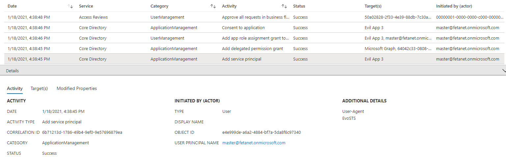

The activities are also found from O365 Unified Audit Log (UAL) and this log has nowadays a new home, the complicance (compliance.microsoft.com) portal. The old location is still active (protection.office.com) but redirects admin to the compliance portal when 'audit search' is selected.

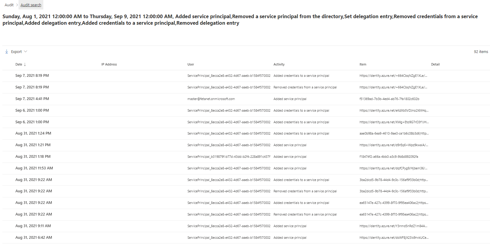


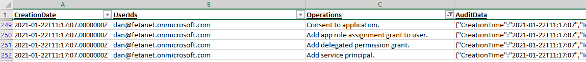

## Azure Workbooks

Overview of consent requests and sign-in from users to the granted apps. With the built-in workbook you can drill down to individual app consents that's extremely useful when working in the environment with large number of activities in this area. 

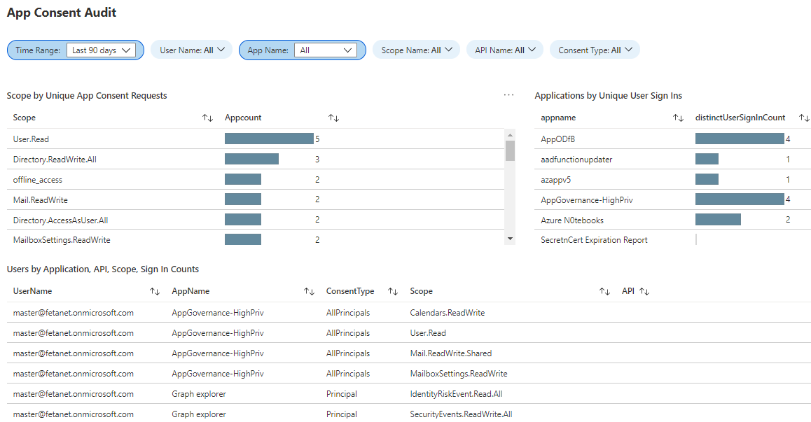

Individual app consents
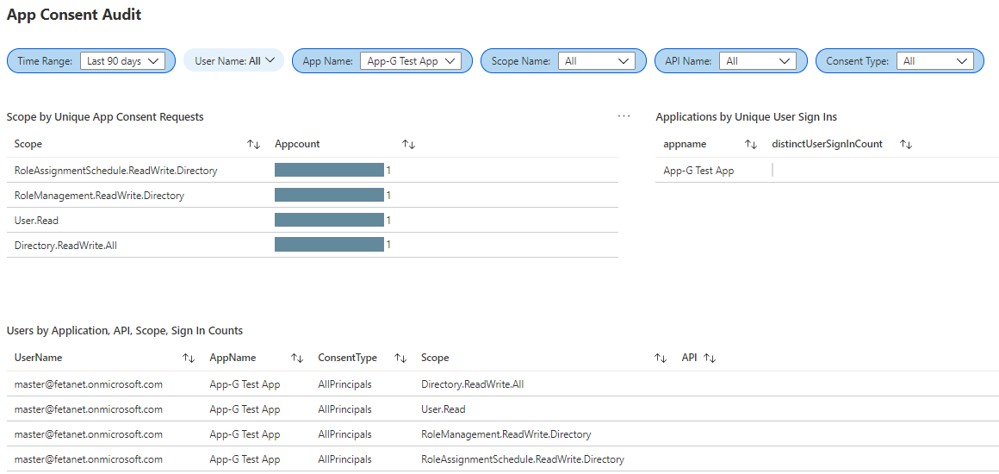

## PowerShell

### Script to list delegated permission grants

[Philippe Signoret](https://gist.github.com/psignoret) has written a PowerShell script to lists all delegated permission grants. Example:

Get-AzureADServicePrincipal -All $true | .\Get-AzureADPSPermissionGrants.ps1 -Preload

This script is regularly updated and available from his GitHub page: [Get all permissions granted to an app in Azure AD · GitHub](https://gist.github.com/psignoret/9d73b00b377002456b24fcb808265c23)

You can also search the Office 365 Audit log with PowerShell and create a report of the consent grants found in the results. Here's an example: https://office365itpros.com/2021/02/18/discover-new-office365-audit-events/

## Integration of PowerShell + Azure Log Analytics and some magic with KQL
Kudos to [Joosua Santasalo](https://twitter.com/SantasaloJoosua)  who made this possible.

Azure AD consent analysis can be done also with combination of PowerShell, Azure Log Analytics and KQL if Azure AD log data (Sign-in logs, Audit logs, Non-Interactive log, ServicePrincipal log & ManagedIdentity log) is ingested to the Log Analytics workspace. 

This can be achieved with the following steps:
- Export app permissions with aforementioned [Philippe Signoret](https://gist.github.com/psignoret) PowerShell script
- Create dedicated Azure storage account and ingest data exported from previous step to the storage account 
- With Log Analytics externaldata operator you can use runtime storage for .CSV files. Storage files require SAS token to access, which is provided to the externaldata operator

In this query we have combined data from the following sources:
- AADServicePrincipalSignInLogs, AADManagedIdentitySignInLogs, SigninLogs & AADNonInteractiveUserSignInLogs
- External data that contains Azure AD app permissions 

This give us richer data for analyzing app consents and how widely the app is used. Information we used in example query:
- Number of sign-ins, number of users, ClientDisplayName, permissions, principals & risk data
 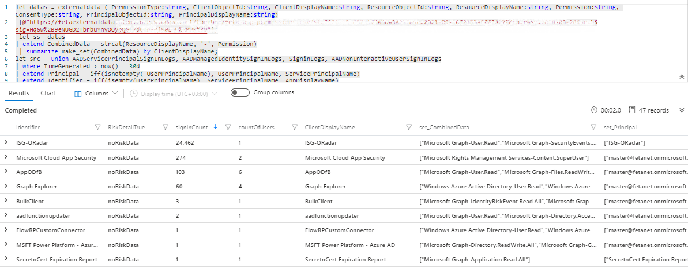


## Microsoft Cloud App Security (MCAS)

MCAS offers way to detect automatically possible malicious applications. If you suspect that you have malicious application already in your tenant the investigation blade can shed a light to analyze app permissions and also manage access (approved/ banned) to the apps. If application is banned from the MCAS, the access to the app is revoked from Azure AD.

**Managing OAuth Apps in MCAS**

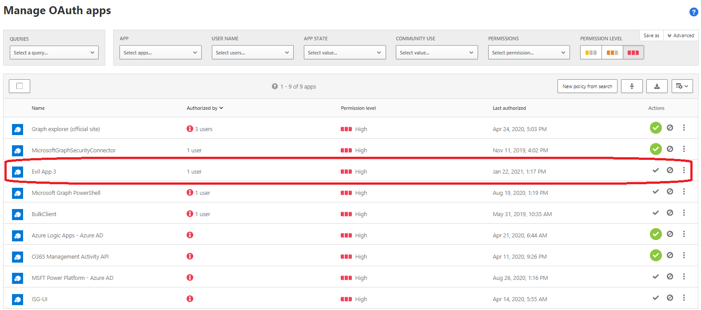

**App permissions listed in MCAS**

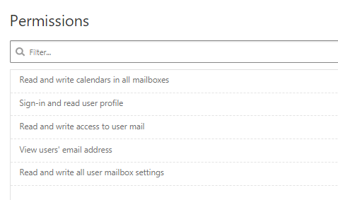

**Banning the app in MCAS**

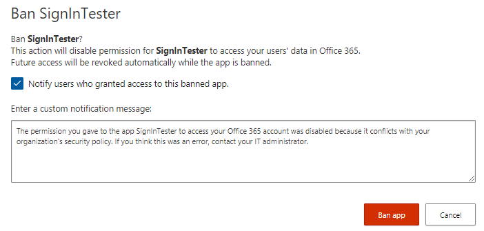

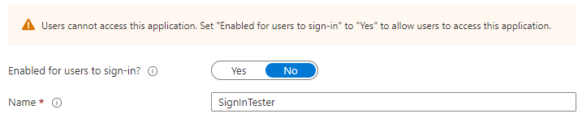


### MCAS Built-In Rules

The following policies are available out of the box in MCAS. It’s important to understand that anomaly detection policies are only available for OAuth apps that are authorized in Azure Active Directory and the severity of OAuth app anomaly detection policies cannot be modified.

**Unusual addition of credentials to an OAuth app**

- This detection identifies the suspicious addition of privileged credentials to an OAuth app. This can indicate that an attacker has compromised the app, and is using it for malicious activity.
- Learning your organization's environment requires a period of seven days during which you may expect a high volume of alerts.

**Misleading OAuth app name**

- Scans OAuth apps connected to your environment and triggers an alert when an app with a misleading name is detected. Misleading names, such as foreign letters that resemble Latin letters, could indicate an attempt to disguise a malicious app as a known and trusted app.

**Misleading publisher name for an OAuth app**

- Scans OAuth apps connected to your environment and triggers an alert when an app with a misleading publisher name is detected. Misleading publisher names, such as foreign letters that resemble Latin letters, could indicate an attempt to disguise a malicious app as an app coming from a known and trusted publisher.

**Malicious OAuth app consent**

- Scans OAuth apps connected to your environment and triggers an alert when a potentially malicious app is authorized. Malicious OAuth apps may be used as part of a phishing campaign in an attempt to compromise users. This detection leverages Microsoft security research and threat intelligence expertise to identify malicious apps.

**Suspicious OAuth app file download activities**

- Scans the OAuth apps connected to your environment and triggers an alert when an app downloads multiple files from Microsoft SharePoint or Microsoft OneDrive in a manner that is unusual for the user. This may indicate that the user account is compromised.


### Application Governance Built-in Policies
 
**Microsoft 365 OAuth Phishing Detection**
- MAPG provides rules-based and ML-based detections to identify potential M365 OAuth phishing attacks.

**Microsoft 365 OAuth App Reputation**
- MAPG provides rules-based and ML-based detections to identify M365 OAuth apps which have exhibited suspicious behavior in other organizations

**Microsoft 365 OAuth App Governance**
- Alerts created by custom policies in AppG solution.

*The following pictures shows configuration of two default policies*

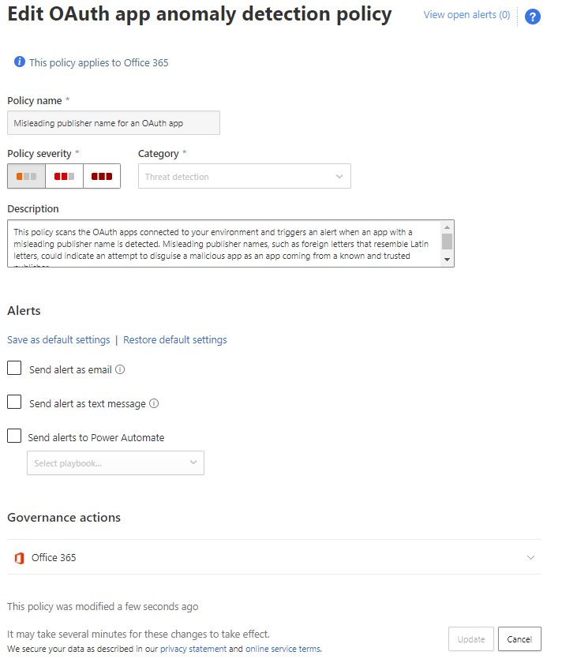

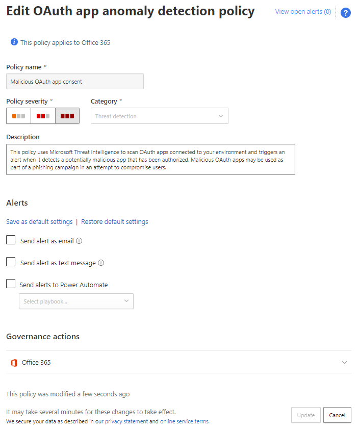

### Example Alert based on built-in rule

Imagine scenario where application is registered to the directory and its name is very close to the “real” application name. In the example, we used Azure N0tebooks (single-tenant app) which is quite close to Azure Notebooks that you can expect to find from Azure AD. In this scenario, MCAS creates an alert. This detection is based on built-in policy and it’s unknown for us is consent grant needed for the alert.

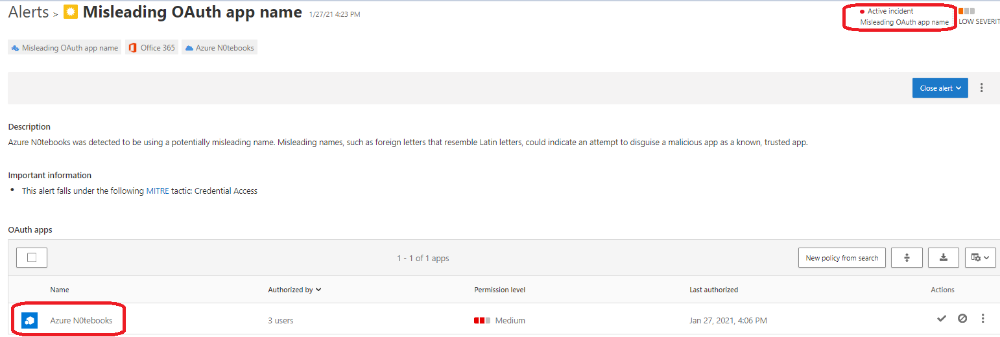

This can be identified also from MCAS raw data

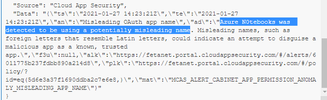

Latency in this alert was approximately 20min in our tests.

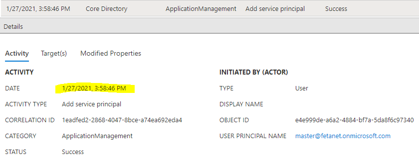

*Side note: During tests, we found that some application names were not accepted as registered applications but couldn’t find proper documentation about the topic.*

### MCAS Custom Rules

Besides the built-in rules MCAS offers a way to create own custom policies based on the organization use cases. Useful in this case would be an alert every time when a user adds application that has “high” category permissions to Azure AD or the application category is “rare” or “uncommon”.

**OAuth App Added with High permissions**

- In this example the idea is to detect the application added to Azure AD that has high permissions and it’s “Community use” equals to “Rare & Uncommon”.

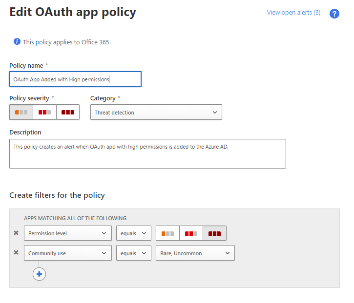

When MCAS scans the applications and detects possible malicious one with high permission, the alert is created based on the policy settings.

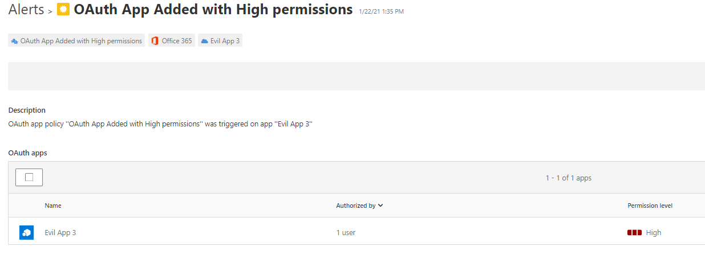

## App Governance - Microsoft Cloud App Security (MCAS) add-on (AppG)
App Governance, which is MCAS add-on, is the newest addition to Microsoft security solutions. Solution description from Microsoft: <em>'It's a security and policy management capability that customers can use to monitor and govern app behaviors and quickly identify, alert, and protect from risky behaviors with data, users, and apps. App governance is designed for&nbsp;OAuth-enabled apps&nbsp;that access&nbsp;Microsoft 365&nbsp;data via&nbsp;<a rel="noreferrer noopener" href="https://docs.microsoft.com/en-us/graph/use-the-api" target="_blank">Microsoft Graph APIs</a>'. &nbsp;</em></p>

At the time of writing (09/13/2021) AppG is in public preview mode. Take into account that even it's MCAS add-on it requires a license, at least for now.

### Architecture 

Data is collected from different data sets such as Azure AD & Cloud App Security, the App Governance collect information and provides the data in a single pane of glass in compliance center (compliance.microsoft.com).

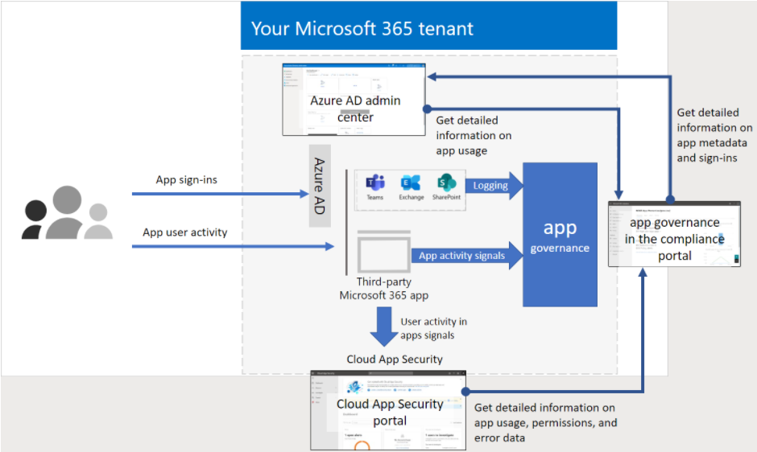

### Detection Policies and Visibility in App Governance
AppG provides richer information than MCAS alone because it leverages data from both, Azure AD & MCAS. You can see information such as app permissions, usage and publisher information that helps to determine app risk levels from compliance point of view.

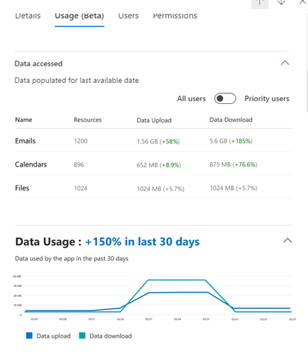

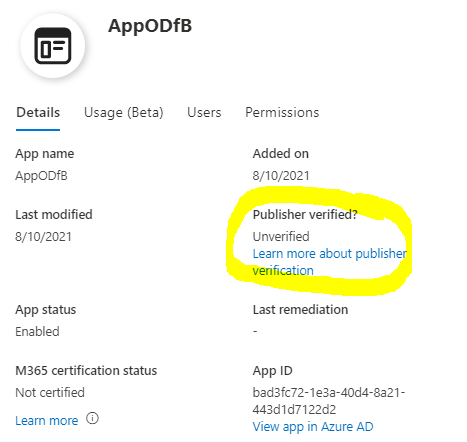

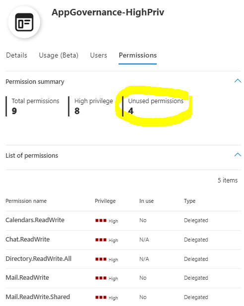

## Azure Sentinel

Azure Sentinel offers multiple out of the box rules related to the application administrative actions. In the picture below there are listed all default Azure AD application related analytic rules.

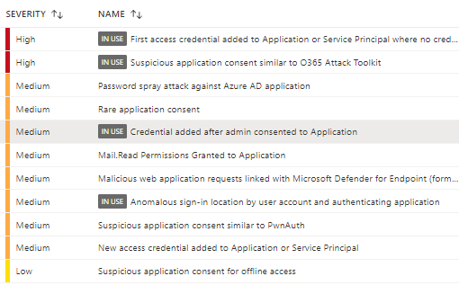

When integration between M365 Defender (or MCAS) and Azure Sentinel is in place, and incidents are created based on MCAS alerts (MCAS doesn’t have incidents) you can expect to find the same MCAS application related alerts from the Azure Sentinel.

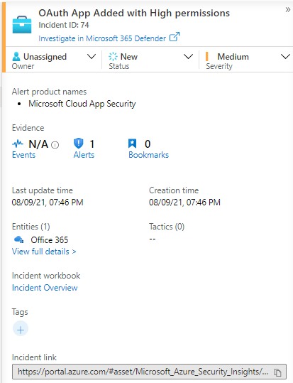

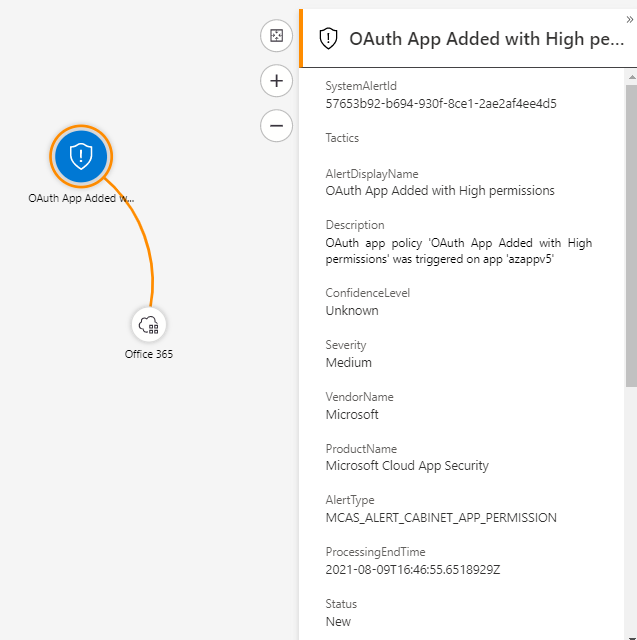

**Azure Sentinel out of the box rules -** Mail.Read Permissions Granted to Application & Rare Application Consent - Incident examples

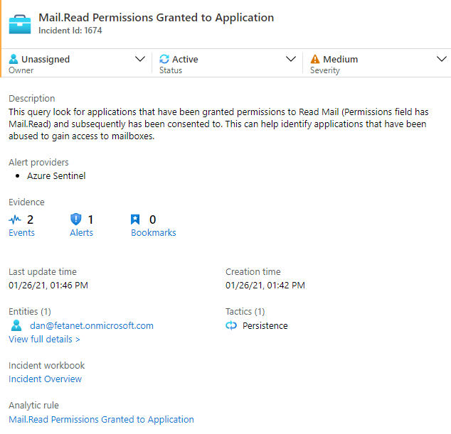

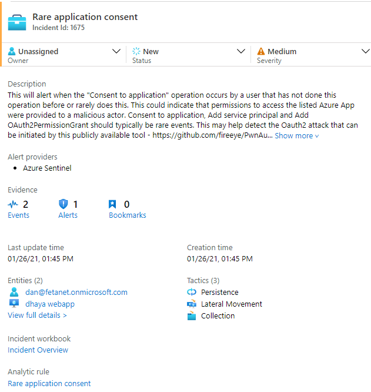

# Mitigation (and Reduced Attack Surface)

## Disable Default Permissions for App Registrations

By default, every member of the Azure AD tenant is able to register applications and manage all aspects (“Owner” permissions) of the “application registration” they have created on their own:

AAD > [User settings](https://portal.azure.com/#blade/Microsoft_AAD_IAM/ActiveDirectoryMenuBlade/UserSettings)

> “App Registrations”:

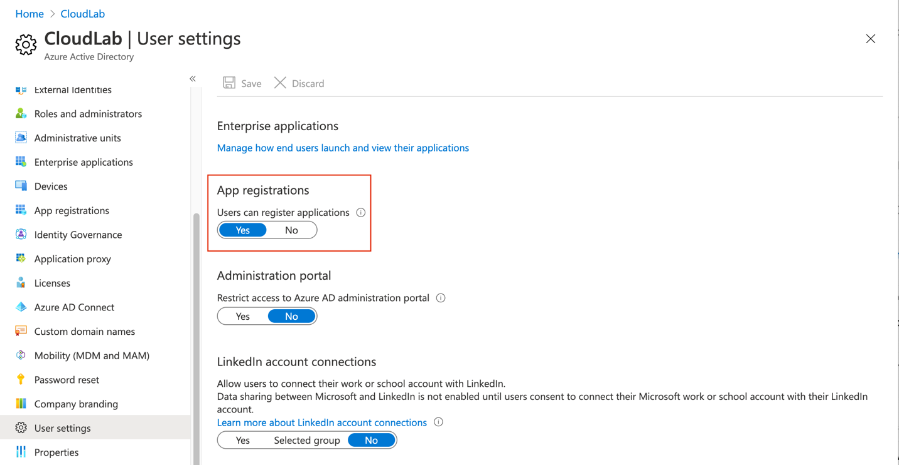

It’s strongly recommended to restrict the permission to create and manage app registration for end-users. The following options can be used for delegation of this permissions to (DevOps) user accounts:

- Application Owner: Delegation of all management permissions to a specific (and existing) application. Only users can be assigned as “Owner” (no support of groups).
    - In addition, role assignment to “[Application Developer](https://docs.microsoft.com/en-us/azure/active-directory/roles/permissions-reference#application-developer)” allows a user to create app registration independently from the restriction of the (default) user settings.
    Creator of app registrations will be assigned as “Owner” (as already mentioned) and therefore also able to manage the registration. Consider the wide range of potential permissions of this role!
- [Built-in Directory Role](https://docs.microsoft.com/en-us/azure/active-directory/roles/permissions-reference): Delegation of application management (as part of the existing directory roles “[Application Administrator](https://docs.microsoft.com/en-us/azure/active-directory/roles/permissions-reference#application-administrator)" or “[Cloud Application Developer](https://docs.microsoft.com/en-us/azure/active-directory/roles/permissions-reference#cloud-application-administrator)") on scope of directory- or object-level (application/service principal).
- [Custom Directory role](https://techcommunity.microsoft.com/t5/azure-active-directory-identity/custom-roles-for-app-registration-management-is-now-in-public/ba-p/789101): Create a custom role to delegate a specific permission set on [app registration](https://docs.microsoft.com/en-us/azure/active-directory/roles/custom-available-permissions) and [enterprise app registration](https://docs.microsoft.com/en-us/azure/active-directory/roles/custom-enterprise-app-permissions) on a directory- object-level scope. Delegation on level of Administrative Units (AU) is not possible yet.

It’s recommended to strictly avoid managing app registration by using the “Global Admin” role.

*Side note: Consider the limitation to create application objects as a creator (currently a directory-level quota of 250 objects).*

*Side note: CIS Microsoft Azure Foundation Benchmark (Version 1.1) includes also the recommendation to ensure that “Users can register applications” is set to “No'” (CIS Control 1.11). [“Azure Fundamentals” Security Checklist for Identity Management](https://docs.microsoft.com/en-us/azure/security/fundamentals/steps-secure-identity#restrict-user-consent-operations) includes this consideration as well.*

*Side note: Consider the privilege escalation path of delegation on application management in Azure AD (especially on scope of directory) which can give the ability to impersonate the application’s identity.*

*Side note: Arbitrary app registrations: If you have Azure AD tenant at it's default settings, then any user with member permissions can create arbitrary app registrations in the tenant. These users can get valid Access Tokens with the Audience value for any API you created in the tenant, or in any audeince of the multi-tenant apps. This is possible by the use of client credentials flow. These apps don't have to be related to the API in any way, other than being in the same tenant.*

**References about the side note** : Related also to multi-tenant apps and arbitrary registrations from [joonasw.net](https://joonasw.net/view/always-check-token-permissions-in-aad-protected-api)

## Restrict User Consent Permissions for End-Users

All members of the Azure AD tenant are able to set user consent for applications by default:

AAD > User Settings > [Enterprise Applications](https://portal.azure.com/#blade/Microsoft_AAD_IAM/StartboardApplicationsMenuBlade/UserSettings/menuId/UserSettings) > ”Enterprise Applications”

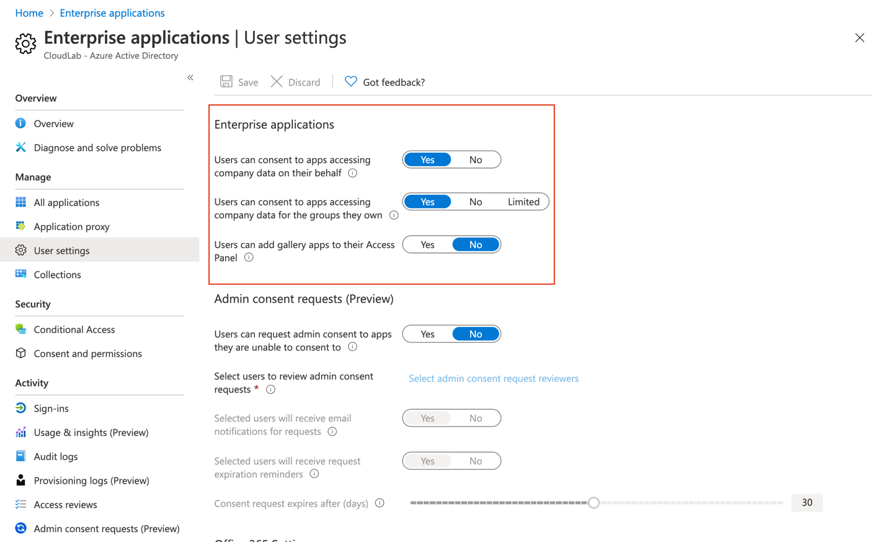

*Side note: A minimum protection to prevent “illicit consent requests” is enabled by default.If a risky consent request is detected by Microsoft, the user consent will be blocked and requires a “step-up” to admin consent. More information about the “Risk-based step-up consent” is available on [Microsoft Docs](https://docs.microsoft.com/en-us/azure/active-directory/manage-apps/configure-user-consent?tabs=azure-portal#risk-based-step-up-consent).*

In the past, Microsoft already recommends to disable “user consent” even if the default settings for new tenant have not been changed. But for a long time, no options between enabling user consent to all apps (risky) and disabling any user consent (bad user experience, approval by admin required) was available.

In the recent years, Microsoft has introduced new configuration options which allows to find a balance between these options. Allowing user consent on a selected set of permissions or only to verified apps can be configured now. The following “Consent and Permission” blade offers the settings to fine-tune the granting of user consent:

AAD > User Settings > Enterprise Applications > Consent and Permissions > “
[User consent settings](https://portal.azure.com/#blade/Microsoft_AAD_IAM/StartboardApplicationsMenuBlade/UserSettings/menuId/UserSettings)”

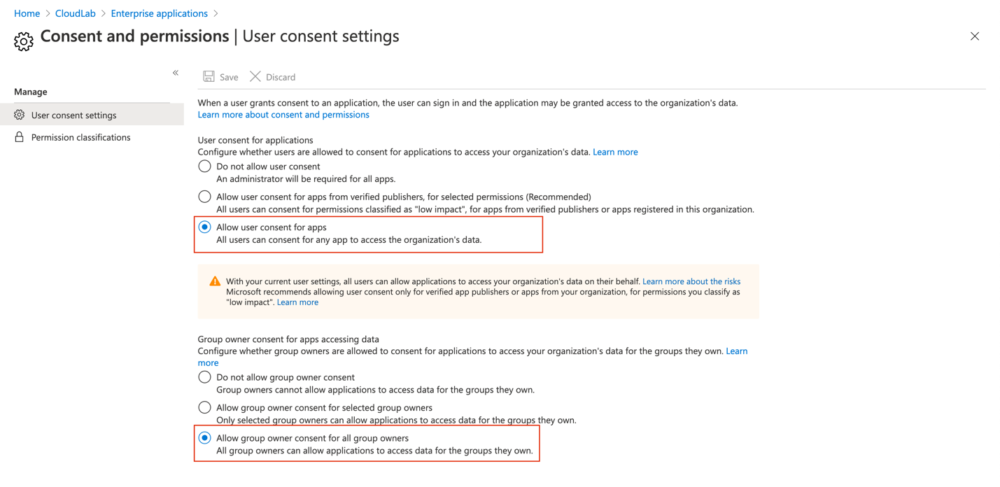

**User consent for applications:**
Microsoft recommends to “*allow consent for apps from verified publishers*” on “*selected permissions*” only to restrict the grant and reduce the attack surface for mitigation of illicit consent attacks.
Apps from your own tenant will be allowed for “user consent” even they not presenting a verified publisher certificate.

*Side note: Starting in November 2020, Microsoft blocks user consent to “[most newly registered multi-tenant apps](https://docs.microsoft.com/en-us/azure/active-directory/develop/publisher-verification-overview#benefits)” without verified publisher.*

**Group owner consent for apps accessing data:**[Resource-specific consent](https://docs.microsoft.com/en-us/microsoftteams/resource-specific-consent) can be delegated by selecting “*allow group owner consent for all group owners*” option or restrict this permission by choosing “*owner of selected group(s)*”.
This setting can be helpful to empower “Team Owner” to set consent of 3rd party apps for accessing to Microsoft Teams data. [App Permission Policies](https://docs.microsoft.com/en-us/microsoftteams/teams-app-permission-policies) in Microsoft Teams can be used to restrict the apps which can be granted by the Team Owners.

A list of resource-specific permission that can be used for consent is available in [Microsoft Docs](https://docs.microsoft.com/en-au/microsoftteams/platform/graph-api/rsc/resource-specific-consent).

## Permission Classification as “Low-Risk”

API permissions (e.g., “User.Read” from Microsoft Graph) can be configured in the “[Permission classifications](https://docs.microsoft.com/en-us/azure/active-directory/manage-apps/configure-permission-classifications?tabs=azure-portal)” to classify and add them to the “Low risk” condition set.
This defines and restricts the scope of permission which can be granted by the user consent:

AAD > User Settings > Enterprise Applications > ”Consent and Permissions” > “[Permission Classification](https://portal.azure.com/#blade/Microsoft_AAD_IAM/ConsentPoliciesMenuBlade/Permissions)"

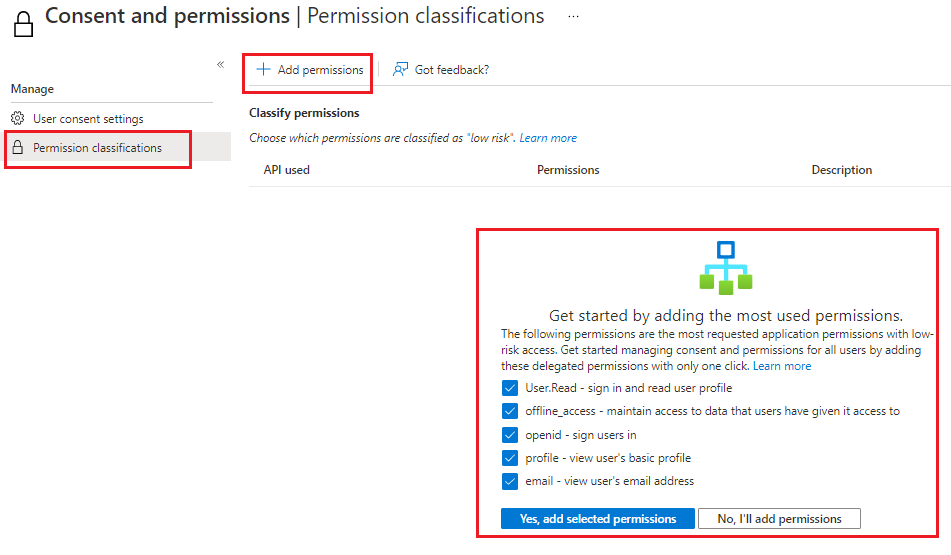

Disabling “app registration of users” and restricting user consent to “verified publishers” (or internals apps) on the low-risk permission are included in the recommendation from Microsoft to offer a “secure” user consent configuration.

This setup may reduce user friction and avoid users from signing-up for applications with non-Azure AD credentials. Nevertheless, monitoring and auditing of consent permissions becomes in this scenario essential.

Requests for user consent outside of the “classified permissions” or “verified publisher” scope will be stepped-up to admin consent.

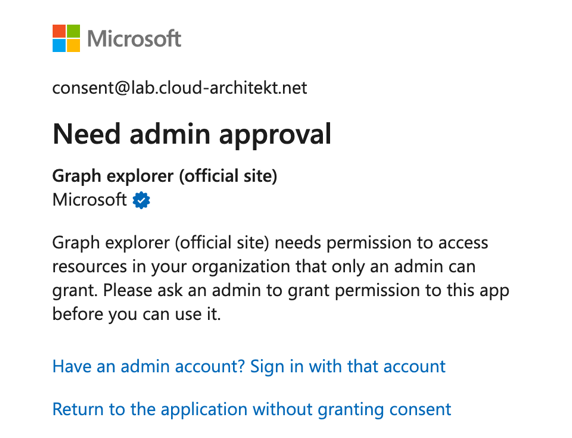

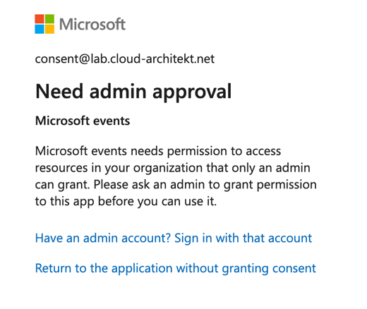

*Two examples of consent requests that needs admin approval:“Microsoft Graph Explorer” is labeled as “verified publisher” but needs permission outside of the classified user permission. “Ignite Registration page” (“Microsoft Events”) needs an admin approval because of a missing verified publisher status.*

*Side Note: Members assigned to ”[Application Developer](https://docs.microsoft.com/en-us/azure/active-directory/roles/permissions-reference#application-administrator)” or “(Cloud) [Application Admin](https://docs.microsoft.com/en-us/azure/active-directory/roles/permissions-reference#application-administrator)” role is able to grant user consent permission for their own user account even if the user consent is disabled or restricted (by permission classification or consent policy).*

*Side note: Consider and verify your security requirements in concerns about rely on the trust of Microsoft’s “publisher verification” as part of your “supply chain” to register 3rd party apps in your tenant. The “publisher verification” can be “passed” by any trusted Microsoft partner company and is not a certificate for security checks (compared to app store regulations). Take care of the details of the verification process that Microsoft uses to “verify” the publisher. More details are available on the [Microsoft Docs article.](https://docs.microsoft.com/en-us/azure/active-directory/develop/publisher-verification-overview#benefits)*

## Advanced policies to restrict user consent

All default consent settings are defined and stored as “built-in app consent policies” which cannot be edited or deleted. These policies start with the prefix “microsoft” can be listed by using the Azure AD Cmdlet “Get-AzureADMSPermissionGrantPolicy”:

- microsoft-all-application-permissions
Default permission policy of all application permissions, for all APIs and for any client application (even they have no verified publisher).

- microsoft-all-application-permissions-verified
Default permission policy of all application permission for all clients from verified publishers or your organization.
- microsoft-application-admin
Policy which defines the permission for (Cloud) Application Administrators
(grant permission to tenant-wide admin consent)
- microsoft-company-admin
Policy which defines the permission for Global Administrators.
- microsoft-user-default-legacy
Default policy for all member users of Azure AD if user consent is allowed.
- microsoft-user-default-low
Default policy for all member users of Azure AD if user consent from verified publishers on select permissions (classification) is configured.

Admins are able to use “Azure AD (Preview) PowerShell module” and “Microsoft Graph API” to manage custom (user) consent policies and apply them on conditions of the app such as “ClientApp ID”, "Publisher ID” or “Permission Set” (Classification).
A list of supported conditions is documented in [Microsoft Docs](https://docs.microsoft.com/en-us/azure/active-directory/manage-apps/manage-app-consent-policies#supported-conditions).

Default “authorization policy” can be displayed by using the cmdlet
“Get-AzureADMSAuthorizationPolicy” which includes the “Permission Grant Policy” for the default user role (member type):

```
Id : authorizationPolicy
OdataType :
BlockMsolPowerShell :
Description : Used to manage authorization related settings across the company.
DisplayName : Authorization Policy
EnabledPreviewFeatures : {}
GuestUserRoleId : 10dae51f-b6af-4016-8d66-8c2a99b929b3
PermissionGrantPolicyIdsAssignedToDefaultUserRole : {ManagePermissionGrantsForSelf.microsoft-user-default-low}
```

A list of all conditions that are included in the “Microsoft-User-Default-Low" policy can be listed by using the “Get-AzureADMSPermissionGrantConditionSet” cmdlet:

```powershell
“Get-AzureADMSPermissionGrantConditionSet –PolicyId microsoft-user-default-low –ConditionSetType includes”

Id : 9c72ced4-50c7-4486-933e-6756d554b199
PermissionType : delegated
PermissionClassification : low
ResourceApplication : any
Permissions : {all}
ClientApplicationIds : {all}
ClientApplicationTenantIds : {36955ea9-c98e-4749-b603-ffefe652dd90}
ClientApplicationPublisherIds : {all}
ClientApplicationsFromVerifiedPublisherOnly : False
Id : 8ce99f96-730c-4ebd-8397-07ee65942b97
PermissionType : delegated
PermissionClassification : low
ResourceApplication : any
Permissions : {all}
ClientApplicationIds : {all}
ClientApplicationTenantIds : {all}
ClientApplicationPublisherIds : {all}
ClientApplicationsFromVerifiedPublisherOnly : True
```

The first entry shows that the “user consent” grant is allowed to all registered “ClientApplications” within the own tenant if requested permissions passing the classification (“Low”). Verified publisher state of the application is not required.

The second entry restricts all other “ClientApplications” to be validated from a “Verified Publisher” and user consent will be granted to permissions from the “Low” classification profile only.

You are able to create a “[custom app consent policy](https://docs.microsoft.com/en-us/azure/active-directory/manage-apps/manage-app-consent-policies#create-a-custom-app-consent-policy)" as described in the Microsoft Docs article and defines them as a new default for the members as follows:

```powershell
Set-AzureADMSAuthorizationPolicy -Id "authorizationPolicy" `
-PermissionGrantPolicyIdsAssignedToDefaultUserRole @("managePermissionGrantsForSelf.{consent-policy-id}")
```

### Custom Roles and App Consent Policies

*Management of app consent policies and the permission to grant consent permissions can be delegated as “[Custom Role](https://docs.microsoft.com/en-us/azure/active-directory/roles/custom-consent-permissions#managing-app-consent-policies)" in Azure AD. Especially, the option to delegate consent permission in combination with a custom role and Azure AD PIM should be very interesting. The following sample shows a custom role to grant admin consent (*managePermissionGrantsForAll *) for all apps on the condition of the “AdminCustom-Policy"*

```powershell

# Collect input parameters for AAD custom roles
$displayName = "Application Consent Approver"
$description = "Can manage basic aspects of application registrations."
$templateId = (New-Guid).Guid

# Permissions that needs to be grantedI
$allowedResourceAction =
@(
"microsoft.directory/servicePrincipals/managePermissionGrantsForAll.my-admincustom-policy"
)
$rolePermissions = @{'allowedResourceActions'= $allowedResourceAction}

# Create new custom admin role
$customAdmin = New-AzureADMSRoleDefinition -RolePermissions $rolePermissions -DisplayName $displayName -Description $description -TemplateId $templateId -IsEnabled $true
```

The created custom role will be shown in the Azure AD Directory Roles overview:

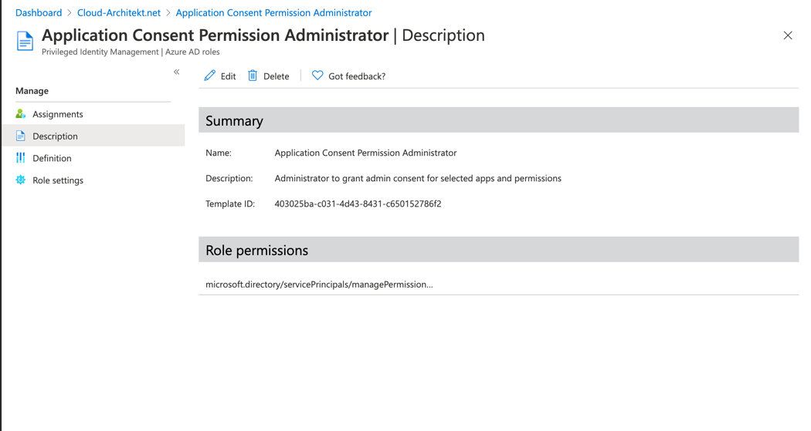

Eligible or permanent assignments to other users are possible and also the delegation scope on application, service principals or directory-level:

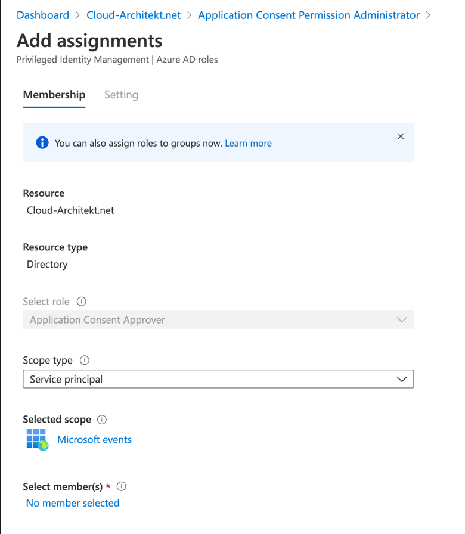

## Approval Workflow for (Tenant-Wide) Admin Consent

Configuration of the “[admin consent workflow](https://docs.microsoft.com/en-us/azure/active-directory/manage-apps/configure-admin-consent-workflow)" is recommended to offer end users a workflow to request for consent if they aren’t allowed by the “app consent policy” or admin consent of a permission is needed.

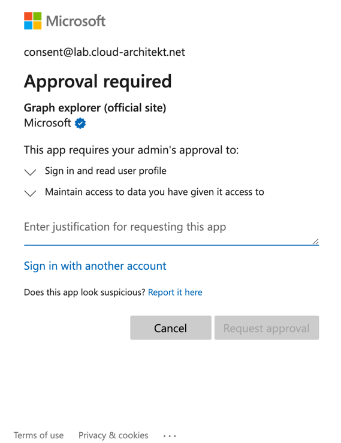

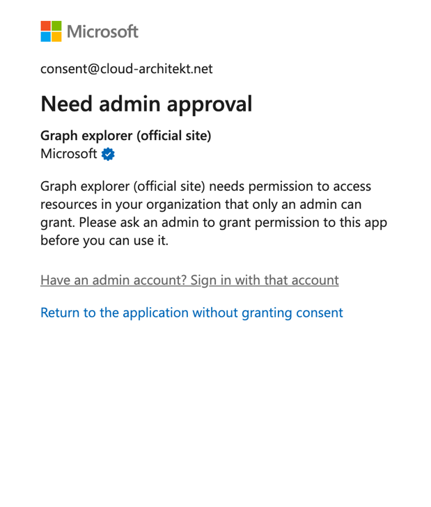

Otherwise, the user will be running into the dialog “Need admin approval” without any further assistance or option (as you can see in the right screenshot above).

The admin consent request workflow is disabled by default and needs to be configured in the following blade:

AAD > User Settings > Enterprise Applications > ”[Admin consent requests (Preview)](https://portal.azure.com/#blade/Microsoft_AAD_IAM/StartboardApplicationsMenuBlade/UserSettings/menuId/)”

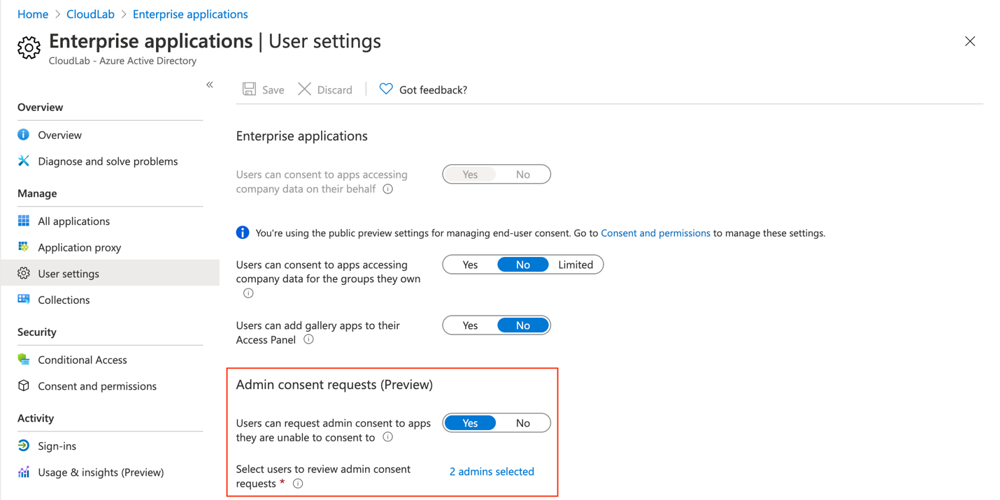

Microsoft released some [recommendations on implementation and change process of admin consent request workflow](https://docs.microsoft.com/en-us/azure/active-directory/manage-apps/configure-admin-consent-workflow). It’s important that every admin (who is part of the workflow process) 
- Is able to [evaluate the request](https://docs.microsoft.com/en-us/azure/active-directory/manage-apps/manage-consent-requests#evaluating-a-request-for-tenant-wide-admin-consent) based on Microsoft guidance
- Carefully and estimate the potential risk of the requested app. 
    - Verified publisher status and any compliance details from “MCAS Cloud App Catalog” should be included in the review.

*Side note: Microsoft released a documentation for admins with best practices in [managing consent to applications and evaluating consent requests](https://docs.microsoft.com/en-us/azure/active-directory/manage-apps/manage-consent-requests).*

Admins can be added to the approval request workflow from the following configuration blade if they have an active (eligible) or permanent role assignment to Global, (Cloud) Application Administrator Role.

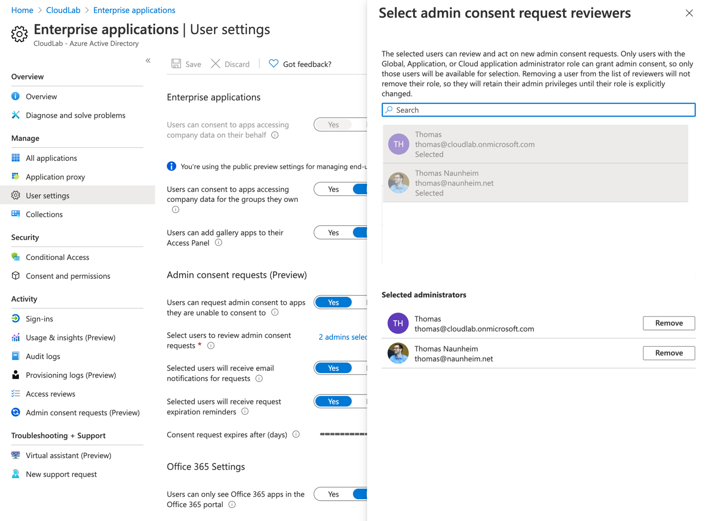

*Side Note: You should be able to choose an eligible role member as “consent reviewer” if the role is activated during the time of configuration. But the visibility of “admin consent requests” for eligible role members are limited to the time of active assignment of the role.*

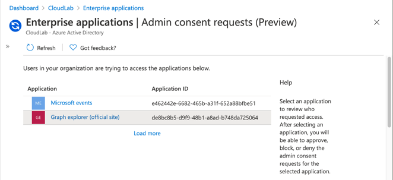


*On the left side, permanent role member who can see all requests. Eligible role member (on the right side) is able to see only requests during the time of activated assignment.*

Notifications about new or expired “admin consent requests” will be sent to the selected reviewer.

*Side Note: During my tests, I haven’t received any notifications if the privileged accounts are just configured by a valid mailbox as part of the "Alternate email” attribute.*

Activities of the approval workflow [will be included in the Azure AD Audit Logs](https://docs.microsoft.com/en-us/azure/active-directory/manage-apps/configure-admin-consent-workflow#audit-logs).

*Side Note: Admin Consent outside of the configured Approval Workflow:([Cloud](https://docs.microsoft.com/en-us/azure/active-directory/roles/permissions-reference#cloud-application-administrator)) “[Application Administrator](https://docs.microsoft.com/en-us/azure/active-directory/roles/permissions-reference#application-administrator)” and “Global Admin” role members are able to grant admin consent manually even they are not included in the admin approval request and can’t see the items in the workflow request blade.*

## Alternate options or restrictions to Tenant-Wide Admin Consent

Admin Consent will be granted on a tenant-wide level for all users. Therefore, you should consider if it's needed to delegate the permissions on this scope. Especially if the application not requires any permission with admin approval. Keep in mind, that most “admin consent requests” will be created because the user isn’t able to grant “user consent” on the restricted configuration.
Therefore, you should verify if the requested app has a broad user scope and decide if a tenant-wide consent is reasonable.
Otherwise, there are two options to restrict this scope even they are more expensive in aspects of efforts by end-user grant and operational tasks:

- **Granting tenant-wide consent of delegated permissions and limit the access**
This could be your favorite option if you want to prevent users from granting user consent (or the need of admin consent) but restrict the access to an app with admin consent. In this case, configure the [user assignment for the related app](https://docs.microsoft.com/en-us/azure/active-directory/manage-apps/assign-user-or-group-access-portal) and limited the access by a [Conditional Access Policy](https://docs.microsoft.com/en-us/azure/active-directory/conditional-access/concept-conditional-access-cloud-apps).
- **Create a “permission grant condition set” for all users on the specific application:**
The following configuration could be preferred if you are already using a “Custom app consent policy” and want to allow “user consent” for this specific app. In this sample, “Microsoft Ignite Registration page” will be added as individual entry in the user permission grant policy to allow “user consent” on the named conditions:

```powershell

    ## App Id from the Admin Approval Request
    $clientAppId = "e462442e-6682-465b-a31f-652a88bfbe51"

    ## Permission of the Consent Request
    $permission = @("User.Read")
    $permissionIds = $resource.OAuth2Permissions `
    | Where-Object { $permission.Contains($_.Value) } | Select-Object -ExpandProperty Id

    ## App Id of the Resource Application (in this case Azure AD Graph)
    $resource = Get-AzureADServicePrincipal -Filter "servicePrincipalNames/any(n:n eq '**[https://graph.windows.net](https://graph.windows.net/)')"

    ## Create new Grand Condition Set  
    New-AzureADMSPermissionGrantConditionSet `
    - PolicyId "my-custom-policy" `
    - ConditionSetType "includes" `
    - ClientApplicationIds @($clientAppId) `
    - ResourceApplication $resource.AppId `
    - PermissionClassification "low" `
    - PermissionType "delegated" `
    - Permissions $permissionIds
    
    #Update on Authorization Policy
    Set-AzureADMSAuthorizationPolicy -Id "authorizationPolicy" `
    -PermissionGrantPolicyIdsAssignedToDefaultUserRole @("managePermissionGrantsForSelf.my-custom-policy") 
```

*Side note: Joosua has written a blog post about an alternate approach for [granting OAuth2 permissions without tenant wide consent](https://securecloud.blog/2021/03/09/poc-grant-azure-ad-oauth2-permissions-without-tenant-wide-consent/) which results in adding the permission for just single user and permission object, instead of granting permissions for the entire tenant.*

# Recommendations
    

| Option|Free|P1|P1+MCAS 
|---|---|---|---|
|AAD Logs|Incl. sentinel|Incl. sentinel|Incl. sentinel
|Consent Policy| incl.| incl.| incl.|
| Auto-remediation| ||MCAS|

# Further reading
- [Azure AD, apps and consent grant (service accounts)](https://ingogegenwarth.wordpress.com/2021/02/23/aad-apps-consent-service-accounts/)
- [TechCommunity Blog Post: Azure AD: Custom Application Consent Policies](https://techcommunity.microsoft.com/t5/core-infrastructure-and-security/azure-ad-custom-application-consent-policies/ba-p/2115812)

# References

- [Apps & service principals in Azure AD - Microsoft identity platform | Microsoft Docs](https://docs.microsoft.com/en-us/azure/active-directory/develop/app-objects-and-service-principals)

- [Microsoft identity platform scopes, permissions, and consent | Microsoft Docs](https://docs.microsoft.com/en-us/azure/active-directory/develop/v2-permissions-and-consent)

- [Azure AD app consent experiences - Microsoft identity platform | Microsoft Docs](https://docs.microsoft.com/en-us/azure/active-directory/develop/application-consent-experience)

- [Azure AD consent framework - Microsoft identity platform | Microsoft Docs](https://docs.microsoft.com/en-us/azure/active-directory/develop/consent-framework)

- [Microsoft identity platform admin consent protocols | Microsoft Docs](https://docs.microsoft.com/en-us/azure/active-directory/develop/v2-admin-consent)

- [Get access on behalf of a user - Microsoft Graph | Microsoft Docs](https://docs.microsoft.com/en-us/graph/auth-v2-user?context=graph/api/1.0)

- [Microsoft Docs: Take action on overprivileged or suspicious applications in Azure Active Directory](https://docs.microsoft.com/en-us/azure/active-directory/manage-apps/manage-application-permissions#investigate-a-suspicious-application)

- [How are application objects and service principals related to each other?](https://docs.microsoft.com/en-us/azure/active-directory/develop/active-directory-how-applications-are-added#how-are-application-objects-and-service-principals-related-to-each-other)

- [App consent permissions for custom roles in Azure Active Directory | Microsoft Docs](https://docs.microsoft.com/en-us/azure/active-directory/roles/custom-consent-permissions)
