# Abuse of Microsoft Entra Connect Application-based Authentication

_Author: Sami Lamppu and Thomas Naunheim_
_Reviewers: Nestori Syynimaa, Robbe Van den Daele_
_Created: October 2025_

- [Abuse of Microsoft Entra Connect Application-based Authentication](#abuse-of-microsoft-entra-connect-application-based-authentication)
- [Introduction](#introduction)
  - [Authentication Changes](#authentication-changes)
    - [How It Works (High-Level)](#how-it-works-high-level)
  - [Attack scenarios with Legacy (current) Authentication Model](#attack-scenarios-with-legacy-current-authentication-model)
- [Attack scenarios](#attack-scenarios)
    - [Mapping to MITRE ATT\&CK Framework](#mapping-to-mitre-attck-framework)
    - [Tactics, Techniques \& Procedures (TTPs) of the named attack scenarios](#tactics-techniques--procedures-ttps-of-the-named-attack-scenarios)
  - [Automated Attack Simulation with Certificate and AADInternals](#automated-attack-simulation-with-certificate-and-aadinternals)
    - [Prerequisites](#prerequisites)
    - [Load the function into Windows PowerShell and modify the parameters to your environment](#load-the-function-into-windows-powershell-and-modify-the-parameters-to-your-environment)
    - [Run automated function and execute AADInternals](#run-automated-function-and-execute-aadinternals)
  - [Adding new credentials via existing Entra Connect certificate](#adding-new-credentials-via-existing-entra-connect-certificate)
- [Hunting and Detection Capabilities](#hunting-and-detection-capabilities)
  - [Custom Detection and Hunting Queries](#custom-detection-and-hunting-queries)
    - [Identify servers with installed Entra Connect components](#identify-servers-with-installed-entra-connect-components)
    - [List Entra Connect related Application Identities (including NodeIds from XSPM)](#list-entra-connect-related-application-identities-including-nodeids-from-xspm)
    - [Existing owners on Application or Service Principals through Graph API](#existing-owners-on-application-or-service-principals-through-graph-api)
    - [Added credentials on application or service principal of ABA identity](#added-credentials-on-application-or-service-principal-of-aba-identity)
    - [Certificate outside of TPM](#certificate-outside-of-tpm)
    - [Sign-In with a suspicious Credential Type](#sign-in-with-a-suspicious-credential-type)
    - [Sign-in with different certificates at the same time](#sign-in-with-different-certificates-at-the-same-time)
    - [Unusual/different IP address of Entra Sync operations compared to sign-in](#unusualdifferent-ip-address-of-entra-sync-operations-compared-to-sign-in)
    - [Token acquisition outside of Entra Connect Server](#token-acquisition-outside-of-entra-connect-server)
  - [Advanced detection for correlation of key rotation between Entra Connect server and ABA identity](#advanced-detection-for-correlation-of-key-rotation-between-entra-connect-server-and-aba-identity)
    - [Ingestion of Entra Connect Server Logs](#ingestion-of-entra-connect-server-logs)
    - [Sample query on ABA key rotation event in Microsoft Sentinel](#sample-query-on-aba-key-rotation-event-in-microsoft-sentinel)
    - [Sign-In with a New Certificate that has not been rotated or created by Entra Connect](#sign-in-with-a-new-certificate-that-has-not-been-rotated-or-created-by-entra-connect)
- [Mitigations](#mitigations)
  - [Foundational](#foundational)
    - [Use Trusted Plaform Module (TPM) with ABA](#use-trusted-plaform-module-tpm-with-aba)
    - [Enable App Property Lock](#enable-app-property-lock)
    - [Review the Directory and API Permissions roles with privileges to take over App Authentication](#review-the-directory-and-api-permissions-roles-with-privileges-to-take-over-app-authentication)
    - [Avoid any owner delegations to service principals and application objects](#avoid-any-owner-delegations-to-service-principals-and-application-objects)
    - [Enforce Application Management Policy to block client secrets](#enforce-application-management-policy-to-block-client-secrets)
    - [Review recommendations to identify stale ABA Identities](#review-recommendations-to-identify-stale-aba-identities)
  - [Intermediate](#intermediate)
    - [Apply Conditional Access Policies for blocking access outside of Entra Connect IP Addresses](#apply-conditional-access-policies-for-blocking-access-outside-of-entra-connect-ip-addresses)
    - [Apply Risk-based Conditional Access Policies for Entra Connect ABA](#apply-risk-based-conditional-access-policies-for-entra-connect-aba)
  - [Advanced](#advanced)
    - [Enforce Application Management Policy to restrict certificates from known Sub CA](#enforce-application-management-policy-to-restrict-certificates-from-known-sub-ca)
- [Incident Response (Containment)](#incident-response-containment)
    - [Support of Continuous Access Evaluation?](#support-of-continuous-access-evaluation)


# Introduction

In 2022, we published a Chapter about ‘**Abuse of Microsoft Entra Connect Sync Service Account’,** which focuses on the following attack scenarios:

- How an adversary can access the unprotected Entra Connect server(s) or exfiltrate uncontrolled/unencrypted backups that allow access to the service database.
- Abusing service account credentials.
- Stealing refresh/access tokens of a high-privileged user who is used to maintain Entra Connect-related settings (Hybrid Identity Administrator).

Entra Connect and its predecessors have been relaying user identity and credential pair (userPrincipalName & password) since their inception. However, this traditional method of relying on a simple username and password combination is increasingly seen as inadequate. Such credentials are inherently weak and vulnerable, making them prime targets for identity theft and various cyberattacks. We addressed these issues in an earlier chapter, which contains several protection and detection mechanisms. 

👉 Chapter “[Abuse of Microsoft Entra Connect Sync Service Account](https://github.com/Cloud-Architekt/AzureAD-Attack-Defense/blob/main/AADCSyncServiceAccount.md)”

## Authentication Changes

Microsoft announced (April 2025) a transition from using traditional username and password authentication to a more secure application identity that uses OAuth 2.0 client credential flow with certificate credentials. 

Previously, the Microsoft Entra Connector account used a username and password to authenticate sync requests. Now, there is a single-tenant application in Entra ID that authenticates using certificates and the OAuth 2.0 flow.

Details are available here - [Authenticate to Microsoft Entra ID by Using Application Identity - Microsoft Entra ID | Microsoft Learn](https://learn.microsoft.com/en-us/entra/identity/hybrid/connect/authenticate-application-id).

Deployment can be performed during an Entra Connect upgrade by installing the latest Entra Connect sync (versions equal to or higher than 2.5.3.0) or by configuring application-based authentication (ABA) using the Entra Connect wizard. The fresh installation of Entra Connect uses ABA by default for authentication.

<p align="center">
  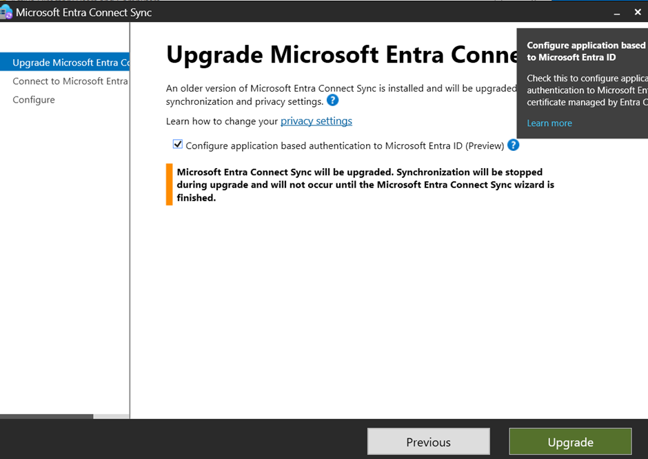
</p>

After the deployment is complete, we can see the following audit logs in Entra to confirm that the needed permissions are assigned to the app (this is the interesting part for this paper).

<p align="center">
    
</p>

> [!NOTE]
> Upgrade Entra Connect Server to latest version will automatic onboard to application-based authentication as documented in [Microsoft Learn](https://learn.microsoft.com/en-us/entra/identity/hybrid/connect/authenticate-application-id?tabs=default#onboard-to-application-based-authentication)
> Starting with version 2.5.76.0 or higher, the service will automatically configure application authentication within a six-hour window if the service is using username and password to authenticate to Microsoft Entra ID.


> [!CAUTION]
> Consider removing unused and unnecessary Microsoft Entra Connector accounts and related Conditional Access exclusions after migration.

### How It Works (High-Level)

1. **Application Creation**: A single-tenant application must be created in Entra ID (used for authentication). 
    - There is also an option for Bring Your Own Application (BYOA) if an organization wants to manage the application object by itself. By default, Microsoft manages the application. 
2. **Certificate**: Microsoft Entra Connect manages the application and certificate, including creating, rotating, and deleting the certificate. For optimal protection of the certificate's private key, the recommendation is to use a Trusted Platform Module (TPM) solution in Entra Connect server to establish a hardware-based security boundary. 
    - There is also an option for Bring Your Own Certificate (BYOC) if an organization wants to manage the application object independently. By default, Microsoft manages the application.
    - In BYOC scenario, Hardware Security Module (HSM) can be used to store the private key for additional protection.
3. **OAuth 2.0 Flow**: Leverages modern OAuth 2.0 client credential flow
4. **Hardware Security**: For optimal protection of the certificate's private key, it is recommended that the machine use a Trusted Platform Module (TPM) solution to establish a hardware-based security boundary. If TPM is not used to store the certificate private key, it is vulnerable to unauthorized access by anyone with local admin permissions to the Entra Connect Server.

<p align="center">
  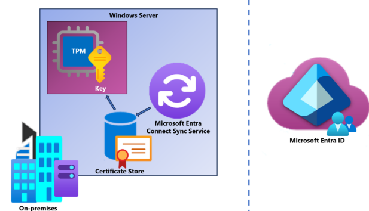
</p>

*Side note about the certificates and used store: The Microsoft official documentation highlights that the used certificate is stored on the CURRENT_USER certificate store.*

*Based on the research we've made we found that the used certificate key pair is stored on the server and the TPM/HSM but the certificate public portion location varies on the deployment model (standalone server - VSA / Entra Connect installed on domain controller - gMSA).*

 *In a standalone server scenario the Microsoft-managed certificate is stored in the 'NT Service/ADSync' certificate store.*

 *In a scenario where domain contoller hosts Entra Connect, the Microsoft-managed certificate is stored in the 'NT Service/ADSync' certificate store. The certificate can be found in a file level from the following path (figure below contains certutil dump of the public portion of the certificate): 'C:\Windows\ServiceProfiles\ADSync\AppData\Roaming\Microsoft\SystemCertificates\My\Certificates.*

<p align="center">
  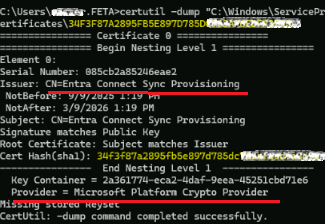
</p>

## Attack scenarios with Legacy (current) Authentication Model

Let’s return to the initial attack scenarios we demonstrated in the earlier Entra Connect-related chapter:

**How an adversary can access the unprotected Entra Connect server(s) or exfiltrate uncontrolled/unencrypted backups that allow access to the service database.**

- The scenario remains valid, but it falls outside the scope of this paper. We provide recommendations for this scenario in the recommendations section, but do not highlight the attack scenario in this paper.

**Abusing service account credentials.**

- The initial scenario is no longer valid (see bullet points below). Still, due to changes in the threat landscape in this area, we’ll elaborate on attack scenarios against single-tenant service principals and how to protect against them.
- Related to abusing Entra Connect service account credentials (legacy method), there are a few mitigations in this area:
    - Previously, the Entra Connect service account had extensive permissions to Entra ID. Microsoft mitigated this at the end of 2024. Nowadays, the service account has only “microsoft.directory/onPremisesSynchronization/standard/read” permissions to the Entra directory.
    - Additionally, when application-based authentication is implemented, the adversary does not have traditional credentials that they could use in this scenario.
- However, there is a potential attack path regarding the service principal. We’ll cover these below in the Attack Scenarios section.

**Stealing refresh/access tokens of a high-privileged user who is used to maintain Entra Connect-related settings (Hybrid Identity Administrator).**

- The attack scenario remains valid, even if the enhanced authentication method had been used. The scenario is related to Entra ID roles and not weak configuration, but rather overprivileged user accounts and missing detections in this area.
- User accounts with assigned hybrid identity administrator roles have enhanced permissions for sync service features, but they also possess extensive management permissions for service principals and app registrations in Entra ID. Additionally, members of these roles may be excluded from device compliance to allow usage on an interconnect server for management tasks. This scenario opens up a privileged escalation attack path from the on-premises Active Directory to Entra ID.

https://learn.microsoft.com/en-us/entra/identity/hybrid/connect/authenticate-application-id

[https://learn.microsoft.com/en-us/entra/architecture/service-accounts-principal](https://learn.microsoft.com/en-us/entra/architecture/service-accounts-principal)

# Attack scenarios

In this section, you can find an overview of the attack scenarios. A crucial factor is that if an adversary gains access to the Entra Connect server(s), they are already inside the network. The Entra Connect server provides a path to lateral movement from on-premises to the Microsoft cloud environment.

That being said, a compromised Entra Connect server could grant access to token artifacts of a person with the Hybrid Identity Admin (HI) role, depending on how access and roles are configured in the environment. 

Why is this important? With the HI role, an adversary gains permissions to manage applications (incl. ABA identities) and create their own SP with Entra Connect-related permissions. Many organizations lack detection in this area, which may lead to a situation where an adversary can bypass detection by renaming Entra Connect ABA identities. This is the primary reason we rely on OAuthAppInfo in detections to identify every SP with the corresponding API permissions.

**Summary of attack scenarios:**

- Add additional certificate, secret, or federated credential on app registration or service principal (SP)
    - Can be done via Cloud Admin account or existing Connect Sync certificate
    - Any role that has permissions to the application and service principal object, including:
        - Ownership
        - Service principal itself for credential rotation
        - API permissions (e.g., Application.ReadWriteAll)
        - Directory Role with related role actions (e.g., Hybrid Identity Admin or Application Admin for credential management)
- Accessing token artifacts of Hybrid Identity Admin in Entra Connect server.
- In the modern authentication model (ABA), the Entra Connect server uses an application (SP) for authentication (cert auth). The application has the following permissions to Entra ID:
    - ADSynchronization.ReadWrite.All
        - full access to sync API - AADInternals for exposing the sync API (cmdlet - syncapi)
    - PasswordWriteback.RefreshClient.All
    - PasswordWriteback.RegisterClientVersion.All
    - PasswordWriteback.OffboardClient.All
- The ability to control synchronization and password writeback processes could provide an indirect path to complete tenant compromise and lateral movement to on-premises environments. Any service principal with these permissions should be considered equivalent to a Global Administrator and secured accordingly.
- Exfiltrate or sign tokens
    - Take a look at Dirk-Jan's post in X about the attack scenario - [https://x.com/_dirkjan/status/1928384964573204845](https://x.com/_dirkjan/status/1928384964573204845)
        - On hosts without a TPM, we can dump the cert+key.
        - On hosts with TPM (second picture), we can use the key to create an auth assertion for RoadTX to request tokens.
        - PoC tooling - [Paradoxis/ADSyncDump-BOF: The ADSyncDump BOF is a port of Dirk-Jan Mollema's adconnectdump.py / ADSyncDecrypt into a Beacon Object File (BOF) with zero dependencies.](https://github.com/Paradoxis/ADSyncDump-BOF)
- Added the same API permissions to a newly created or existing app registration by the Authentication Administrator
    - App Admin has permissions to grant admin consent for non-Azure AD and -Microsoft Graph API permissions (which also includes the delegated permissions for Microsoft Entra AD Synchronization Service and Microsoft password reset service). 
    
        *Source: [https://learn.microsoft.com/en-us/entra/identity/hybrid/connect/authenticate-application-id?tabs=default](https://learn.microsoft.com/en-us/entra/identity/hybrid/connect/authenticate-application-id?tabs=default)*

        
    <p align="center">
  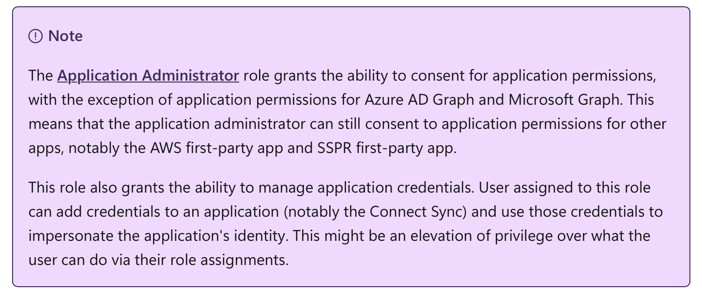


### Mapping to MITRE ATT&CK Framework

MITRE ATT&CK framework is commonly used for mapping Tactics, Techniques, and Procedures (TTPs) for adversary actions and emulating defenses on organizations around the world.

### Tactics, Techniques & Procedures (TTPs) of the named attack scenarios
The figure below shows TTPs used in this scenario in the MITRE ATT&CK framework.

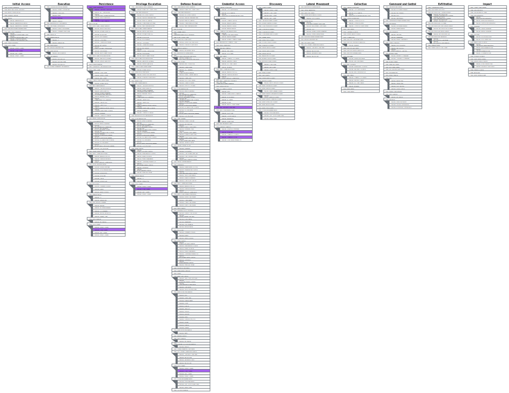

<a style="font-style:italic" href="https://mitre-attack.github.io/attack-navigator/#layerURL=https%3A%2F%2Fraw.githubusercontent.com%2FCloud-Architekt%2FAzureAD-Attack-Defense%2Fmain%2Fmedia%2Fmitre%2FAttackScenarios%2FEIDC-8.json&tabs=false&selecting_techniques=false" >Open in MITRE ATT&CK Navigator</a>


The following table contains both the earlier attack method and the new ABA-related MITRE mappings.

**TTP on abusing Entra Connect Sync Service Account**

| **Attack Scenario** | **TTPs** | **Description** |
| --- | --- | --- |
| Access to unprotected Entra Connect servers (not hardened or restricted access as Tier0 system) or exfiltration from uncontrolled/unencrypted backups allows access to the Entra Connect database passwords of Entra Connector accounts can be exfiltrated in clear text if privilege escalation to local admin permissions on the Entra Connect server was successful | Credential Access - Unsecured Credentials - Credentials In Files: [T1552.001](https://attack.mitre.org/techniques/T1552/001/) | Adversaries may search local file systems and remote file shares for files containing insecurely stored credentials. These can be files created by users to store their own credentials, shared credential stores for a group of individuals, configuration files containing passwords for a system or service, or source code/binary files containing embedded passwords. |
| Access to unprotected Entra Connect servers (not hardened or restricted access as Tier0 system) or exfiltration from uncontrolled/unencrypted backups allows access to the Entra Connect database | Credential Access - Unsecured Credentials: Private Keys: [T1552.004](https://attack.mitre.org/techniques/T1552/004/) | Adversaries may search for private key certificate files on compromised systems for insecurely stored credentials. Private cryptographic keys and certificates are used for authentication, encryption/decryption, and digital signatures.[1] Common key and certificate file extensions include: .key, .pgp, .gpg, .ppk., .p12, .pem, .pfx, .cer, .p7b, .asc. |
| Using credentials of Entra Connector accounts from unprotected Entra Connect for privileged access to Connector API,Adding temporary access pass to Entra Connector Account | Valid Accounts: Cloud Accounts: [T1078.004](https://attack.mitre.org/techniques/T1528/) | Adversaries may obtain and abuse credentials of a cloud account as a means of gaining Initial Access, Persistence, Privilege Escalation, or Defense Evasion. Cloud accounts are those created and configured by an organization for use by users, remote support, services, or for administration of resources within a cloud service provider or SaaS application. In some cases, cloud accounts may be federated with traditional identity management system, such as Windows Active Directory. Compromised credentials for cloud accounts can be used to harvest sensitive data from online storage accounts and databases. Access to cloud accounts can also be abused to gain Initial Access to a network by abusing a Trusted Relationship. Similar to Domain Accounts, compromise of federated cloud accounts may allow adversaries to more easily move laterally within an environment. Once a cloud account is compromised, an adversary may perform Account Manipulation - for example, by adding Additional Cloud Roles - to maintain persistence and potentially escalate their privileges. |
| User accounts with assigned "Hybrid Identity Administrators" roles have enhanced permissions for ’sync service features’ but also, extensive management permissions for service principals and app registrations in Entra ID which includes | Persistence - Account Manipulation: [T1098](https://attack.mitre.org/techniques/T1098/) | Adversaries may manipulate accounts to maintain access to victim systems. Account manipulation may consist of any action that preserves adversary access to a compromised account, such as modifying credentials or permission groups. These actions could also include account activity designed to subvert security policies, such as performing iterative password updates to bypass password duration policies and preserve the life of compromised credentials. In order to create or manipulate accounts, the adversary must already have sufficient permissions on systems or the domain. However, account manipulation may also lead to privilege escalation where modifications grant access to additional roles, permissions, or higher-privileged Valid Accounts. |
| Temporary Access Pass can be used by compromised high-privileged accounts or service accounts to create a backdoor on "On-Premises Directory Synchronization Service Account. |
Another ABA-based scenario is to add x509 certificate to the Connect app/SP to persist. | Account Manipulation: Additional Cloud Credentials - [T1098.001](https://attack.mitre.org/techniques/T1098/001/) | Adversaries may add adversary-controlled credentials to a cloud account to maintain persistent access to victim accounts and instances within the environment. Adversaries may add credentials for Service Principals and Applications in addition to existing legitimate credentials in Entra ID. These credentials include both x509 keys and passwords.With sufficient permissions, there are a variety of ways to add credentials including the Azure Portal, Azure command line interface, and Azure or Az PowerShell modules. |
| Directory role permissions allow to change of ownership of the "GraphAggregatorService" service principal and add app roles to self-grant arbitrary Microsoft Graph API permission. | Account Manipulation: Additional Cloud Roles - [T1098.003](https://attack.mitre.org/techniques/T1098/003/) | An adversary may add additional roles or permissions to an adversary-controlled cloud account to maintain persistent access to a tenant. For example, they may update IAM policies in cloud-based environments or add a new global administrator in Office 365 environments. With sufficient permissions, a compromised account can gain almost unlimited access to data and settings (including the ability to reset the passwords of other admins). This account modification may immediately follow Create Account or other malicious account activity. Adversaries may also modify an existing Valid Accounts that they have compromised. This could lead to privilege escalation, particularly if the roles added allow for lateral movement to additional accounts. For example, in Entra ID environments, an adversary with the Application Administrator role can add Additional Cloud Credentials to their application's service principal. In doing so the adversary would be able to gain the service principal’s roles and permissions, which may be different from those of the Application Administrator. |
| Refresh/access token from an account with assigned directory role "Hybrid Identity Administrator" can be replayed when it will be used to apply Entra Connect configuration changes. Members of this role could be excluded from device compliance to allow usage of Entra Connect Server for management tasks | Credential Access - Steal Application Access Token: [T1528](https://attack.mitre.org/techniques/T1528/) | Adversaries can steal application access tokens as a means of acquiring credentials to access remote systems and resources. Application access tokens are used to make authorized API requests on behalf of a user or service and are commonly used as a way to access resources in cloud and container-based applications and software-as-a-service (SaaS). OAuth is one commonly implemented framework that issues tokens to users for access to systems. Adversaries who steal account API tokens in cloud and containerized environments may be able to access data and perform actions with the permissions of these accounts, which can lead to privilege escalation and further compromise of the environment. |
| Invoke AzureAD/Graph modules or `Invoke‑RestMethod` on the AAD Connect host to add the key. | Execution - Command and Scripting Interpreter: PowerShell - [T1059.001](https://attack.mitre.org/techniques/T1059/001/) | Adversaries may abuse PowerShell commands and scripts for execution. PowerShell is a powerful interactive command-line interface and scripting environment included in the Windows operating system. |
| Underlying control plane call to Graph/Azure AD to add credential. | Execution - Command and Scripting Interpreter: Cloud API **-** [T1059.009](https://attack.mitre.org/techniques/T1059/009/) | Adversaries may abuse cloud APIs to execute malicious commands. APIs available in cloud environments provide various functionalities and are a feature-rich method for programmatic access to nearly all aspects of a tenant. |


## Automated Attack Simulation with Certificate and AADInternals

### Prerequisites

We have written a PowerShell function (`Invoke-EntraConnectAppAuthBackdoor`) to simulate an attack by adding a certificate as backdoor to impersonate an ABA identity. This attack connects to Microsoft Graph and uses an account with `Application.ReadWrite.All` permissions to add the backdoor certificate to the ABA identity. This means it is not required to run this script on the Entra ID Connect server directly. The `ClientId` of an existing ABA identity and the corresponding `TenantId` must be provided as parameters.

After executing the function, the following steps are automated:

- Install or update the required PowerShell modules and versions (Microsoft.Graph.Authentication and [AADInternals](https://aadinternals.com) if not already available 
- Patch [AADInternals](https://aadinternals.com) to accept access tokens with the wrong audience (if the version is less than or equal to 0.9.8)  
- Create a self-signed certificate on the service principal object as a "backdoor" and acquire tokens for Microsoft Graph and the AD Sync API  
- Update the user entity, whose `sourceAnchor` is set in `Set-AADIntUserPassword`, by using AADInternals

### Load the function into Windows PowerShell and modify the parameters to your environment

Get the PowerShell function from [Invoke-EntraConnectAppAuthBackdoor](https://github.com/Cloud-Architekt/AzureAD-Attack-Defense/blob/main/scripts/EntraConnectABA/Invoke-EntraConnectAppAuthBackdoor.ps1) for automated attack simulation and provide your `TenantId` and `ClientId` (also known as ApplicationId) as parameters.

### Run automated function and execute AADInternals

With the commands below, you can automatically simulate the attack:

```powershell
$Tokens = Invoke-EntraConnectAppAuthBackdoor
Set-AADIntUserPassword -AccessToken $tokens.adsynctoken -SourceAnchor "ShlZXwVOvk6Y+wPP1a10Tw==" -Password "NewPassword123!"
```

Output should look similar to the following:

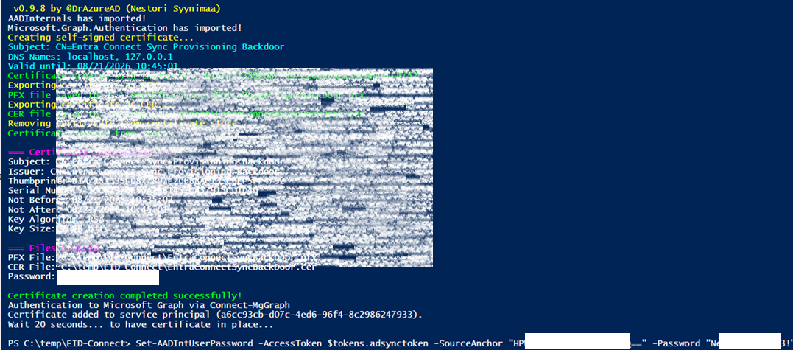

> [!CAUTION]
> Do not execute this script in a production environment.
This script is intended for testing, educational, or community-driven purposes only. Running it in production may lead to unintended consequences. Consider the [Disclaimer](https://github.com/Cloud-Architekt/AzureAD-Attack-Defense?tab=readme-ov-file#disclaimer) of this community-project.


## Adding new credentials via existing Entra Connect certificate

This attack scenario is explained in detail in a [SpecterOps blogpost](https://specterops.io/blog/2025/06/09/update-dumping-entra-connect-sync-credentials/), where they show how an existing Entra Connect certificate can be used to roll keys and add new credentials to the Connect Sync application. In this scenario no cloud admin credentials are needed, but does require code execution on the Entra Connect server instead. The proof-of-concept essentially includes:

1. Obtain access token and signed POP assertion via existing Entra Connect certificate, which can be done using [this program](https://github.com/hotnops/ECUtilities/tree/main/SharpECUtils/GetPopToken).
2. Add a new certificate using the access token and signed POP assertion, using [this program](https://github.com/hotnops/ECUtilities/tree/main/SharpECUtils/AddSPKey).

Once the new key is added, the certificate can be exported and used by the attacker to authenticate as the Connect Sync application from anywhere.

# Hunting and Detection Capabilities

The attack scenarios scoped in this paper are sophisticated and assume that the attacker is already inside the organization. That being said, the detection capabilities rely on custom detections and threat hunting more than native detection capabilities from Microsoft's security stack. 

Native Microsoft detections exist, but there are only a few of them available out of the box. The following figure is an excellent visualization of the different areas where focus needs to be in different scenarios. The attack scenarios in this paper are divided into two different areas:

- Targeting the Entra Connect server in an on-premises environment.
- Targeting application instances in a cloud environment.

The Microsoft Entra ID application consent framework is complex, encompassing multiple areas, including tenant, application & service principal, as well as consent settings. This means that there are multiple attack scenarios in this domain, which also affects hunting and detection capabilities. The figure below, by **Katie Knowles**, is an excellent visualization of different variations of persistence, method, detection, and defense mechanisms.

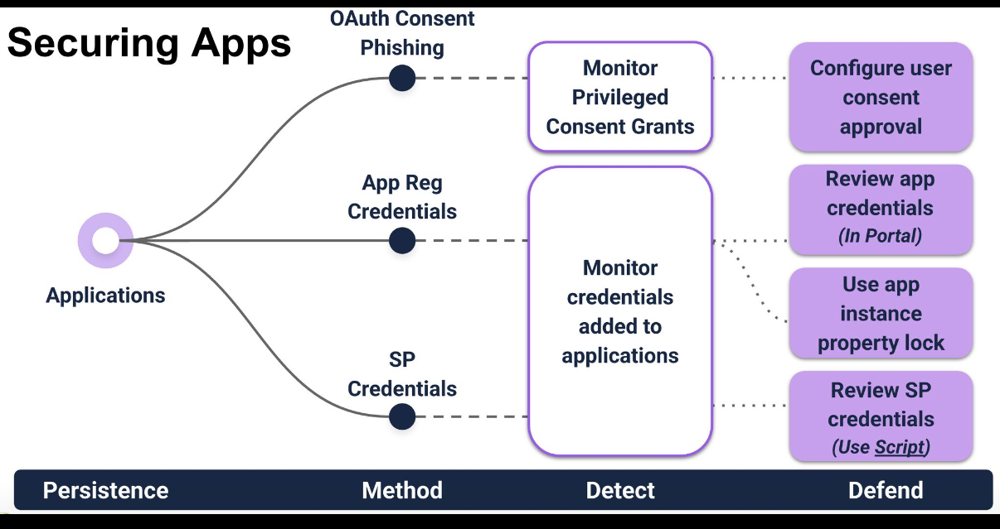

Source: Visualization of [Detect & defend vs Entra ID persistence](https://www.linkedin.com/posts/kaknowles_detect-defend-vs-entra-id-persistence-activity-7336465313120645121-v4tW?utm_source=share&utm_medium=member_ios&rcm=ACoAABKGip8B7Y1QEXnmwIBCsbE0dZRS86knh8M) by Katie Knowles

## Custom Detection and Hunting Queries

This section contains several queries that can be used to detect potentially malicious activity from the environment. The logic in the queries leverages the OAuthAppInfo data table in Defender XDR to correlate the data with various data sources in the scenarios below.

> [!NOTE]
> Since some of the below queries use the `OAuthAppInfo` table, make sure that [App Governance in Defender for Cloud Apps is enabled](https://learn.microsoft.com/en-us/defender-cloud-apps/app-governance-get-started).

### Identify servers with installed Entra Connect components

The following query can be used to identify Entra Connect servers in the environment. The query uses Exposure Management and MDE TVM data to get insights from the environment.

[Identify-EntraConnectServers.kusto](https://github.com/Cloud-Architekt/AzureAD-Attack-Defense/blob/main/queries/EntraConnectABA/Identify-EntraConnectServers.kusto)

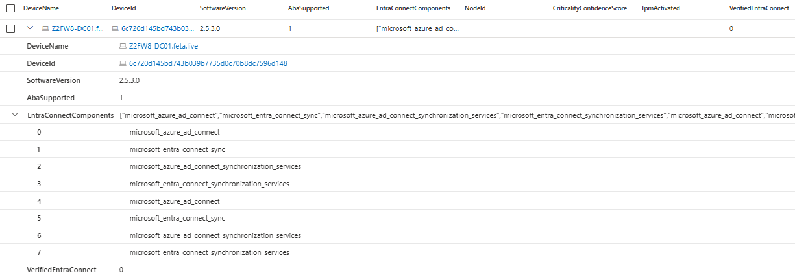

### List Entra Connect related Application Identities (including NodeIds from XSPM)

In the past, we used Sentinel Watchlist to detect Entra Connect servers and related application entities. The issue with Watchlist is administrative overhead, and many organizations are struggling to keep the lists updated, for example, in a scenario where the Entra Connect server is changed (EOL reason).

This query could also be used as a detection to replace the previous logic to “Identify Entra Connect Service Accounts without WatchList”. 

The query requires setting [Entra Connect as a critical asset](https://security.microsoft.com/securitysettings/defender/critical_asset_management?). The Entra Connect server is not added to the list automatically; it requires approval, as seen in the Figure below. 

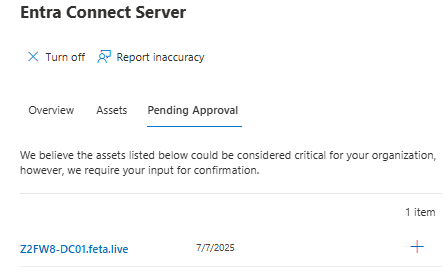

Logic can also be used for detection to identify App Roles outside of the naming pattern for Entra Connect App Auth SPNs.

> [!NOTE]
> Keep in mind that `OAuthAppInfo` will be updated on regular basis but not in real-time which could lead to a delay until the application is visible.

[Identify-EntraConnectApplicationIdentities](https://github.com/Cloud-Architekt/AzureAD-Attack-Defense/blob/main/queries/EntraConnectABA/Identify-EntraConnectApplicationIdentities.kusto)

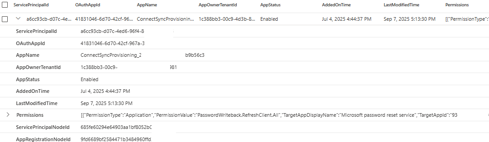

### Existing owners on Application or Service Principals through Graph API

The owner information is not directly available in Defender XDR advanced hunting or Sentinel data. We can see changes for applications in the Entra audit logs, but not the underlying settings. For that reason, the best approach is to use the Graph API to query the information directly from the API.

The first query lists application owners for the ConnectSync applications through the Graph API:

```http
{
  "apiType": "graph",
  "graphApiVersion": "beta",
  "method": "get",
  "path": "/applications",
  "queryParams": {
    "$expand": "owners($select=id,displayName,userPrincipalName,mail,jobTitle)",
    "$select": "id,appId,displayName,publisherDomain,createdDateTime,owners",
    "$filter": "startswith(displayName, 'ConnectSyncProvisioning_')"
  },
  "fetchAll": true
}
```

Alternatively, you can also use a PowerShell script:

```powershell
Get-MgApplication -ConsistencyLevel eventual -Search '"DisplayName:ConnectSyncProvisioning_"' | ForEach-Object {
    $owners = Get-MgApplicationOwner -ApplicationId $_.Id
    [PSCustomObject]@{
        DisplayName = $_.DisplayName
        AppId = $_.AppId
        PublisherDomain = $_.PublisherDomain
        CreatedDateTime = $_.CreatedDateTime
        OwnersCount = $owners.Count
        Owners = ($owners | ForEach-Object { 
            if ($_.AdditionalProperties.userPrincipalName) {
                "$($_.AdditionalProperties.displayName) ($($_.AdditionalProperties.userPrincipalName))"
            } else {
                $_.AdditionalProperties.displayName
            }
        }) -join "; "
    }
} | Format-Table -AutoSize

# Alternative: Export to CSV for Excel analysis
# } | Export-Csv -Path "Applications-with-Owners.csv" -NoTypeInformation
```

The second query lists service principal owners through the Graph API:

```http
{
  "apiType": "graph",
  "graphApiVersion": "beta",
  "method": "get",
  "path": "/servicePrincipals",
  "queryParams": {
    "$expand": "owners($select=id,displayName,userPrincipalName,mail,jobTitle)",
    "$select": "id,appId,displayName,publisherName,createdDateTime,servicePrincipalType,owners",
    "$filter": "startswith(displayName, 'ConnectSyncProvisioning_')"
  },
  "fetchAll": true
}
```

Or you can use PowerShell to lists service principals and managed identities owners:

```powershell
Get-MgServicePrincipal -ConsistencyLevel eventual -Search '"DisplayName:ConnectSyncProvisioning_"' | ForEach-Object {
    $owners = Get-MgServicePrincipalOwner -ServicePrincipalId $_.Id
    [PSCustomObject]@{
        DisplayName = $_.DisplayName
        AppId = $_.AppId
        PublisherName = $_.PublisherName
        ServicePrincipalType = $_.ServicePrincipalType
        CreatedDateTime = $_.CreatedDateTime
        OwnersCount = $owners.Count
        Owners = ($owners | ForEach-Object { 
            if ($_.AdditionalProperties.userPrincipalName) {
                "$($_.AdditionalProperties.displayName) ($($_.AdditionalProperties.userPrincipalName))"
            } else {
                $_.AdditionalProperties.displayName
            }
        }) -join "; "
    }
} | Format-Table -AutoSize

# Alternative: Export to CSV
# } | Export-Csv -Path "ServicePrincipals-with-Owners.csv" -NoTypeInformation
```

### Added credentials on application or service principal of ABA identity

Changes in certificates or secrets are standard operations on the Entra Connect server but can also be an indicator of compromise. The query below helps to detect any changes in this sensitive information.

Dynamic severity needs to be added for the detection version to avoid noise from key rotation by Hybrid Identity or GA as part of the renewal process.

Alternative approach would be to leverage Entra ID Audit logs to detect suspicious certificate renewals. The typical cadence of certificate renewal (in a Microsoft-managed scenario) is 6 or 9 months. Any credential updates taking place outside are sign of a  suspicious activity.

[Added-Credentials.kusto](https://github.com/Cloud-Architekt/AzureAD-Attack-Defense/blob/main/queries/EntraConnectABA/Added-Credentials.kusto)

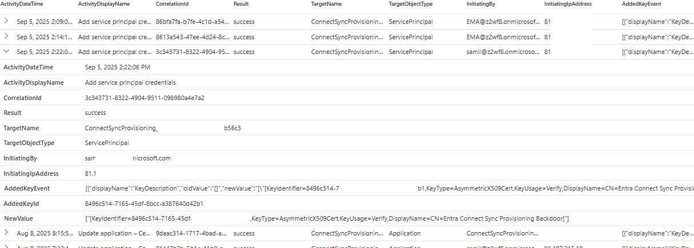

### Certificate outside of TPM

The following query can be used to list certificates issued to the Entra Connect server

> [!NOTE]
> The DeviceTvmCertificateInfo in the XDR’s advanced hunting table is populated by records from Microsoft Defender for Endpoint (MDE). If your organization hasn’t deployed the service in Microsoft Defender XDR, queries that use the table won’t work or return any results.

```kusto

DeviceTvmCertificateInfo
| where parse_json(IssuedTo)["CommonName"] == 'Entra Connect Sync Provisioning'

```

### Sign-In with a suspicious Credential Type

In a scenario where ABA is used as an authentication method, the other authentication method shouldn’t be used by the Entra Connect service principal. For example, when a client secret or federated credential, instead of a certificate, has been used. This query can be used to detect other methods than certificate-based authentication.

[SignIn-EntraConnectAbaSuspiciousCredentialType.kusto](https://github.com/Cloud-Architekt/AzureAD-Attack-Defense/blob/main/queries/EntraConnectABA/SignIn-EntraConnectAbaSuspiciousCredentialType.kusto)

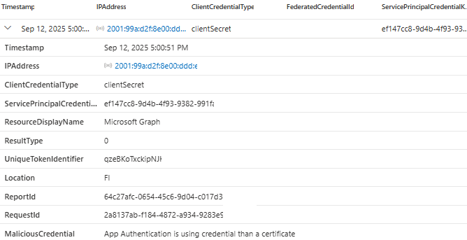

### Sign-in with different certificates at the same time

The query below can be used to detect sign-ins with different certificates at the same time for the Entra Connect SP.

[SignIn-DifferentAbaCertificatesAtSameTime.kusto](https://github.com/Cloud-Architekt/AzureAD-Attack-Defense/blob/main/queries/EntraConnectABA/SignIn-DifferentAbaCertificatesAtSameTime.kusto)

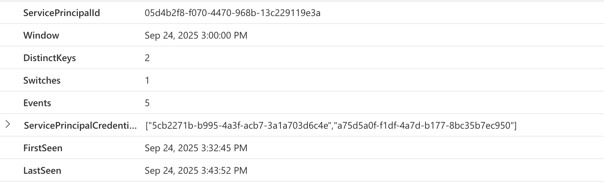

### Unusual/different IP address of Entra Sync operations compared to sign-in

This query summarizes the successful logins against the Entra Connect service principal and summarizes the IP addresses used for logins. It can be used to find possible malicious activity in the environment. It could be an indicator for token replay.

```kusto
AADServicePrincipalSignInLogs
| where TimeGenerated >= ago(14d)
| where ServicePrincipalName contains "ConnectSyncProvisioning"
| where ResultType == "0"  // Successful sign-ins only
| summarize SignInCount = count() by ServicePrincipalName, ServicePrincipalId, IPAddress, ResourceDisplayName
| summarize 
    TotalSignIns = sum(SignInCount),
    UniqueIPs = dcount(IPAddress),
    IPDetails = make_bag(pack(IPAddress, SignInCount)),
    Resources = make_set(ResourceDisplayName),
    MostActiveIP = arg_max(SignInCount, IPAddress)
    by ServicePrincipalName, ServicePrincipalId
| where UniqueIPs > 1  // Focus on service principals with multiple IPs
| extend IPBreakdown = tostring(IPDetails)
| project 
    ServicePrincipalName, ServicePrincipalId, UniqueIPs, TotalSignIns, MostActiveIP, IPBreakdown, Resources = tostring(Resources)
| sort by UniqueIPs desc, TotalSignIns desc
```

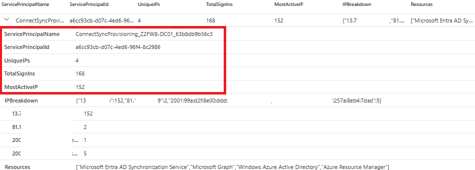

That concludes the detection part. As can be seen, the detections are based on the custom queries, and most of them rely on the OAuthAppInfo table in Defender XDR. The approach has pros and cons, as every approach does. The most important one is that the OAuthAppInfo table is not updated in real-time and might have latencies. Take this into account when planning detection capabilities.

### Token acquisition outside of Entra Connect Server

By leveraging the enhanced auditing capability of Entra Connect Admin Audit Logs (more information on that later), we can correlate sign-ins in Entra with the token acquisition on the Entra Connect Server. The query requires integration of Entra Connect Admin Audit Log with Microsoft Sentinel.

[TokenAcquisition-OutsideOfEntraConnectServer.kusto](https://github.com/Cloud-Architekt/AzureAD-Attack-Defense/blob/main/queries/EntraConnectABA/TokenAcquisition-OutsideOfEntraConnectServer.kusto)

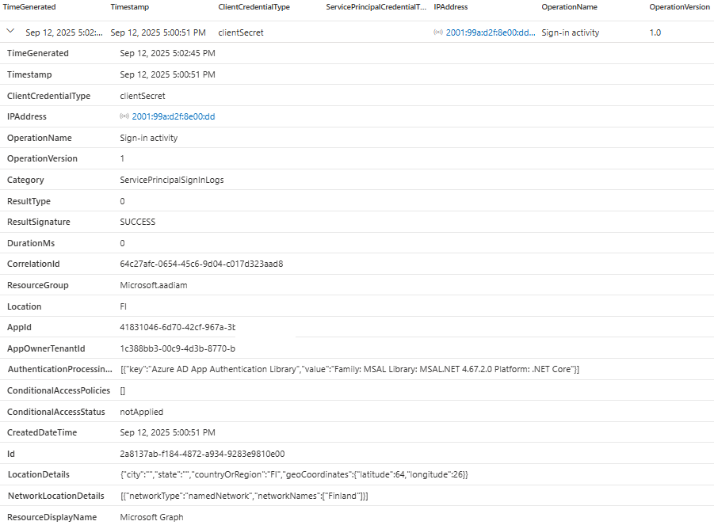


## Advanced detection for correlation of key rotation between Entra Connect server and ABA identity

### Ingestion of Entra Connect Server Logs
Starting with Version [2.4.129.0](https://learn.microsoft.com/en-us/entra/identity/hybrid/connect/reference-connect-version-history#241290) of Microsoft Entra Connect Sync, a new admin audit logging feature is available (enabled by default). More details can be found here: [Audit Administrator Events in Microsoft Entra Connect Sync - Microsoft Entra ID | Microsoft Learn](https://learn.microsoft.com/en-us/entra/identity/hybrid/connect/admin-audit-logging)

This feature allows security teams to monitor changes made to Entra Connect sync configurations by Global Administrators, Hybrid Administrators, and local server administrators. A full list of all events can be found here:
[https://learn.microsoft.com/en-us/entra/identity/hybrid/connect/admin-audit-logging#list-of-logged-events](https://learn.microsoft.com/en-us/entra/identity/hybrid/connect/admin-audit-logging#list-of-logged-events) 

To be able to see enhanced audit logs of the Entra Connect server, you need to bring Windows events Application log events through Azure Monitor Agent (AMA) to Sentinel. This requires the AMA agent to be deployed to the Entra Connect server and also to add the application log as a custom source to the AMA configuration.

Below is information about the prerequisites, as well as an XPath query to the AMA agent configuration.

- Pre-requisite: Integration of Application Log - [https://www.linkedin.com/pulse/import-azure-ad-connect-logs-microsoft-sentinel-ralf-gomeringer](https://www.linkedin.com/pulse/import-azure-ad-connect-logs-microsoft-sentinel-ralf-gomeringer)

If you are using Microsoft Sentinel, you can follow the instructions below to configure the Data Collection Rule (DCR). Depending on your organization, having Sentinel integrated with Defender XDR, DCRs can be configured from Sentinel or in Defender XDR (below XDR is used). 

- Open up Sentinel data connectors and navigate to ‘Windows Security Events via AMA’

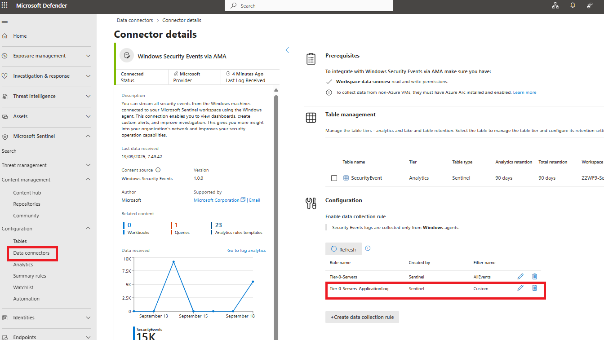

- Create a new DCR and give it a name, for example, ‘**Tier-0-Servers-ApplicationLog’**
- Configure the rule to contain Entra Connect Server (on the basic & resource tab)

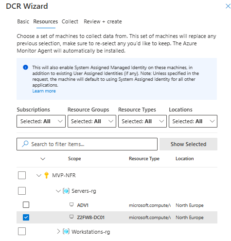

- Set the custom XPath query to the rule (see queries below) - select add and save to configuration. The DCR rule will be deployed in a 5-10 minute timeline.

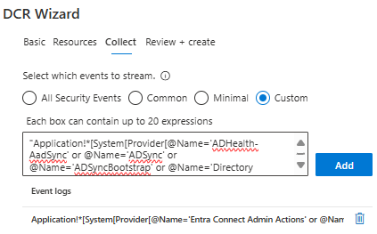

- XPath Query to collect the most important audit events:

```xml
"Application!*[System[Provider[@Name='Entra Connect Admin Actions' or @Name='Azure AD Connect Upgrade' or @Name='AzureADConnectHealthAgent']]]"
```

If you want more extensive logging of new and legacy audit events, use the following XPath query in the DCR rule.

- Adjusted XPath Query to collect the advanced audit events:

```xml
"Application!*[System[Provider[@Name='ADHealth-AadSync' or @Name='ADSync' or @Name='ADSyncBootstrap' or @Name='Directory Synchronization' or @Name='Microsoft-AadApplicationProxy-Connector' or @Name='Microsoft-AzureADConnect-AgentUpdater' or @Name='Entra Connect Admin Actions' or @Name='Microsoft Azure AD Connect Authentication Agent' or @Name='Microsoft-AzureADConnect-AuthenticationAgent' or @Name='PasswordResetService']]]"
```

If you want to test which application log sources in Entra Connect have events in the server, you can run the following PowerShell script on the server. Adjust providers if needed. 

```powershell
# Test providers using XPath
Write-Host "Testing Entra Connect Related Event Sources with XPath..." -ForegroundColor Green
Write-Host "=" * 60

$providers = @(
    'Entra Connect Admin Actions',
    'Azure AD Connect Upgrade', 
    'AzureADConnectHealthAgent',
    'ADSync',
    'Microsoft-AzureADConnect-AgentUpdater',
    'Microsoft Azure AD Connect Authentication Agent'
)

foreach ($provider in $providers) {
    try {
        $xpath = "*[System[Provider[@Name='$provider']]]"
        $events = Get-WinEvent -LogName 'Application' -FilterXPath $xpath -MaxEvents 1 -ErrorAction Stop
        Write-Host "✓ $provider - Has events" -ForegroundColor Green
    } catch {
        Write-Host "✗ $provider - No events" -ForegroundColor Red
    }
}
```

Next, we have a few examples of how this enhanced auditing capability can be used. 

### Sample query on ABA key rotation event in Microsoft Sentinel

The following log entry is available locally when the ABA certificate has been renewed:

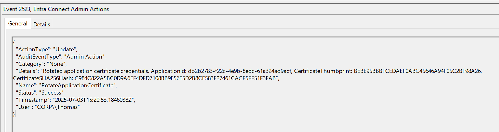

This event is also part of the query result when ingesting the application log to Microsoft Sentinel and allows getting details about the Certificate Thumbprint and SHA 256 Hash:

```kusto
    SecurityEvent
    | where EventSourceName == "Entra Connect Admin Actions"
    | extend Data=parse_xml(EventData)
    | extend EventData=Data.DataItem.EventData.Data
    | extend EventStatus = parse_json(tostring(parse_json(tostring(Data.EventData)).Data)).Status
    | extend EventAction = parse_json(tostring(parse_json(tostring(Data.EventData)).Data)).Name
    | where EventAction == "RotateApplicationCertificate"
    | extend EventTimestamp = parse_json(tostring(parse_json(tostring(Data.EventData)).Data)).Timestamp
    | extend EventData = parse_json(tostring(parse_json(tostring(Data.EventData)).Data))
    | extend EventUser = tostring(parse_json(EventData.User))
    | extend EventDetails = tostring(parse_json(EventData.Details))
    | extend 
        ApplicationId = extract(@"ApplicationId: ([^,]+),", 1, EventDetails),
        CertificateThumbprint = extract(@"CertificateThumbprint: ([^,]+),", 1, EventDetails),
        CertificateSHA256Hash = extract(@"CertificateSHA256Hash: ([^\s]+)", 1, EventDetails)
    | project EventTimestamp, EventData, EventAction, EventStatus, EventUser, EventDetails, ApplicationId, CertificateThumbprint, CertificateSHA256Hash

```

Output in advanced hunting after certificate rotation

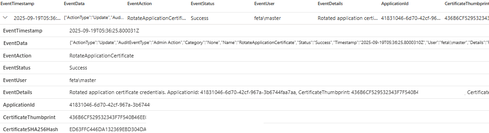

**Side note:**

If you don’t see the audit events in Sentinel/XDR:

- Verify DCR and XPath configuration
- Verify on the Entra Connect server that the registry contains the AuditEventLogging DWORD value set to 1.

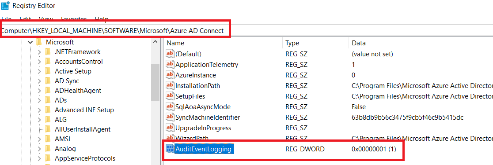

### Sign-In with a New Certificate that has not been rotated or created by Entra Connect

The ABA method creates a Microsoft-managed certificate during the deployment. The certificate is rotated by Microsoft as well, and this query helps to identify a possible malicious sign-ins to the Entra Connect app when a certificate that has not been rotated or created by Entra Connect is being used. The following query requires integration of Entra Connect Admin Audit Log to Microsoft Sentinel.

[SignIn-NewCertificateOutsideOfAbaRotation.kusto](https://github.com/Cloud-Architekt/AzureAD-Attack-Defense/blob/main/queries/EntraConnectABA/SignIn-NewCertificateOutsideOfAbaRotation.kusto)

Example output you should see with the query

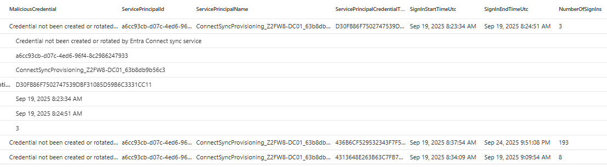

Details included in the query

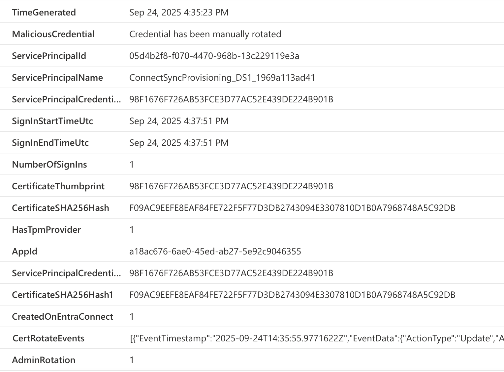

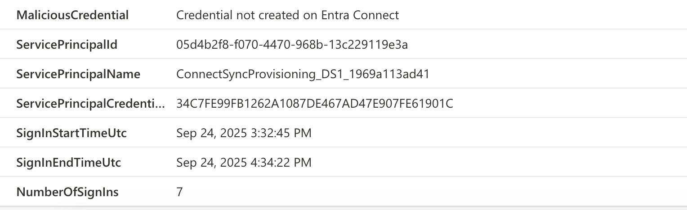

# Mitigations

This section covers the mitigations that can be deployed to the environment and Entra Connect server to prevent abuse of the Entra Connect Service Principal. We start with foundational mitigations, then move to more detailed, server-specific ones.

## Foundational

The following mitigations require less effort and should be applied when configuring Entra Connect App Authentication, and mitigation actions should be reviewed regularly. Consider using security measurements based on the [Microsoft Entra security operations guide for applications](https://learn.microsoft.com/en-us/entra/architecture/security-operations-applications).

### Use Trusted Plaform Module (TPM) with ABA

It is recommended to use TPM always in ABA scenario to prevent export of private key from Entra Connect server. In BYOC scenario, Hardware Security Module (HSM) can also be used to provide additional protection for private keys.


### Enable App Property Lock

Apply a lock on all properties to avoid impersonation of Entra Connect Service Principal in case of any attack path (in the future) to abuse identity in combination to convert this identity to a multi-tenant app. This is the default behavior for any new app registration (including single-tenant apps) in the Portal UI, but is not configured by using Entra Connect managed application creation. More details on [how to configure app instance property lock](https://learn.microsoft.com/en-us/entra/identity-platform/howto-configure-app-instance-property-locks) can be found in Microsoft Learn.

### Review the Directory and API Permissions roles with privileges to take over App Authentication

Various directory roles (e.g., Cloud Application Administrator) and API Permissions (Application.ReadWrite.All) allow modification of properties of the Entra Connect App Auth objects (including adding backdoor credentials). You should review every directory role (including custom roles or object-scoped assignments) and correspondence API permissions. Treat roles like (Cloud) Application Admin, custom roles, or API permissions with similar permissions as Tier 0 (Control Plane) assets.

You can achieve the goal by using the following KQL function (UnifiedIdentityInfoXdr):

> [!NOTE]
> Make sure you added the `UnifiedIdentityInfoXdr` KQL query as a function in Defender XDR. You can find the [latest logic of the KQL query here](https://github.com/Cloud-Architekt/AzureSentinel/blob/main/Functions/UnifiedIdentityInfoXdr.yaml). Once you have the KQL query, you can [save and share the query](https://learn.microsoft.com/en-us/defender-xdr/advanced-hunting-shared-queries) in Microsoft Defender XDR portal for regular use.

```kusto
let PrivilegedIdentities = UnifiedIdentityInfoXdr()
| mv-expand parse_json(AssignedEntraRoles)
| where parse_json(AssignedEntraRoles)["RolePermissions"] contains 'microsoft.directory/applications/owners/update'
| extend RoleType = strcat(parse_json(AssignedEntraRoles)["PimAssignmentType"], " Entra ID Directory Role")
| project AccountDisplayName, RoleName = parse_json(AssignedEntraRoles)["RoleDefinitionName"], RoleType;
let PrivilegedWorkloadIdentities = UnifiedIdentityInfoXdr()
| mv-expand parse_json(ApiPermissions)
| extend RoleType = "Microsoft Graph API App Role"
| where parse_json(ApiPermissions)["AppRoleDisplayName"] startswith 'Application.'
| project AccountDisplayName, RoleName = parse_json(ApiPermissions)["AppRoleDisplayName"], RoleType;
union PrivilegedIdentities, PrivilegedWorkloadIdentities
| summarize RoleNames = make_set(RoleName) by AccountDisplayName, RoleType
| sort by AccountDisplayName asc
```

> [!WARNING]
> This function relies on XDR identity data, which does not cover custom or scoped roles yet. If you need a full analysis of any role assignments, you have to build your own Graph API-based query, manually review, or use community tools (such as [EntraOps](https://www.notion.so/Chapter-8-Abusing-Microsoft-Entra-ID-Connect-using-Application-Identity-20a8ea33fe2e8055acfbf57d18ad0b92?pvs=21)).

### Avoid any owner delegations to service principals and application objects

No user or service principal should have been assigned as owner on the related Entra Connect ABA objects. You should use Microsoft Graph API to identify owners on [Application](https://learn.microsoft.com/en-us/graph/api/application-list-owners?view=graph-rest-1.0&tabs=http) and [Service Principal](https://learn.microsoft.com/en-us/graph/api/serviceprincipal-list-owners?view=graph-rest-1.0&tabs=http) objects which allows you the full visibility of all delegated owners (including service principals). The following KQL query uses Exposure Management data to identify owners and can be also used for monitoring.

> [!WARNING]
> Unfortunately, only ownership on application objects will be covered by the Exposure data.

```kusto
let EntraConnectAppRoles = dynamic(['ADSynchronization.ReadWrite.All', 'PasswordWriteback.RefreshClient.All', 'PasswordWriteback.RegisterClientVersion.All', 'PasswordWriteback.OffboardClient.All']);
let EntraConnectAppIdentities = OAuthAppInfo
| where Timestamp >ago(14d)
//| where parse_json(Permissions) has_any (EntraConnectAppRoles)
| summarize by OAuthAppId;
ExposureGraphNodes
| where parse_json(NodeProperties)["rawData"]["appId"] in~ (EntraConnectAppIdentities)
| extend XspmGraphOAuthAppNodeId = NodeId
| join kind=inner ( ExposureGraphEdges
    | where EdgeLabel == @"has role on"
    // Currently limited to OAuth App edges
    | where TargetNodeLabel == "Microsoft Entra OAuth App"
    | extend RolePermissions = parse_json(EdgeProperties)["rawData"]["roles"]["rolePermissions"]
    | mv-expand parse_json(RolePermissions)
    | where RolePermissions.["roleValue"] startswith 'Owner'
    | join kind=leftouter (
        ExposureGraphNodes | project SourceNodeId = NodeId, EntityIds
    ) on SourceNodeId
    | extend NodeId = SourceNodeId, NodeName = SourceNodeName, NodeLabel = SourceNodeLabel
    | extend OwnedBy = bag_pack_columns(NodeId, NodeName, NodeLabel, EntityIds)
    | project-rename XspmGraphOAuthAppNodeId = TargetNodeId
    | summarize OwnedBy = make_set(OwnedBy) by XspmGraphOAuthAppNodeId
) on XspmGraphOAuthAppNodeId
| project NodeName, OwnedBy

```

### Enforce Application Management Policy to block client secrets

Create an application management policy which blocks the addition of client secrets on application and service principal objects if you haven’t already a [tenant-wide policy](https://learn.microsoft.com/en-us/entra/identity/enterprise-apps/tutorial-enforce-secret-standards?pivots=ms-powershell) with those restrictions in-place. Below you'll find a PowerShell example to create the policy object:

```powershell
Import-Module Microsoft.Graph.Identity.SignIns
Import-Module Microsoft.Graph.Applications

Connect-MgGraph -Scopes Policy.ReadWrite.ApplicationConfiguration

$params = @{
	displayName = "Entra Connect ABA identity policy"
	description = "Credential policy for Entra Connect ABA identities"
	isEnabled = $true
	restrictions = @{
		passwordCredentials = @(
			@{
				restrictionType = "passwordAddition"
				state = "enabled"
				maxLifetime = $null
				restrictForAppsCreatedAfterDateTime = [System.DateTime]::Parse("2025-06-01T00:00:00Z")
			}
			@{
				restrictionType = "symmetricKeyAddition"
				state = "enabled"
				maxLifetime = $null
				restrictForAppsCreatedAfterDateTime = [System.DateTime]::Parse("2025-06-01T00:00:00Z")
			}
		)   
	}
}

$AppManagementPolicy = New-MgPolicyAppManagementPolicy -BodyParameter $params

```

More details about the `AppManagementPolicy` are available from [Microsoft. Learn](https://learn.microsoft.com/en-us/graph/api/appmanagementpolicy-post?view=graph-rest-1.0&tabs=http).

This app management policy needs to apply to all application and service principal objects of the Entra Connect ABA identities. The following PowerShell examples is looking for all objects which starts with the pattern “ConnectSyncProvisioning_” and assign the previously described policy:

```powershell

Connect-MgGraph -Scopes Policy.ReadWrite.ApplicationConfiguration

$EntraAbaSpObjects = (Get-MgServicePrincipal -Filter "startswith(DisplayName,'ConnectSyncProvisioning_')")

$params = @{
	"@odata.id" = "https://graph.microsoft.com/v1.0/policies/appManagementPolicies/$($AppManagementPolicy.Id)"
} | ConvertTo-Json

foreach ($ServicePrincipalObjectId in $EntraAbaSpObjects.Id) {
	Invoke-MgGraphRequest -Method POST -Uri "https://graph.microsoft.com/v1.0/servicePrincipals/$($ServicePrincipalObjectId)/appManagementPolicies/`$ref" -Body $params
}

$EntraAbaAppObjects = (Get-MgApplication -Filter "startswith(DisplayName,'ConnectSyncProvisioning_')")

foreach ($EntraAbaAppId in $EntraAbaAppObjects.Id) {
	New-MgApplicationAppManagementPolicyByRef -ApplicationId $EntraAbaAppId -BodyParameter $params
}
```

Verify the restriction by trying to add a client secret to the related application or service principal object. You should see the following message in the portal:

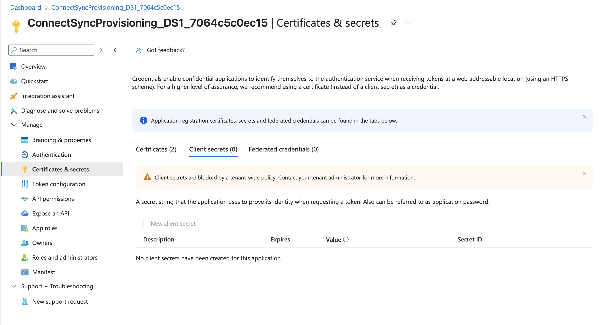

> [!NOTE]
> Currently, there seems to be a bug which shows “blocked by a tenant-wide policy” even if you have configured an app management policy on service principal/application-level.*

> [!WARNING]
> Unfortunately, there’s currently no way to also block the addition of federated credentials to the Entra Connect ABA identities.

### Review recommendations to identify stale ABA Identities

Stale application objects of deprovisioned Entra Connect Sync increase the attack surface and should be mitigated. You can use Entra Recommendations to identify unused applications and permissions, and then review them for potential deletion. In general, it should include in the offboarding process for Entra Connect for the corresponding application identities. Learn more about `staleApps` in [Entra Recommendations from Microsoft Learn](https://learn.microsoft.com/en-us/entra/identity/monitoring-health/recommendation-remove-unused-apps?tabs=microsoft-entra-admin-center). 

## Intermediate

The following mitigations require a Workload ID Premium license for Entra Connect ABA identities and a known outgoing IP address of your Entra Connect Servers, which can be used to identify and restrict access.

### Apply Conditional Access Policies for blocking access outside of Entra Connect IP Addresses

Conditional Access for Workload Identities allows you to [block access by locations](https://learn.microsoft.com/en-us/entra/identity/conditional-access/policy-block-by-location) (e.g., from untrusted IP ranges). We strongly recommend using a static (outgoing public) IP address for your Entra Connect servers, which should also be dedicated to high-privileged systems (and not shared with lower-privileged endpoints such as Guest Wi-Fi).

This approach enables you to restrict access to the Entra Connect ABA identities only to the specific IP addresses of your Entra Connect and control plane servers/endpoints.

Manage these IP ranges as Named Locations in Microsoft Entra, and exclude them from the block policy as shown in the following example:


### Apply Risk-based Conditional Access Policies for Entra Connect ABA

Workload ID premium provides a couple of [risk detections](https://learn.microsoft.com/en-us/entra/id-protection/concept-workload-identity-risk#workload-identity-risk-detections) across sign-in behavior and offline indicators of compromise. We strongly recommend implementing a [risk-based policy](https://learn.microsoft.com/en-us/entra/id-protection/concept-workload-identity-risk#enforce-access-controls-with-risk-based-conditional-access) which will block further access in case of medium or high (depends on your risk acceptance).

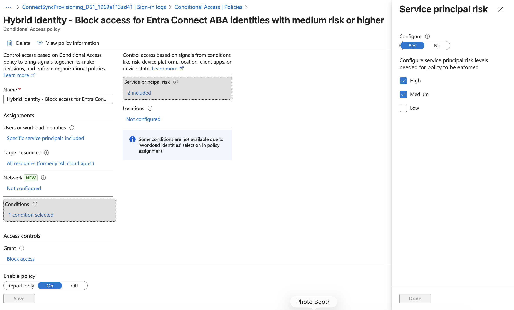

Risky service principals should be closely monitored to execute further mitigation and containment measures but also avoid service interruptions in case of false positives.

## Advanced

### Enforce Application Management Policy to restrict certificates from known Sub CA

There’s an additional restriction option in case you are using Entra Connect ABA identities with a [Bring Your Own Certificate](https://learn.microsoft.com/en-us/entra/identity/hybrid/connect/authenticate-application-id?tabs=default#bring-your-own-certificate) (BYOC) setup. Application Management Policies can be configured to ensure that only certificates issued by a specific intermediate certificate authority are only accepted. More details on how to [assign a certificate chain of trust](https://learn.microsoft.com/en-us/graph/tutorial-applications-basics?tabs=http#step-2-assign-the-certificate-chain-of-trust-to-an-application-management-policy) and take advantage of `trustedCertificateAuthority` in your App Management policies are available on Microsoft Learn. 

> [!NOTE]
> Keep in mind that you can assign only one app management policy for each service principal and application object.

# Incident Response (Containment)

In the event of an incident involving a compromised Active Directory, Entra Connect servers, or ABA identities, it is crucial to implement containment measures promptly.
Disabling service principals is especially important to prevent further access by ABA identities and to mitigate potential lateral movement paths.
Ensure that you have a prepared containment or incident response playbook for Entra Connect servers, including:

- [Disable service principal](https://learn.microsoft.com/en-us/security/operations/incident-response-playbook-compromised-malicious-app#disable-compromised-application) of ABA identities
- Mark the service principal as compromised by using [Microsoft Graph API](https://learn.microsoft.com/en-us/graph/api/riskyserviceprincipal-confirmcompromised?view=graph-rest-1.0&tabs=http) and take advantage of the risk-based Conditional Access Policies (if configured)

### Support of Continuous Access Evaluation?

Issued tokens for “Microsoft Entra AD Synchronization Service” and “Microsoft Graph API” seems to support (based on sign-in logs) Continuous Access Evaluation (CAE).

<p align="center">
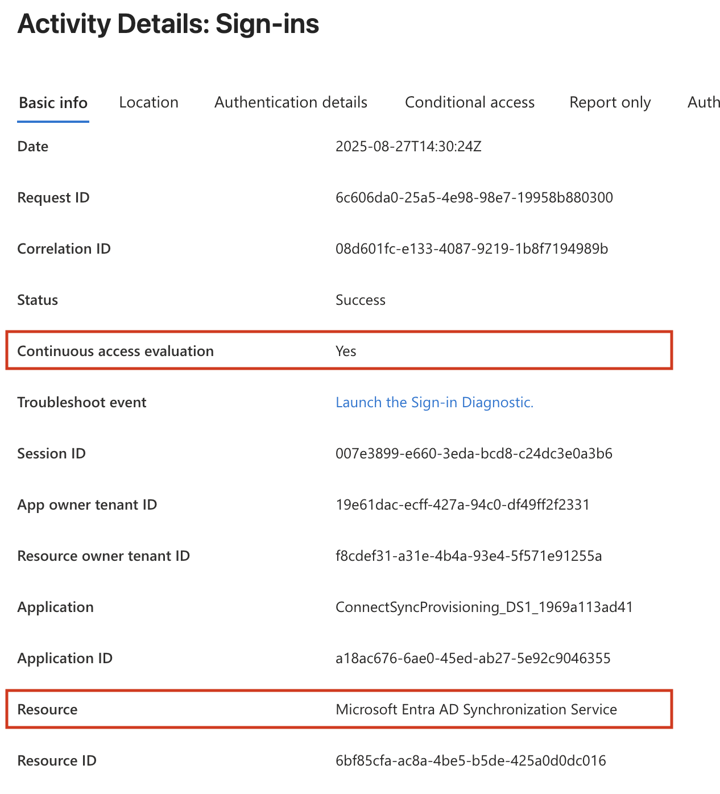
</p>

This allows revocation of access tokens in near-real time based on the following critical events:

- Service principal disable
- Service principal delete
- High service principal risk as detected by Microsoft Entra ID Protection

> [!NOTE]
> During our tests, we were not able to reproduce the CAE behavior. A [Microsoft Learn article](https://learn.microsoft.com/en-us/entra/identity/conditional-access/concept-continuous-access-evaluation-workload) describes that currently only Microsoft Graph is supported as a resource provider and that more resource providers will be added over time. This may be what Microsoft is working on and may be supported in the near future.
