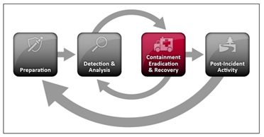
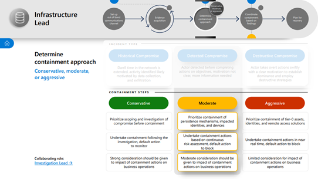
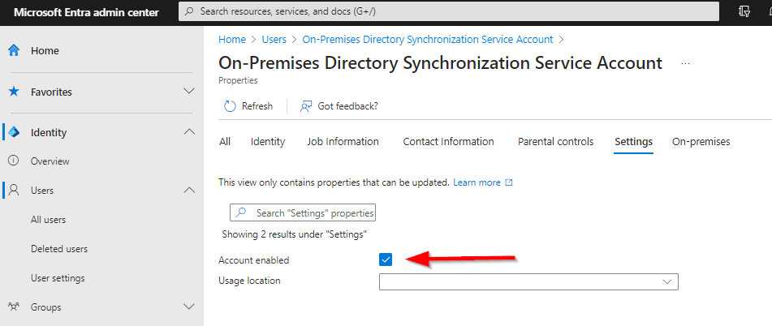
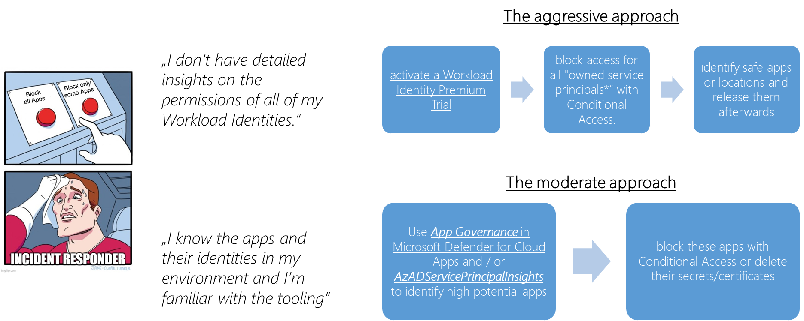
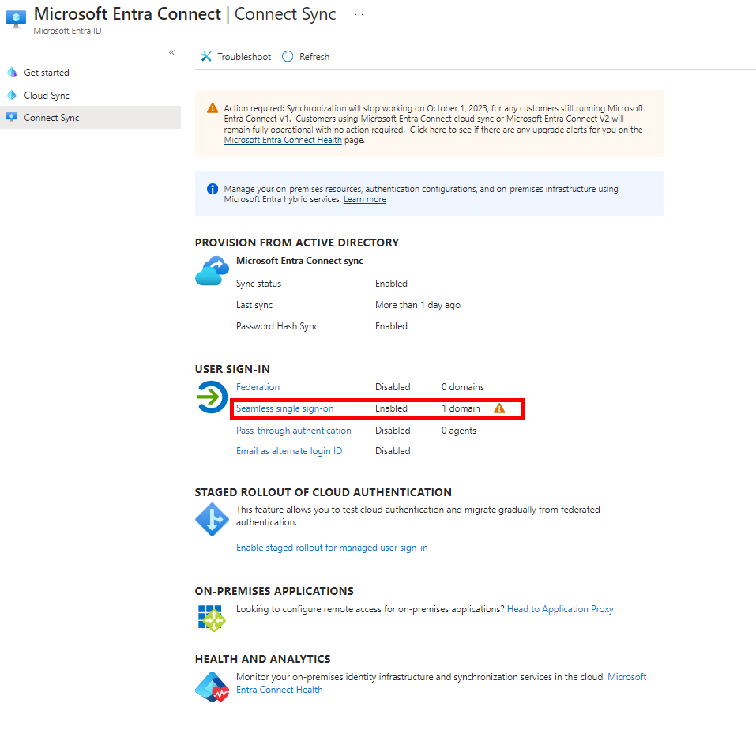
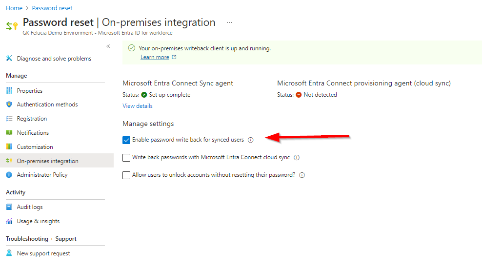

# Appendix: How to prevent lateral movement to Entra ID when your Active Directory has fallen

_Author: Christopher Brumm_

_Created: July 2024_

A checklist to protect your Entra ID when Active Directory is compromised and how to prepare for this situation

- [Appendix: How to prevent lateral movement to Entra ID when your Active Directory has fallen](#appendix-how-to-prevent-lateral-movement-to-entra-id-when-your-active-directory-has-fallen)
  - [Intro](#intro)
  - [First Aid Checklist](#first-aid-checklist)
    - [Phase 1: Prevent full compromise](#phase-1-prevent-full-compromise)
    - [Phase 2: Protect User Accounts](#phase-2-protect-user-accounts)
      - [About Active Directory password cracking](#about-active-directory-password-cracking)
  - [Description of phase 1 steps](#description-of-phase-1-steps)
    - [Block the Entra ID Connect sync account](#block-the-entra-id-connect-sync-account)
    - [Block synced Admin Accounts](#block-synced-admin-accounts)
    - [Configure an Admin Conditional Access Policy](#configure-an-admin-conditional-access-policy)
    - [Delete MFA bypasses in the legacy MFA console](#delete-mfa-bypasses-in-the-legacy-mfa-console)
    - [Block access for Workload Identities](#block-access-for-workload-identities)
      - [The aggressive approach](#the-aggressive-approach)
      - [The moderate approach](#the-moderate-approach)
  - [Description of phase 2 steps](#description-of-phase-2-steps)
    - [Disable Seamless SSO](#disable-seamless-sso)
    - [Enforce MFA and restrict the registration](#enforce-mfa-and-restrict-the-registration)
    - [(optional) Disable OnPrem Authentication](#optional-disable-onprem-authentication)
    - [(optional) Disable password write back](#optional-disable-password-write-back)
  - [How to prepare?](#how-to-prepare)
    - [Workload Identities (used OnPrem)](#workload-identities-used-onprem)
    - [Migrate to Password Hash Sync if you’re using PTA or ADFS](#migrate-to-password-hash-sync-if-youre-using-pta-or-adfs)
  - [What else?](#what-else)

## Intro

At the moment, the biggest threat to an Entra ID tenant in the vast majority of environments comes from the connected Active Directory. Attackers are (currently) focusing heavily on on-prem environments, as these are generally much more difficult to protect and are also in a much worse state. And it's often not far from there to the cloud…

Maybe you’re reading this right now because have bookmarked it for the case of emergency. As someone who is regularly assisting people in such situations my advice is the same as from Douglas Adams: **Don’t Panic!**

Quickly form a response team and divide up the tasks. After an initial brief analysis of the attack, isolating the attacking systems and limiting the damage are the order of the day. NIST has defined a simple and clear process for this (can be read in detail in the [Computer Security Incident Handling Guide](https://nvlpubs.nist.gov/nistpubs/SpecialPublications/NIST.SP.800-61r2.pdf)).

<a href="./media/containment/NISTIncidentHandling-small.png" target="_blank"></a>

Source: [Computer Security Incident Handling Guide](https://nvlpubs.nist.gov/nistpubs/SpecialPublications/NIST.SP.800-61r2.pdf)

Microsoft also has a [guide for organizing an incident response](https://www.microsoft.com/content/dam/microsoft/final/en-us/microsoft-brand/documents/Navigating-the-Maze-of-Incident-Response.pdf) - which I would highly recommend. The containment measures described here fall into the Infrastructure Lead category and are to be seen as Moderate to Aggressive.

<a href="DARTIncidentHandling" target="_blank"></a>

Source: [Microsoft - Navigating 
the Maze of 
Incident Response](https://www.microsoft.com/content/dam/microsoft/final/en-us/microsoft-brand/documents/Navigating-the-Maze-of-Incident-Response.pdf)

Since Active Directory plays a central role in many environments, there are various ways for attackers to expand their influence. From a defender's point of view, I suggest (without knowing the environment) severing the following connections for containment:

- Connections to other forests and partners
- Connections to the OT environment
- Connections to the backup system
- Connections to Entra ID

This article is about the latter and has the goal of

1. give you clear advice what to do to protect your Entra ID when your AD is compromised
2. explain you why I’ve chosen these steps and some background information
3. help you to prepare for this situation

I assume that when you start working through this list you are sure that your AD is compromised, but even if you only have a strong suspicion, it often makes sense to perform some of the actions, since an Entra ID tenant per se works wonderfully without a connection to AD. Triggers for a "strong suspicion" could be, for example:

- a “DC Sync Attack” alarm in Microsoft Defender for Identity (MDI).
- Microsoft Defender for Endpoint (MDE) alarms indicating a compromised Domain Controller
- MDI/MDE alarms indicating a compromised Domain Admin account

## First Aid Checklist

> There is this german [quote from Friedrich von Logau](https://de.wikiquote.org/wiki/Friedrich_von_Logau): "_**In Gefahr und tiefer Not bedeutet der mittlere Weg den sicheren Tod***" what can be translated to "**In Danger and Deep Distress, the Middle Way Spells Certain Death**_”
>

My experience from incident response operations has taught me: act early and act decisively!

### Phase 1: Prevent full compromise

This part is time critical and you want to do this in the first minutes. You have to assume that you lost the OnPrem environment and you want to defend the tenant.

- [ ] [Block the Entra ID Connect sync account](#block-the-entra-id-connect-sync-account)
- [ ]  [Block synced Admin Accounts](#block-synced-admin-accounts)
- [ ] [Configure an Admin Conditional Access Policy](#configure-an-admin-conditional-access-policy)
- [ ] [Delete MFA bypasses in the legacy MFA console](#delete-mfa-bypasses-in-the-legacy-mfa-console)
- [ ] [Block access for Workload Identities](#block-access-for-workload-identities)

### Phase 2: Protect User Accounts

The attacker had Domain Admin privileges and (unless you know better) you have to assume that he made a dump of the ntds.dit and can offline try to crack them. Depending on your AD password policies and your already implemented measures in Entra ID you have between hours and days to react on this.  

This part has depending on your current config a big user impact and you should combine it with user information. However, good preparation pays off in this area. In a well-secured environment that uses Password Hash Sync, all steps have already been implemented in advance.

- [ ] [Disable Seamless SSO](#disable-seamless-sso)
- [ ] [Enforce MFA and restrict the registration](#enforce-mfa-and-restrict-the-registration)
- [ ] Delete Trusted Locations in Conditional Access
- [ ] [Optional: Disable OnPrem Authentication](#optional-disable-onprem-authentication)
- [ ] [Optional: Disable Password Writeback](#optional-disable-password-write-back)

#### About Active Directory password cracking

Since phase 2 has a dependency on passwords it is reasonable to have a brief look how Active Directory handles them:

- Active Directory stores all passwords as NTLM-hashes (unsalted MD4) in the ntds.dit and copying the ntds.dit is a common technique called [OS Credential Dumping](https://attack.mitre.org/techniques/T1003/003/)
- Tools like John the Ripper (here is [a guide](https://craighays.com/cracking-active-directory-passwords-password-audit-part-2/)) or Hashcat (here is [a guide](https://infinitelogins.com/2020/04/16/abusing-llmnr-nbtns-part-2-cracking-ntlmv2-hashes/)) are very effective in cracking the extracted passwords and the main factors for the time you have are.
- How long the cracking takes depends on the length and complexity of the password and the version and configuration of your Domain Controllers. Assuming that you only have AES encrypted NT hashes and no RC4 encrypted LM hashes (see [here](https://learn.microsoft.com/en-us/windows-server/security/kerberos/passwords-technical-overview#passwords-stored-in-active-directory)) you can compare your password policy with this benchmark (this is MD5 instead of the used MD4 algorithm which is slightly more secure…)

<a href="./media/containment/HivePassword.jpeg" target="_blank"></a>

Source: [https://www.hivesystems.io/password](https://www.hivesystems.io/password)

> 💡 But sadly this is the benchmark for random passwords - Users are choosing often easy to guess passwords and since everyone uses at first word lists with these tools, you have to assume that all user passwords are instantly cracked… 😑
>

## Description of phase 1 steps

All steps are taken in Entra ID and you should open your screenshot tool before you start.
> ‼️ Don't login with an admin account from any of your maybe affected systems like your Entra Connect Server. Attackers can steal and replay your token. -> see [Replay of Primary Refresh (PRT) and other issued tokens](ReplayOfPrimaryRefreshToken.md)
>

### Block the Entra ID Connect sync account

means: Disable all Entra ID Connect Accounts in Entra ID and revoke their active sessions

**How to do it in the portal?**

You can do this in the portal:

- Search on the [All Users Page](https://entra.microsoft.com/#blade/Microsoft_AAD_UsersAndTenants/UserManagementMenuBlade/menuId/) for the sync account
  - UPN is starting with “Sync_” and the DisplayName is starting with “On-Premises Directory Synchronisation”
  - hint: the role Directory Synchronisation Accounts is not visible in the portal
- Edit Properties → Settings → Uncheck “Account enabled” and “Revoke Sessions” for this account.

<a href="./media/containment/EIDCAccount.png" target="_blank"></a>

**How to do it with PowerShell?**

>💡 If you’re (hopefully) also planning to disable all synced admin accounts (see below) you can directly jump to this step, because the Entra ID Connect accounts are synced admin accounts and will be covered by that step.
>

Alternatively you can use the [EntraOps-Module by Thomas Naunheim](https://www.cloud-architekt.net/entraops/). It will export a list of all privileged accounts and classifies them. This list can then be filtered by our needs - in this case ControlPlane (aka Tier0) and sync-status.

```powershell

# Get EntraOps with eg. git clone https://github.com/Cloud-Architekt/EntraOps.git

# Load-Module and Login
$YourTenant = "YourTenant"
Import-Module ./EntraOps
Connect-EntraOps -AuthenticationType UserInteractive -TenantName $YourTenant 

# Export of all Privileged Identities in Entra ID for further queries
$PrivIdentities = Get-EntraOpsPrivilegedEamEntraId

# Show me the Entra ID Connect Accounts
$EIDCAccounts = $PrivIdentities `
| ForEach-Object { $AdminUPN = $_.ObjectUserPrincipalName; $_.RoleAssignments} `
| Where-Object { $_.RoleDefinitionName -eq "Directory Synchronization Accounts" } `
| Select-Object {$AdminUPN}, RoleDefinitionName, ObjectId

# Disable Synced Accounts
$EIDCAccounts `
| ForEach-Object { Update-MgUser -UserId $_.ObjectId `
  -AccountEnabled:$false `
  -Confirm `
}

# Check Success
$EIDCAccounts `
| ForEach-Object { Get-MgUser -UserId $_.ObjectId -Property UserPrincipalName, AccountEnabled, Id } `
| Select-Object UserPrincipalName, AccountEnabled, Id 
```

**Why should I do this?**

Thomas and Sami have written a complete chapter on [how to abuse Microsoft Entra Connect Sync Service Account](AADCSyncServiceAccount.md).
Among other things, the account has write access to all applications and can e.g. add new owners or credentials. This means that every application with e.g. Directory.ReadWrite.All permissions enables tenant takeover - see [Fabians Blog](https://cloudbrothers.info/en/prem-global-admin-password-reset/) for details.

**What is the effect of the action?**

The action can be safely executed and everything will continue to run smoothly! However, we no longer have synchronization, which means that no changes will be made to passwords, attributes, group memberships, etc.

### Block synced Admin Accounts

means: Disable all synced Admin Accounts and revoke their active sessions.

>💡 This ad-hoc measure has to be done after stopping the Entra ID Sync by disabling the Entra ID Connect Account, because EIDC will override the status in the next sync cycle. In the long term, you want to get rid of these accounts completely.
>

**How to do it in the portal?**
You can do this in the portal but this is a rather time-consuming manual process - so my advice is to do it with PowerShell:

- In [Roles and administrators](https://entra.microsoft.com/#view/Microsoft_AAD_IAM/RolesManagementMenuBlade/~/AllRoles) check all roles marked as “PRIVILEGED” with assignments (eligible and static) and search for admins with UPNs not ending to [tenantname.onmicrosoft.com](http://tenantname.onmicrosoft.com/)
- In doubt use the [All Users Page](https://entra.microsoft.com/#blade/Microsoft_AAD_UsersAndTenants/UserManagementMenuBlade/menuId/) - there is a column “on-premises sync enabled”
- Edit Properties → Settings → Uncheck “Account enabled” and Revoke Sessions

**How to do it with PowerShell?**
The best way (in my opinion) to find Synced Admin Accounts is to use the [EntraOps-Module by Thomas Naunheim](https://www.cloud-architekt.net/entraops/). It will export a list of all privileged accounts and classifies them. This list can then be filtered by our needs - in this case ControlPlane (aka Tier0) and sync-status.

```powershell
# Get EntraOps with eg. git clone https://github.com/Cloud-Architekt/EntraOps.git

# Load-Module and Login
$YourTenant = "YourTenant"
Import-Module ./EntraOps
Connect-EntraOps -AuthenticationType UserInteractive -TenantName $YourTenant 

# Export of all Privileged Identities in Entra ID for further queries
$PrivIdentities = Get-EntraOpsPrivilegedEamEntraId 

# Show me the synced Entra-Admins
$SyncedAdmins = $PrivIdentities `
| Where-Object {$_.OnPremSynchronized -eq $true} `
| Where-Object {$_.RoleAssignments.Classification.AdminTierLevelName -contains "ControlPlane"} `
| ForEach-Object { $AdminUPN = $_.ObjectUserPrincipalName; $_.RoleAssignments} `
| Select-Object {$AdminUPN}, RoleDefinitionName, ObjectId

# Disable Synced Accounts
$SyncedAdmins | Select-Object -Unique '$AdminUPN', ObjectId `
| ForEach-Object { 
    $Output = "Disable Account " + ($_.'$AdminUPN'); Write-Host -ForegroundColor Red $Output
    Update-MgUser -UserId $_.ObjectId -AccountEnabled:$false -Confirm `
}

# Check Success
$SyncedAdmins `
| ForEach-Object { Get-MgUser -UserId $_.ObjectId -Property UserPrincipalName, AccountEnabled, Id } `
| Select-Object UserPrincipalName, AccountEnabled, Id 

```

**Why should I do this?**
At this point, it can be assumed that all accounts in AD are compromised. Hopefully, the synchronized accounts are additionally secured by MFA and Conditional Access. But in this situation, I wouldn't rely on that.

**Effect of the action?**
The affected admins are now temporarily unable to act, and it is to be assumed that scripts running in the context of these accounts will no longer operate.

It is essential to emphasize that running jobs under admin accounts should be strictly avoided. This is a critical security measure to protect your system and prevent unauthorized access or potential breaches.

### Configure an Admin Conditional Access Policy

means: Configure a Conditional Access Policy for all Admins to enforce at least MFA and Sign-in frequency.

**How to do it in the portal?**
If this is not already the case you need to lock down your administrative access. A starting point is a Conditional Access policy from the [template Require MFA for administrators](https://learn.microsoft.com/en-us/entra/identity/conditional-access/howto-conditional-access-policy-admin-mfa) extended by

- all roles [in this table](https://learn.microsoft.com/en-us/entra/identity/role-based-access-control/permissions-reference#all-roles) with the label PRIVILEGED like Hybrid Identity Administrator or Intune Administrator
- a never persistent browser session and a reasonable Sign-in frequency (e.g. 10 hours)

<a href="./media/containment/AdminCAP.png" target="_blank"></a>

**Why should I do this?**
Passwords are not secure (easy to crack, often reused for multiple accounts, stored somewhere,…) and you don’t want them to be the only factor. In addition admins often have cached sessions / cookies on their machines (and attackers know this 😉).

>💡 This policy is the absolute minimum! My advice is to upgrade this fast to require **[phishing-resistant multifactor authentication](https://learn.microsoft.com/en-us/entra/identity/conditional-access/how-to-policy-phish-resistant-admin-mfa)** and **[compliant or Microsoft Entra hybrid joined device](https://learn.microsoft.com/en-us/entra/identity/conditional-access/howto-conditional-access-policy-compliant-device-admin).**
>

**Effect of the action?**
Every admin now has to use MFA to login and it is to be assumed that scripts running in the context of admin accounts will no longer operate.

### Delete MFA bypasses in the legacy MFA console

means: Disable legacy configurations in the legacy MFA console allowing to bypass MFA, like Trusted IPs and caching

**How to do it in the portal?**

- Go to the [legacy MFA portal](https://account.activedirectory.windowsazure.com/usermanagement/mfasettings.aspx) !
(Entra → Protection → MFA → Getting started → configure → Additional cloud-based…)
- Clear the checkbox to _**skip multi-factor authentication for requests from federated users on my intranet**_.
- Clear the list for _**skip multi-factor authentication for requests from following IP address subnets**_.
- Clear the checkbox to _**allow users to remember multi-factor authentication on devices they trust…**_

    <a href="./media/containment/LegacyMFA.png" target="_blank"></a>

**Why should I do this?**
All of these configurations provide opportunities for bypassing MFA. In a scenario where we assume that all passwords have been compromised, MFA can serve as the sole barrier for an attacker. It is crucial to recognize the significance of MFA in such situations, as it adds an extra layer of security by requiring multiple forms of authentication.

**Effect of the action?**
Sometimes MFA must now be confirmed more often and users who are no longer able to confirm MFA will contact the help desk. Non-persistent systems such as terminal servers or VDIs are usually particularly affected.

### Block access for Workload Identities

means: Find all apps with high application permissions used in OnPrem systems and delete their credentials

At first, all workload identity secrets or certificates must be considered compromised because they may be stored OnPrem. Unfortunately, it is not readily apparent which workload identities could become a problem for our tenant in this situation.

You now have two options on how to proceed:

<a href="./media/containment/WorkloadIdentityDecision.png" target="_blank"></a>

> If in doubt, I would recommend the aggressive approach…
>

#### The aggressive approach

This is a quick stop gap that will immediately reduce the risk but has maybe a big impact on your environment.

1. The easiest way in this situation is to [activate a Workload Identity Premium Trial](https://learn.microsoft.com/en-us/entra/workload-id/workload-identities-faqs#can-i-get-a-free-trial-of-workload-identities-premium) (if licenses are not already available in the tenant)
2. A conditional access policy can then be created that blocks access for all "owned service principals".
SCREENSHOT
3. Identify safe apps or locations and release them afterwards

#### The moderate approach

To use this approach you will need more time, knowledge about apps and their permissions and you need to be well practiced with the needed tools.

There are some really good tools out there like [App Governance in Microsoft Defender for Cloud Apps](https://learn.microsoft.com/en-us/defender-cloud-apps/app-governance-manage-app-governance) and ***[AzADServicePrincipalInsights](https://github.com/JulianHayward/AzADServicePrincipalInsights)***

Focus on Service Principals with with (high) Graph App Permissions and roles in Azure RBAC with credentials (secrets or certificates). You should consider apps that run in or can be controlled from your OnPrem environment as particularly critical, such as

- Systems running OnPrem, eg. Backup, IAM, Infra-as-code
- Scripts running as scheduled tasks

Block them with Conditional Access (see aggressive approach) or delete their credentials.

**Why should I do this?**
Workload identities often have high permissions in Entra and Azure and can be used interactively by attackers. Apart from primary authentication, there are no other authentication factors for service principals.

The only exception is the restriction to IP addresses through Conditional Access, but since the attacker is already in your network, this option is currently rather unfavorable.

For (much) more information you should read [blog series about Workload Identities by Thomas Naunheim](https://www.cloud-architekt.net/entra-workload-id-introduction-and-delegation/)

**Effect of the action?**
The functional restrictions vary greatly depending on the affected application and it makes sense to check which connections can be considered secure and to release these apps again or restrict them to certain IP addresses (outside the OnPrem environment) in a timely manner after the policy has been created.

## Description of phase 2 steps

All steps are taken in Entra ID and you should open your screenshot tool before you start.

### Disable Seamless SSO

means: Disable the Kerberos-based authentication in Entra ID if you’re using PHS or PTA

> 💡 This step should be done as soon as possible, since the attacker doesn’t need to crack anything. With the hash of the AZUREADSSO$ it is possible to craft Kerberos tickets and login as any synced user (unless MFA is configured).
>

If you don’t know if SSSO is enabled - quick check the config in the [Entra portal](https://entra.microsoft.com/#view/Microsoft_AAD_Connect_Provisioning/AADConnectMenuBlade/~/ConnectSync).

<a href="./media/containment/SeamlessSSO.png" target="_blank"></a>

> If enabled, you have to disable it!
>

**How to do it with PowerShell?**
>💡 A problem in this situation is that Microsoft assumes in the [Microsoft Guideline for disabling SSSO](https://learn.microsoft.com/en-us/entra/identity/hybrid/connect/how-to-connect-sso-faq#how-can-i-disable-seamless-sso-) that you act from your Entra ID Connect Server, but in such a situation I don’t want to login with a high privileged Account (Global Admin or Hybrid Auth Admin) on that machine. If you have access you can use any Entra ID Connect Server or you can copy the module to any machine.
>

Fortunately, there are the AAD Internals 💖

```powershell
# Install and Import the module
Install-Module AADInternals
Import-Module AADInternals

# Get a Token (as Global Admin or Hybrid Auth Admin)
$pt=Get-AADIntAccessTokenForPTA

# Check Status
Get-AADIntDesktopSSO -AccessToken $pt

# Disable SSSO
Set-AADIntDesktopSSOEnabled -AccessToken $pt -Enable $false

# Check Status (wait 2 minutes)
Get-AADIntDesktopSSO -AccessToken $pt
```

**Why should I do this?**
Seamless SSO enables login to the AAD via Kerberos. The computer account AZUREADSSO$ was created in the AD for this purpose. At this point, we assume that the AD is compromised - the attacker can therefore issue any Kerberos tickets.

Dr. Nestori Syynimaa describes how this is done in his blog: [https://aadinternals.com/post/on-prem_admin/#active-directory-and-desktop-sso-seamless-sso](https://aadinternals.com/post/on-prem_admin/#active-directory-and-desktop-sso-seamless-sso)

Even if not the entire AD is compromised, but only the SSO account, it can easily be misused to log on to the AAD. Dirk-jan Mollema explains how the feature and the attack on it via Kerberos delegation works in [his talk at the Troopers conference](https://www.youtube.com/watch?v=JEIR5oGCwdg&t=2192s).

**Effect of the action?**
Seamless SSO will then no longer work and users may be prompted to log in manually. In the vast majority of environments, however, this should only have a minor effect, as the clients are known in the Entra ID and have a primary refresh token. Only in old terminal service environments have I seen that the servers are not hybrid-joined.

### Enforce MFA and restrict the registration

means: Configure Conditional Access policies to enforce MFA for all cloud apps and restrict the registration of MFA.

**How to do it in the portal?**

- Create a new policy from the template [Require MFA for all users](https://learn.microsoft.com/en-us/entra/identity/conditional-access/howto-conditional-access-policy-all-users-mfa) without any trusted locations.
- Create a new policy from the template [Securing security info registration](https://learn.microsoft.com/en-us/entra/identity/conditional-access/howto-conditional-access-policy-registration) **without any trusted location**.

**Why should I do this?**
Active Directory has no built-in feature to ensure random generated or „hard-to-guess“ passwords so all not random generated passwords can be seen as instantly breached.

*Don’t waste time on changing passwords in this situation and enforce MFA!*

**Effect of the action?**
Before implementing this measure, you should pause for a moment and honestly assess your priorities and current status. I describe here the consistent path that aims to maximize the protection of company data.

If you have a lot of users without registered MFA and your support is not able to provide temporary access passes to all of them you have to decide if you’re implementing a weaker policy or lock out these users for some time.

### (optional) Disable OnPrem Authentication

means: if you’re not using Password Hash Sync your users are still authenticating against Active Directory and you should consider disabling the OnPrem authentication.

>❗ Whether you carry out the following steps depends of course - as with the previous steps - on the one hand on the situation and the progress to date. On the other hand, it makes a huge difference whether PHS is enabled in addition or not.
> If PHS is not enabled your users will be unable to login since no password hash is stored at the user object in Entra ID and it is not easy to set this for hybrid users without an Active Directory.
>

If you have done all the steps above the security of the login is quite independent from your OnPrem Infrastructure because the password is only one of the factors.  

So take your time to form a plan for your identity infrastructure before you do anything. Disabling ADFS or PTA won’t change the fact that your users are hybrid users and Entra ID won’t let you change most of the attributes (including the password).

If your plan is to set up a new AD (maybe with restored users) it is a good idea to cut off the old one at an early stage.

**ADFS-version: How to do it with PowerShell?**
Disabling authentication with ADFS means in effect: migrate the domains from federated to managed. Microsoft has an [extensive guide for ADFS decommissioning](https://learn.microsoft.com/en-us/windows-server/identity/ad-fs/decommission/adfs-decommission-guide) including the concrete steps to convert your domains from federated to managed, including the [concrete steps](https://learn.microsoft.com/en-us/entra/identity/hybrid/connect/migrate-from-federation-to-cloud-authentication#convert-domains-from-federated-to-managed) to convert the domain:

```powershell
#Install required module
Install-Module Microsoft.Graph -Scope CurrentUser

# Get a Token
Connect-MGGraph -Scopes "Domain.ReadWrite.All", "Directory.AccessAsUser.All"

# Check Status
Get-MgDomain -DomainId yourdomain.com

# Migrate to Managed
Update-MgDomain -DomainId <domain name> -AuthenticationType "Managed"

# Check Status
Get-MgDomain -DomainId yourdomain.com

```

As an alternative you can use the AADInternals:

```powershell
# Install and Import the module
Install-Module AADInternals
Import-Module AADInternals

# Get a Token (as Global Admin or Hybrid Auth Admin)
$pt=Get-AADIntAccessTokenForPTA

# Check Status
Get-AADIntLoginInformation -Domain company.com

# Migrate to Managed
Set-AADIntDomainAuthentication -DomainName company.com -Authentication Managed

```

**PTA-version: How to do it with PowerShell?**

PTA is just an tenant option and you can easy enable or disable it with the (awesome) AADInternals:

```powershell
# Install and Import the module
Install-Module AADInternals
Import-Module AADInternals

# Get a Token (as Global Admin or Hybrid Auth Admin)
$pt=Get-AADIntAccessTokenForPTA -UseDeviceCode

# Disable PTA
Set-AADIntPassThroughAuthenticationEnabled -AccessToken $pt -Enable $false
```

**Why should I do this?**
If AD is compromised, ADFS is also compromised. The ADFS server or even just the stored certificate can log in any user in the domain.

The generally highly recommended [blog post from the Microsoft Incident Response Team on the topic of cloud identity compromises](https://www.notion.so/Microsoft-Entra-MFA-Fraud-Deep-Dive-6da5bfe4117c459dade513b3a5434dd6?pvs=21) describes the problem of lateral movement via ADFS directly as the first and Microsoft also [described in full detail in February 2023](https://go.microsoft.com/fwlink/?linkid=2224415) using the example of MagikWeb how an attack via ADFS works.

Same for PTA: As long as the PTA agents are running, your logins are controlled by the AD and all logins including the passwords are visible there.

**Effect of the action?**
If password hash sync has not been activated previously, all synchronized accounts will not be able to log in after the change until a new password has been set.  It is very helpful here if the users have previously set up Self Service Password Reset.

For ADFS it must also be clear that going back means completely rebuilding the federation, as the basis of trust (the certificate) has been compromised.

### (optional) Disable password write back

means: Prevent the write back of new passwords to Active Directory while password change or reset

**How to do it in the portal?**

<a href="./media/containment/PasswordWriteback.png" target="_blank"></a>

**Why should I do this?**
The passwords are compromised and you may have to ask or force your users to set new passwords. However, since it would be very unhelpful to synchronize these new passwords back into the OnPrem environment, we should disable this writeback for the time being.

**Effect of the action?**
Switching off the writeback unfortunately means that neither Self Service Password Reset nor password changes are possible for users. The author is currently only aware of one way to set a new password for users in this state: in the M365 Admin Center.

It therefore makes sense - as already discussed with regard to the deactivation of OnPrem Authentication - to first formulate a plan for the identity infrastructure before taking this step.

## How to prepare?

The best preparation for an emergency is a securely configured environment. The measures described in this section can not only significantly reduce the number of actions required in an emergency, but also significantly increase security in general. And I would always prefer to perform the changes described above in a planned situation rather than out of an emergency. So, you can and should implement the following measures described above as early as possible, regardless of the emergency:

- [ ] [Block synced Admin Accounts](#block-synced-admin-accounts)
- [ ] [Delete MFA bypasses in the legacy MFA console](#delete-mfa-bypasses-in-the-legacy-mfa-console)
- [ ] [Configure an Admin Conditional Access Policy](#configure-an-admin-conditional-access-policy)
- [ ] [Enforce MFA and restrict the registration](#enforce-mfa-and-restrict-the-registration)
- [ ]  Delete Trusted Locations in Conditional Access
- [ ] [Disable Seamless SSO](#disable-seamless-sso)

### Workload Identities (used OnPrem)

Of course, it is preferable to eliminate all apps running OnPrem with permissions in Entra ID, but sometimes this takes time to re-architect. Meanwhile you should:

- reduce the number of apps / systems.
- have a list that can be processed quickly in an emergency.
- ensure that these systems / apps are subject to strict protection.
- have monitoring of the SignIns of the apps.
- reduce direct control of Active Directory over these apps.

### Migrate to Password Hash Sync if you’re using PTA or ADFS

Both Pass Through Authentication and Active Directory Federation Services require that the primary authentication takes place in Active Directory - which is a real problem in this situation.

I see no reason to run ADFS today (and personally have never seen a reason for PTA) and it is now possible to migrate painlessly and with manageable effort. Microsoft has a very good [migration guide for ADFS to PHS](https://docs.microsoft.com/en-us/azure/active-directory/hybrid/plan-migrate-adfs-password-hash-sync) (+[Whitepaper](https://aka.ms/ADFSTOPHSDPDownload)) and I wrote in 2021 a [blog for the PTA to PHS migration](https://chris-brumm.medium.com/how-to-migrate-from-pass-through-authentication-to-password-hash-sync-7f798b37bb30).

But even as someone who has set up, converted and dismantled all the variants mentioned in the past, I have to admit - I don't like to do these migrations without prior planning.

>❗ So: If you haven't already migrated to PHS - start planning today!
>

## What else?

It is not unlikely that the attacker has been in your environment for some time and therefore possibly also in your Entra ID. It makes sense

- to look for indications of attackers in the Entra ID
- quickly expand the hardening measures described here
- establish monitoring with Sentinel for Entra ID.

Unfortunately, this no longer fits into this playbook and I recommend the rest of the **[Azure AD - Attack and Defense Playbook](https://github.com/Cloud-Architekt/AzureAD-Attack-Defense)** as your first stop.
