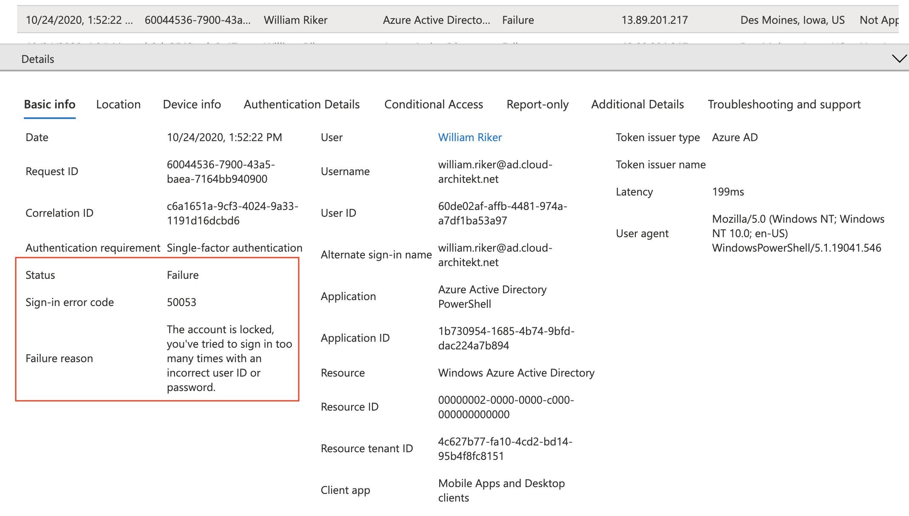
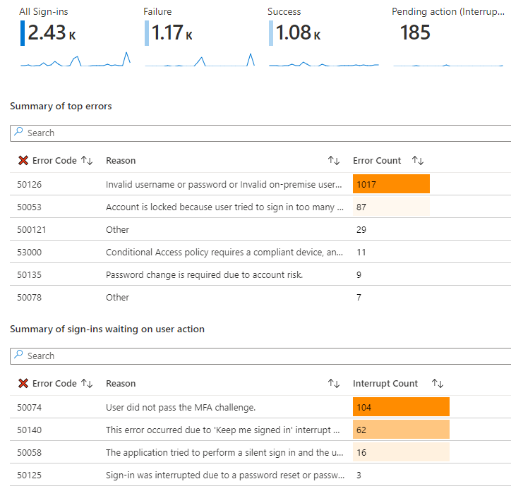
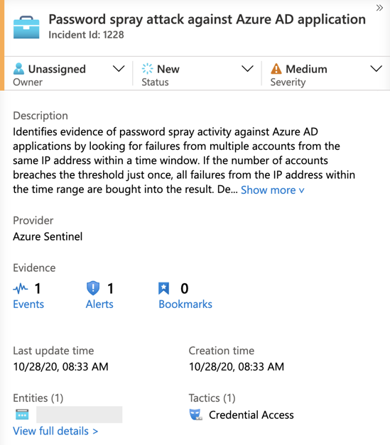
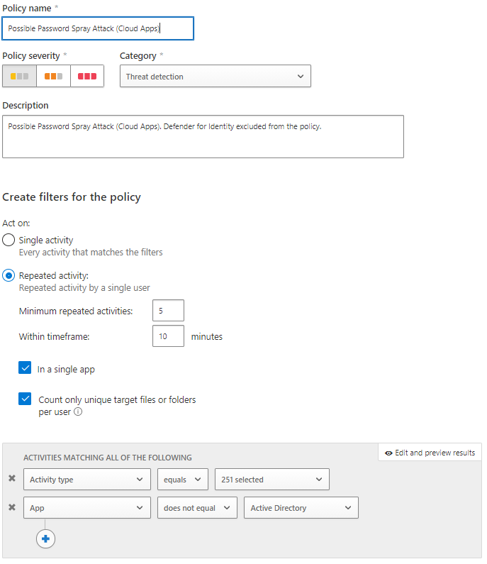
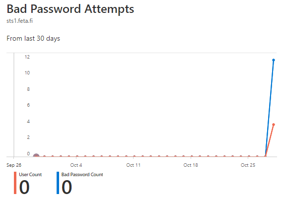
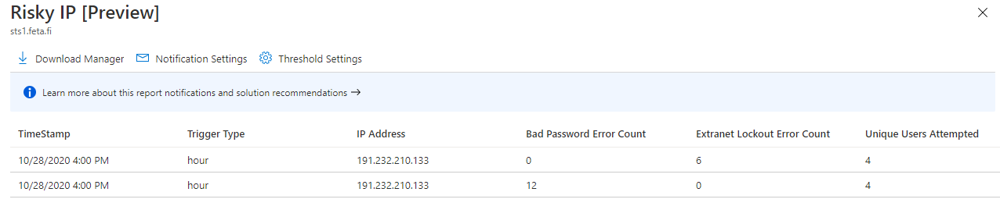
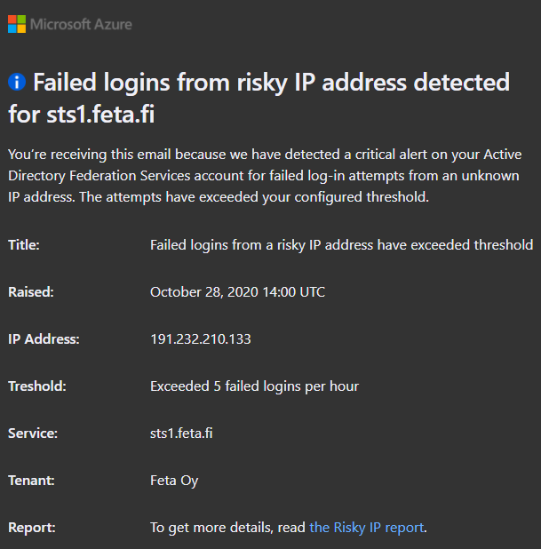
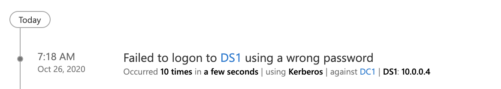
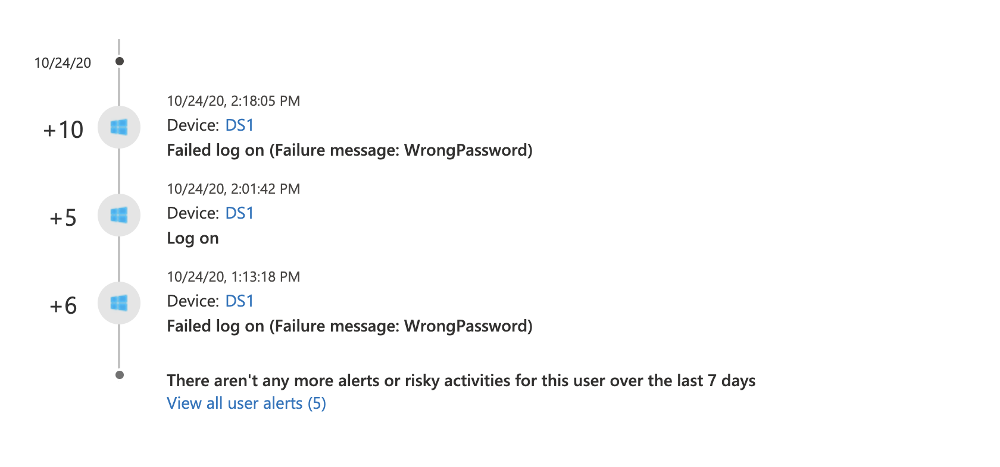

# Password Spray Attacks
*"A password spray attack is where multiple usernames are attacked using common passwords in a unified brute force manner to gain unauthorized access.”*

*MITRE ATT&CK: [Credential Access (T1110)](https://attack.mitre.org/techniques/T1110/003/)*

## Simulation of Attacks

### Tools and Utilities to simulate Password Spray attacks

During our tests, we’ve used two different tools for simulating password spray attacks which applies to interactive sign-ins only.
Each of them accessing different API endpoints:

- [MSOLSpray](https://github.com/dafthack/MSOLSpray):[https://graph.windows.net](https://graph.windows.net/) (OAuth flow is ROPC flow)
- [Invoke-AzureAdPasswordSprayAttack](https://danielchronlund.com/2020/03/17/azure-ad-password-spray-attacks-with-powershell-and-how-to-defend-your-tenant/) (by Daniel Chronlund):[https://reports.office365.com/ecp/reportingwebservice/reporting.svc](https://reports.office365.com/ecp/reportingwebservice/reporting.svc)
- Manual logins to different O365 workloads (including EXO, O365 portal, MyApps)

### Enumeration of user names

Most attackers are using leaked or stolen lists of usernames to start the attacks.
Before starting spray attacks it’s technical possible to validate if a user account exists in a certain tenant. Login page in Azure AD returns an error message if the user name is not existing. [Daniel Chronlund](https://danielchronlund.com/2020/03/13/automatic-azure-ad-user-account-enumeration-with-powershell-scary-stuff/) has written a script and blog post to demonstrate how to enumerate user accounts via PowerShell.

## Detection

*There are several methods and options to detect Password Spray Attacks in an Azure AD environment that depends on your configured authentication options, type of users and licensed features.*

### Sign-in logs In Azure Active Directory

*Applies to Azure AD Premium with Cloud Authentication (PHS/PTA) and Log Analytics Workspace (in case of using Azure AD Workbooks)*

- **Sign-in logs** includes all failed attempts and the lockout event in case of reaching the threshold of the smart lockout policy.

    All smart lockout events will be audited and every further (failed) sign-in attempt includes sign-in error code 55053. Azure Monitor Alerts can be used for trigger alert, security incident or end-user notification in case of a locked-out user.

- **Azure AD Workbooks “Sign-in Analysis” and “Sign-in Failure Analysis”** shows visualized insights about sign-in failures and can be useful to get an overview or regular check as part of an SecOps dashboard.

### KQL (Rule) Query in Azure Sentinel / Azure Monitor (based on AAD sign-in logs)

**Azure Sentinel** includes an (built-in) analytic rule to detect "[Password spray attack against Azure AD application Password Spray](https://github.com/Azure/Azure-Sentinel/blob/master/Detections/SigninLogs/SigninPasswordSpray.yaml)” which will be triggered and worked very well during our attack simulations. The query is available [from the Azure Sentinel GitHub](https://github.com/Azure/Azure-Sentinel/blob/master/Detections/SigninLogs/SigninPasswordSpray.yaml) Repository and can be also used as “[Azure Monitor Alert](https://docs.microsoft.com/en-us/azure/azure-monitor/learn/tutorial-response)” if you haven’t implemented Sentinel as your Cloud-SIEM solution.

*Azure Sentinel Incident in case of password spray attacks which includes entities for further hunting and investigation.*

### Risk Detection “Password Spray” in Azure AD Identity Protection

*Applies to Users with Azure AD Premium licenses*

- Microsoft has implemented a **[machine learning (ML) algorithm](https://techcommunity.microsoft.com/t5/azure-active-directory-identity/advancing-password-spray-attack-detection/ba-p/1276936)** to detect Password Spray Attacks across Azure AD tenant's worldwide. It is another approach comparing to heuristic detection methods in the past. This **new risk detection type** was announced and deployed in Fall 2020.
- ML-based risk detection will be **calculated in [offline](https://docs.microsoft.com/en-us/azure/active-directory/identity-protection/concept-identity-protection-risks#sign-in-risk)** which leads to delay.
During our tests we have seen delay between a couple of hours to multiple days.
- Identity Protection allows to remediate the user risk in case of a successful attack (user risk level will be changed to “high”). An unsuccessful attack will not change the user risk and should be monitored as “Risk detection”.

### Suspicious activity in Microsoft Cloud App Security (MCAS)

*Applies to Azure AD with licensed MCAS instance and configured App Connectors*

- **Activity Logs** includes sign-in attempts (including failed logon and account locked state) as far the target application is connected and supported (via app connector).
- Anomaly detection policies:
    - **Multiple failed login attempt rule** was not triggered during our tests. This detection was introduced in [MCAS version 176 as original named “Unusual failed logon”](https://docs.microsoft.com/en-us/cloud-app-security/release-notes#cloud-app-security-release-176).
    - **Impossible Travel** was detected during the Password Spray attacks if geographically distant locations was used. This includes all sign-in attempts regardless of successfully or failed attempts. Detection of impossible travel by unsuccessfully sign-in attempts will be not forwarded to IPC.
    - **Custom policy** can be used to detect potential suspicious login activity. It’s common that someone is knocking in the door when we are talking about the public endpoints but it would be good to have a hint when it’s happening.

### Side note: Limited visibility of attacks against inviting Azure AD Tenant

*Applies to Azure AD B2B Guest user (with Password Hash-Sync Cloud Authentication) to inviting tenant*

Sign-in failures of invited users (as part of an attack) will not be audited in the invited nor inviting tenant. This gives you a limited visibility and option to detect brute force or password spray attacks to your users from inviting tenants. On the other hand, Smart Lockout from the invited tenant is still applied and helps to lock out the attackers. More details are available from the following link:

- [https://www.cloud-architekt.net/azuread-b2b-security-considerations/](https://www.cloud-architekt.net/azuread-b2b-security-considerations/)
- [https://docs.microsoft.com/en-us/azure/active-directory/external-identities/conditional-access](https://docs.microsoft.com/en-us/azure/active-directory/external-identities/conditional-access)

### Side notes: Detection in Active Directory Federation Services environments:

*In our tests the attack was performed against ADFS and target application was O365 that is configured as relaying party in the ADFS. When analyzing logins from ADFS the key takeaway is that failed logins from ADFS (when acting as IDP for O365) are not found from Azure AD sign-in logs.*

***Extranet Lockout & Extranet Smart Lockout***

*ADFS has similar mechanism than Azure AD to prevent account lockouts in brute force or password spray type attacks called “Extranet Lockout” in W2016 version and “Extranet Smart Lockout” in W2019 version. The idea is similar than in Azure AD Smart Lockout, to prevent malicious actor to get inside the system and let the end-user to continue work from familiar IP location.*

*Extranet Account Lockout settings needs be aligned with the on-prem Active Directory password policy. More information from the following links*

- *[https://docs.microsoft.com/en-us/windows-server/identity/ad-fs/operations/configure-ad-fs-extranet-smart-lockout-protection](https://docs.microsoft.com/en-us/windows-server/identity/ad-fs/operations/configure-ad-fs-extranet-smart-lockout-protection)*
- *[https://samilamppu.com/2018/07/09/w2016-adfs-smart-lockout/](https://samilamppu.com/2018/07/09/w2016-adfs-smart-lockout/)*

AAD Connect Health agent reportIt’s recommended to have AAD Connect Health for ADFS installed on ADFS servers. By doing so, you can leverage the following reports in Azure AD Connect Health blade:

- *Bad Password Attempts*
- *Risky IPs*

Notifications: When thresholds are reached you will get an email from Microsoft about failed logins from risky IP address activity.Microsoft Cloud App Security (MCAS)MCAS receives O365 activity logs from O365 Management Activity API if O365 app connector is enabled. From the API, it receives all the login attempts that the API is able detect. Also, if Defender for Identity (former Azure ATP) is integrated to MCAS, logins from on-prem Active Directory can be found from the MCAS activity log. Custom policies can be created based on the received data.

### Side notes: Detection in PTA environments:

*Applies to Azure AD Premium Users (with PTA Cloud Authentication), Microsoft Defender for Identity and Collected Security Logs in Azure Sentinel*

There are further sign-in error logs in case you are using PTA as your authentication method.

PTA agents are validating requests from the Azure AD backend (usernames and passwords) against Active Directory by calling the Win32 LogonUser API.
Therefore Azure ATP will audit the credential validation from server that running PTA agents (in the following examples shown as “DS1”):

PTA validation requests will be also recorded as logon events in Microsoft Defender for Identity/MCAS. In the screenshot below, you’ll find some successful and failed credential validation events from the PTA agent server (”DS1”):

On the first view, there’s no indicator to build a difference between a local brute force or password spray attack from a PTA agent server and validation request for Azure AD PTA authentication.

The following KQL query helps to filter out sign-in failures on a PTA server:

PTA agents are also logging all authentication requests from the Azure AD backend/service bus. You’ll find the trace log in the installation path of the PTA Agent (e.g. C:\ProgramData\Microsoft\Azure AD Connect Authentication Agent\Trace). A failed validation requests should look like the following one:
AzureADConnectAuthenticationAgentService.exe Error: 0 : Passthrough Authentication request failed. RequestId: '07c2183c-ac6d-44c3-95a4-a24e8c73a0a3'. Reason: '1326'.

Unfortunately, the RequestId wasn't useful in our tests for any further correlation to the original request from Azure AD (e.g. CorrelationID) or Active Directory logon events. Only the time of generated event and sign-in attempt could be used to build a relation of the events.

Local monitoring and detection of password spray or brute-force attacks can be achieved by using [PTA Performance Counters](https://docs.microsoft.com/en-us/azure/active-directory/hybrid/tshoot-connect-pass-through-authentication#performance-monitor-counters). But keep in mind that requests reaching the agents only if the account was not locked out by Azure AD.

### Automated Response and Remediation

### Lockout attackers from continue spray attacks

- **Smart Lockout** is available (and enabled by default) for all types of cloud authentication (incl. **hybrid identity scenarios with Password Hash or Pass-Trough authentication**).
    - Different counters of familiar and unfamiliar locations, configured Trusted IP ranges will not be considered to detect familiar locations.
    - Users can not be unlocked from admins, only successful Self Service Password Reset (SSPR) will clear the lockout counter
    - Customizing of threshold values are only available for licensed Azure AD P1 or higher
- *ADFS ([Extranet Lockout](https://docs.microsoft.com/en-us/windows-server/identity/ad-fs/technical-reference/ad-fs-password-protection)) vs. Cloud Authentication (Smart Lockout)*

    *Guest (Invited user) vs. Member (Cloud vs. Synced?) vs. External Identities (covers by CA IPC features?)*

    - *Synced users with federated or PTA authentication always audited failed authentication attempts*

### Auto-Remediation after a successful attack

*Applies to Users with Azure AD Premium licenses and configured Identity Protection policies*

- As already described, **Azure AD Identity Protection** includes a risk detection which will change the user risk to “High”. This offers a built-in auto-remediation by successful attacks if a user risk policy is configured.
- **Continuous access evaluation (CAE)** should be implemented (in the future) to achieve a “Critical Event Evaluation” for timely response of the user risk. Because of the offline detection it’s needed to enforce remediation to current sessions.

### Auto-Remediation after a successful attack

> Applies to Azure AD environment with Premium License and Azure Sentinel instanc

Various sources of failed/successful password spray attacks should be **collected to Azure Sentinel**. This gives you the option to **run a playbook (auto-remediation) to lockout or investigate the source to prevent further attacks** or changing the attack methods:

- [Isolation of company device](https://github.com/Azure/Azure-Sentinel/tree/master/Playbooks/Isolate-MDATPMachine) (by “Microsoft Defender for Endpoint”)
in case of an internal attack.
- Blocking source of attacks on other devices [using the Graph Security TI indicator Post method](https://github.com/Azure/Azure-Sentinel/tree/master/Playbooks/Block-IPs-on-MDATP-Using-GraphSecurity).
- [Investigation of IP Address (Reputation)](https://github.com/Azure/Azure-Sentinel/tree/master/Playbooks/Get-IPReputation) as query to VirusTotal.
- ….
- Custom playbook to block IP address in Azure or on-premises environment in case of a confirmed attacker source.
- *„A successful password spray attack will change the user risk to "high". An unsuccesful attack will not change the user risk.“.*
- *IPC detections shows also failed spray attacks? Including source of all password spray attacks to TI for blocking further access to other systems (Firewall, Azure services)? Benefit of Azure Sentinel detection as trigger for multi-cloud SOAR?*
- 
- *Minimize risk by successful attack*
    - *Delay between risk detection / auto-remediation and revoke session/access token*
        - *IPC changes user risk to „high“ (offline detection), access token still valid for 1 hour without* *CAE*
        - *Disable user’s access to 3rd party cloud systems or on-premises system via Azure Sentinel playbook*
        - *MCAS detection of „multiple failed logins attempts“ allows no governance action to „require user to sign-in again“*

## Mitigation

- **Block Legacy Authentication**
    - Use Azure AD Conditional Access to block legacy from all workloads when possible
    - Start with the reporting mode and use Azure AD Workbook to identify legacy auth
    - Disable legacy services (e.g. Exchange Online)
        - Configured on mailbox-level [Set-CASMailbox](https://docs.microsoft.com/en-us/powershell/module/exchange/client-access/set-casmailbox?view=exchange-ps)
        - EAS Authentication Policy to block legacy auth.
- **Always MFA or passwordless** options for users (strong authentication)
- **Strengthen your passwords**
    - AAD Password Protection (incl. Global and Custom Banned List)
    - Increase password length and improve password policy
    - Modernize password policy: [Password Guidance - Microsoft Research](https://www.microsoft.com/en-us/research/publication/password-guidance/)
        - Disable password expiration
- **AAD Smart Lockout Policy**
    - Smart Lockout vs. On-Prem AD Lockout policy (in PTA scenarios)
    - Behaviours between unfamiliar and familiar IP range
    - Whitelisting of Azure Public IP addresses (access from Central US region and local network as impossible travel?)
- **Block bad IPs (via Azure Sentinel Playbook to Firewall systems)**
- **Azure AD Protection (Real-time detection = mitigation?)**
    - Unfamiliar sign-in properties include detection for basic authentication (or legacy protocols). Because these protocols do not have modern properties such as client ID, there is limited telemetry to reduce false positives.
- **Protection of Hybrid Authentication Scenarios with ADFS:**
    - Risky IP report for ADFS with Azure AD Connect
    - [Configure AD FS 2016 and Azure MFA | Microsoft Docs](https://docs.microsoft.com/en-us/windows-server/identity/ad-fs/operations/configure-ad-fs-and-azure-mfa)
    - [Enable ADFS Extranet Lockout](https://samilamppu.com/2018/07/09/w2016-adfs-smart-lockout/)
    - [Inside Microsoft Threat Protection: Mapping attack chains from cloud to endpoint](https://www.microsoft.com/security/blog/2020/06/18/inside-microsoft-threat-protection-mapping-attack-chains-from-cloud-to-endpoint/)

### Technical Background

- [Protecting your organization against password spray attacks](https://www.microsoft.com/security/blog/2020/04/23/protecting-organization-password-spray-attacks/)
- [Inside Microsoft Threat Protection: Mapping attack chains from cloud to endpoint](https://www.microsoft.com/security/blog/2020/06/18/inside-microsoft-threat-protection-mapping-attack-chains-from-cloud-to-endpoint/)