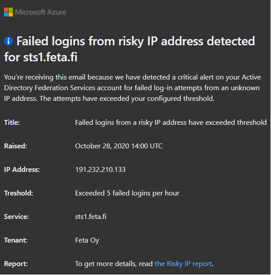
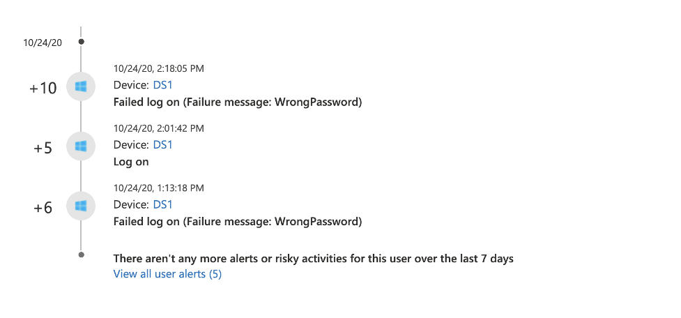
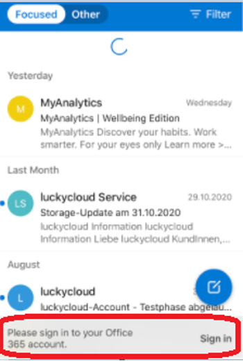
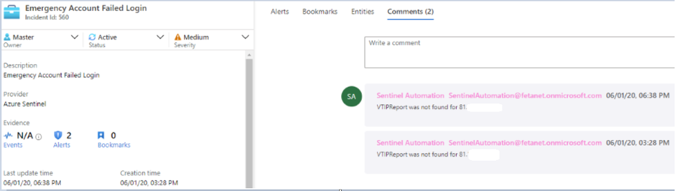

# Password Spray Attacks

Author: Sami Lamppu, Thomas Naunheim
Created: November 2020

*"A password spray attack is where multiple usernames are attacked using common passwords in a unified brute force manner to gain unauthorized access.”*

*MITRE ATT&CK: [Credential Access (T1110)](https://attack.mitre.org/techniques/T1110/003/)*

## Attack

### Tools and Utilities to simulate Password Spray attacks

During our tests, we used different tools for simulating password spray attacks which applies to interactive sign-ins only.
Each of them accessing different API endpoints:

- MSOLSpray (by Dafhack): 
[https://graph.windows.net](https://graph.windows.net/)
- [Invoke-AzureAdPasswordSprayAttack](https://danielchronlund.com/2020/03/17/azure-ad-password-spray-attacks-with-powershell-and-how-to-defend-your-tenant/) (by Daniel Chronlund):
[https://reports.office365.com/ecp/reportingwebservice/reporting.svc](https://reports.office365.com/ecp/reportingwebservice/reporting.svc)
- MSOLSpray (by Dafhack): 
[https://graph.windows.net](https://graph.windows.net/)
- [Custom password spray tool made by Joosua Santasalo](https://twitter.com/santasalojoosua/status/1326060995614298112?s=21)
- Logins to different cloud workloads:
(EXO, O365 portal, Azure management API)

### Enumeration of user names

Most attackers are using leaked or stolen lists of usernames to start the attacks.
Before starting spray attacks it’s technical possible to validate if a user account exists in a certain tenant. Login page in Azure AD returns an error message if the user name not exists. [Daniel Chronlund](https://danielchronlund.com/2020/03/13/automatic-azure-ad-user-account-enumeration-with-powershell-scary-stuff/) has written a script and blog post to demonstrate how to enumerate user accounts via PowerShell.

## Detection

*There are several methods and options to detect Password Spray Attacks in an Azure AD environment that depends on your configured authentication options, type of users and licensed features.*

### Sign-in logs In Azure Active Directory

*Applies to Azure AD Premium with Cloud Authentication (PHS/PTA) and Log Analytics Workspace (in case of using Azure AD Workbooks)*

- **Sign-in logs** includes all failed attempts and the lockout event in case of reaching the threshold of the [smart lockout](https://docs.microsoft.com/en-us/azure/active-directory/authentication/howto-password-smart-lockout#how-smart-lockout-works) policy.

    

    *All smart lockout events will be audited and every further (failed) sign-in attempt includes sign-in error code 55053. Azure Monitor Alerts can be used for trigger an alert, security incident or end-user notification in case of a locked-out state.*

- **Azure AD Workbooks “Sign-in Analysis” and “Sign-in Failure Analysis”** shows visualized insights about sign-in failures and can be useful to get (first) overview or regular check as part of an SecOps dashboard.

    

### KQL Query in Azure Sentinel / Azure Monitor (based on AAD sign-in logs)

**Azure Sentinel** includes an analytic rule (built-in) to detect "[Password spray attack against Azure AD application](https://github.com/Azure/Azure-Sentinel/blob/master/Detections/SigninLogs/SigninPasswordSpray.yaml)” which will be triggered and worked very well during our attack simulations. The query is available [from the Azure Sentinel GitHub](https://github.com/Azure/Azure-Sentinel/blob/master/Detections/SigninLogs/SigninPasswordSpray.yaml) Repository and can be also used as “[Azure Monitor Alert](https://docs.microsoft.com/en-us/azure/azure-monitor/learn/tutorial-response)” if you haven’t implemented Sentinel as your Cloud-SIEM solution.


*Example of an “Azure Sentinel Incident” in case of password spray attacks including entities for further hunting and investigation.*

Analytics of [“Entity Behavior” in Azure Sentinel](https://techcommunity.microsoft.com/t5/azure-sentinel/guided-ueba-investigation-scenarios-to-empower-your-soc/ba-p/1857100) allows further investigation in combination of other security alerts and events.


*Entity insights of Azure Sentinel allows deep-dive investigation of potential attacks.
Source: [Guided UEBA Investigation Scenarios to empower your SOC](https://techcommunity.microsoft.com/t5/azure-sentinel/guided-ueba-investigation-scenarios-to-empower-your-soc/ba-p/1857100) (Microsoft TechCommunity)*

### Risk Detection “Password Spray” in Azure AD Identity Protection

*Applies to Users with Azure AD Premium licenses and all authentication flows*

- Microsoft has implemented a **[machine learning (ML) algorithm](https://techcommunity.microsoft.com/t5/azure-active-directory-identity/advancing-password-spray-attack-detection/ba-p/1276936)** to detect Password Spray Attacks across Azure AD tenant's worldwide. It is another approach comparing to heuristic detection methods in the past. This **new risk detection type** was announced and deployed in fall 2020.
- ML-based risk detection will be **calculated in [offline](https://docs.microsoft.com/en-us/azure/active-directory/identity-protection/concept-identity-protection-risks#sign-in-risk)** which leads to delay.
During our tests we have seen delay between a couple of hours to multiple days.
- Identity Protection allows to remediate the user risk in case of a successful attack (user risk level will be changed to “high”). During our test, an unsuccessful attack has not changed the user risk and should be actively monitored as “Risk detection”.

### Suspicious activity in Microsoft Cloud App Security (MCAS)

*Applies to Azure AD with licensed MCAS instance and configured App Connectors*

- **Activity Logs** includes sign-in attempts (including failed logon and account locked state) as far the target application is connected and supported (via MCAS app connector).
- Anomaly detection policies:
    - **Multiple failed login attempt rule** was not triggered during our tests in October 2020. This detection was introduced in [MCAS version 176 as original named “Unusual failed logon”](https://docs.microsoft.com/en-us/cloud-app-security/release-notes#cloud-app-security-release-176).
    - **Impossible Travel** was detected during the Password Spray attacks if geographically distant locations was used. This includes all sign-in attempts regardless of successfully or failed attempts. Detection of impossible travel by unsuccessfully sign-in attempts will be not forwarded to IPC.
    - **Custom policy for cloud apps** can be used to detect potential suspicious login activity. With MCAS, you can create a custom policy to detect such activity but, take into account “Multiple failed login” built-in policy exist. Below is an example policy we used in our tests.
        - Custom policy example to detect possible password spray attack (adjust settings by your own needs)
        - Apps – Microsoft online workloads selected
        - Own policy can be created per app (MSOnline, WS, Box etc) in case needed. Activity – Failed logon (all 251 activity types selected)
        - Threshold – low in test environment

          

### Side note: Visibility of attacks against inviting Azure AD Tenant

*Applies to Azure AD B2B Guest user (with Password Hash-Sync Cloud Authentication) to inviting tenant*

In the past, sign-in failures of an invited user were not be audited in the invited nor inviting tenant.
From our point of view, this was an issue because of limited visibility to detect brute force or password spray attacks of users outside of the home (invited) tenant.
Description of the previous behavior is documented in the following blog post:
[https://www.cloud-architekt.net/azuread-b2b-security-considerations/](https://www.cloud-architekt.net/azuread-b2b-security-considerations/)

Today, the logging of sign-in attempts from guest users (Azure AD B2B) seems to be changed.

Sign-in failures will be audited in the home (inviting) and resource (invited) tenant as well.
Details of the sign-in attempts are identical in both tenants. All events include the property “Resource tenant ID” which helps to identify and difference sign-in attempts to inviting tenants (and resources).


*Azure AD logs of users‘ home tenant includes (successful and failed) sign-in attempts to inviting tenant now. ”Resource tenant ID” allows to differentiate between sign-in attempts to home or resource tenant.*

Smart Lockout of the home tenant/invited users is always covering and protecting sign-in attempts even if the attacker attempts to sign-in by using the TenantID as parameter of the inviting tenant.

Access of Guest users (B2B) will not be protected by Conditional Access Policies in the home tenant which will also be shown in the sign-in logs and already acknowledge by Microsoft:
[Conditional Access for B2B collaboration users](https://docs.microsoft.com/en-us/azure/active-directory/external-identities/conditional-access)

### Side notes: Detection in Active Directory Federation Services environments

*When analyzing logins from ADFS the key takeaway is that failed logins from ADFS are not found from Azure AD sign-in logs, only successful ones are.*

***Extranet Lockout & Extranet Smart Lockout***

*ADFS has similar mechanism than Azure AD to prevent account lockouts in brute force or password spray type attacks called “Extranet Lockout” in W2016 version and “Extranet Smart Lockout” in W2019 version. The idea is similar than in Azure AD Smart Lockout, to prevent malicious actor to get inside the system and let the end-user to continue work from familiar IP location.*

*Extranet Account Lockout settings needs be aligned with the on-prem Active Directory password policy. More information from the following links*

- *[https://docs.microsoft.com/en-us/windows-server/identity/ad-fs/operations/configure-ad-fs-extranet-smart-lockout-protection](https://docs.microsoft.com/en-us/windows-server/identity/ad-fs/operations/configure-ad-fs-extranet-smart-lockout-protection)*
- *[https://samilamppu.com/2018/07/09/w2016-adfs-smart-lockout/](https://samilamppu.com/2018/07/09/w2016-adfs-smart-lockout/)*


***AAD Connect Health agent report***

It’s recommended to have AAD Connect Health for ADFS installed on ADFS servers. By doing so, you can leverage the following reports in Azure AD Connect Health blade:

- *Bad Password Attempts*
- *Risky IPs*


***Notifications***

If thresholds are reached you will receive an email from Microsoft (based on the notification settings) about failed logins from a potentially risky IP-address.



### Side note: Detection of on-premises attacks to Active Directory

**Microsoft Defender for Identity (Azure ATP)** - contains built-in alert rules that detects brute force & password spray type of attacks at the on-premises environment

- [Suspected Brute Force attack (Kerberos, NTLM) (external ID 2023)](https://docs.microsoft.com/en-us/azure-advanced-threat-protection/compromised-credentials-alerts#suspected-brute-force-attack-kerberos-ntlm-external-id-2023)
- [Suspected Brute Force attack (LDAP) (external ID 2004)](https://docs.microsoft.com/en-us/defender-for-identity/compromised-credentials-alerts#suspected-brute-force-attack-ldap-external-id-2004)
- [Suspected Brute Force attack (SMB) (external ID 2033)](https://docs.microsoft.com/en-us/azure-advanced-threat-protection/compromised-credentials-alerts#suspected-brute-force-attack-smb-external-id-2033)

### Side notes: Detection in PTA environments:

*Applies to Azure AD Premium Users (with PTA Cloud Authentication), Microsoft Defender for Identity and Collected Security Logs in Azure Sentinel*

There are further sign-in error logs in case you are using PTA as your authentication method.

PTA agents are validating requests from the Azure AD backend (usernames and passwords) against Active Directory by calling the Win32 LogonUser API.
Therefore, Defender for Identity (f.k.a Azure ATP) will audit the credential validation from server that running PTA agents (in the following examples shown as “DS1”):


PTA validation requests will be also recorded as logon events in the user page of MCAS.
In the screenshot below, you’ll find some successful and failed credential validation events from the PTA agent server (”DS1”):



On the first view, there’s no indicator to differentiate between a local brute force or password spray attack and validation request for Azure AD PTA authentication.

The following KQL query helps to filter out sign-in failures on a PTA server:

```powershell
SecurityEvent
| where EventID == "4625"
| where ProcessName !contains "AzureADConnectAuthenticationAgentService.exe"
```

PTA agents are also logging all authentication requests from the Azure AD backend/service bus.
The trace log is located in the installation path of the PTA Agent (for example: C:\ProgramData\Microsoft\Azure AD Connect Authentication Agent\Trace).

A failed validation requests should look like the following one:

```powershell
AzureADConnectAuthenticationAgentService.exe
Error: 0: Passthrough Authentication request failed.
RequestId: '07c2183c-ac6d-44c3-95a4-a24e8c73a0a3'. Reason: '1326'.
```

Unfortunately, the “RequestId” wasn't useful in our tests for any further correlation to the original request from Azure AD (e.g. CorrelationID) or Active Directory logon events. Only the time of generated event and sign-in attempt could be used to establish a relation of the events.

Local monitoring and detection of password spray or brute-force attacks can be also achieved by using [PTA Performance Counters](https://docs.microsoft.com/en-us/azure/active-directory/hybrid/tshoot-connect-pass-through-authentication#performance-monitor-counters). But keep in mind: Authentication validation requests will be delivered to the agents only if the account was not locked out by Azure AD.

### Automated Response and Remediation

### Lockout attackers from continue spray attacks

- **Smart Lockout** is available (and enabled by default) for all types of cloud authentication (incl. **hybrid identity scenarios with Password Hash Sync or Pass-Through authentication**).
    - Consider the different counters of familiar and unfamiliar locations.
    - Users can not be unlocked from admins, only successful Self Service Password Reset (SSPR) will clear the lockout counter
    - Customizing of threshold values are only available for licensed Azure AD P1 or higher.
- **ADFS** **Extranet Lockout & Extranet Smart Lockout** available in Windows Server 2016 & 2019 versions (not by default, configuration is needed).

### Auto-Remediation after a successful attack

*Applies to Users with Azure AD Premium licenses and configured Identity Protection policies*

- As already described, **Azure AD Identity Protection** includes a risk detection which will change the user risk to “High”. This offers a built-in auto-remediation by successful attacks if a user risk policy is configured.
- **Continuous access evaluation (CAE)** can be implemented (currently in public preview) to achieve a “Critical Event Evaluation” for timely response of the user risk. Elevated user risk detected by IPC is one of the supported “critical” events.
    - In our tests, when the user (who had CAE enabled) [access was revoked](https://docs.microsoft.com/en-us/azure/active-directory/enterprise-users/users-revoke-access) by the admin explicitly the access to the services was blocked inside three (3) min period, in both "Outlook Web" and "Outlook for iOS" apps.

        

        

### Auto-Response to attack-related entities

*Applies to Azure AD environment with Premium License and Azure Sentinel instance*

Various sources of failed/successful password spray attacks should be **collected to Azure Sentinel**. This gives you the option to **run a playbook (auto-remediation) for blocking or investigation of the attack source** and avoid attackers to counting or changing the attack methods:

- **[Isolation of company device](https://github.com/Azure/Azure-Sentinel/tree/master/Playbooks/Isolate-MDATPMachine)** (by “Microsoft Defender for Endpoint”)
in case of an internal attack.
- **Blocking source of attacks on other devices** [using the Graph Security TI indicator Post method](https://github.com/Azure/Azure-Sentinel/tree/master/Playbooks/Block-IPs-on-MDATP-Using-GraphSecurity).
- **[Investigation of IP Address (Reputation)](https://github.com/Azure/Azure-Sentinel/tree/master/Playbooks/Get-IPReputation)** as query to VirusTotal.

    

- **Custom playbook to block IP address in Azure or on-premises environment (e.g. Firewall Systems or Disable Active Directory User account)** in case of a confirmed attacker source.
- **[Confirm Risky User](https://github.com/Azure/Azure-Sentinel/tree/master/Playbooks/Confirm-AADRiskyUser)** in case of an automatic investigation of the password spray attack (correlation to other related security alerts or suspicious IP address)
- **Revoke Sign-in sessions to invalidates the refresh token.** Password-based cookies will be invalid in case of password change/reset or triggered IPC policy. This playbook could be an option if you haven’t IPC implemented or licensed and want to achieve that all tokens will be revoked as part of Sentinel’s detection. Issued access tokens to the attacker is still valid for the token lifetime (1h) but renewal or new token requests will be prevented.

## Mitigation (and Reduced Attack Surface)

- **Blocking Legacy Authentication** protocols reduces the probability significantly:
“Microsoft’s research of previous identity-related attacks indicates that more than 99% of password spray attacks use legacy authentication protocols, and more than 97% of credential stuffing attacks use legacy authentication.”
Source: [Microsoft Digital Defense Report, September 2020](https://www.microsoft.com/en-us/download/confirmation.aspx?id=101738)
    - Use [Azure AD Conditional Access to block legacy](https://docs.microsoft.com/en-us/azure/active-directory/conditional-access/block-legacy-authentication) authentication from all workloads when possible
        - Start with the reporting mode and use Azure AD Workbook to identify legacy auth
    - Disable legacy services (e.g. Exchange Online)
        - Configured on mailbox-level [Set-CASMailbox](https://docs.microsoft.com/en-us/powershell/module/exchange/client-access/set-casmailbox?view=exchange-ps)
        - EAS Authentication Policy to block legacy auth
- **Monitoring of Smart Lockout activities and settings**
    - (Default) settings of Smart Lockout should be monitored
- **Enabling MFA or password-less** options for all users (strong authentication)
- **Provide your users a centralized and connected Azure AD identity**,
avoid disconnected identities in other Identity Systems with same credentials
    - Enforce different passwords or usage of credential manager in case you can’t avoid different identity systems and accounts (without options for AAD-integration or password-less options)
- **Strengthen your passwords**
    - Modernize password policy:
        - Check references by [Microsoft Research](https://www.microsoft.com/en-us/research/publication/password-guidance/) and [NIST password guidelines](https://nvlpubs.nist.gov/nistpubs/SpecialPublications/NIST.SP.800-63-3.pdf)
        - Disable password expiration
        - Increase password length and block popular words as part of passwords
    - Use AAD Password Protection (incl. Global and Custom Banned List) to strength the quality of passwords and avoid common passwords
    - Design a modern approach for passwords in your Azure AD environment
    (Recommended read: [Blog post by Alexander Filipin](https://alexfilipin.medium.com/modernize-your-approach-to-passwords-with-the-azure-ad-identity-platform-e12769c37fbe))
- Implement a process to reset compromised accounts and **block previous used credentials**
- **Protection and prevention in exposing of user lists**
    - Monitoring and blocking of suspicious apps with “read directory data” or “read user profile” permissions
    - [Restrict guest users](https://docs.microsoft.com/en-us/azure/active-directory/enterprise-users/users-restrict-guest-permissions) (B2B) to prevent enumeration of user lists. [Consider the default permissions](https://docs.microsoft.com/en-us/azure/active-directory/fundamentals/users-default-permissions) of user types and prevent untrusted or external identities to become “member” permissions.

## Technical Background and References

- [Protecting your organization against password spray attacks](https://www.microsoft.com/security/blog/2020/04/23/protecting-organization-password-spray-attacks/)
- [Inside Microsoft Threat Protection: Mapping attack chains from cloud to endpoint](https://www.microsoft.com/security/blog/2020/06/18/inside-microsoft-threat-protection-mapping-attack-chains-from-cloud-to-endpoint/)
