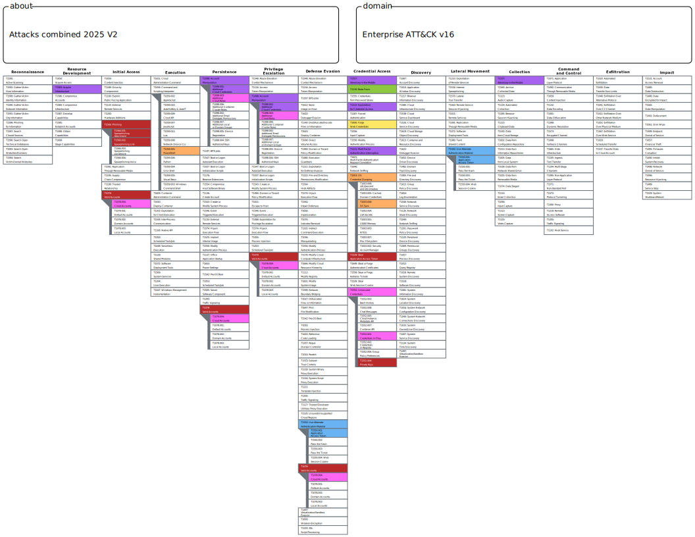
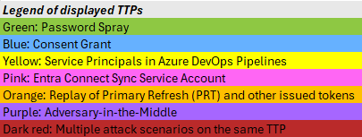
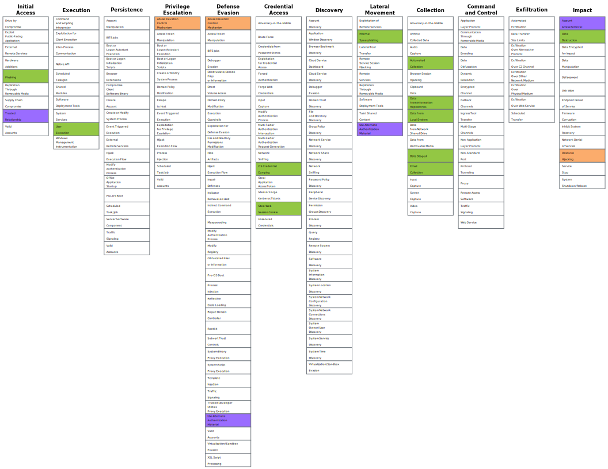
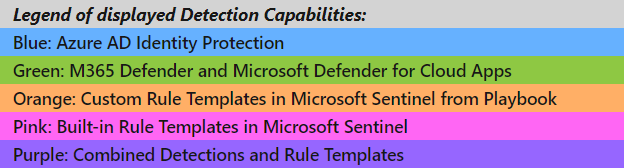
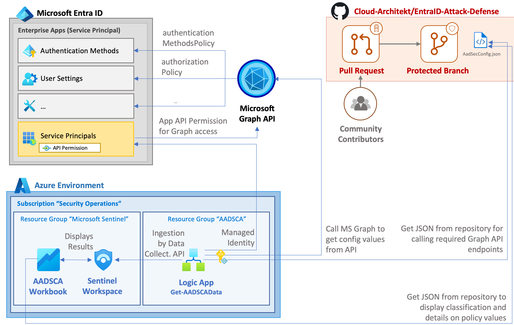
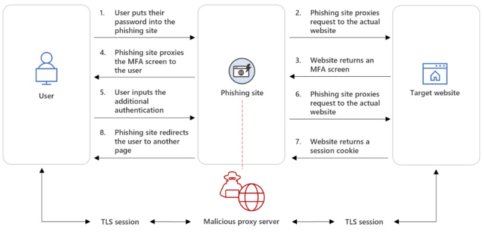
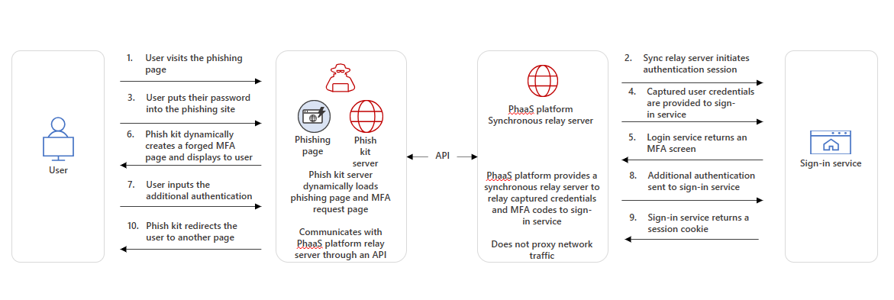

# Microsoft Entra ID - Attack and Defense Playbook

This publication is a collection of various common attack scenarios on Microsoft Entra and how they can be mitigated or detected.
All of the included scenarios, insights and comments are based on experiences from the contributors during their attack simulations, hands-on or real-world scenarios.

It should be considered a living document, which will be updated as practices progress & changes in attack and defense techniques.
We invite identity or security experts from the community to work together on this publication and contribute updates, feedbacks, comments or further additions.

## Chapters
- [Password Spray](PasswordSpray.md)
- [Consent Grant](ConsentGrant.md)
- [Service Principals in Azure DevOps Pipelines](ServicePrincipals-ADO.md)
- [Microsoft Entra Connect Sync Service Account ](AADCSyncServiceAccount.md)
- [Replay of Primary Refresh (PRT) and other issued tokens](ReplayOfPrimaryRefreshToken.md)
- [Entra ID Security Config Analyzer (EIDSCA)](AADSecurityConfigAnalyzer.md)
- [Adversary-in-the-Middle (AiTM) Attacks](Adversary-in-the-Middle.md)

##### Appendix:
- [Overview of Identity Security Monitoring in Microsoft Cloud](IdentitySecurityMonitoring.md)
- [How to prevent lateral movement to Entra ID when your Active Directory has fallen](LateralMovementADEID.md)

In all chapters, we follow the same guideline on the chapter structure. When reading, you can expect to find:

- Description of the common attack scenarios in every scenario
- Detection of the attacks by leveraging Microsoft security stack
- Mitigation for the attack and instructions how to improve your environment security posture based on the chapter scope
- Matching of attack scenarios and detection capabilities to Tactics, Techniques & Procedures (TTPs) of [MTRE ATT&CK Framework](#mitre-attck-framework)

The following sections contain a short description of each chapter you can find from the 'Entra ID Attack & Defense Playbook'.

## Background
The initial idea for creating the ‘Azure AD Attack & Defense Playbook’ came from Thomas Naunheim. Our first Teams call was somewhere in Autumn 2020 where Thomas presented the idea and it was sold immediately.  

The first chapter was about the ‘Password Spray’ attack where we focused heavily on the Entra ID Protection (formely known as Azure AD Identity Protection) detection mechanism to detect ‘password spray’ type of attacks. During the first chapter we learned that calendar time for finalizing the research might take significantly longer than expected due to the complexity of the research and different angles on the research. Scoping, like in any project type of work, is extremely important. 

## Authors
<!-- ALL-CONTRIBUTORS-LIST:START - Do not remove or modify this section -->
<!-- prettier-ignore-start -->
<!-- markdownlint-disable -->
<table>
  <tr>
    <td align="left"><a href="https://samilamppu.com"> <b>Sami Lamppu</b></a> <a href="https://twitter.com/samilamppu" title="Twitter">💬</a> <a href="https://samilamppu.com" title="Blog">📖</a></td>
    <td align="left"><a href="https://www.cloud-architekt.net"> <b>Thomas Naunheim</b></a> <a href="https://twitter.com/thomas_live" title="Twitter">💬</a> <a href="https://www.cloud-architekt.net" title="Blog">📖</a></td>
  </tr>
</table>

<!-- markdownlint-enable -->
<!-- prettier-ignore-end -->
<!-- ALL-CONTRIBUTORS-LIST:END -->

## Contributors and Reviewers
<table>
  <tr>
    <td align="left"><a href="https://securecloud.blog/"> <b>Joosua Santasalo</b></a> <a href="https://twitter.com/SantasaloJoosua" title="Twitter">💬</a> <a href="https://securecloud.blog/" title="Blog">📖</a></td>
    <td align="left"><a href="https://securecloud.blog/"> <b>Markus Pitkäranta</b></a> <a href="https://twitter.com/PitkarantaM" title="Twitter">💬</a> <a href="https://longbeach.cloud/" title="Blog">📖</a></td>    
    <td align="left"><a href="https://chris-brumm.medium.com/"> <b>Christopher Brumm</b></a> <a href="https://x.com/cbrhh" title="Twitter">💬</a> <a href="https://chris-brumm.medium.com/" title="Blog">📖</a></td>
    <td align="left"><a href="https://www.cloudbrothers.info/"> <b>Fabian Bader</b></a> <a href="https://x.com/fabian_bader" title="Twitter">💬</a> <a href="https://www.cloudbrothers.com/" title="Blog">📖</a></td>       
  </tr>
</table>

With the latest chapters we have had lucky to have other community members involved to the project such as [Joosua Santasalo](https://twitter.com/SantasaloJoosua), [Fabian Bader](https://twitter.com/fabian_bader) & [Christopher Brumm](https://twitter.com/cbrhh) part as a sparring partner and reviewer. 

# MITRE ATT&CK Framework
[MITRE ATT&CK Framework](https://attack.mitre.org/) is commonly used for mapping Tactics, Techniques & Procedures (TTPs) for adversary actions and emulating defenses on organizations around the world. In this playbook, we are leveraging the MITRE ATT&CK framework v11 in all of the chapters to map Technics, Tactics & Procedures (TTPs) to the attack scenarios. This would help Blue Teams to build defenses for the corresponding scenarios.

## Tactics, Techniques & Procedures (TTP)
You can expect to find multiple detection rules from the individual chapters based on the specific attack scenario. Because the playbook has a high number of detection rules, we decided to create visualization that contains all the attack scenarios mapped to TTPs. Take also into account, every individual chapter has visualization for the corresponding attack scenario. 

### Map of attack scenarios to TTP

 
 

 
<a style="font-style:italic" href="https://mitre-attack.github.io/attack-navigator/#layerURL=https%3A%2F%2Fraw.githubusercontent.com%2FCloud-Architekt%2FAzureAD-Attack-Defense%2Fmain%2Fmedia%2Fmitre%2FUpdate-Jan-2025%2FAttacks-combined-2025.json&tabs=false&selecting_techniques=false" >Open in MITRE ATT&CK Navigator</a>

## Detections and rule templates for attack scenarios
The related detection capabilities of Microsoft Security products (Microsoft Defender XDR, Microsoft Sentinel, Azure Entra ID Connect, Microsoft Defender for Cloud) will be covered in the detection part of the attack scenarios. Custom rule templates for Microsoft Sentinel, which has been developed for the playbook, are also mapped to the TTPs. The detection rules are available as [Microsoft Sentinel Rule Template (ready-to-deploy) in JSON (ARM Template) format here](https://github.com/Cloud-Architekt/AzureAD-Attack-Defense/tree/main/queries).

### Detection coverage of Microsoft Cloud Security Stack

 

 
<a style="font-style:italic" href="https://mitre-attack.github.io/attack-navigator/#layerURL=https%3A%2F%2Fraw.githubusercontent.com%2FCloud-Architekt%2FAzureAD-Attack-Defense%2Fmain%2Fmedia%2Fmitre%2FRules%2FRules_Combined.json" >Open in MITRE ATT&CK Navigator</a>

_Side note: We've used the existing TTP mapping from the Microsoft Sentinel rule templates and Microsoft 365 incident correlation. Some detections are not offering full MITRE ATT&CK coverage and are not included in this visualization._

# Attack scenarios
Typically, one chapter has taken approximately 1-2 months of calendar time so it has been quite an effort to put all four (4) chapters & appendix together. During the last two (2) years we did research on the following scenarios:

## Password Spray Attacks
*“A password spray attack is where multiple usernames are attacked using common passwords in a unified brute force manner to gain unauthorized access.”*

The chapter was initially created in November 2020 and updated in November 2021 to contain the latest security product updates from Microsoft Ignite 2021. 

The chapter contains a short description of the attack and tools used to simulate the password spray type of attack. In the detection part multiple Microsoft security solutions as used such as Microsoft Sentinel & Defender for Cloud apps. 

On the side notes, there are some considerations for the on-prem environment and ADFS as well if one is still in use. 

 [Password Spray](PasswordSpray.md)

## Consent Grant Attacks
*“In an illicit consent grant attack, the attacker creates an Azure-registered application that requests access to data such as contact information, email, or documents. The attacker then tricks an end-user into granting that application consent to access their data either through a phishing attack or by injecting illicit code into a trusted website. After the illicit application has been granted consent, it has account-level access to data without the need for an organizational account.* 

Normal remediation steps, like resetting passwords for breached accounts or requiring Multi-Factor Authentication (MFA) on accounts, are not effective against this type of attack since these are third-party applications and are external to the organization. These attacks leverage an interaction model that presumes the entity that is calling the information is automation and not a human.” 

The chapter contains an attack description and explanation of why it’s important to secure & monitor activities around the Entra ID Consent framework. In the detection chapter we used the following solutions: 

- O365 SSC & new Compliance portal (Unified Audit Log)
- Entra ID portal (Audit logs, workbooks & application management)
- PowerShell tools (Get-AzureADPSPermissions)
- Combination of Get-AzureADPSPermissions export, Azure Log Analytics & some KQL magic
- Microsoft Defender for Cloud Apps – App Governance
- Microsoft Sentinel 

Because the topic is huge and complicated the mitigation part contains instructions & details on how you can reduce the attack surface in your environment. 

- [Consent Grant](ConsentGrant.md)

## Service Principals in Azure DevOps (Release) Pipelines 
In the following two attack scenarios, we’ve set our focus on privileged service principals as part of release pipelines in Azure DevOps (ADO) and the (potential) limited visibility in auditing. 

- Exfiltration of credentials or access token from Azure DevOps pipelines 
- Using service connections outside of intended pipeline 

ADO is a large topic and in this chapter, the scope is limited only to the scenarios mentioned above. The same path followed here:
- Attack description for both scenarios in the scope
- Detection of the attack
- Mitigation for the attack 

When we worked with this chapter we spent a lot of time on the detection technics which was a complicated mainly because of the ADO audit log schema. Nevertheless, hard work pays off and we were able to achieve our defined target and detect attacks in Microsoft Sentinel.

The chapter contains deep-dive information on how to secure the Azure DevOps environment on the mitigation chapter.

- [Service Principals in Azure DevOps Pipelines](ServicePrincipals-ADO.md)

## Abuse of Microsoft Entra Connect Sync Service Account
In this paper we are mainly focusing on the following scenario: 

- Attacking administrative account with directory role assignment to “Hybrid Identity Administrator” for managing Microsoft Entra Connect configurations
- Abusing of Azure AD user “On-Premises Directory Synchronization Service Account” which will be used to synchronize objects from Microsoft Entra Connect (AADC) Server (AD on-premises) to Azure AD. 

Out of scope are privilege escalation and attack paths from AADC server in direction to Active Directory (incl. abuse Azure AD DS connector account) 

The latest chapter released on the 14th of March 2022 is all about abusing the Microsoft Entra Connect sync service account. To be precise, the AAD Connect account is responsible for performing actions to the Azure AD side. 

The topic and attack scenario was extremely interesting for research work and even though I’ve worked a lot with Microsoft Entra Connect in the past I have to admit that I’ve learned a lot during the last two (2) month period. We did some interesting findings which we haven’t noticed earlier. 

If you have read this far I encourage you to check out the KQL queries for Microsoft Sentinel which we created during our research work. 

- [Microsoft Entra Connect Sync Service Account ](AADCSyncServiceAccount.md)

## Replay of Primary Refresh (PRT) and other issued tokens from an Microsoft Entra joined device
Microsoft has introduced Windows 11 with the requirement to use a Trusted Platform Module (TPM) chip. This has greatly increased the capabilities to use Windows 11 OS security features including an extra layer of protection for cloud-based authentication scenarios. The Primary Refresh Token (PRT) and other relevant keys can be well protected by TPM in Windows 11 but also in Windows 10 and Windows Server versions from 2016 and above. Taking this into account in this paper we mainly focus on the following scenarios:

- Attack scenario with PRT and easy mitigation options (enforce TPM and device compliance) to reduce the attack surface. This will also covers considerations and dependencies in security configuration and cooperation of components to prevent successful token replay attacks.
- Detection capabilities of abusing access token after AuthN/AuthZ with cloud session anomalies by Microsoft Defender for Cloud Apps (MDA) and Microsoft Defender for Cloud (MDC).

- [Replay of Primary Refresh (PRT) and other issued tokens](ReplayOfPrimaryRefreshToken.md)

## Entra ID Security Config Analyzer (EIDSCA)
The purpose of the Entra ID Security Config Analyzer is to provide a solution that pulls out Entra ID security configuration from the selected Microsoft Graph API endpoints and ingest the data to Log Analytics. Azure Workbook is used for data visualization and Microsoft Sentinel can be used to create alerts/incidents when critical configuration change is detected.

The following picture describes EIDSCA solution architecture, used solution and data flows:

_Reference architecture to integrate EIDSCA as part of Microsoft Sentinel environment. Data will be ingested to same workspace as Sentinel.
It depends on your implementation and design if you want to have an integration to dedicated, operational or existing Sentinel workspace._

EIDSCA controls are also used in Maester, more information on the [Maester documentation](https://maester.dev/docs/tests/eidsca/)

- [Entra ID Security Config Analyzer (EIDSCA)](AADSecurityConfigAnalyzer.md)

## Adversary-in-the-Middle Attacks

### Token Replay Attacks

Different tokens play a crucial role in cloud authentication. Therefore, it's Important to understand their mechanics and how adversaries can exploit them if they get into the wrong hands. Understanding this can help in building protection against identity attacks.

Token theft occurs when an adversary gets access and compromises tokens.  Once stolen, the adversary can replay stolen tokens and access the compromised account. In AiTM scenario, the adversary can bypass MFA requirement, because the MFA claims are already included in the token and authentication requirements are met. Therefore, the adversary gets access to the environment. We will elaborate the scenario, detection and mitigation later on this paper.

To find more information about Entra ID security tokens take a look on the following Microsoft Learn resources:

- [Entra ID Security Tokens](https://learn.microsoft.com/en-us/entra/identity-platform/security-tokens)
- [Concept of Primary Refresh Token](https://learn.microsoft.com/en-us/entra/identity/devices/concept-primary-refresh-token)

Entra ID Attack & Defense Playbook chapter 'Replay of Primary Refresh (PRT) and other issued tokens from an Azure AD joined device' sheds a light on replaying PRT, access token & refresh token:

- [Replay of Primary Refresh (PRT) and other issued tokens from an Azure AD joined device](https://github.com/Cloud-Architekt/AzureAD-Attack-Defense/blob/main/ReplayOfPrimaryRefreshToken.md)

In this chapter, we are focusing on Adversary-in-the-Middle (AiTM) type of attack where adversary intercepts victim's session cookie and later replays it to access the sign-in service.

### Phishing-as-a-service (PhaaS) by Microsoft Threat Intelligence

Cybercriminals currently use AiTM phishing techniques to bypass multifactor authentication (MFA) protections at scale. These advanced techniques are democratized and increased through the phishing-as-a-service (PhaaS) cybercrime economic model, which has spawned several service offerings since 2021.

Nowadays the number of AiTM-capable PhaaS platforms has continued to grow throughout 2023-2024, with previously existing services adding AiTM capabilities to their platforms and newly created services incorporating AiTM phishing techniques natively. While traditional forms of credential phishing still exist, the number of AiTM phishing attacks exceeds those without this capability.

The ultimate goal of AiTM phishing is to steal user credentials and session cookies. Browsers store session cookies to allow users access to services without having them repeatedly authenticated. AiTM phishing targets session cookies and credentials to bypass traditional MFA protections.

More information about PhaaS:

- [Hacker News article](https://thehackernews.com/2023/08/phishing-as-service-gets-smarter.html)
- [Infosecurity magazine article](https://www.infosecurity-magazine.com/news/microsoft-aitm-uptick-phishing/)
- [Microsoft Defender Experts blog](https://techcommunity.microsoft.com/t5/microsoft-security-experts-blog/defender-experts-chronicles-a-deep-dive-into-storm-0867/ba-p/3911769)

### Technique Overview

In this chapter we go through two methods related to AiTM attack scenario, AiTM phishing through reverse proxy and AiTM phishing through synchronous relay. The figures and attack descriptions are partly from Microsoft Threat Intelligence reports.

#### AiTM phishing through reverse proxy

Every modern web service implements a session with a user after successful authentication so that the user does not have to authenticate to every new page they visit.
This session functionality is enabled by a session cookie issued by an authentication service following initial authentication. The session cookie serves as proof to the web server that the user has been authenticated and maintains an active session on the website.

In an AiTM phishing attack, an attacker intercepts the target user's session cookie and later replays it to access the sign-in service. Because the cookie demonstrates that the MFA check has already been passed (claim included in the token), it satisfies the MFA requirement, allowing the attacker to bypass MFA protections and gain access to the compromised user account.

In AiTM phishing through a reverse proxy, the proxy is deployed between a user and the legitimate website or application that the user wants to visit (such as Microsoft sign-in portals or LinkedIn). The reverse proxy forwards the requests from the user to the actual service and intercepts the responses. This kind of setup makes it possible to the adversary to steal and intercept the target’s password and the session cookie that proves their ongoing and authenticated session with the website.

Phishing kits, that have been popular among adversaries are: EvilGinx, Modlishka, Muraena and "Office 365" (EvilProxy). These phishing kits allow adversaries to carry out AiTM phishing attacks using reverse proxy servers​.

_Side note: In many campaigns targeted application has been OfficeHome in the Entra ID logs._

_AiTM phishing through reverse proxy attack diagram (initial figure from Microsoft Defender XDR Threat Intelligence reports)._

#### AiTM phishing through synchronous relay

Another AiTM method is called 'AiTM phishing through synchronous relay'. In this type of attack a copy or mimic of a sign-in page is presented to the target, as seen in traditional phishing attacks. ​If a user provides their credentials to this page, the credentials are stored on an attacker-controlled server where the phishing kit instance, including its administrative panel, are installed. ​Basically, it means that user's input is being stolen including sign-in credentials, two-factor authentication (MFA) codes, and session cookies.

The relay servers are typically provided and controlled by the actor group behind the development, and responsible stakeholders of PhaaS platform. One example of this kind of group is Storm-1295 which is behind the Greatness PhaaS platform according to Microsoft Threat Intelligence reports.

_AiTM phishing through synchronous relay diagram (initial figure from Microsoft Defender XDR Threat Intelligence reports)._

- [Adversary-in-the-Middle Attacks](Adversary-in-the-middle.md)

## How to become part of the project and contribute?
- **Update or new content (Pull Request):** As already mentioned, we like to have a living document which is driven by the Entra community! Share your results and insights as part of this project! Send a pull request to add your content to this project.

- **Issues/Outdated content:** Protection features or tools changes continually. Update the out-dated content (as part of pull request) or create an issue to point out

- **Reviewer:** We also look for experts who want to review or discuss the existing or new content before publishing!

- **Feedback:** Feel free to suggest attack/defense scenarios that could be interesting for the community. We will add them to the backlog and idea collection!
